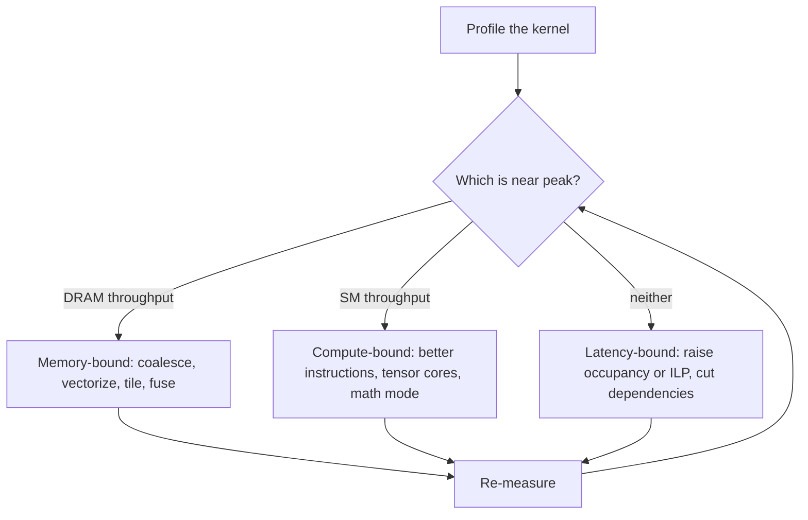

# The Optimization Workflow

Tuning a kernel without a loop around the work turns into guessing: try something that sounds plausible, rerun, eyeball whether it got faster, repeat. The workflow that actually converges is narrower than that — profile to find the one resource the kernel is actually waiting on, apply only the fix that targets that resource, re-measure to confirm the fix worked and see what limiter is binding now, and stop once further gains are no longer worth the effort. Every other page in this folder is a toolbox entry for one step of this loop, not a replacement for it.

## Measure first

Never optimize from a hypothesis about what "should" be slow. Profile the kernel and read the two headline metrics from [Memory-Bound vs Compute-Bound](../01-parallel-computing-foundations/memory-bound-vs-compute-bound.md) — `dram__throughput.avg.pct_of_peak_sustained_elapsed` and `sm__throughput.avg.pct_of_peak_sustained_elapsed` — before changing a single line. A kernel that "feels" compute-heavy because it has a long arithmetic expression can still be memory-bound in practice if that expression reads far more data than it computes with; intuition about the source code is not a substitute for a measurement of the running kernel. [Nsight Compute](../09-tooling-profiling-and-debugging/nsight-compute.md) is the tool that produces these numbers.

## Classify the limiter

The two metrics above sort a kernel into one of three buckets, exactly as [Memory-Bound vs Compute-Bound](../01-parallel-computing-foundations/memory-bound-vs-compute-bound.md) lays out: high DRAM throughput with low SM throughput is memory-bound, the reverse is compute-bound, and both low is latency-bound — too few resident warps or too little independent work to keep either pipeline supplied. Classifying correctly matters more than any single fix, because the three buckets take opposite actions.

## Fix the dominant limiter only

Each limiter has its own short list of fixes, and a fix aimed at the wrong limiter burns effort without moving the runtime:

| Limiter | Fixes that target it |
|---|---|
| Memory-bound | Coalesce accesses ([Memory Access Optimization](./memory-access-optimization.md)); raise reuse with shared-memory tiling ([Shared Memory Tiling](./shared-memory-tiling.md)); fuse kernels to cut round trips through DRAM ([Kernel Fusion and Launch Overhead](./kernel-fusion-and-launch-overhead.md)) |
| Compute-bound | Cut instruction count or improve instruction-level parallelism ([Instruction-Level Optimization](./instruction-level-optimization.md)); reduce warp divergence ([Reducing Divergence](./reducing-divergence.md)); move eligible work onto tensor cores ([Programming Tensor Cores](./programming-tensor-cores.md)) |
| Latency-bound | Raise occupancy so more warps are resident to hide stalls ([Occupancy Tuning](./occupancy-tuning.md)); raise per-thread independent work; shorten dependency chains |

:::warning[The two most common wasted efforts]
Tuning occupancy on a kernel that's already memory-bound does nothing — the memory system, not the warp supply, is the ceiling, and adding more resident warps just means more warps queued behind the same DRAM requests. Micro-optimizing instruction selection on a latency-bound kernel is the mirror-image waste: the pipeline isn't issuing enough instructions to be picky about which ones, so shaving cycles off an individual instruction sequence doesn't touch the actual bottleneck, which is too few warps or too little independent work in flight.
:::

## Re-measure

Apply exactly one class of fix, then profile again with the same two metrics. Re-measuring after every change — not after a batch of them — is what keeps the loop honest: it confirms the fix actually moved the limiter it targeted, and it reveals whichever limiter is binding next, which is often not the one you'd guess. A kernel that goes from memory-bound to compute-bound after tiling has genuinely changed regime, and the next fix has to come from the compute-bound column, not another round of memory tuning.

## Knowing when to stop

The loop terminates against a hardware roof, not against a round number. Establish that roof before starting — the effective bandwidth peak for a streaming kernel, or the time a vendor library like cuBLAS achieves for a GEMM of the same shape — and treat it as the target, not zero. Diminishing returns set in well before that roof: each pass through the loop typically buys less than the last, and continuing to chase the exact remaining percentage costs disproportionate engineering time for a shrinking payoff.

:::tip[Stop within 20% of the hardware roof]
Establish a hardware roof first — effective bandwidth for a streaming kernel, or cuBLAS's time for an equivalent GEMM — before starting the loop. Once a kernel lands within 20% of that roof, further tuning is very likely fighting fixed overheads (launch latency, tail effects) rather than a real inefficiency, and the loop should stop.
:::

## See also

- [Occupancy Tuning](./occupancy-tuning.md) — the fix for the latency-bound branch of the classification above.
- [Common Antipatterns](./common-antipatterns.md) — the checklist of specific ways this loop goes wrong.
- [Memory-Bound vs Compute-Bound](../01-parallel-computing-foundations/memory-bound-vs-compute-bound.md) — the diagnostic this page's classify step is built on.
- [Nsight Compute](../09-tooling-profiling-and-debugging/nsight-compute.md) — the profiler that produces the measure step's numbers.
- [Metrics That Matter](../09-tooling-profiling-and-debugging/metrics-that-matter.md) — the full reference for the metrics named in this loop.
- [GPU & Accelerators](../readme.md) — the section index and its three learning paths.
