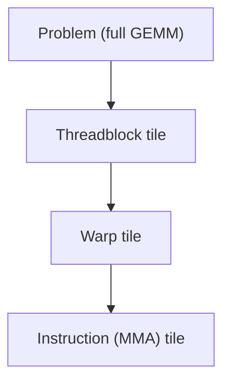

# CUTLASS

CUTLASS is a C++ template library for building GEMM (and convolution) kernels with cuBLAS-class performance out of composable, reusable pieces — tile shapes, memory-movement stages, and epilogues — rather than a single pre-built call. [cuBLAS](./cublas.md) is fast but fixed: `cublasSgemm` computes `C = alpha * op(A) * op(B) + beta * C` and nothing else, in the layouts and precisions it was built for. CUTLASS exists for the shapes and fusions that fall outside that fixed surface — an unusual data type, a custom epilogue, a problem size cuBLAS's kernel selection handles badly — while still generating code tuned close to cuBLAS's own throughput on the same hardware.

## What CUTLASS is for

Reach for CUTLASS when cuBLAS's answer is fast but not *fusable* — the surrounding computation needs something folded into the GEMM's output stage that cuBLAS's fixed API has no parameter for, or the operand types or tile shape are unusual enough that cuBLAS's kernel selection falls back to a generic, unoptimized path. CUTLASS trades cuBLAS's zero-code convenience for control over exactly the pieces cuBLAS keeps fixed, at the cost of having to assemble the kernel from those pieces yourself. Even the simplest usage is still a type-level assembly rather than a single call: a GEMM is a C++ type, built from operand types, layouts, and an architecture tag, and running it means instantiating that type and invoking it like a functor.

```cpp showLineNumbers
using Gemm = cutlass::gemm::device::Gemm<
    cutlass::half_t, cutlass::layout::ColumnMajor,   // ElementA, LayoutA
    cutlass::half_t, cutlass::layout::ColumnMajor,   // ElementB, LayoutB
    cutlass::half_t, cutlass::layout::ColumnMajor,   // ElementOutput, LayoutOutput
    float,                                           // ElementAccumulator
    cutlass::arch::OpClassTensorOp,                  // use Tensor Cores
    cutlass::arch::Sm70>;                            // target architecture tag

Gemm gemm_op;
cutlass::Status status = gemm_op({
    {m, n, k},
    {d_A, lda}, {d_B, ldb}, {d_C, ldc}, {d_C, ldc},
    {alpha, beta}});

if (status != cutlass::Status::kSuccess) { /* handle error */ }
```

Nothing here names a threadblock tile, a warp tile, or an instruction tile — this basic form picks defaults for all three. Overriding them, which is the whole point of reaching for CUTLASS instead of cuBLAS, means adding them as further template arguments to the same `Gemm` type.

## The tile hierarchy

A GEMM decomposes the same way regardless of who writes it: the full problem is cut into tiles handled by one thread block at a time, each threadblock tile is cut into warp tiles handled by one warp, and each warp tile is cut into the smallest unit a single tensor-core instruction can consume in one issue. CUTLASS names this decomposition explicitly and makes each level a template parameter instead of an implicit consequence of loop bounds.



Choosing these three shapes — threadblock tile, warp tile, instruction tile — *is* the tuning problem CUTLASS exposes: each level trades occupancy against reuse against how well the shape matches the tensor-core instruction actually being issued, the same tradeoff [Programming Tensor Cores](../07-kernel-optimization/programming-tensor-cores.md) works through for a single hand-written `wmma` tile. CUTLASS just makes every level of that decision a compile-time parameter instead of a single hard-coded choice.

## Epilogues

An epilogue is what happens to a tile of `C` after the accumulation loop finishes and before it's written back to global memory — and it's the payoff for owning the kernel at all. A plain GEMM writes `alpha * AB + beta * C` and stops; a real workload usually needs a bias add, an activation function, or a scaling factor applied to that same tile immediately afterward, and doing that as a separate kernel means a second full pass reading and writing the output. CUTLASS lets that logic run inside the GEMM's own epilogue stage, fused into the same kernel, on data that's already resident in registers or shared memory from the accumulation — no second pass over `C` in DRAM at all.

## CuTe and layouts

CUTLASS 2.x expressed tile addressing through hand-written iterator classes, one per layout and access pattern, which meant a new layout needed new iterator code. CUTLASS 3.x replaces that with CuTe, a layout algebra: shape and stride become composable objects (`Layout = Shape : Stride`) instead of iterator logic, so a layout is data describing how logical coordinates map to memory offsets, not code that walks memory directly. A `Layout` combines a `Shape` — the logical extents, e.g. `(128, 64)` — with a `Stride` — the memory step per dimension, e.g. `(1, 128)` for column-major — and composing two layouts (nesting, tiling, permuting) is composing these shape/stride pairs algebraically rather than writing a new iterator class for each combination. This is what makes swizzled shared-memory layouts and TMA descriptors expressible as data: a swizzle is just another layout composed on top of the base one, and the tensor-map metadata TMA needs is derived directly from the resulting `Shape`/`Stride` pair instead of hand-written per case.

## CUTLASS 3.x on Hopper

:::note[Requires CC 9.0+]
CUTLASS 3.x's Hopper GEMM kernels use warp-specialized cooperative scheduling: some warps issue `wgmma` tensor-core instructions while others drive TMA-based bulk copies, overlapping the two roles across warps rather than time-slicing them on the same warp. This is the same TMA and multi-stage pipeline machinery [Software Pipelining](../07-kernel-optimization/software-pipelining.md) and [Asynchronous Data Movement](../04-cuda-memory-model/asynchronous-data-movement.md) describe generally, generated by CUTLASS instead of hand-written. Check [Compute Capability](../02-gpu-hardware-architecture/compute-capability.md) before targeting this path.
:::

## When to reach for it

:::warning[The cost is real: don't adopt CUTLASS to save a few percent]
CUTLASS kernels are deeply templated C++, and that has consequences beyond the learning curve: compile times for a single instantiated kernel can run into minutes, template errors routinely span hundreds of lines pointing at the wrong frame, and getting a new instantiation actually compiling and correct takes real time even for an experienced CUDA programmer. This cost is worth paying when cuBLAS genuinely can't express the fusion or shape needed — it is not worth paying to close a small, uncertain gap against cuBLAS's own throughput on a shape cuBLAS already handles well. Measure the actual gap on the actual shape before reaching for it.
:::

## See also

- [cuBLAS](./cublas.md) — the pre-built GEMM CUTLASS is built to be a controllable alternative to, and the column-major convention CUTLASS's C++ API shares with it.
- [Programming Tensor Cores](../07-kernel-optimization/programming-tensor-cores.md) — the hand-written `wmma` tile-shape tradeoff CUTLASS's tile hierarchy generalizes.
- [Software Pipelining](../07-kernel-optimization/software-pipelining.md) — the multi-stage and TMA pipelines CUTLASS 3.x generates for Hopper.
- [Matrix Multiply with Tensor Cores](../13-applied-kernels-and-patterns/matrix-multiply-tensor-cores.md) — an applied kernel at the level of detail CUTLASS automates away.
- [GPU & Accelerators](../readme.md) — the section index and its three learning paths.
