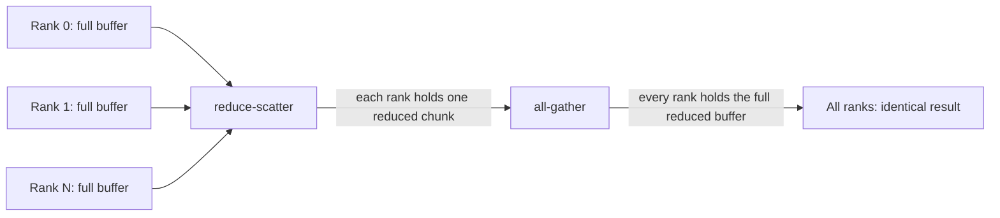

# NCCL

NCCL (NVIDIA Collective Communications Library) is the library that moves data between GPUs — within a node over NVLink or PCIe, and across nodes over the network — through a small set of collective operations borrowed from the MPI world: all-reduce, broadcast, all-gather, and the rest. This page covers the API surface: setting up a communicator, the collectives themselves, and how a call integrates with a stream. [Collectives with NCCL](../10-multi-gpu-and-scaling/collectives-with-nccl.md) covers the harder half — ring versus tree algorithm selection, and overlapping communication with gradient computation in a real training loop — and builds directly on the vocabulary defined here.

## What NCCL provides

NCCL implements collective communication primitives tuned for GPU-to-GPU transfer: it discovers the topology connecting a set of GPUs — NVLink, PCIe, or network fabric between nodes — and picks a communication algorithm and data path suited to that topology automatically, rather than requiring the caller to hand-code a transfer strategy per hardware configuration. The API is deliberately close to MPI's collective calls, which is intentional: multi-GPU training code with an MPI background transfers to NCCL with almost no conceptual translation.

## Communicators

Every NCCL call operates through an `ncclComm_t`, one per GPU, and all communicators that will talk to each other must be initialized together from a shared `ncclUniqueId` so each rank knows how to reach the others. The recommended topology is one process per GPU: rank 0 generates the ID, broadcasts it to every other rank over whatever out-of-band channel the application already has (MPI here), and every rank then calls `ncclCommInitRank` with that ID, its rank, and the total world size.

```cpp showLineNumbers
ncclUniqueId id;
if (rank == 0) NCCL_CHECK(ncclGetUniqueId(&id));
MPI_Bcast(&id, sizeof(id), MPI_BYTE, 0, MPI_COMM_WORLD);

CUDA_CHECK(cudaSetDevice(localRank));
ncclComm_t comm;
NCCL_CHECK(ncclCommInitRank(&comm, worldSize, id, rank));

NCCL_CHECK(ncclAllReduce(d_grad, d_grad, count, ncclFloat, ncclSum, comm, stream));
CUDA_CHECK(cudaStreamSynchronize(stream));
```

`NCCL_CHECK` here is this page's local analogue of [`CUDA_CHECK`](../06-cuda-runtime-and-apis/error-handling.md): a one-line macro that evaluates an NCCL call, compares the returned `ncclResult_t` against `ncclSuccess`, and reports and exits on anything else. It's a different macro over a different enum, the same way [`CUBLAS_CHECK`](./cublas.md) is for cuBLAS — none of the three are interchangeable, and this page doesn't redefine either of the other two.

## The collectives

| Collective | Data movement |
|---|---|
| `ncclAllReduce` | Every rank contributes a buffer; every rank receives the reduction (sum, max, ...) of all of them |
| `ncclBroadcast` | One rank's buffer is copied to every other rank |
| `ncclReduce` | Every rank contributes a buffer; one designated rank receives the reduction |
| `ncclAllGather` | Every rank contributes a buffer; every rank receives all buffers concatenated |
| `ncclReduceScatter` | Every rank contributes a full buffer; each rank receives one reduced chunk of it |
| `ncclSend` / `ncclRecv` | Point-to-point transfer between exactly two ranks, paired by matching send/recv calls |

`ncclAllReduce` is the one training code calls most — it's how gradients computed independently on every GPU end up identical everywhere before the optimizer step — and it isn't a primitive operation in its own right. NCCL implements it as a reduce-scatter followed by an all-gather: the reduce-scatter leaves each rank holding one fully-reduced chunk of the total, and the all-gather then distributes every rank's chunk to every other rank so all of them end up with the complete, identical result.



## Stream integration

An NCCL call doesn't block and doesn't run synchronously on the host — like a kernel launch, it's enqueued onto the `cudaStream_t` passed as its last argument and returns as soon as the enqueue succeeds. That's the operational fact that matters: communication genuinely overlaps with compute when the NCCL call and the compute it needs to overlap with are issued on *different* streams, with the dependency between them expressed through CUDA events rather than left implicit. Two NCCL calls issued back-to-back on the same stream still execute in program order on that stream, exactly like two kernel launches would.

## Topology awareness

NCCL inspects the actual interconnect between the GPUs it's given — NVLink links, PCIe topology, which GPUs share a PCIe switch or a NUMA node, and the network fabric between hosts — and selects its ring or tree structure and chunk sizes to match it, rather than treating every link as equally fast. [Interconnects: PCIe and NVLink](../02-gpu-hardware-architecture/interconnects-pcie-and-nvlink.md) and [Peer-to-Peer and NVLink](../10-multi-gpu-and-scaling/peer-to-peer-and-nvlink.md) cover what that topology actually looks like and what it costs; this page's job is only to note that NCCL discovers it automatically rather than needing it hand-specified.

:::tip[`NCCL_DEBUG=INFO` is the first thing to check]
Setting the environment variable `NCCL_DEBUG=INFO` makes NCCL print the topology it detected and the algorithm and channel count it chose for each communicator at init time. When achieved bandwidth is below what the interconnect should support, this output — not a profiler — is the first place to look: it will show, for instance, a ring falling back to a slower path because two GPUs it expected to be NVLink-connected are actually only reachable over PCIe.
:::

## Grouped calls

`ncclGroupStart()` / `ncclGroupEnd()` batches multiple NCCL calls — several point-to-point sends and receives, or several collectives on different communicators — so they're issued together instead of one at a time, which both reduces launch overhead and lets NCCL schedule the batch as a unit rather than serializing calls that could otherwise run concurrently.

```cpp showLineNumbers
NCCL_CHECK(ncclGroupStart());
for (int i = 0; i < numComms; ++i) {
    NCCL_CHECK(ncclAllReduce(d_grad[i], d_grad[i], count[i], ncclFloat, ncclSum, comms[i], stream));
}
NCCL_CHECK(ncclGroupEnd());
```

:::warning[Every rank must call the same collectives in the same order]
NCCL collectives are matched across ranks by call order, not by any explicit tag — if one rank calls `ncclAllReduce` while another calls `ncclBroadcast` at the corresponding point, or one rank simply skips a call the others make, there is no error to catch it. The mismatched ranks wait forever for a peer that never issues the matching call, and the job hangs rather than failing loudly. This is why collective calls inside conditional or rank-dependent code paths are a common source of silent multi-GPU hangs — the fix is ensuring every rank walks through the same sequence of collective calls unconditionally.
:::

## See also

- [Collectives with NCCL](../10-multi-gpu-and-scaling/collectives-with-nccl.md) — ring/tree algorithm selection and overlapping communication with compute in a training loop, building on the vocabulary this page defines.
- [Peer-to-Peer and NVLink](../10-multi-gpu-and-scaling/peer-to-peer-and-nvlink.md) — the direct GPU-to-GPU transfers NCCL's intra-node data path is built on.
- [Interconnects: PCIe and NVLink](../02-gpu-hardware-architecture/interconnects-pcie-and-nvlink.md) — the hardware topology NCCL detects and schedules around.
- [GPU & Accelerators](../readme.md) — the section index and its three learning paths.
