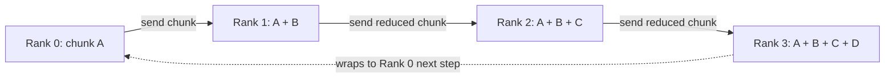

# Collectives with NCCL

The [NCCL](../08-libraries-and-ecosystem/nccl.md) page covers the API — communicators, the collective calls, stream integration, grouped calls. This page covers what happens underneath an `ncclAllReduce` call: the ring and tree algorithms NCCL chooses between, the cost model that explains why ring all-reduce scales the way it does, and how a training loop overlaps communication with compute instead of paying for it serially. It doesn't repeat the API surface — link there for `ncclCommInitRank`, the collectives table, or `ncclGroupStart`/`ncclGroupEnd`.

## Ring algorithms

A ring all-reduce arranges all `P` ranks in a logical ring and moves data in two phases, each taking `P - 1` steps: a reduce-scatter, where each step every rank sends one chunk to its ring successor and adds the chunk it receives from its predecessor, leaving each rank holding one fully-reduced chunk after `P - 1` steps; and an all-gather, where each rank forwards the reduced chunk it now has around the ring so that after another `P - 1` steps every rank holds every chunk. No rank ever needs more bandwidth than its two ring neighbors provide, which is exactly why the pattern scales to large `P` without a central bottleneck.



## Tree algorithms

A tree all-reduce instead arranges ranks into a binary (or wider) tree: reduce up toward a root, broadcast back down. Its latency scales as `O(log P)` rather than `O(P)`, which makes it the better choice for small messages where per-step overhead dominates and ring's bandwidth advantage never gets a chance to matter. NCCL doesn't ask the caller to choose — it picks ring or tree per call based on message size and topology, which is why `NCCL_ALGO` exists at all: it's an override for the rare case where NCCL's automatic choice needs to be forced for debugging or benchmarking, not something a normal training job sets.

In practice this means the same job can see a different algorithm chosen for different tensors within the same training step — small tensors (biases, layer norm parameters) go via tree, large tensors (weight matrices) go via ring — and that mixture is normal, not a sign of misconfiguration.

## Cost models

Ring all-reduce's cost model is derivable directly from the two-phase description above. With `P` ranks and `N` total bytes to reduce, each rank's share per phase is `N / P` bytes, and each phase takes `P - 1` steps, so each rank sends `2(P - 1)` chunks of `N / P` bytes over the course of the whole operation. At bandwidth `B` per link, total time is:

```text
2(P - 1)/P × N/B
```

As `P` grows large, `2(P - 1)/P` approaches `2`, so the time approaches `2N/B` — **nearly independent of `P`** for large `N`. That's the property that makes ring all-reduce scale: adding more ranks doesn't proportionally add more time, because each rank's share of the data shrinks as fast as the step count grows. It's also why the model breaks down for small `N`: at small message sizes, per-step latency (not the `N/B` term) dominates, which is exactly the regime where a tree's `O(log P)` step count wins instead.

The same model explains why buying a faster interconnect helps more than buying more GPUs, past a certain scale: `B` sits in the denominator of a term that dominates for the large messages a training job's weight tensors actually are, while `P` mostly washes out — the fix for a communication-bound job is usually a better link, not a smaller world size.

## Overlapping communication with compute

Distributed data parallel training doesn't wait for the whole backward pass to finish before starting communication — it buckets gradients and starts the all-reduce for one bucket as soon as that bucket's gradients are ready, while backward computation for earlier layers is still running. Concretely: layer `n`'s gradients finish first (backward runs output-to-input), so its bucket's all-reduce can be issued immediately, overlapping with the backward computation for layer `n - 1` that hasn't finished yet.

Bucket size is a real tradeoff, not a knob to maximize in either direction. Buckets too small mean many small all-reduce calls, each paying fixed per-call latency that a tree algorithm's `O(log P)` term doesn't fully hide — latency-dominated, poor bandwidth utilization. Buckets too large mean fewer, bigger all-reduces that start later relative to the backward pass finishing, leaving less remaining compute for the communication to hide behind — less overlap, more of the all-reduce exposed after backward completes.

:::tip[Confirm overlap on the Nsight Systems timeline, don't assume it]
NCCL kernels show up as their own GPU work on the timeline captured by [Nsight Systems](../09-tooling-profiling-and-debugging/nsight-systems.md), on their own stream row. If overlap is actually happening, those NCCL kernel bars sit *underneath* — concurrent with — the backward-pass compute kernels, not stacked after them. Bars that appear only after the last compute kernel ends mean the bucketing or stream assignment isn't achieving overlap, whatever the bucket-size configuration claims to be doing.
:::

## Bucketing gradients

Gradient bucketing groups adjacent layers' gradients into fixed-size buffers so that a bucket becomes ready — and its all-reduce becomes issuable — as soon as the last gradient in it is computed, rather than issuing one all-reduce per parameter tensor. This is what turns "wait for all gradients, then one giant all-reduce" into the overlapped pattern above, and it's the mechanism DDP implementations tune via a bucket-size parameter rather than exposing the ring/tree choice directly — the algorithm choice belongs to NCCL, the bucket boundaries belong to the training framework.

## See also

- [NCCL](../08-libraries-and-ecosystem/nccl.md) — the communicator and collective-call API this page's algorithms run underneath.
- [Data, Model, Pipeline, and Tensor Parallelism](./parallelism-strategies.md) — how these collectives compose into full training strategies.
- [Nsight Systems](../09-tooling-profiling-and-debugging/nsight-systems.md) — confirming overlap on the timeline rather than assuming it.
- [GPU & Accelerators](../readme.md) — the section index and its three learning paths.
