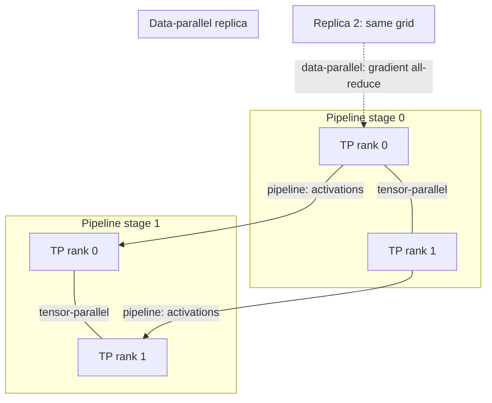

# Data, Model, Pipeline, and Tensor Parallelism

Splitting a training job across GPUs means choosing what gets partitioned — the data, the model's layers, or the operations inside a single layer — and each choice trades communication volume against memory savings differently. This page covers the communication mechanics of each strategy: what crosses the interconnect, when, and how much. [Distributed Training](../../machine-learning/02-deep-learning/distributed-training.md) covers the training-side recipe built on top of these mechanics — ZeRO/FSDP sharding, optimizer state placement, gradient accumulation — and is the page to read for how a framework actually configures and combines them.

## Data parallelism

Partitions the **batch**: every GPU holds a full copy of the model and processes a different slice of the input. Communication is the gradient all-reduce covered on [Collectives with NCCL](./collectives-with-nccl.md), once per step, sized to the full parameter count regardless of batch size. Failure mode: memory per device caps model size, because every replica needs the full model, its gradients, and its optimizer state resident — adding GPUs adds throughput, not headroom.

## Model (tensor) parallelism

Partitions a single **operation** — typically one large matrix multiply — across devices, each computing a slice of the result. Communication happens *inside* every layer's forward and backward pass, not once per step, which means it needs to be fast enough to not stall the layer that's waiting on it. Failure mode: it needs very fast interconnect (NVLink-class), so in practice it stays within a node — spreading tensor-parallel shards across nodes exposes network latency inside the hot path of every single layer.

## Pipeline parallelism

Partitions the model's **layers** across devices, with activations flowing forward through the pipeline and gradients flowing back. Communication is activation and gradient handoff at each stage boundary — smaller in volume than an all-reduce over the whole model, but strictly sequential in the naive case. Failure mode: pipeline bubbles — a stage sits idle waiting for the previous stage's output on the first micro-batch and the last stage's completion on the final one. Micro-batching (splitting each batch into smaller pieces that flow through the pipeline back-to-back) mitigates the bubble but never fully eliminates it.

## Sequence and expert parallelism

Sequence parallelism partitions the **sequence dimension** of activations that tensor parallelism otherwise leaves fully replicated, cutting the activation-memory cost tensor parallelism doesn't address on its own. Expert parallelism (used with mixture-of-experts models) partitions **experts** — different feed-forward blocks — across devices, and routes each token to whichever device holds the expert it's assigned to. Failure mode: routing imbalance — if tokens don't distribute evenly across experts, some devices sit idle while others queue up, and worst-case imbalance can stall the whole step behind the busiest expert.

## Communication volume compared

| Strategy | Partitions | Communicates | Per-step volume | Interconnect sensitivity |
|---|---|---|---|---|
| Data | Batch | Gradients (all-reduce) | Full parameter count, once per step | Moderate — overlaps with backward compute |
| Tensor | One operation | Activations/partial sums, per layer | Per-layer activation size, many times per step | High — must be NVLink-class, stays intra-node |
| Pipeline | Layers | Activations/gradients at stage boundaries | Per-stage activation size, per micro-batch | Moderate — sequential dependency matters more than raw bandwidth |
| Expert | Experts (MoE blocks) | Token routing (all-to-all) | Depends on routing balance | High — all-to-all pattern, sensitive to imbalance |

## Combining them

Real large-model training rarely uses one strategy alone — it composes them, commonly called 3-D parallelism when data, tensor, and pipeline are combined simultaneously across a grid of devices.

Each axis of the grid maps to a different communication pattern and a different interconnect requirement, which is why the placement isn't arbitrary.

:::tip[The standard layering on a multi-node cluster]
Tensor parallel within a node, over NVLink — it needs the bandwidth and can't tolerate network latency. Pipeline parallel across a small number of nodes — it tolerates the added latency because handoffs are only at stage boundaries. Data parallel across everything else — it's the least communication-sensitive axis, so it absorbs however many nodes are left. Getting this layering backwards (say, tensor-parallel across nodes) is one of the most common causes of multi-node training scaling far worse than expected.
:::

## See also

- [Collectives with NCCL](./collectives-with-nccl.md) — the ring/tree algorithms underneath the all-reduce and all-to-all calls each strategy issues.
- [GPU Clusters and Schedulers](./clusters-and-schedulers.md) — requesting and placing the multi-node, multi-GPU grid these strategies run on.
- [Distributed Training](../../machine-learning/02-deep-learning/distributed-training.md) — the training-side recipe (ZeRO/FSDP sharding, optimizer state, gradient accumulation) built on top of this page's communication mechanics.
- [GPU & Accelerators](../readme.md) — the section index and its three learning paths.
