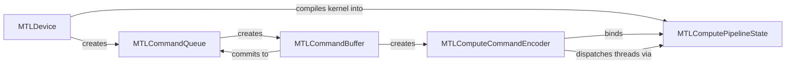

# Metal and Apple Silicon

Metal is Apple's graphics-and-compute API, and on Apple silicon it sits on top of a hardware fact that has no real CUDA equivalent: the CPU and GPU are not two devices connected by a bus, they are two sets of cores reading the same physical memory. That single fact changes what "offload to the GPU" even means on this hardware, and it's the reason this page exists separately from the rest of the portability folder rather than being folded into a general graphics-API page alongside [Vulkan and DirectX Compute](./vulkan-and-directx-compute.md).

## Metal compute

Metal's object model is a shorter chain than Vulkan's but built from the same kind of pieces: a `MTLDevice` represents the GPU, an `MTLCommandQueue` is where work gets submitted, an `MTLCommandBuffer` holds one batch of recorded commands, an `MTLComputeCommandEncoder` records the actual dispatch calls into that buffer, and an `MTLComputePipelineState` is the compiled, ready-to-dispatch form of a kernel function.



The kernel itself is written in Metal Shading Language (MSL), a C++14 dialect:

```cpp showLineNumbers title="saxpy.metal"
#include <metal_stdlib>
using namespace metal;

kernel void saxpy(device const float* x [[buffer(0)]],
                   device float* y [[buffer(1)]],
                   constant float& a [[buffer(2)]],
                   uint i [[thread_position_in_grid]]) {
    y[i] = a * x[i] + y[i];
}
```

`[[buffer(n)]]` and `[[thread_position_in_grid]]` are MSL attributes binding a parameter to a buffer slot or to the built-in global thread index — the MSL counterpart of `gl_GlobalInvocationID` or `SV_DispatchThreadID`. There's no Prism grammar for MSL specifically, so the fence above is tagged `cpp`; since MSL is a C++ dialect, `cpp` highlighting reads it acceptably even though it doesn't recognize the `[[...]]` attribute syntax as anything special.

## Unified memory on Apple Silicon

This is the genuinely different part, not a restatement of "integrated GPUs share memory" from [The Accelerator Landscape](../00-overview/the-accelerator-landscape.md). A buffer created with `MTLStorageModeShared` lives in memory both the CPU and GPU address directly — writing to it from Swift or C++ host code and reading it from a compute kernel requires no `memcpy`, no staging buffer, and no explicit transfer call at all. The consequence is structural, not just a smaller constant: the whole transfer-cost analysis in [When Not to Use a GPU](../00-overview/when-not-to-use-a-gpu.md) — the 40 ms-per-gigabyte arithmetic that rules out small, transfer-dominated kernels on a discrete card — doesn't apply here, because there is no bus crossing to amortize in the first place. That's what makes small-kernel GPU offload viable on Apple silicon in cases where it would lose decisively on a PCIe-attached GPU: a kernel too small or too transfer-heavy to be worth a discrete card's round trip can still be worth dispatching on a unified-memory device, because the round trip isn't there.

## MPS and MPSGraph

Metal Performance Shaders (MPS) is Apple's counterpart to cuBLAS and cuDNN: a library of tuned kernels for matrix multiplication, convolution, and other common primitives, so that using the GPU well doesn't require hand-writing MSL for every operation. MPSGraph sits a level higher, building and executing a computation graph the way cuDNN's graph API or XLA does. Most users never touch either directly — the route that matters in practice is PyTorch's `mps` backend, which lowers PyTorch operations onto MPS and MPSGraph automatically, the same way the CUDA backend lowers them onto cuBLAS and cuDNN.

## The Neural Engine

The Apple Neural Engine (ANE) is a fixed-function accelerator for machine learning inference sharing the same unified memory pool, but it is **not** reachable from Metal at all — there is no MSL kernel that targets it. The only path to the ANE is through Core ML: you hand Core ML a model, and its partitioner decides, operation by operation, whether each piece runs on the ANE, the GPU, or the CPU. There is no API call that forces a specific op onto the ANE; that decision is entirely Core ML's. See [Edge NPUs](../12-npu-and-inference-accelerators/edge-npus.md) for how this fits alongside the other mobile and embedded NPUs.

## What to expect

Apple silicon's unified memory and mature MPS/Core ML stack make it a strong target for inference and small-to-medium compute workloads, with the caveat that Metal's tooling and community size are both smaller than CUDA's — expect fewer third-party kernels, and expect to write more of the numerically heavy code yourself when MPS doesn't already cover it.

:::warning["Supports ANE" is a claim about the partitioner, not the model]
A model description that says it "supports the Neural Engine" means Core ML's partitioner *can* place some operations there, not that it will place most of them there — ANE operator support is narrow and not documented in enough detail to predict from the model architecture alone. A model can run mostly on the GPU despite ANE support existing in principle. Verify the actual split with Instruments' Core ML instrument rather than assuming the marketing claim describes your model's runtime behavior.
:::

## See also

- [WebGPU](./webgpu.md) — the browser-portable compute API that also runs natively on Apple silicon via Dawn.
- [Edge NPUs](../12-npu-and-inference-accelerators/edge-npus.md) — how the Neural Engine compares to other mobile and embedded NPUs.
- [The Accelerator Landscape](../00-overview/the-accelerator-landscape.md) — where Apple silicon sits among the other vendors' stacks.
- [GPU & Accelerators](../readme.md) — the section index and its three learning paths.
