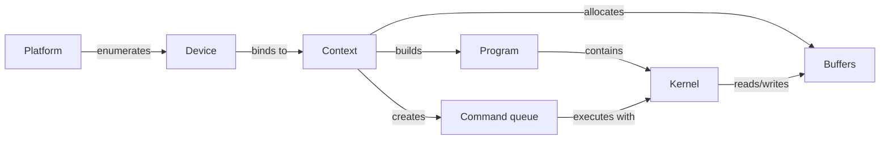

# OpenCL

OpenCL predates CUDA's dominance and was, for years, the only serious vendor-neutral answer to "how do I write one program that runs on GPUs from multiple vendors, plus CPUs, plus other accelerators." It still runs today, still ships in every major GPU driver, and still matters in a specific set of niches — but it lost the mindshare battle for general-purpose GPU compute, and understanding why is as useful as understanding the API itself.

## The object model

OpenCL exposes hardware through an explicit chain of objects, each one built from the one before it:



A **platform** is a vendor's OpenCL implementation (the NVIDIA driver's, AMD's, Intel's — a machine with GPUs from two vendors installed has two platforms). A **device** is one piece of hardware under that platform. A **context** binds one or more devices together so they can share objects. A **command queue** is where work targeting a specific device gets enqueued — buffer copies, kernel launches — analogous to a CUDA stream. A **program** is the compiled form of one or more kernel source strings, and a **kernel** is one named entry point extracted from a built program. **Buffers** are the memory objects kernels read and write. Every one of those objects is created and managed explicitly by host code; nothing is implicit.

## Kernel language

OpenCL C is a restricted dialect of C, extended with address-space qualifiers (`__global`, `__local`, `__constant`) and built-in vector types and functions. A kernel looks recognizably close to a CUDA `__global__` function in what it computes, if not in ceremony:

```cpp showLineNumbers title="saxpy.cl"
__kernel void saxpy(int n, float a, __global const float* x, __global float* y) {
    int i = get_global_id(0);
    if (i < n) y[i] = a * x[i] + y[i];
}
```

`get_global_id(0)` plays the role `blockIdx.x * blockDim.x + threadIdx.x` plays in CUDA — the kernel's position in the flattened global iteration space. `__global` marks a pointer as pointing into device global memory, since OpenCL C has no implicit default address space the way CUDA's `__device__`-qualified pointers do.

## The host-side ceremony

What makes OpenCL's verbosity visible is not the kernel — it's everything the host code has to do just to get that kernel running, because OpenCL kernels are compiled from source strings at runtime rather than compiled ahead of time by the same toolchain as the host code:

```cpp showLineNumbers
cl_uint num_platforms;
clGetPlatformIDs(0, nullptr, &num_platforms);
std::vector<cl_platform_id> platforms(num_platforms);
clGetPlatformIDs(num_platforms, platforms.data(), nullptr);

cl_device_id device;
clGetDeviceIDs(platforms[0], CL_DEVICE_TYPE_GPU, 1, &device, nullptr);

cl_context context = clCreateContext(nullptr, 1, &device, nullptr, nullptr, nullptr);
cl_command_queue queue = clCreateCommandQueueWithProperties(context, device, nullptr, nullptr);

const char* source = /* the saxpy.cl text above, as a string */;
cl_program program = clCreateProgramWithSource(context, 1, &source, nullptr, nullptr);
clBuildProgram(program, 1, &device, nullptr, nullptr, nullptr);
cl_kernel kernel = clCreateKernel(program, "saxpy", nullptr);

cl_mem d_x = clCreateBuffer(context, CL_MEM_READ_ONLY, bytes, nullptr, nullptr);
cl_mem d_y = clCreateBuffer(context, CL_MEM_READ_WRITE, bytes, nullptr, nullptr);
clEnqueueWriteBuffer(queue, d_x, CL_TRUE, 0, bytes, h_x, 0, nullptr, nullptr);
clEnqueueWriteBuffer(queue, d_y, CL_TRUE, 0, bytes, h_y, 0, nullptr, nullptr);

clSetKernelArg(kernel, 0, sizeof(int), &n);
clSetKernelArg(kernel, 1, sizeof(float), &a);
clSetKernelArg(kernel, 2, sizeof(cl_mem), &d_x);
clSetKernelArg(kernel, 3, sizeof(cl_mem), &d_y);

size_t global_size = n;
clEnqueueNDRangeKernel(queue, kernel, 1, nullptr, &global_size, nullptr, 0, nullptr, nullptr);
clEnqueueReadBuffer(queue, d_y, CL_TRUE, 0, bytes, h_y, 0, nullptr, nullptr);
```

Every step above — platform enumeration, device query, context, queue, program compiled from a string, kernel extracted by name, buffers created and written, arguments set one at a time by index — is boilerplate a CUDA program never writes, because `nvcc` compiles the kernel ahead of time and the CUDA runtime creates its context implicitly. That length is not incidental to this page; it is the argument.

## Why it lost mindshare

The verbosity above is a symptom of choices that, in retrospect, cost OpenCL the broader GPU-compute ecosystem to CUDA:

- **Separate-source compilation.** Kernels as plain strings, compiled at runtime by `clBuildProgram`, means no type checking between host argument-setting calls (`clSetKernelArg`, indexed by number) and the kernel signature, and no IDE support — no autocomplete, no jump-to-definition, no compile-time error at the call site when an argument type is wrong.
- **No single-source C++.** OpenCL C is a C dialect, not C++; there was no way to share types, templates, or host/device code the way CUDA's single-source `.cu` model always could.
- **Vendor implementation quality diverged.** Different vendors' OpenCL drivers supported different subsets of each spec version at different quality levels, so "OpenCL code" often meant "OpenCL code tested against one vendor's driver," undermining the portability the standard was supposed to guarantee.
- **CUDA's library ecosystem simply outgrew it.** cuBLAS, cuDNN, and the rest of NVIDIA's library stack gave CUDA programmers production-quality primitives years before OpenCL's ecosystem caught up, and by the time SYCL and HIP offered single-source portable alternatives, CUDA's library lead was hard to close.

## Where it still matters

OpenCL did not disappear — it settled into the niches where its actual strengths (broad hardware support, a mature standard, no dependency on any one vendor's toolchain) outweigh its ceremony: embedded and mobile GPUs, FPGA vendor toolchains that build their high-level synthesis flows on top of it, and as the portable fallback inside software that has to run correctly on whatever GPU happens to be installed — some rendering and video-processing tools use it for exactly that reason.

:::note[SPIR-V is OpenCL's other legacy]
OpenCL 2.1 introduced SPIR-V as a portable intermediate representation for kernels, replacing plain source-string compilation with a binary IR that can be validated and optimized ahead of time. SPIR-V outlived OpenCL's mindshare loss — it's also the IR Vulkan compute shaders compile to, and the substrate SYCL implementations target under the hood, making it one of the more consequential things to come out of the OpenCL standard.
:::

## See also

- [SYCL and oneAPI](./sycl-and-oneapi.md) — the single-source C++ model built directly on OpenCL's device and execution concepts.
- [Vulkan and DirectX Compute](./vulkan-and-directx-compute.md) — another SPIR-V-consuming compute API, from the graphics side.
- [The Portability Problem](./the-portability-problem.md) — why source-level portability alone was never going to be enough.
- [GPU & Accelerators](../readme.md) — the section index and its three learning paths.
