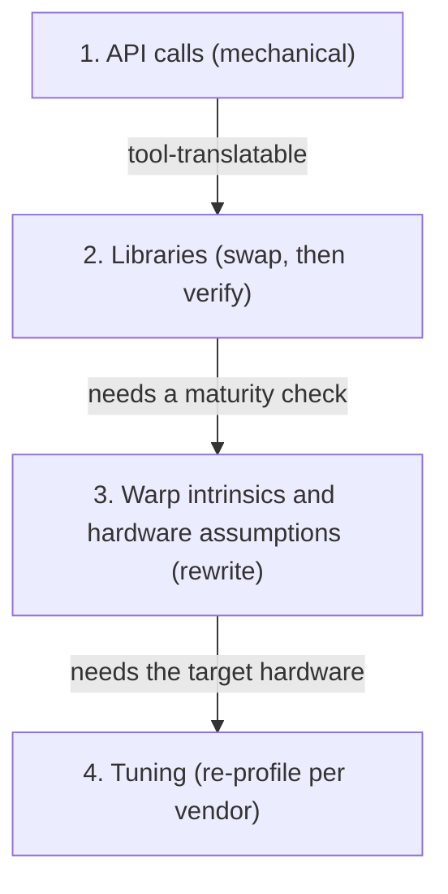

# The Portability Problem

Every CUDA program in this section so far has assumed an NVIDIA GPU underneath it. That assumption is usually safe in a single research group's cluster and usually false the moment code has to run on a customer's laptop, an AMD-powered supercomputer, or a mobile SoC. "Portability" sounds like a single problem with a single fix — pick a vendor-neutral API and move on — but it is really three separate, increasingly hard problems wearing one name, and confusing them is how teams end up with code that compiles everywhere and runs well nowhere.

## What actually locks you in

Not all CUDA-specific code is equally hard to leave behind. Roughly in order from easy to hard to escape:

1. **API calls.** `cudaMalloc`, `cudaMemcpy`, `<<<grid, block>>>` — these are mechanical to translate. A tool can do most of the work, because each call has a near-1:1 counterpart in HIP, SYCL, or OpenCL; see [HIP and ROCm](./hip-and-rocm.md) for exactly how mechanical this step is.
2. **Libraries.** cuBLAS, cuDNN, and NCCL have counterparts — rocBLAS, MIOpen, RCCL, and so on — but those counterparts vary in maturity, coverage, and performance relative to the NVIDIA original. Swapping a library call is easy to write and hard to trust without benchmarking.
3. **Warp-level intrinsics and hardware assumptions.** Code that hardcodes a warp size of 32, builds a `0xffffffff` lane mask, or assumes a specific bank count or tensor-core tile shape is making assumptions that are simply false on other hardware. This is not a translation problem; it is a rewrite.
4. **Tuning.** Tile sizes, unroll factors, and occupancy targets chosen by profiling on one architecture do not transfer. They still compile and run elsewhere — they just run badly, silently, with no compiler error to flag the mismatch.

Each rung down that list requires understanding the target hardware, not just its API surface, which is also why the effort needed to escape CUDA lock-in rises far faster than the rung number suggests:

## Three kinds of portability

"Portable" collapses three distinct properties that are worth naming separately:

- **Source portability** — the code compiles on the target stack. A translated `.cu` file that builds as HIP has achieved this.
- **Functional portability** — the code runs and produces correct results on the target hardware. Correct answers, not just a clean compile.
- **Performance portability** — the code runs *well* on the target hardware, without hand-tuning specific to that hardware.

Source and functional portability are largely solved problems today: HIP, SYCL, and OpenCL all reliably get code compiling and running correctly across vendors. Performance portability mostly is not — a kernel that is source- and functionally-portable can still run at a fraction of the hardware's achievable throughput, for reasons rungs 3 and 4 above describe.

That gap between "runs correctly" and "runs well" is precisely what makes performance portability the interesting problem in this folder. Every page that follows — HIP's near-CUDA API, SYCL's single-source model, OpenCL's explicit object chain, directive-based offload — solves source and functional portability in its own way; none of them solves performance portability for you.

:::warning[Portability without testing on the other target is a claim, not a property]
A kernel tuned exclusively on NVIDIA hardware and never run on AMD or Intel hardware is not "portable" just because it happens to compile elsewhere via HIP or SYCL. Until it has actually been measured on the second target, "portable" is an untested assumption — and the most common outcome when it finally is tested is a badly-tuned kernel that happens to also run somewhere else.
:::

## What portability costs

A portability layer trades some amount of peak performance for the ability to target more than one vendor from one codebase. The cost shows up in a few recognizable ways: an abstraction that maps to the lowest common denominator of what every backend supports, missing access to a vendor-specific intrinsic that the tuned CUDA version relied on, or a code-generation backend that is simply less mature than `nvcc` for a given hardware target. None of that is a fixed percentage — the size of the gap depends entirely on how much rung-3/rung-4 tuning the original kernel had, and claiming a specific number without a specific, attributable benchmark is not something this page will do.

The direction of the gap is also not fixed. A kernel that was never particularly well-tuned for NVIDIA hardware to begin with can lose little or nothing by moving to a portability layer, because there was no hand-tuned baseline to fall short of. The gap only becomes visible on kernels that had real per-architecture tuning invested in the original — which is exactly the rung-4 work a portability layer cannot see or reproduce automatically.

## The portable-performance question

Given that performance portability is the unsolved piece, the real design question for any project is not "which portability layer is fastest" but "how much of my performance-critical code actually needs vendor-specific tuning, and how much doesn't." Most of an application — data movement, orchestration, non-hot-path kernels — tolerates the generic path from a portability layer just fine. A small number of kernels typically account for most of the runtime, and those are exactly the ones where the tuning in rung 4 matters and a portability layer's generic scheduling shows up as measurable overhead. Treating the whole application as equally performance-critical, and therefore equally worth hand-tuning per vendor, is how a portability effort turns into a full parallel maintenance burden instead of a targeted one.

## A realistic strategy

The strategy that holds up in practice is to keep the algorithm portable, isolate the tuned inner kernel behind a clean interface, and accept a small number of per-vendor specializations for the handful of kernels that actually dominate runtime. That means: write the bulk of the application against a portable API (HIP, SYCL, or directive-based offload, per [HIP and ROCm](./hip-and-rocm.md), [SYCL and oneAPI](./sycl-and-oneapi.md), and [OpenMP and OpenACC Offload](./openmp-and-openacc-offload.md)); identify the few kernels where rung-3/rung-4 tuning actually matters; and let those specific kernels have vendor-specific implementations selected behind an interface, rather than trying to force one tuning to serve every backend equally.

## See also

- [HIP and ROCm](./hip-and-rocm.md) — the nearest-to-CUDA portability layer and where mechanical translation stops being enough.
- [Choosing a Portability Layer](./choosing-a-portability-layer.md) — how to weigh these tradeoffs for a specific project.
- [The Host–Device Model](../01-parallel-computing-foundations/the-host-device-model.md) — the shared offload structure every layer in this folder expresses differently.
- [GPU & Accelerators](../readme.md) — the section index and its three learning paths.
