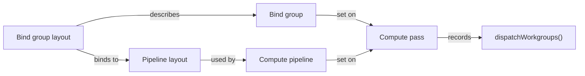

# WebGPU

Every compute API so far in this folder assumes a native process with a driver it trusts. A browser tab cannot make that assumption — it runs code from an untrusted origin, on a machine it doesn't control, and has to expose GPU compute without letting a web page read another tab's memory or hang the system. WebGPU is the answer: a browser API, backed by Vulkan, Metal, or D3D12 underneath, that gives web content a compute (and graphics) pipeline shaped like a stripped-down, sandboxed version of those native APIs.

## Compute in the browser

A `GPUDevice`, obtained by requesting an adapter and then a device from it, is the WebGPU entry point — the browser's sandboxed stand-in for the `VkDevice` or `MTLDevice` a native app would talk to directly. From there the shape is familiar: buffers, a shader module, a pipeline, a command encoder, and a queue to submit to. What's different is that every one of those objects is created through a JavaScript (or WASM) API, validated by the browser before anything reaches the actual driver, and torn down automatically when the tab closes — there is no way for page content to leak a GPU handle past its own session.

## WGSL

WebGPU's shading language is WGSL, and a compute shader in it declares its bindings and work-group size much like GLSL or HLSL do:

```wgsl showLineNumbers
@group(0) @binding(0) var<storage, read>       x : array<f32>;
@group(0) @binding(1) var<storage, read_write> y : array<f32>;
@group(0) @binding(2) var<uniform>             a : f32;

@compute @workgroup_size(256)
fn main(@builtin(global_invocation_id) gid : vec3<u32>) {
    let i = gid.x;
    if (i < arrayLength(&x)) {
        y[i] = a * x[i] + y[i];
    }
}
```

`@group(0) @binding(n)` is WGSL's binding syntax, corresponding to a descriptor set/binding pair in Vulkan or a register in HLSL. `var<storage, read>` and `var<storage, read_write>` declare storage-buffer access modes explicitly in the type, rather than relying on a separate qualifier keyword the way GLSL's `buffer` blocks do. `@compute @workgroup_size(256)` marks the entry point and fixes the work-group size, and `@builtin(global_invocation_id)` binds the parameter to the same global thread index GLSL calls `gl_GlobalInvocationID` and HLSL calls `SV_DispatchThreadID`. `arrayLength(&x)` returns the element count of the runtime-sized array bound to `x`, taking its address explicitly because `arrayLength` operates on a pointer to the array rather than the array itself — which is also why this shader never needs a separate `n` parameter the way the [Vulkan](./vulkan-and-directx-compute.md) GLSL and HLSL versions do.

## Bind groups and pipelines

Buffers don't bind to a shader directly; they go through a `GPUBindGroupLayout` that describes what a pipeline expects, a `GPUBindGroup` that supplies the actual buffers matching that layout, and a `GPUComputePipeline` built against the layout, before any of it can be recorded into a pass and dispatched:



The layout/instance split exists so a pipeline can be compiled once and reused with different buffers across many dispatches — the bind group is the cheap, per-dispatch part, and the pipeline is the expensive, compile-once part, mirroring the same layout/instance separation Vulkan's descriptor sets and D3D12's root signatures make.

## The sandbox's limits

The limits are not incidental — they decide up front whether a given workload fits in a browser at all. `adapter.limits` reports the concrete numbers a given browser and GPU combination actually supports — `maxStorageBufferBindingSize`, `maxComputeWorkgroupSizeX`, `maxComputeInvocationsPerWorkgroup`, and `maxComputeWorkgroupStorageSize` among them — and the spec's conservative default values are what an app must assume until it explicitly requests higher ones through `requiredLimits` at device-creation time, which the adapter can then refuse. Beyond size limits, WGSL simply has no 64-bit floating-point type — `f32` is the only floating-point type in core WGSL, so anything needing double precision has to stay off the GPU entirely or accept `f32`. There are no general-purpose pointers usable the way CUDA or SYCL uses device pointers — WGSL's pointer type exists but cannot be passed across shader-stage boundaries or aliased freely — and there's no direct CPU-side memory mapping into a GPU buffer; getting data back requires an explicit `mapAsync` and copy step, never a bare dereference. Feature negotiation follows the same pattern as limits: `adapter.features` reports what's available, and a device request that asks for an unsupported feature fails outright rather than silently degrading.

## Realistic use cases

None of this makes WebGPU a training or HPC platform — the limits above rule that out before performance even enters the discussion. What it's genuinely good for is client-side inference of small models (a quantized classifier or a small transformer running entirely in-tab), interactive visualization (particle systems, fluid simulations, anything that wants GPU-speed feedback tied to user input), and in-browser simulation for education or demos where installing a native toolchain isn't an option. Anything that needs the memory capacity, multi-GPU scaling, or sustained throughput this section's CUDA material targets belongs on a native stack instead.

:::note[WGSL runs outside the browser too]
WebGPU isn't only a browser API — `wgpu` (the Rust implementation behind Firefox's WebGPU) and Dawn (Chrome's implementation) both ship as standalone native libraries, callable from a regular application with no browser involved. That makes WGSL a plausible portable shader target even for native code that has nothing to do with the web, trading some of Vulkan's or Metal's peak capability for one shader language that runs unmodified across all three native backends plus the browser.
:::

## See also

- [Vulkan and DirectX Compute](./vulkan-and-directx-compute.md) — the native graphics APIs WebGPU's implementations are built on top of.
- [Choosing a Portability Layer](./choosing-a-portability-layer.md) — where WebGPU fits among the other options once the browser or in-process constraint applies.
- [The Accelerator Landscape](../00-overview/the-accelerator-landscape.md) — WebGPU's place in Apple's stack and elsewhere.
- [GPU & Accelerators](../readme.md) — the section index and its three learning paths.
