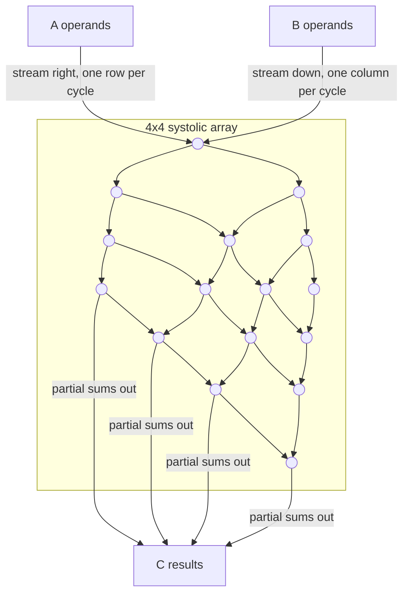

# Systolic Arrays and Dataflow

[What Is an NPU](./what-is-an-npu.md) established that an NPU's efficiency comes from removing per-instruction overhead, not from having more MAC units than a GPU. This page is about the mechanism that actually achieves that: the systolic array, and the small set of dataflow patterns — weight-stationary, output-stationary, row-stationary — that decide what stays resident in each cell versus what streams past it. Which pattern a piece of hardware picks is not a minor implementation detail; it is the single biggest factor in how much energy that hardware spends moving data around.

## The idea

A systolic array is a 2-D grid of identical MAC cells, each connected only to its immediate neighbors. Data enters the array from its edges and moves one cell per clock cycle — "systolic" because, like a heartbeat pushing blood through a body, values pulse through the grid in lockstep rather than being fetched individually by each cell. The mechanism is simple: each cell reads two operands (typically one from its left neighbor, one from above), multiplies them, adds the result to a running sum, and passes both operands onward to its own right and bottom neighbors on the next cycle.

The reuse this buys is the entire point, and it is not about MAC count — a systolic array does not have more multipliers than an equivalent-area collection of independent ALUs. What it has is data reuse: a single value read from memory at the array's edge gets used by every cell in the row or column it passes through, rather than being re-fetched from memory (or even from a register file) by each consumer separately. One memory read feeds an entire row or column of multiply-accumulates, and that is the reduction in memory traffic that makes the array efficient.

## GEMM on a systolic array

A dense matrix multiply is the canonical fit for this hardware, because its structure matches the array's connectivity exactly: computing `C = A x B` means every element of `C` is a sum of products along a shared dimension, and a systolic array can stream `A`'s rows in from the left and `B`'s columns in from the top so that partial sums accumulate in place as they move down through the grid.

Each cell holds one multiply-accumulate unit and a small amount of local storage. On every cycle it multiplies the operand arriving from the left by the operand arriving from above, adds that product to the partial sum arriving from above (or held locally, depending on the dataflow — see below), and forwards operands and partial sum to its neighbors. After enough cycles for the pipeline to fill, the array is producing one row of finished output per cycle, with every cell doing useful work on every cycle — that steady-state utilization is what a systolic GEMM is optimizing for, and it is why NPU compilers care so much about tiling a matrix multiply to actually fill the array's fixed dimensions.

*Source: [Google Cloud TPU system architecture](https://docs.cloud.google.com/tpu/docs/system-architecture-tpu-vm) (frame extracted from an animated figure)*

That single frame is a snapshot of the same process the diagram above models schematically: values already resident in cells being multiplied and accumulated while results appear at the array's edge, which is what "steady-state utilization" looks like in an actual implementation rather than an idealized flowchart.

## Weight-stationary

In a weight-stationary array, each cell loads one weight value and holds it resident for the entire computation; only activations stream through. This suits workloads that reuse the same weights across many inputs — a large batch multiplied repeatedly against one fixed weight matrix, which is exactly the shape of a batched inference pass. Loading weights into the array is itself a cost (it takes as many cycles as the array has rows or columns), so weight-stationary designs amortize that load cost over as large a batch as possible; Google's TPU MXU, covered in [Google TPU](./google-tpu.md), is the best-known example of this dataflow at scale.

## Output-stationary

In an output-stationary array, each cell accumulates one output element locally across the entire reduction, while both weights and activations stream through it. This suits workloads with deep accumulation — a long reduction dimension, such as a convolution with many input channels — because the partial sum never has to leave the cell it is being accumulated in, which avoids the read-modify-write traffic that stationary-weight designs pay when partial sums must move between cells.

## Row-stationary

Row-stationary, the dataflow associated with the Eyeriss accelerator, keeps one row of a convolution filter resident in each row of the array and reuses it across multiple rows of the input feature map, while also reusing partial sums locally within a row before combining them across rows. It is a deliberate compromise between the other two: rather than optimizing for one operand type's reuse at the expense of the others, it spreads reuse across weights, activations, and partial sums simultaneously, which tends to generalize better across the range of layer shapes a real convolutional network contains instead of being tuned for one shape in particular.

## Why data movement dominates energy

The reason all of this dataflow engineering exists comes down to a single ordering, not a set of numbers: an access to off-chip DRAM costs orders of magnitude more energy than a MAC operation itself; an access to on-chip SRAM costs much less than DRAM but still meaningfully more than the arithmetic; and an access to a register file or a direct neighbor-to-neighbor link, the kind a systolic array relies on, costs less again. That ordering — DRAM expensive, SRAM cheaper, local/register cheapest — is architecture- and process-dependent in its exact ratios, so treat any specific picojoule figure you encounter as belonging to one particular chip and node, not as a portable constant. What is portable is the shape of the curve, and it is why the entire field of dataflow design is organized around one goal: read a value from expensive memory once, and reuse it as many times as possible before it has to be re-fetched.

:::note[The same idea, a different point on the flexibility axis]
[Tensor Cores](../02-gpu-hardware-architecture/tensor-cores.md) are, in miniature, the same reuse argument: a small, hardware matrix-multiply-accumulate unit that a warp issues as one instruction instead of many scalar FMAs. The difference is where each sits on the flexibility axis. A tensor core is embedded in an otherwise fully programmable SIMT machine — it accelerates one operation shape inside a general-purpose core. A systolic array *is* the machine; there is no general-purpose core around it to fall back into. Both exist because reuse beats raw MAC count, at two very different scales of commitment to that idea.
:::

## See also

- [Google TPU](./google-tpu.md) — a weight-stationary systolic array built to datacenter scale.
- [What Is an NPU](./what-is-an-npu.md) — the design-point argument this page's mechanism supports.
- [Tensor Cores](../02-gpu-hardware-architecture/tensor-cores.md) — the same small-matrix-engine idea embedded in a programmable SIMT core.
- [GPU & Accelerators](../readme.md) — the section index and its three learning paths.
