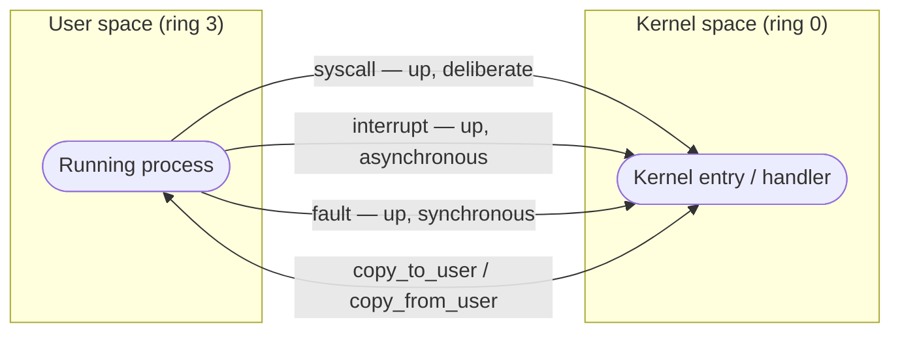

# The Kernel/User-Space Boundary

Two worlds separated by one hardware-enforced door, and why every mechanism in this section is shaped by that door.

There are two worlds on a running Linux machine, and one door between them. User space is code the
machine does not trust with the hardware — your shell, your browser, the process you just compiled.
The kernel is the code that owns the hardware: every device, every page of physical memory, every
other process on the box. The door between them is not a convention, a library call, or a rule your
program could choose to ignore — it is enforced by a single bit inside the CPU that code running in
user space cannot set. Every mechanism described anywhere in this section — every syscall, every
interrupt, every fault, every copy — exists in the shape it does because of the cost of walking
through that door and the rules the hardware places on doing it.

## What is on each side

| | User space | Kernel space |
|---|---|---|
| Address space | Its own, private, unprivileged | The kernel's own map, plus every process's mappings it needs to reach |
| Privilege level | Ring 3 (x86-64): unprivileged | Ring 0 (x86-64): privileged instructions and everything else |
| What a crash costs | One process; the kernel reclaims it | Potentially the whole machine — there is no ring above 0 to catch it |
| What it may touch | Only what its own mappings and file descriptors permit | Any physical memory, any device, any process's state |
| How it is scheduled | As a process or thread, timesliced against every other one | Not scheduled as its own entity — kernel code runs *inside* whichever process's context called it, or in an interrupt context that pre-empts everything |
| What it may not do | Execute a privileged instruction, touch a supervisor-only page | Nothing is withheld from it — restraint here is a matter of correctness, not permission |

## The door is hardware

The line between these two worlds is not something the kernel merely asks user code to respect — it
is a CPU mode that user code is architecturally incapable of changing on its own, which is what makes
it a security boundary rather than a polite agreement. The full mechanics of how that mode works —
the ring numbers, the instructions it gates, why it takes both a privilege check and a separate memory
check to make the boundary unforgeable — belong to computer architecture, not to Linux specifically,
and are covered in
[Privilege Levels and Protection](../../computer-science/cpu-architecture/privilege-levels-and-protection.md).
The one fact this page needs from that page: the boundary cannot be forged from the user-space side,
by construction, and that is the whole point of everything that follows.

## What crosses, and how

Four kinds of traffic cross the boundary, and they differ in the one thing that matters most for
reasoning about a running system: who initiated the crossing, and when.

- **System calls** — up, deliberate. Your process executes an instruction on purpose, asking for a
  named kernel service and blocking (from its own point of view) until it returns.
- **Interrupts** — up, asynchronous, unrelated to the process that happens to be running. A timer
  fires, a disk finishes a transfer, a network card has a packet — none of that has anything to do
  with what your process was doing at that instant, but the CPU stops it anyway and jumps to the
  kernel.
- **Faults** — up, synchronous, caused by the instruction the running process just executed. A page
  not present, a divide by zero, an attempt to write read-only memory: the CPU stops *before* the
  instruction's effect happens and hands the kernel a precise description of what was attempted.
- **Copies of data** — both ways, and always explicit. The kernel never simply dereferences a pointer
  a user process handed it — a bad pointer from user space must become an error, not a kernel crash —
  so every byte that crosses is moved through a checked copy routine, never a bare load or store.

*The four kinds of traffic that cross the privilege boundary, and their direction.*

Folder 05 owns the mechanics of each of these — the register conventions, the exact trap paths, the
`copy_to_user`/`copy_from_user` implementation. This page only owns their shape: what kind of thing
each one is, and which side started it.

## What actually happens

Take the simplest possible crossing: a process calls `write(1, "hi", 2)`. Walk it at the level of
*which side is executing*, not the syscall's semantics.

1. Your process is running, executing your program's instructions, in ring 3, using your process's
   stack.
2. It executes one instruction — `SYSCALL` on x86-64 — and that instruction traps.
3. The CPU switches privilege level to ring 0 and switches to a kernel stack, atomically, as part of
   that one instruction. Nothing your process could have done stops this or redirects it.
4. Execution lands at an address the *kernel* chose ahead of time, not one your process supplied:
   <Src file="arch/x86/entry/entry_64.S" symbol="entry_SYSCALL_64" />, the fixed entry point every
   fast syscall on x86-64 lands at.
5. Kernel code now runs — but it runs *on behalf of your process*, in your process's context, charged
   to your process's CPU time. There is no separate "kernel process" that received a message and is
   off doing the write on its own schedule.
6. The write completes (or blocks, if the destination isn't ready — but that is still your process,
   now waiting inside the kernel rather than in user space).
7. The kernel returns. Privilege drops back to ring 3, the kernel stack is left behind, and your
   process resumes at the instruction immediately after the one that trapped.

Nothing was sent anywhere. No message was queued for another program to pick up. Your process left
ring 3, ran different code in ring 0 for a while, and came back — the same process, the same thread,
the same task, the entire time.

:::note
arm64 walks the same shape with different names. The trapping instruction is `SVC #0`, not `SYSCALL`;
the privilege model is **exception levels**, not rings — user space runs at EL0, the kernel at EL1, and
the transition raised is EL0→EL1 rather than ring 3→ring 0. There is no separate fixed "fast syscall"
entry point the way `entry_SYSCALL_64` is on x86-64: a system call is one more synchronous exception
category dispatched through the same vector table every trap uses, distinguished afterward by reading
`ESR_EL1`. See [Privilege Levels and Protection](../../computer-science/cpu-architecture/privilege-levels-and-protection.md)
and [Exceptions, Traps, and Interrupts](../../computer-science/cpu-architecture/exceptions-traps-and-interrupts.md)
for the full model each name belongs to.
:::

## The kernel is not a process

You cannot `ps` the kernel, because the kernel is not a process — it is code, and code alone does not
show up in a process table. What `ps` shows you in place of "the kernel" is a family of **kernel
threads**: real, schedulable entities, forked from <Src file="kernel/kthread.c" symbol="kthreadd" />
and visible with their name in square brackets — `[kworker/0:1]`, `[ksoftirqd/0]`, `[rcu_sched]`. A
kernel thread is kernel code running as its own scheduled entity because that particular piece of
work — deferred interrupt handling, RCU grace-period bookkeeping, a work-queue item — has no user
process to be charged to. It is a real, separate thing from the mechanism above: in the `write()` walk
just described, kernel code ran *inside your process*, not inside a kernel thread. Kernel threads
exist for kernel work that belongs to nobody in particular; syscall handling is kernel work that
belongs, very specifically, to the process that made the call.

## Why the boundary is expensive, and what that causes

Crossing the boundary is not free. Saving and restoring register state, switching privilege and stack,
and the flush of speculative and cache state that modern mitigations add around the transition all
cost real cycles — cycles a program pays every single time it asks the kernel for anything, no matter
how small the request. That fixed cost is why so much of Linux's design effort goes into *not*
crossing the door, or crossing it as rarely as possible for as much work as possible: the vDSO maps
a handful of read-only kernel data and functions directly into every process so that calls like
`gettimeofday()` never trap at all; batching interfaces exist so one crossing can submit many
operations instead of one; `io_uring` goes further and lets a process and the kernel share ring
buffers so that, in the best case, no syscall is needed at all; memory-mapped I/O turns what would be
a stream of `read()`/`write()` calls into ordinary memory accesses the MMU handles without a trap.
None of this is optional polish — it is the direct, structural consequence of the door being
expensive to walk through.

## Misconceptions

1. **"The kernel is a program that runs alongside my programs."** No — there is no kernel process
   sitting in a run queue next to yours. The kernel is code your own process executes, in a different
   privilege mode, and then stops executing when it returns to you.
2. **"A system call is a function call into a library."** No — a library call is an ordinary jump your
   compiler placed; a system call is a hardware-mediated privilege transition to an address you did
   not choose and cannot change. `libc` wrapper functions like `write()` exist precisely to hide the
   `SYSCALL` instruction underneath an ordinary-looking function call.
3. **"The kernel can read my variables directly."** It can, physically — but it must not, and the
   convention that it does not is enforced in code, not by the hardware alone: a raw pointer from user
   space is never dereferenced directly. It goes through a checked copy routine that validates the
   address is actually yours before touching it, turning what would be a kernel crash on a bad pointer
   into an ordinary `-EFAULT` returned to the caller.

<KernelFacts
  structure={[["struct pt_regs", "arch/x86/include/asm/ptrace.h"]]}
  path="user instruction → CPU privilege transition → kernel entry → handler → return to user"
  observe="perf stat -e 'raw_syscalls:sys_enter' -- ls"
  trap="Kernel code that runs for your process is still charged to your process. `sys` time in `time(1)` is your program's time, spent on the other side of the door." />

## References

- [`man 2 syscall`](https://man7.org/linux/man-pages/man2/syscall.2.html) — the user-space view of the
  crossing: the per-architecture calling convention and register table for raw system calls.
- [The Linux kernel user's and administrator's guide](https://docs.kernel.org/admin-guide/index.html)
  — what the kernel exposes across the boundary, and the vocabulary the rest of this section builds
  on.
- Michael Kerrisk, *The Linux Programming Interface*, ch. 3, "System Calls" — the definitive treatment
  of the system-call interface from the calling process's side. A purchase, not a free link.
