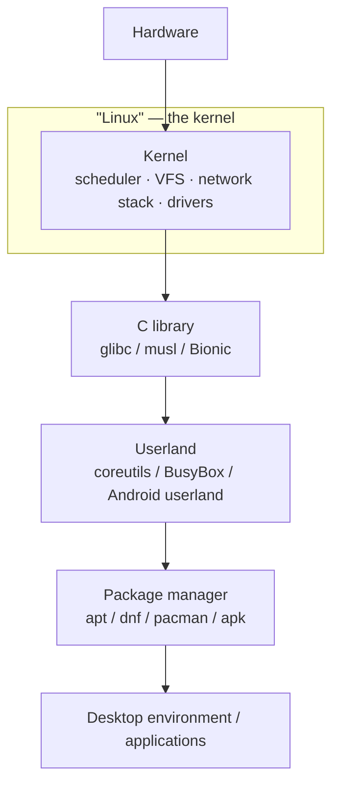

# What Linux Actually Is

Kernel, GNU, and distribution pulled apart, plus the two design commitments that still constrain everything: a stable user-space ABI and no stable module ABI.

The word "Linux" names four different things depending on who says it, and the four are not
interchangeable. It can mean the kernel — one project, one maintainer chain, one release schedule. It
can mean the kernel plus a userland, the smallest sense in which something "runs Linux" and can do
useful work. It can mean a distribution — a specific packaging of that combination with a name,
a release cadence, and a support policy of its own. And it can mean the whole ecosystem — every
distribution, every fork, every vendor kernel, treated as one undifferentiated thing. This is not
pedantry. The four have different maintainers, different release cadences, and different
compatibility promises, and a claim that is true of one is routinely false of another.

## The kernel, precisely

The kernel, precisely, is one thing: one source tarball, one `Makefile`, one `git` history with one
maintainer at the top of it. It releases on a cadence of roughly nine weeks, numbered `major.minor`
with no meaning attached to whether minor is even or odd — that convention died years ago. A subset of
releases are additionally designated **long-term support (LTS)**: the kernel community keeps
backporting fixes to them for years after a normal release would have been abandoned. This section
pins to one such release; see [the source](../readme.md) for exactly which one and why.

## What a distribution adds

Everything else. A distribution takes the kernel and adds a userland — GNU coreutils on Debian or
Fedora, BusyBox on a minimal system, Android's own userland — a C library, an init system, a package
manager, and usually a set of patches carried on top of upstream. It also adds one thing that gets
less attention than it deserves: a kernel **configuration**. The same kernel source compiles into
meaningfully different kernels depending on which `Kconfig` options are turned on, and that
configuration is a distribution decision as real as its choice of init system — it decides which
subsystems, drivers, and security features exist at all on a machine running that distribution's
kernel, not just which ones default to on.

## Two rules that explain most of Linux's design

1. **"We do not break user space."** A program that works today keeps working on every future kernel.
   Syscalls are never removed. A flag is added, never repurposed to mean something new. A structure
   that needs to grow gets an explicit size argument so old and new binaries can both use it safely.
   The consequence is one that surprises people: some interfaces are permanently ugly, carrying
   compatibility warts nobody would design in today, because fixing them would break a program that
   depends on the wart.
2. **No stable in-kernel ABI.** Internal interfaces — the ones only other kernel code and
   [modules](../04-kernel-architecture-and-idioms/exported-symbols-and-the-module-abi.md) call — change
   freely from release to release, with no compatibility promise at all. An out-of-tree module must be
   rebuilt against each kernel it runs on; an in-tree one is simply updated, in the same commit, by
   whoever changed the interface it depended on.

## Why those two rules are consistent

These look contradictory until you notice what each one is a promise *to*. The first is a promise to
users: the software you run against this kernel will keep running. The second is a refusal to extend
that same promise to code that chose to live outside the tree, where the project cannot see it, test
it, or fix it when an interface moves. This is not hypocrisy — it is a deliberate allocation of
maintenance cost. The kernel community pays, forever, to keep the syscall interface stable, because
that interface faces the entire world. It refuses to pay to keep internal interfaces stable, because
paying for that would mean freezing kernel internals for the benefit of code the project cannot
review — and internal interfaces are precisely the ones a kernel developer must be free to reshape to
keep improving the thing users actually depend on.

## What actually happens

Take "install a kernel update" — a phrase people use as if it meant one clean thing. What it actually
unpacks into, on a typical distribution:

1. The distribution's package manager fetches a package built from upstream Linux source *plus that
   distribution's config and patch set* — not a plain upstream tarball. A distribution kernel is never
   pristine upstream; it is upstream with a specific `.config` baked in and a set of patches carried on
   top, some cosmetic, some fixing bugs upstream hasn't shipped a fix for yet, occasionally some that
   change behavior on purpose.
2. The package installs a compressed kernel image and a tree of modules under a version-specific path.
3. An **initramfs** — a small filesystem holding just enough drivers and tools to find and mount the
   real root filesystem — gets generated fresh, on *your* machine, from *your* hardware and *your*
   installed modules. It is not shipped pre-built; a generic initramfs couldn't know in advance which
   disk controller or filesystem your particular machine needs at boot.
4. A boot-loader entry is written pointing at the new image, and the old kernel is normally left in
   place as a fallback.

None of that is upstream's release process — it is what a distribution's packaging does with an
upstream release. And the version string this produces is not upstream's version string either:
`uname -r` reports the distribution's own build identifier, which typically embeds the upstream base
version plus a distribution-specific suffix and patch count. The kernel's copy of that string lives in
<Src file="include/uapi/linux/utsname.h" symbol="new_utsname" />, filled in once at build time and
handed back unchanged, on every call, by <Src file="kernel/sys.c" symbol="sys_newuname" />. Read a real
one field by field:

```text
$ cat /proc/version
Linux version 6.8.0-49-generic (buildd@lcy02-amd64-045) (x86_64-linux-gnu-gcc-12 (Ubuntu 12.3.0-1ubuntu1~22.04) 12.3.0, GNU ld (GNU Binutils for Ubuntu) 2.38) #49-Ubuntu SMP PREEMPT_DYNAMIC Thu Nov  7 16:19:59 UTC 2024

$ uname -a
Linux host 6.8.0-49-generic #49-Ubuntu SMP PREEMPT_DYNAMIC Thu Nov 7 16:19:59 UTC 2024 x86_64 x86_64 x86_64 GNU/Linux
```

`6.8.0-49-generic` is Ubuntu's identifier, not upstream's: `6.8.0` is the upstream base this build
started from, `49` is Ubuntu's own build/patch count, `generic` is the kernel *flavor* (the specific
`.config` used — Ubuntu ships several). Everything after the version in `/proc/version` — the builder,
the compiler that built it, the exact build timestamp — belongs to the distribution's build
infrastructure, not to the kernel project.

## Monolithic, with modules — in one paragraph

One structural fact about the kernel itself matters for everything above: it is a **monolithic
kernel with loadable modules** — one address space, one privilege level, with drivers and subsystems
that can be compiled in or loaded at runtime rather than run as separate isolated services. That
choice is why a distribution's kernel *configuration* is such a consequential decision, and it gets
its own page:
[Monolithic, With Modules](../04-kernel-architecture-and-idioms/monolithic-with-modules.md).

## Misconceptions

1. **"Linux is an operating system."** The kernel is not an operating system by itself — it has no
   shell, no compiler, no package manager, nothing a user would sit down and use. What people run is a
   distribution: the kernel plus everything a distribution adds. "Linux" the kernel is one component of
   that, not the whole of it.
2. **"A newer kernel version means newer features on my machine."** Not reliably. Distribution kernels
   backport fixes and even whole features from newer upstream releases onto an older base, so a
   distribution's `6.1` kernel can legitimately contain code that first landed upstream in `6.9`. The
   version number tells you the base a distribution started from, not the complete feature set actually
   present.
3. **"GNU/Linux is a political point."** It is also a straightforwardly technical one. Alpine Linux and
   Android are both, unambiguously, Linux — they run the Linux kernel — and neither is GNU: Alpine pairs
   the kernel with musl and BusyBox, Android with Bionic and its own userland. "Linux" and "GNU" name
   independent things that are very often, but not always, combined.



*Where the kernel stops and the distribution starts: the kernel is one project; everything below it in
this diagram is a distribution's choice.*

<KernelFacts
  structure={[["struct new_utsname", "include/uapi/linux/utsname.h"]]}
  path="uname(2) → sys_newuname() → copy_to_user() of the kernel's utsname"
  observe="cat /proc/version && uname -a"
  trap="`uname -r` is a string the build set, not a guarantee about which features exist. Distribution kernels backport heavily; the version tells you the base, not the contents." />

## References

- [The Linux Kernel Archives — Releases](https://www.kernel.org/category/releases.html) — the live
  release table, including which branches are currently LTS; the source the pinned version in this
  section was taken from.
- [`Documentation/admin-guide/abi.rst`](https://docs.kernel.org/admin-guide/abi.html) — the stability
  promise stated by the kernel project itself, and the exception categories it actually admits.
- [Linus Torvalds, "Re: \[Regression w/ patch\] Media commit causes user space to misbahave" (2012)](https://lkml.org/lkml/2012/12/23/75)
  — the "WE DO NOT BREAK USERSPACE!" mail itself, worth reading for the tone as much as the content. Over
  a decade old, but quoted as a statement of a policy the project still holds, not as a description of
  any particular kernel's code.
