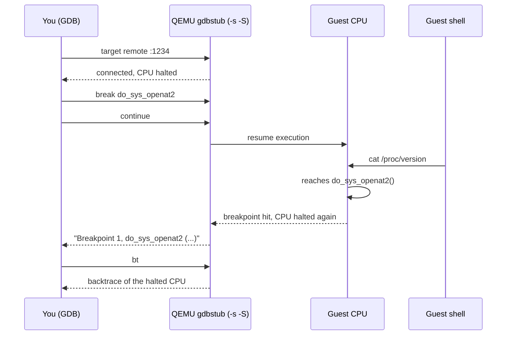

# Debugging the Kernel with GDB

Attaching a debugger to the virtual CPU, loading vmlinux symbols, and walking live kernel structures — the highest-leverage skill in this section.

On real hardware, watching kernel code execute means a serial cable, a second machine, and a debugger
that talks to hardware you can't single-step without stopping the whole box. A VM makes this
qualitatively different: QEMU can expose the guest's virtual CPU to GDB directly, so you can set a
breakpoint on kernel code, step one instruction at a time, and read a live `task_struct` out of guest
memory the same way you'd inspect a local variable in a userspace program. Everything in this folder so
far has been building toward this — a kernel you built, booting under an invocation you understand, is
what makes attaching a debugger to it something you can actually reason about instead of a black box
you're poking at.

## How it works

Two QEMU flags and one GDB command are the entire mechanism. `-s` opens a GDB stub listening on TCP
port 1234; `-S` freezes the guest at its very first instruction instead of letting it run. GDB then
attaches with `target remote :1234` and, from that point on, is driving the guest's virtual CPU
directly — reading and writing its registers and memory, single-stepping it, stopping it at
breakpoints — exactly as it would a local process under `ptrace`, except the "process" is an entire
kernel.

There is no agent running inside the guest and nothing installed in the guest kernel to make this
work. That's the detail that matters most: because GDB is talking to QEMU's *emulation* of the CPU, not
to anything running as guest software, this keeps working even when the guest is completely wedged —
deadlocked, spinning with interrupts off, or otherwise unable to run a single instruction of its own
code. A debugger that depends on the thing it's debugging being responsive is much less useful than one
that doesn't, and this is why kernel developers reach for this setup over almost anything else.

## Loading symbols

```text
$ cd ~/kernel-lab/linux
$ gdb vmlinux
```

`vmlinux` — not `bzImage` — is what GDB loads, because `vmlinux` is the uncompressed ELF with full
DWARF debug information, and `bzImage` is deliberately stripped of exactly that
(see [Building a Kernel](./building-a-kernel.md#what-a-build-produces)). GDB never boots `vmlinux`; it
only reads it, as a map of symbol names to addresses that it can match against whatever the connected
CPU is actually doing.

That map is only correct if it's the **same build** as the running `bzImage`. Two functions that happen
to compile to the same size can shift every address after them by even a one-line source change, so a
`vmlinux` from a different build than the kernel you booted will resolve breakpoints to the wrong
function, or to no function at all.

The second requirement is KASLR. x86-64 randomizes the kernel's load address on every boot by default,
which means the addresses in your static `vmlinux` and the addresses the running kernel is actually
using at any given moment are different by some random offset GDB has no way to know. Add `nokaslr` to
the kernel command line — the same `-append` string the canonical invocation already builds on — and
the two agree. **A `vmlinux`/`bzImage` mismatch and KASLR left on produce the identical symptom**:
breakpoints that silently never hit, or that hit in code that makes no sense for the function you named.
This is the single most common failure in this page's lab.

## The in-tree GDB scripts

[Building a Kernel](./building-a-kernel.md#the-options-that-matter-for-a-debuggable-lab-kernel) already
turned on `CONFIG_GDB_SCRIPTS` before that page's build ran, which means `vmlinux-gdb.py` was generated
automatically alongside `vmlinux` — no separate step needed. `gdb vmlinux` auto-loads it from the same
directory, which is what makes the `lx-*` commands below exist at all inside your GDB session.

:::note
Some distributions restrict GDB from auto-loading scripts outside directories you've explicitly
trusted. If `gdb vmlinux` reports refusing to load `vmlinux-gdb.py`, add
`add-auto-load-safe-path ~/kernel-lab/linux` to `~/.gdbinit` and restart GDB.
:::

Four commands cover most of what this page needs:

| Command | Shows |
|---|---|
| `lx-dmesg` | The kernel's log buffer, read directly out of guest memory — works even before a console driver has printed anything. |
| `lx-ps` | Every task in the system, walked from `init_task`. |
| `lx-lsmod` | Loaded modules, the `lx-*` equivalent of `/proc/modules`. |
| `lx-symbols` | (Re-)loads symbols for the main kernel and every currently loaded module. |

`lx-ps`, run against this section's BusyBox lab kernel:

```text
(gdb) lx-ps
      TASK          PID    COMM
0xffffffff82a12480     0    swapper
0xffff888003a41cc0     1    sh
0xffff888003a43340     2    kthreadd
```

PID 0 (`swapper`) is the static idle task compiled into the kernel itself; PID 1 is BusyBox's `ash`,
`exec`'d in place of `/init` exactly as [A Minimal Root Filesystem](./a-minimal-rootfs.md) built it;
PID 2 is `kthreadd`, the kernel thread that spawns every other kernel thread. Addresses will differ
from run to run — KASLR, if left on elsewhere in your work, moves them; what's stable is the shape of
the table itself.

`lx-symbols` matters beyond the main kernel: a breakpoint on a function inside a `.ko` that hasn't been
loaded yet has no address to break on. `lx-symbols` is what teaches GDB about a module's load address
the moment `insmod` brings it in, which is the only way a breakpoint on module code resolves at all.

## A first breakpoint

<Src file="fs/open.c" symbol="do_sys_openat2" /> is the shared implementation behind `open`, `openat`,
and `openat2` — `openat2` calls it directly, and `open`/`openat` both reach it through
`do_sys_open`. All three syscalls end up here, which makes it a breakpoint that is guaranteed to be
hit the moment the guest shell reads a single file.

```text
(gdb) break do_sys_openat2
Breakpoint 1 at 0xffffffff8127a230: file fs/open.c, line 1420.
(gdb) continue
Continuing.
```

Then, from the guest's own shell:

```text
/ # cat /proc/version
```

Back in GDB:

```text
Breakpoint 1, do_sys_openat2 (dfd=-100, filename=0xffffc90000123ff8 "/proc/version",
    how=0xffffc90000123fe0) at fs/open.c:1420
1420    static int do_sys_openat2(int dfd, const char __user *filename,
(gdb) bt
#0  do_sys_openat2 (dfd=-100, filename=..., how=...) at fs/open.c:1420
#1  0xffffffff8127a3e0 in do_sys_open (dfd=-100, filename=..., flags=..., mode=0) at fs/open.c:1452
#2  0xffffffff8127a4d2 in __x64_sys_openat (regs=...) at fs/open.c:1468
#3  0xffffffff81003a41 in do_syscall_64 (regs=..., nr=257) at arch/x86/entry/syscall_64.c:87
#4  0xffffffff82000123 in entry_SYSCALL_64 () at arch/x86/entry/entry_64.S:87
```

Exact addresses and frame numbers will differ from build to build — the shape of the backtrace,
`do_sys_openat2` called from the syscall entry path in response to the guest's `cat`, is the point.

## Walking a task_struct

`p $lx_current()` returns the `task_struct` for whichever task the currently-stopped CPU was running —
useful the moment a breakpoint hits, since it tells you *which* process triggered it without hunting
through `lx-ps`:

```text
(gdb) p $lx_current()
$1 = (struct task_struct *) 0xffff888003a41cc0
(gdb) p $lx_current()->comm
$2 = "sh\000\000\000\000\000\000\000\000\000\000\000\000"
(gdb) p $lx_current()->pid
$3 = 1
```

The same works from any address `lx-ps` prints, once cast back to the right pointer type:

```text
(gdb) p ((struct task_struct *)0xffff888003a41cc0)->comm
$4 = "sh\000\000\000\000\000\000\000\000\000\000\000\000"
(gdb) p ((struct task_struct *)0xffff888003a41cc0)->pid
$5 = 1
```

This is not this page's territory to go further into — folder 06 owns `task_struct` itself, what its
fields mean, and how the scheduler uses it. What matters here is proving it's reachable at all: a live
kernel data structure, read directly out of guest memory from a stopped CPU, with no special tooling
beyond GDB and the scripts `CONFIG_GDB_SCRIPTS` already gave you.

## Limits

- **Very early boot is a patience problem, not a technique problem.** A breakpoint on code that runs
  before the console or the memory allocators are up still requires `-S` and stepping through firmware
  and decompression first — GDB works the whole way down, but there's more to step through before
  anything interesting happens.
- **Single-stepping with interrupts live is confusing.** Timer interrupts and other asynchronous events
  keep firing while you step, so `next`/`step` can appear to jump into completely unrelated code — not
  a bug in GDB, just another CPU-level event landing between your instructions.
- **Watchpoints on kernel memory are limited by hardware debug registers.** A CPU has a small, fixed
  number of hardware watchpoint slots (four on x86-64); asking for more than that either fails outright
  or silently falls back to a much slower software-emulated watchpoint, depending on your accelerator.



*How a breakpoint set on the host stops a CPU inside the guest — GDB never touches the guest's software, only the CPU state QEMU exposes.*

<Lab host="qemu-gdb" title="Break on a system call" time="15 min">

**Terminal 1** — boot with the debug stub attached, frozen at the first instruction, KASLR off:

```text
$ cd ~/kernel-lab/linux
$ qemu-system-x86_64 \
    -kernel arch/x86/boot/bzImage \
    -initrd ../initramfs.cpio.gz \
    -append "console=ttyS0 nokaslr" \
    -nographic \
    -m 2G \
    -smp 2 \
    -enable-kvm \
    -no-reboot \
    -s -S
```

QEMU launches and prints nothing further — this is expected, covered below.

:::warning
`-S` means the guest CPU has not executed a single instruction yet and will not until GDB tells it to.
An apparently frozen terminal with no boot output at all, right after this command, is `-S` working
exactly as intended — not a hang. Nothing happens here until terminal 2 issues `continue`.
:::

**Terminal 2** — attach and break before `start_kernel` runs:

```text
$ cd ~/kernel-lab/linux
$ gdb vmlinux
(gdb) target remote :1234
Remote debugging using :1234
0x000000000000fff0 in ?? ()
(gdb) break start_kernel
Breakpoint 1 at 0xffffffff82a00123: file init/main.c, line 910.
(gdb) continue
Continuing.
```

Expected: the breakpoint hits almost immediately, and **terminal 1 still shows no boot output at all** —
`start_kernel` runs before the console is set up, so there is nothing to print yet:

```text
Breakpoint 1, start_kernel () at init/main.c:910
910     void start_kernel(void)
```

Check the log buffer directly — it works even with no console output on screen:

```text
(gdb) lx-dmesg | head
```

Let the boot continue the rest of the way to the shell:

```text
(gdb) continue
Continuing.
```

Terminal 1 now shows the full boot log ending at the BusyBox prompt. Back in terminal 2, set the
syscall breakpoint from [A first breakpoint](#a-first-breakpoint):

```text
(gdb) break do_sys_openat2
Breakpoint 2 at 0xffffffff8127a230: file fs/open.c, line 1420.
(gdb) continue
Continuing.
```

In terminal 1's guest shell, trigger it:

```text
/ # cat /proc/version
```

Back in terminal 2:

```text
Breakpoint 2, do_sys_openat2 (dfd=-100, filename=..., how=...) at fs/open.c:1420
(gdb) bt
#0  do_sys_openat2 (dfd=-100, filename=..., how=...) at fs/open.c:1420
#1  0xffffffff8127a3e0 in do_sys_open (dfd=-100, filename=..., flags=..., mode=0) at fs/open.c:1452
#2  0xffffffff8127a4d2 in __x64_sys_openat (regs=...) at fs/open.c:1468
...
```

**If it fails:** a breakpoint that never hits, or `bt` that lands in code with no relation to the
function you named, means KASLR is on somewhere in the chain or `vmlinux` doesn't match the booted
`bzImage` — see [Loading symbols](#loading-symbols) above.

</Lab>

<KernelFacts
  structure={[["vmlinux", "the ELF kernel with DWARF symbols; never booted, only read"], ["vmlinux-gdb.py", "generated by CONFIG_GDB_SCRIPTS; loads the lx-* helpers"]]}
  path="qemu -s -S → gdb vmlinux → target remote :1234 → break <symbol> → continue"
  observe="lx-ps"
  trap="Breakpoints that never hit, or hit in nonsense code, almost always mean KASLR is on or `vmlinux` is from a different build than the running `bzImage`. Rebuild both together and add `nokaslr`." />

## References

- [Kernel documentation — Debugging kernel and modules via gdb](https://docs.kernel.org/process/debugging/gdb-kernel-debugging.html)
  — the in-tree procedure this page follows, including `CONFIG_GDB_SCRIPTS` and the full `lx-*` command
  list, straight from the kernel's own docs. (The plan's original URL, `dev-tools/gdb-kernel-debugging.html`,
  404s — the page moved under `process/debugging/`.)
- [QEMU documentation — GDB usage](https://www.qemu.org/docs/master/system/gdb.html)
  — what `-s` and `-S` actually do, and the gdbstub's breakpoint/watchpoint limits per accelerator.
- [GDB documentation — Remote Debugging](https://sourceware.org/gdb/current/onlinedocs/gdb.html/Remote-Debugging.html)
  — the GDB side of `target remote`, for when the stub connection itself misbehaves.
