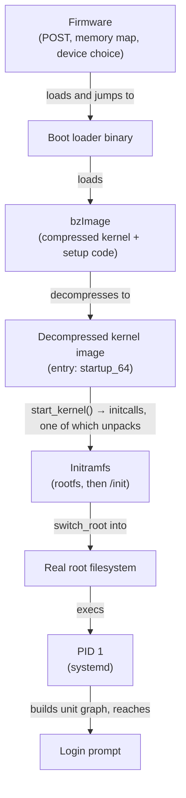

# From Power-On to Login Prompt

Every handoff between pressing the power button and a login prompt, with the artefact each stage passes to the next.

Booting a machine is a chain of handoffs, and every link in that chain has exactly one job: find the
next piece of code, load it into memory, and jump to it — leaving behind a little more of the machine
initialised than it found. Firmware doesn't know what Linux is. The boot loader doesn't know what a
process is. The kernel, for its first few instructions, doesn't even know what mode the CPU is in. Each
stage is narrow on purpose, and each one leaves evidence — a log line, a timestamp, a counter — that
the next stage, or a human much later, can read back. Nothing about this chain is magic; it's eight
ordinary handoffs, each one legible after the fact.

## Firmware

Power-on runs firmware, not the kernel — code already resident in flash on the motherboard, BIOS or
UEFI. It runs POST (power-on self-test) to confirm the CPU, RAM, and buses actually work, builds a map
of which physical memory ranges are usable, enumerates the devices it can see, and then, following its
own configuration, picks a device and a piece of code to load and jump to. Firmware doesn't know what
Linux is; it only knows which sector or file to read and where to jump afterward. See
[Firmware, BIOS, and UEFI](../03-boot-and-init/firmware-bios-and-uefi.md).

## The boot loader

Control now belongs to whatever firmware loaded — typically GRUB, or `systemd-boot` on a UEFI system
with a simpler setup. Its job is narrow: find a kernel image on disk, find (or build) an initramfs to
go with it, assemble a kernel command line, load both into memory, and jump into the kernel's own entry
point. The boot loader does **not** start the operating system — that's the single most useful
correction to make here, because "boot loader starts Linux" is the sentence most people carry around
that skips the part where the kernel is the one deciding what happens next. See
[Boot Loaders: GRUB and Friends](../03-boot-and-init/bootloaders-grub-and-friends.md).

## The kernel image unpacks itself

The file the boot loader just loaded is a `bzImage`, and despite the name, most of its bytes aren't the
kernel that's about to run. A `bzImage` is a small blob of real-mode setup code, a decompression stub,
and a compressed payload holding the real kernel. So the first thing that runs after the jump is
self-extraction: <Src file="arch/x86/boot/compressed/misc.c" symbol="extract_kernel" /> decompresses the
payload into memory and jumps to *that* entry point. Everything up to this instant has been preparing
to run code that, until a moment ago, didn't exist anywhere in memory in executable form. See
[The Kernel Image](../03-boot-and-init/the-kernel-image.md).

## Getting to C

On x86-64, the freshly decompressed kernel's own entry point, <Src file="arch/x86/kernel/head_64.S" symbol="startup_64" />,
still starts in a CPU mode built for compatibility, not for the kernel that's about to run in it. Getting
to the C code most engineers picture as "the kernel" takes several hand-written assembly steps: a
transition through 32-bit protected mode, a set of early page tables built before there's any allocator
to build them with, a transition into 64-bit long mode, and only then a call into the first C function,
<Src file="arch/x86/kernel/head64.c" symbol="x86_64_start_kernel" />. Every one of those transitions
changes what addresses mean and what instructions are legal — which is exactly why it has to happen in a
fixed order, in assembly, before any ordinary C function can safely run at all. See
[Early Boot and Architecture Setup](../03-boot-and-init/early-boot-and-arch-setup.md).

## Bringing up the kernel

`x86_64_start_kernel()` does a small amount of platform setup and calls straight into
<Src file="init/main.c" symbol="start_kernel" /> — the first function that gets to assume it's "the
kernel" the way most people picture it. It's a long, strictly ordered sequence: memory management,
scheduling, timers, interrupts, each step assuming everything before it already works. Near the end,
`start_kernel()` calls `rest_init()`, which spawns the kernel's own PID 1 as a kernel thread running
<Src file="init/main.c" symbol="kernel_init" /> — and then `start_kernel()` itself never returns; the
thread that got the machine this far becomes the idle task.

`kernel_init()` calls <Src file="init/main.c" symbol="kernel_init_freeable" />, which calls
<Src file="init/main.c" symbol="do_basic_setup" /> — and *that* is where the initcalls actually fire,
level by level (early, core, subsys, fs, rootfs, device, late), each level assuming every earlier one is
done. This is how the tree's drivers, filesystems, and subsystems announce themselves without
`start_kernel()` needing a hardcoded list of what exists. See
[start_kernel() and initcalls](../03-boot-and-init/start-kernel-and-initcalls.md).

## Early user space

One specific initcall, at the `rootfs` level, is
<Src file="init/initramfs.c" symbol="populate_rootfs" /> — the function that unpacks the boot loader's
initramfs (a cpio archive) into an in-memory filesystem the kernel calls `rootfs`. So "early user space"
isn't a separate stage bolted on after the kernel finishes booting; it's produced by one of the
initcalls, mid-sequence, same mechanism as everything else in that list.

Once `do_basic_setup()` returns, `kernel_init_freeable()` checks whether the unpacked filesystem has a
`/init` — by default, literally the string `"/init"`, overridable with `rdinit=` on the kernel command
line — and if it's there, hands off to it. This is the first user-space code that runs on the machine.
Its job is narrow and temporary: load whichever kernel modules are needed to see the real root device (a
disk controller driver, a filesystem, an encryption layer — whatever *this* machine needs that the
generic kernel couldn't build in) and then get out of the way. See
[Initramfs and Early User Space](../03-boot-and-init/initramfs-and-early-userspace.md).

:::note
The kernel function `kernel_init()` and the initramfs script conventionally named `/init` are two
different things that happen to share a name. `kernel_init()` is the C function that becomes PID 1's
kernel thread; `/init` is a userspace program — often a shell script, or `systemd` itself on newer
initrd designs — that `kernel_init()` execs.
:::

## The real root, and PID 1

Early user space's `/init` makes the real root filesystem reachable, then replaces itself: on most
modern distributions this is the `switch_root` program, which moves the real root into place, discards
what's left of the initramfs, and `exec`s the real init directly — same PID, no fork. (If a distribution's
initramfs has no `/init` at all, the kernel falls back to an older path,
<Src file="init/do_mounts.c" symbol="prepare_namespace" />, which mounts a root device directly instead
of trusting user space to do it — the mechanism behind a bare `root=` kernel parameter, mostly
superseded now.)

Either way, control eventually returns to `kernel_init()`'s own fallback logic. If the `/init` it tried
failed, and no explicit `init=` was given on the command line, it walks a fixed list —
`/sbin/init`, `/etc/init`, `/bin/init`, `/bin/sh` — via
<Src file="init/main.c" symbol="run_init_process" />, which wraps one call to `kernel_execve()`.
Whichever one succeeds becomes PID 1's actual image, commonly `systemd`. If none of them do, the kernel
panics with "No working init found" — there is no supervisor left to fall back to. This is also why PID 1
is privileged in a way no other process is: <Src file="kernel/exit.c" symbol="do_exit" /> checks
explicitly whether the exiting task is the global init and panics rather than let it die, because a
system with no PID 1 has no one left to reap orphans or notice anything is wrong. See
[switch_root and PID 1](../03-boot-and-init/switch-root-and-pid-1.md).

## systemd builds a graph

PID 1 doesn't run services from a fixed script. It parses `.service`, `.socket`, `.target`, and other
unit files, builds a dependency graph between them, and starts units in parallel wherever the graph
allows it — which is why boot order isn't "one thing after another." That graph eventually reaches a
getty unit, which opens a terminal and runs `login`, which authenticates you and `exec`s your shell. The
prompt you're looking at is a leaf of a dependency tree, not the last line of a list. See
[systemd: The Model](../03-boot-and-init/systemd-the-model.md).

## What actually happens

Every stage above left a timestamp, which means "my machine boots slowly" is an answerable question, not
a feeling. `systemd-analyze` reports the userspace total, and `systemd-analyze critical-chain` walks
backward from the final target through whichever dependency chain actually determined when it was
reached — the units on that chain are the ones worth investigating; everything off it, however slow, was
running in parallel and for free. Both, unedited, from this machine:

```text
$ systemd-analyze
Startup finished in 1.566s (userspace)
graphical.target reached after 1.565s in userspace.
```

```text
$ systemd-analyze critical-chain
The time when unit became active or started is printed after the "@" character.
The time the unit took to start is printed after the "+" character.

graphical.target @1.565s
└─multi-user.target @1.563s
  └─snapd.seeded.service @378ms +993ms
    └─basic.target @356ms
      └─sockets.target @355ms
        └─snapd.socket @353ms +2ms
          └─sysinit.target @343ms
            └─systemd-udevd.service @269ms +73ms
              └─systemd-tmpfiles-setup-dev.service @246ms +7ms
                └─systemd-tmpfiles-setup-dev-early.service @229ms +14ms
                  └─kmod-static-nodes.service @211ms +11ms
                    └─systemd-journald.socket @197ms +18us
                      └─-.mount @171ms
                        └─-.slice @171ms
```

Read bottom to top: `-.slice`, the root of the whole cgroup tree, was ready at 171ms, and every unit above
it in the chain waited on the one below. The single biggest number on the chain is
`snapd.seeded.service`, which took 993ms of the 1.565s total — that line, not a vague sense that "boot is
slow," is where an actual investigation into this machine's boot time would start.

:::note
This machine is a WSL2/Hyper-V virtual machine, not a bare-metal boot, so `systemd-analyze` reports only
the userspace phase — there's no separate firmware/loader/kernel breakdown the way a real BIOS or UEFI
boot shows one. The `dmesg` evidence below still comes from the same kernel running the same handoffs
described above; only the firmware doing the handing-off is virtual.
:::

`dmesg`, unedited, from the same machine — the first entries the kernel ever logs, while it's still
deciding what hardware it has:

```text
[    0.000000] Linux version 6.18.33.2-microsoft-standard-WSL2 (root@f1bbfb02316b) (gcc (GCC) 13.2.0, GNU ld (GNU Binutils) 2.41) #1 SMP PREEMPT_DYNAMIC Thu Jun 18 21:54:43 UTC 2026
[    0.000000] Command line: initrd=\initrd.img WSL_ROOT_INIT=1 panic=-1 nr_cpus=16 hv_utils.timesync_implicit=1 console=hvc0 debug pty.legacy_count=0 WSL_ENABLE_CRASH_DUMP=1
[    0.000000] KERNEL supported cpus:
[    0.000000]   Intel GenuineIntel
[    0.000000]   AMD AuthenticAMD
[    0.000000] BIOS-provided physical RAM map:
[    0.000000] BIOS-e820: [mem 0x0000000000000000-0x000000000009ffff] usable
[    0.000000] BIOS-e820: [mem 0x00000000000e0000-0x00000000000e0fff] reserved
[    0.000000] BIOS-e820: [mem 0x0000000000100000-0x00000000001fffff] ACPI data
[    0.000000] BIOS-e820: [mem 0x0000000000200000-0x00000000f7ffffff] usable
[    0.000000] BIOS-e820: [mem 0x0000000100000000-0x00000003f69fffff] usable
[    0.000000] NX (Execute Disable) protection: active
[    0.000000] APIC: Static calls initialized
[    0.000000] DMI not present or invalid.
[    0.000000] Hypervisor detected: Microsoft Hyper-V
[    0.000000] Hyper-V: privilege flags low 0xae7f, high 0x3b8030, ext 0x42, hints 0x9e4e24, misc 0xe0bed7b2
[    0.000000] Hyper-V: Nested features: 0x3e0101
[    0.000000] Hyper-V: LAPIC Timer Frequency: 0xc3500
[    0.000000] Hyper-V: Using hypercall for remote TLB flush
[    0.000000] clocksource: hyperv_clocksource_tsc_page: mask: 0xffffffffffffffff max_cycles: 0x24e6a1710, max_idle_ns: 440795202120 ns
[    0.000000] clocksource: hyperv_clocksource_msr: mask: 0xffffffffffffffff max_cycles: 0x24e6a1710, max_idle_ns: 440795202120 ns
[    0.000000] tsc: Detected 3686.400 MHz processor
[    0.000038] e820: update [mem 0x00000000-0x00000fff] usable ==> reserved
[    0.000040] e820: remove [mem 0x000a0000-0x000fffff] usable
[    0.000043] last_pfn = 0x3f6a00 max_arch_pfn = 0x400000000
[    0.000059] MTRR map: 5 entries (4 fixed + 1 variable; max 20), built from 8 variable MTRRs
[    0.000061] x86/PAT: Configuration [0-7]: WB  WC  UC- UC  WB  WP  UC- WT
[    0.000088] last_pfn = 0xf8000 max_arch_pfn = 0x400000000
[    0.000098] Using GB pages for direct mapping
[    0.000190] RAMDISK: [mem 0x04beb000-0x04e9ffff]
```

The `Command line:` entry is exactly what the boot loader assembled and handed the kernel — here
`initrd=\initrd.img` names the file that will feed `populate_rootfs()`. The `BIOS-e820` lines are the
kernel echoing back the memory map "firmware" handed it, whether that firmware was a real BIOS or, as
here, Hyper-V synthesizing one. And `RAMDISK: [mem ...]` is the kernel reporting exactly where in memory
it found the initramfs payload it's about to unpack — the log line for the handoff two sections back.



*Eight handoffs, and the artefact each one passes to the next.*

<KernelFacts
  structure={[["start_kernel()", "init/main.c"]]}
  path="firmware → boot loader → bzImage decompression → early arch setup → start_kernel() → initcalls → /init → switch_root → PID 1 → getty"
  observe="systemd-analyze critical-chain"
  trap="The boot loader does not start the operating system. It loads one file and jumps to it; everything after that is the kernel deciding what happens next." />

## References

- [The kernel's boot config documentation](https://docs.kernel.org/admin-guide/bootconfig.html) —
  the extended-command-line mechanism that sits alongside the classic kernel command line, for anyone
  whose boot loader needs more configuration than a single line comfortably holds.
- [The x86 boot protocol](https://docs.kernel.org/arch/x86/boot.html) — the exact contract between the
  boot loader and the kernel: the header fields a `bzImage` carries, and what a boot loader is required
  to fill in before it jumps.
- [`man 1 systemd-analyze`](https://man7.org/linux/man-pages/man1/systemd-analyze.1.html) — the
  measurement tools this page's "What actually happens" evidence comes from, including `blame` and
  `critical-chain` for finding what's actually slow versus what merely ran late.
- [linux-insides: Booting](https://0xax.gitbooks.io/linux-insides/content/Booting/) — a well-known,
  line-by-line walk of early x86 boot. It predates the pinned kernel here (`v6.18`) by many years, and
  some of the file names and function names it references have since moved; read it for the mental
  model, and verify any specific symbol against Elixir before trusting it.
