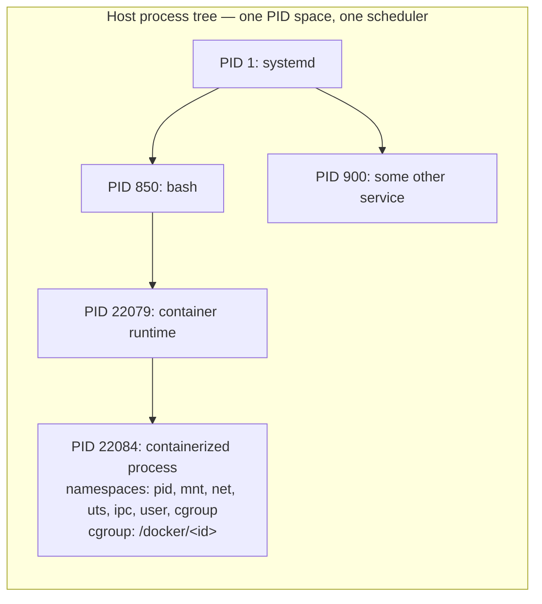

# The Life of a Container

docker run de-mystified: a container is a process started with unusual arguments, and here is every one of them.

A container is a process. That sentence is the whole page — everything below just defends it. There is
no `struct container` anywhere in the kernel, no container system call, no container scheduler class.
What exists is a set of ordinary, independently useful mechanisms — namespaces, cgroups, capabilities,
seccomp — that a userspace tool applies together, in a particular order, at the moment it creates one
process. `docker run`, `podman run`, and `runc` are all, at the bottom, doing the same handful of things
to the same handful of kernel interfaces. Nothing about the result is a lightweight virtual machine;
there is no guest kernel, no hypervisor, no second copy of Linux running underneath. It is a process on
this host, and `ps -ef` on this host will show it to you.

## The image is a stack of directories

Before any process exists, there's an image, and an image is nothing more exotic than a stack of
directory trees, layered. Each layer is the filesystem diff produced by one build step; a base layer
might be a minimal userland, the next layer adds a package, the next adds application code. None of
those layers are mutable once built — they're addressed by content hash and shared read-only across
every container that uses them, which is why running the same image twice doesn't cost twice the disk.

`overlayfs` is what turns a stack of read-only layers plus one writable layer into something that looks
like an ordinary single filesystem. Mounted as <Src file="fs/overlayfs/super.c" symbol="ovl_fs_type" />
with a `lowerdir` (the read-only layers, in order) and an `upperdir` (the one writable layer), it
presents a merged view: a read looks up a file top-down through the layers and returns the first hit; a
write to a file that only exists in a lower, read-only layer triggers **copy-up** — the file is copied
into the writable layer first, and *that* copy is what gets modified. The read-only layers underneath
never change, no matter how much the container writes.

## `clone()` with unusual flags

Creating the container's first process is not a special call — it's the same
<Src file="kernel/fork.c" symbol="kernel_clone" /> path (via <Src file="kernel/fork.c" symbol="copy_process" />)
that creates every process and every thread on the system, `fork()` included. What makes it a
*container's* process is which flags go in. `clone()`'s flags argument doubles as a menu of
namespaces to create fresh, rather than share with the parent:

- `CLONE_NEWPID` — a new PID namespace; the child becomes PID 1 inside it.
- `CLONE_NEWNS` — a new mount namespace; the child gets its own mount table.
- `CLONE_NEWNET` — a new network namespace; its own interfaces, addresses, routes, sockets.
- `CLONE_NEWUTS` — a new UTS namespace; its own hostname.
- `CLONE_NEWIPC` — a new IPC namespace; its own System V IPC objects and message queues.
- `CLONE_NEWUSER` — a new user namespace; its own UID/GID mapping.
- `CLONE_NEWCGROUP` — a new cgroup namespace; its own view of the cgroup hierarchy.

Every one of these changes what the new process can **see** — which processes show up in `/proc`, which
network devices exist, which hostname `uname` reports — not what it's allowed to **do** with CPU, memory,
or I/O. That's a separate mechanism, covered below. The kernel's own bookkeeping for "which namespaces is
this task in" is one small struct, <Src file="include/linux/nsproxy.h" symbol="nsproxy" /> — a handful of
pointers, one per namespace type, that every task points into (with one exception: the user namespace
isn't in `nsproxy` at all, it lives on the task's credentials instead, which is part of why `CLONE_NEWUSER`
gets handled slightly differently from the other six inside the kernel).

## `pivot_root`

Namespaces change what the process can enumerate; they don't, by themselves, change what `/` means.
That's a separate step: <Src file="fs/namespace.c" symbol="pivot_root" /> swaps the process's root
directory for another directory already mounted somewhere in its (now-private) mount namespace — in a
container's case, the merged `overlayfs` view from the first section. Everything the process resolves
through an absolute path afterward starts from there. This is why `pivot_root` needs `CLONE_NEWNS`
first: without a private mount namespace, `pivot_root` would still work, but it would move the root of
the *mount namespace itself* — visible to every process sharing that namespace, host included, not just
this one. (`chroot` would be no substitute for the isolation: it changes only the calling process's own
idea of `/`, a per-process attribute, so it never affects any other process either way.) Doing the swap
inside a private mount namespace is what makes a container's `/bin/ls` see only the image's files and
nothing of the host's.

## cgroups

Namespaces answer "what can this process see." cgroups answer a completely different question — "what
can this process **use**" — and keeping those two questions separate is the single most useful
distinction on this page. A process can be fully namespaced and still starve the host's CPU, or fully
un-namespaced (seeing the whole host process tree) and still be capped to a sliver of memory. They're
orthogonal knobs, not two views of the same thing.

Mechanically, a cgroup is a directory in the cgroupfs virtual filesystem (mounted at `/sys/fs/cgroup` on
a cgroup v2 system). Creating one is `mkdir`; the files that appear inside it automatically are the
resource controls — `cpu.weight` (proportional CPU share), `cpu.max` (a hard bandwidth cap), `memory.max`
(a hard memory ceiling), `io.max` (per-device I/O throttling), `pids.max` (a cap on the number of tasks).
Putting a process under those limits is writing its PID to `cgroup.procs`, which the kernel resolves
through <Src file="kernel/cgroup/cgroup.c" symbol="cgroup_attach_task" />. There's no clone flag for
"join this cgroup" the way there is for namespaces — cgroup membership is assigned by a filesystem write,
usually right after the process exists, which is also why a running container can be *moved* into a
different resource limit later without restarting it, in a way that isn't true of any of the namespaces
above.

## Dropping privilege

A container process usually starts with capabilities and ends the setup phase with fewer of them, on
purpose. Three mechanisms stack here:

- **Capabilities dropped from the bounding set.** `prctl(PR_CAPBSET_DROP, cap, …)`, handled in the
  kernel by <Src file="security/commoncap.c" symbol="cap_prctl_drop" />, permanently removes a
  capability (say, `CAP_SYS_ADMIN`) from the ceiling this process — and anything it later `execve`s —
  can ever hold again for the rest of its life, even if some other privileged mechanism would otherwise
  have granted it.
- **A seccomp filter installed.** The `seccomp(2)` syscall dispatches, for its `SECCOMP_SET_MODE_FILTER`
  operation, to <Src file="kernel/seccomp.c" symbol="seccomp_set_mode_filter" />, which attaches a BPF
  program the kernel runs on every subsequent syscall this process (and its descendants) makes, before
  the syscall's own logic runs at all. A syscall the filter doesn't allow — classically anything
  touching kernel module loading, raw sockets and the like — is blocked at entry, regardless of what
  capabilities the process holds.
- **A user-namespace UID mapping**, written to `/proc/[pid]/uid_map` and handled by
  <Src file="kernel/user_namespace.c" symbol="proc_uid_map_write" />. This is what makes "root inside
  the container" mean something other than "root on the host": UID 0 inside the namespace is mapped to
  some unprivileged UID outside it, so a capability the process holds *inside* its namespace (like
  `CAP_SYS_ADMIN`, which it needs for some of the setup above) simply doesn't apply to anything outside
  that namespace's boundary.

## Networking

By default a fresh network namespace has nothing in it — not even a loopback interface that's up. Giving
a container the ability to talk to anything means creating a `veth` pair: two virtual Ethernet
interfaces, permanently linked, where anything sent in one comes out the other. The kernel creates the
pair through <Src file="drivers/net/veth.c" symbol="veth_newlink" />, and the runtime moves one end into
the container's network namespace (it becomes `eth0` in there) while leaving the other end in the host's
default namespace, where it's attached to a bridge alongside the other containers' host-side veth ends
and given a NAT rule so outbound traffic looks like it came from the host. From here, a packet leaving
the container follows exactly the receive and transmit path described in
[the life of a packet](./the-life-of-a-packet.md) — twice, once on each side of the veth pair — with the
`bridge` device standing in for a physical switch.

## Then `exec`

Once every namespace is created, `pivot_root` has swapped in the image's filesystem, the cgroup
assignment is in place, capabilities are down to what's needed, and (usually) a seccomp filter is
installed, the process does one more thing: <Src file="fs/exec.c" symbol="do_execveat_common" />
replaces its image with the actual application the image was built to run — `nginx`, `python`,
whatever `ENTRYPOINT` named. And at that exact moment, from the kernel's point of view, all the
container-specific setup is over. What's left is just a process: it has a PID, a set of namespaces, a
cgroup, a reduced capability set, and now an executable image, exactly the same four kinds of state every
other process on the machine has. `ps` on the host shows it, with a normal, ordinary host PID.

## What actually happens

This machine has no container runtime installed to `docker run` against, but every mechanism above is a
plain syscall, and `unshare(1)` drives the same ones by hand — which is the more honest demonstration
anyway, because nothing is hidden behind a daemon. This creates a process with its own PID, mount, UTS,
IPC, user, network, and cgroup namespaces, unprivileged, then sleeps so it can be inspected from outside:

```text
$ unshare --user --pid --uts --ipc --mount --net --cgroup \
    --fork --map-root-user --mount-proc /bin/sh -c 'sleep 6' &
$ PID=$(pgrep -f '^sleep 6$')
```

From the host, unedited — `ps` sees an ordinary process, not anything marked "container":

```text
$ ps -p $PID -o pid,ppid,cmd
    PID    PPID CMD
  22100   22099 sleep 6
```

Its namespaces, also from the host, via `ls -l /proc/$PID/ns` — nine entries, not seven, and the extra
two are worth naming rather than glossing over: `pid_for_children` is a second view of the same pid
namespace (the one new children get created in, listed separately from `pid` because the two can
diverge), and `time` is always present as a namespace type regardless of which `CLONE_NEW*` flags were
passed — it isn't one of the seven flags this page's `unshare` command used:

```text
$ ls -l /proc/$PID/ns
total 0
lrwxrwxrwx 1 dev dev 0 Aug 30 00:03 cgroup -> cgroup:[4026532236]
lrwxrwxrwx 1 dev dev 0 Aug 30 00:03 ipc -> ipc:[4026532234]
lrwxrwxrwx 1 dev dev 0 Aug 30 00:03 mnt -> mnt:[4026532232]
lrwxrwxrwx 1 dev dev 0 Aug 30 00:03 net -> net:[4026532237]
lrwxrwxrwx 1 dev dev 0 Aug 30 00:03 pid -> pid:[4026532235]
lrwxrwxrwx 1 dev dev 0 Aug 30 00:03 pid_for_children -> pid:[4026532235]
lrwxrwxrwx 1 dev dev 0 Aug 30 00:03 time -> time:[4026531834]
lrwxrwxrwx 1 dev dev 0 Aug 30 00:03 user -> user:[4026532231]
lrwxrwxrwx 1 dev dev 0 Aug 30 00:03 uts -> uts:[4026532233]
```

And its cgroup, via `cat /proc/$PID/cgroup`:

```text
$ cat /proc/$PID/cgroup
0::/init.scope
```

That last one is worth reading carefully rather than skimming past, because it demonstrates something
this page said explicitly above: `unshare --cgroup` creates a new cgroup **namespace** — a new *view* —
without moving the process into a new cgroup **directory**. `/proc/[pid]/cgroup` reports a path relative
to the *reader's* own cgroup namespace, so reading it from the unchanged host namespace shows exactly
what it would for any other process here: unmoved. A real container runtime takes the extra step this
demonstration didn't — `mkdir`-ing a fresh cgroup directory and writing the PID to its `cgroup.procs` —
which is the piece that actually enforces a resource limit rather than just changing what `/proc/self/cgroup`
prints from the inside.

What that resource-limiting side actually looks like, read directly from this shell's own cgroup,
unedited:

```text
$ cat /sys/fs/cgroup/init.scope/cgroup.controllers
cpu memory pids
$ cat /sys/fs/cgroup/init.scope/cpu.max
max 100000
$ cat /sys/fs/cgroup/init.scope/memory.max
max
```

`cpu.max` reads `max 100000` — no bandwidth cap, over a 100ms accounting period — and `memory.max` reads
`max` — no ceiling. Setting a real limit is writing a number into either file in place of `max`; nothing
about the mechanism changes between "this shell" and "a container," because there is no separate
mechanism. (This host's cgroup tree has no `io` controller enabled at this level, which is why `io.max`
isn't listed in `cgroup.controllers` here — which controllers are available depends on what the parent
cgroup delegated, not on anything specific to containers.)

## Misconceptions

1. **"A container is a lightweight VM."** No — there is no guest kernel, no hypervisor, no second
   instruction set being emulated or virtualized. A container's process runs on the exact same kernel,
   scheduled by the exact same scheduler, as everything else on the host.
2. **"Containers are a kernel feature."** The kernel provides namespaces, cgroups, capabilities, and
   seccomp — four separate, independently useful mechanisms, none of them named "container" anywhere in
   their implementation. "Container" is the name for a particular userspace assembly of those four; the
   kernel has no idea it's building one.
3. **"Root in a container is safe."** Only if a user namespace maps that root to an unprivileged UID on
   the host. Without `CLONE_NEWUSER` (or an equivalent explicit UID remap), UID 0 inside the container
   is the same UID 0 the host trusts completely, and any host resource the container's mount namespace
   can still reach — a bind-mounted host path, a leaked file descriptor — is reachable with full host
   root privilege.

| Flag | Isolates | What breaks if you omit it |
|---|---|---|
| `CLONE_NEWPID` | Process IDs; the child becomes PID 1 inside its own namespace | Every host process is visible inside the container, and PID numbering collides with the host's |
| `CLONE_NEWNS` | The mount table | The container sees the host's real filesystem layout — no private `/`, no `pivot_root` target |
| `CLONE_NEWNET` | Network devices, addresses, routes, sockets | The container shares the host's IP and can bind host ports directly |
| `CLONE_NEWUTS` | Hostname and NIS domain name | `hostname` inside the container changes the *host's* actual hostname |
| `CLONE_NEWIPC` | System V IPC objects and POSIX message queues | Two containers can see and interfere with each other's IPC objects |
| `CLONE_NEWUSER` | UID/GID mappings, and which capabilities apply where | "root" inside is root on the host — the single most dangerous flag to skip |
| `CLONE_NEWCGROUP` | The view of the cgroup hierarchy under `/proc/self/cgroup` | The container sees the host's entire cgroup tree instead of just its own subtree |



*One process tree. The container is a subtree with different namespaces and a cgroup.*

<KernelFacts
  structure={[["struct nsproxy", "include/linux/nsproxy.h"]]}
  path="clone(CLONE_NEW*) → pivot_root() → cgroup assignment → capability drop → seccomp → execve()"
  observe="ls -l /proc/$$/ns"
  trap="There is no container in the kernel. Every `docker ps` entry is a process on the host with an unusual set of namespaces, a cgroup, and a reduced capability set — and `ps -ef` on the host will show it to you." />

## References

- [`man 7 namespaces`](https://man7.org/linux/man-pages/man7/namespaces.7.html) — the authoritative list
  of every namespace type and its exact semantics; the source for the table above.
- [The kernel's cgroup v2 documentation](https://docs.kernel.org/admin-guide/cgroup-v2.html) — the
  resource side of this page, including why the unified v2 hierarchy replaced v1's per-controller trees,
  and the full list of controller interface files this page only samples.
- [`man 2 pivot_root`](https://man7.org/linux/man-pages/man2/pivot_root.2.html) — what actually changes
  the root, and specifically how and why it differs from `chroot(2)`.
