# The Life of a Packet

Wire to socket and back again, through the DMA ring, NAPI, GRO, netfilter, routing, and TCP.

A packet's journey through the kernel is the clearest example anywhere in Linux of work being
deliberately *deferred*. The interrupt handler that announces a packet's arrival does almost nothing —
it doesn't even look at the packet. Nearly all of the real processing happens later, in a different
execution context, on purpose. Understanding why explains most of the shape of the networking stack:
why there's a poll loop instead of an interrupt per packet, why one structure carries a packet through
every layer, and why the numbers `ping` reports are not quite what they look like.

## Before the kernel knows

The story starts before any kernel code runs at all. The driver has already set up a ring buffer in
RAM and told the NIC where it is. When a frame arrives on the wire, the NIC DMAs it directly into the
next slot in that ring — no CPU involvement, no copy through an intermediate buffer — and only after
the transfer completes does it raise an interrupt. By the time any kernel code executes, the packet's
bytes are already sitting in RAM. The interrupt is an announcement of something already finished, not
a request to go fetch data.

## The interrupt, and NAPI

The hardware interrupt handler does the minimum possible: acknowledge the interrupt, disable further
interrupts from that queue, and call <Src file="include/linux/netdevice.h" symbol="napi_schedule" /> to
schedule polling — then return immediately. Nothing about parsing, classifying, or delivering the
packet happens at interrupt level. `napi_schedule()` queues the device's `napi_struct` and raises the
`NET_RX` softirq, whose handler is
<Src file="net/core/dev.c" symbol="net_rx_action" /> (registered once, at boot, via
`open_softirq(NET_RX_SOFTIRQ, net_rx_action)`).

This is NAPI — "New API," despite the name being decades old now — and it's the reason the receive
path scales the way it does. Under light load, one packet still costs roughly one interrupt. Under
heavy load, the NIC's queue is disabled from interrupting entirely, and
<Src file="net/core/dev.c" symbol="napi_poll" /> is called repeatedly from the softirq instead, driven
by demand rather than by the device. An interrupt storm that would otherwise consume the whole machine
turns into a bounded poll loop, by design.

## `sk_buff`

Every packet flowing through the kernel is represented by one <Src file="include/linux/skbuff.h" symbol="sk_buff" />
— the structure that carries both the packet's bytes and the kernel's growing understanding of them as
it climbs the stack. Each layer that peels off a header (Ethernet, then IP, then TCP or UDP) does so by
moving a pointer into the buffer forward, not by copying the remaining bytes into a new location. The
same `sk_buff` that arrived from the NIC is still the one handed to the application, headers stripped
by arithmetic rather than by allocation. This is the entire reason the stack can be layered the way it
is without paying a copy at every boundary: the cost of an extra protocol layer is a pointer adjustment,
not a `memcpy`.

## GRO

Before packets climb any further, <Src file="include/linux/netdevice.h" symbol="napi_gro_receive" />
(dispatching to <Src file="net/core/gro.c" symbol="dev_gro_receive" />) gets a chance to merge related
small segments — several TCP segments from the same stream, arrived close together — into one larger
`sk_buff` before handing it upward. Generic Receive Offload trades a small amount of merging work for a
much larger saving: the rest of the stack, and the application reading from the socket, processes one
large packet's worth of headers and locking instead of forty small ones.

## netfilter and routing

The merged packet passes through netfilter's hook points — the places where `iptables`/`nftables`
rules, connection tracking, and NAT get their chance to inspect or rewrite it — before the kernel makes
its routing decision: is this packet addressed to a local socket, or does it need to be forwarded back
out? For a packet destined here, <Src file="net/ipv4/ip_input.c" symbol="ip_rcv" /> and the functions
downstream of it are where these hooks fire and the routing lookup happens. Connection tracking, in
one sentence, is the kernel remembering that this packet belongs to an existing flow so that netfilter
rules and NAT can be applied consistently to every packet in that flow, not just the first one.

## Transport

For TCP, <Src file="net/ipv4/tcp_ipv4.c" symbol="tcp_v4_rcv" /> is where the packet meets the
connection's actual state machine: sequence numbers are checked against what's expected, out-of-order
segments are held rather than delivered, and acknowledged data is appended to the socket's receive
queue. If a process is blocked in `recv()` waiting for exactly this, the socket's data-ready callback —
<Src file="net/core/sock.c" symbol="sock_def_readable" /> by default — wakes it. None of this involves
copying data out to user space yet; the bytes are still sitting in kernel buffers, just now reachable
from the socket the application is holding.

## The application finally reads

`recv()` (or `read()` on the socket fd) is what actually moves the bytes into the caller's buffer, via
<Src file="net/ipv4/tcp.c" symbol="tcp_recvmsg" />. This copy — from the socket's receive queue into
user-space memory — is the first copy of the packet's payload since the NIC's original DMA. Everything
between arrival and this moment moved a pointer, not the data itself.

## Transmit, briefly

Sending runs the same shape in reverse, without an interrupt to kick it off: the application's
`write()`/`send()` builds an `sk_buff`, TCP attaches sequencing and header data, and
<Src file="include/linux/netdevice.h" symbol="dev_queue_xmit" /> hands it to the queueing discipline —
the `qdisc` — which orders and possibly shapes or drops it before it reaches the driver. The driver's
transmit callback, `ndo_start_xmit`, hands descriptors to the NIC and then writes to a device register
to tell it new work is waiting — the "doorbell" that makes the NIC actually go look at what's been
queued for it, rather than polling on its own.

## What actually happens

`ping` looks like it's measuring "the network." What it's actually measuring is more interesting: an
ICMP echo request, built and timestamped entirely by the kernel, round-tripped through both machines'
full receive and transmit paths — including whatever queueing happened at each end. Here is a real
`ping -c 3` against a public resolver, unedited:

```text
$ ping -c 3 8.8.8.8
PING 8.8.8.8 (8.8.8.8) 56(84) bytes of data.
64 bytes from 8.8.8.8: icmp_seq=1 ttl=115 time=5.01 ms
64 bytes from 8.8.8.8: icmp_seq=2 ttl=115 time=4.51 ms
64 bytes from 8.8.8.8: icmp_seq=3 ttl=115 time=4.84 ms

--- 8.8.8.8 ping statistics ---
3 packets transmitted, 3 received, 0% packet loss, time 2003ms
rtt min/avg/max/mdev = 4.507/4.786/5.008/0.208 ms
```

Read those numbers honestly: `time=5.01 ms` is not "the network's latency." It's the sum of the wire
time in both directions, this machine's transmit-path queueing, the remote host's own receive- and
transmit-path queueing, and its ICMP handling — all folded into one number `ping` can't decompose for
you. On a busy host at either end, that number goes up for reasons that have nothing to do with the
network in between.

The receive path's own accounting shows the NAPI deferral directly. `/proc/softirqs` counts every
softirq invocation per CPU; unedited, from this machine:

```text
$ grep -E "CPU0|NET_RX|NET_TX" /proc/softirqs
                    CPU0       CPU1       CPU2       CPU3       CPU4       CPU5       CPU6       CPU7       ...
      NET_TX:          0          0          0          0          0          0          0          0  ...
      NET_RX:       8640      10307      13379      12115      22969      10753       7707       7261  ...
```

:::note
`/proc/interrupts | grep -i eth` is the more common way to see this — a rising per-queue interrupt
count next to a device name. This machine is a virtualized sandbox (WSL2 over Hyper-V), and its network
device doesn't surface a conventional per-NIC interrupt line the way a bare-metal `eth0` would; the
softirq counters above are the portable evidence and show the same thing, one number of `NET_RX`
invocations per CPU regardless of what's underneath.
:::

## Misconceptions

1. **"The kernel copies each packet at each layer."** No — one `sk_buff` carries the packet through
   every layer, and each layer that strips a header moves a pointer within that same buffer. The first
   copy of the payload happens at `recv()`, not at any point before it.
2. **"One packet, one interrupt."** True only under light load. NAPI disables interrupts on a busy
   queue and switches to polling instead, precisely so a flood of small packets doesn't turn into a
   flood of interrupts.
3. **"`ping` measures the network."** It measures the network plus both kernels' queueing and
   processing on the way in and out. A loaded host — on either end — inflates the number without a
   single bit changing about the link between them.

```mermaid
flowchart LR
    subgraph HW["Hardware / hardirq context"]
        direction LR
        DMA["NIC DMAs the frame into the ring buffer"] --> IRQ["Interrupt fires"]
        IRQ --> ACK["Handler acks, disables further IRQs, calls napi_schedule()"]
    end
    subgraph SI["Softirq context — NET_RX"]
        direction LR
        POLL["napi_poll() drains the ring"] --> GRO["GRO merges related segments"]
        GRO --> NF["netfilter hooks, routing decision"]
        NF --> TCP["tcp_v4_rcv(): sequencing, receive queue"]
    end
    subgraph PC["Process context"]
        direction LR
        WAKE["Blocked process is woken"] --> RECV["recv() copies into the user buffer"]
    end
    HW --> SI --> PC
```



*The receive path, split by the execution context each stage runs in.*

<KernelFacts
  structure={[["struct sk_buff", "include/linux/skbuff.h"]]}
  path="NIC DMA → hardirq → napi_schedule() → NET_RX softirq → net_rx_action() → napi_poll() → GRO → netfilter → routing → tcp_v4_rcv() → socket receive queue → recv()"
  observe="grep -E 'CPU0|NET_RX|NET_TX' /proc/softirqs"
  trap="The packet is in RAM before the kernel is told about it. The interrupt announces a DMA that already finished; it does not deliver data." />

## References

- [The kernel's NAPI documentation](https://docs.kernel.org/networking/napi.html) — the polling model
  in the kernel's own words, and the mechanism this whole page's shape depends on.
- [The kernel's `sk_buff` documentation](https://docs.kernel.org/networking/skbuff.html) — what the
  structure actually holds, and why header removal is pointer arithmetic rather than a copy.
- [`man 7 packet`](https://man7.org/linux/man-pages/man7/packet.7.html) — where user space can tap
  this path directly with `AF_PACKET`, and at which point in the journey described above.
