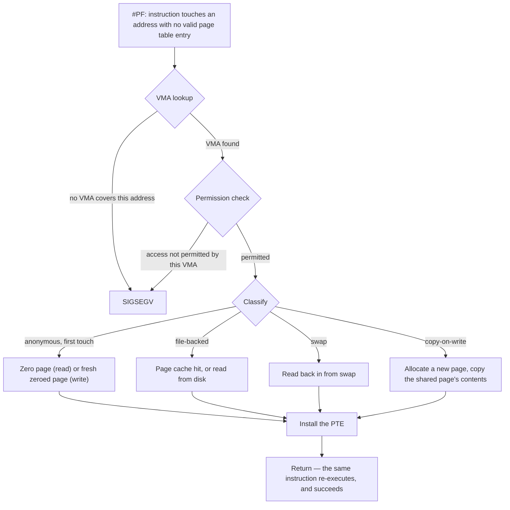

# The Life of a Page Fault

An ordinary first touch of freshly allocated memory, traced from the CPU exception to the instruction re-executing — the normal case, not an error.

A page fault is not an error. It is the mechanism by which memory becomes real: the kernel promises
you an address range long before any physical page backs it, and the fault is the moment — deferred
for as long as possible — where a promise turns into RAM. A healthy process takes thousands of these
per second, most of them so cheap they never show up as a stall. Treating every fault as a symptom of
something wrong is the single most expensive wrong model a Linux reader can hold, because it's exactly
backwards: faults are how normal memory gets allocated at all.

## The allocation that allocates nothing

`malloc(1 GB)` returns almost instantly. Not because the kernel found a gigabyte of free RAM in a few
microseconds, but because it didn't need to — `malloc` asked the kernel to extend the process's
address space via `brk` or `mmap`, and extending the address space is just bookkeeping. The kernel
records a new virtual memory area and hands back a pointer into it. No physical page has been touched,
allocated, or even chosen yet. The 1 GB "exists" only as a promise the kernel has made to itself: *if
you ever touch this address, I will make it real.*

## The first touch

The promise is kept the first time some instruction actually reads or writes through that pointer.
The CPU executes the store (or load), and before it can complete, the MMU has to translate the virtual
address to a physical one — which means walking the page table. It finds no valid entry, because
nothing has populated one yet. The CPU cannot finish the instruction, so it raises a page fault
exception, `#PF`. This is a *precise* exception: the instruction that faulted has not completed and
has left no partial effects, which is exactly what lets the kernel fix the problem and simply retry it
afterward. What "precise" buys the kernel here — and how it differs from an interrupt, which has no
faulting instruction to return to — is covered in
[Exceptions, Traps, and Interrupts](../../computer-science/cpu-architecture/exceptions-traps-and-interrupts.md).

## The kernel takes over

The CPU vectors into the kernel's page fault entry point. On x86-64, this is `exc_page_fault()` in
`arch/x86/mm/fault.c`; the faulting address itself arrives in a dedicated register, `CR2`, and a
hardware-supplied error code accompanies it, encoding whether the access was a read or a write,
whether it came from user or kernel mode, and whether the page table entry was present but forbidden
versus simply absent. From there, dispatch for a user-space address runs through
<Src file="arch/x86/mm/fault.c" symbol="handle_page_fault" /> into
<Src file="arch/x86/mm/fault.c" symbol="do_user_addr_fault" /> — the function that does the real work
of deciding what this fault means.

## Was this address legal?

`do_user_addr_fault()`'s first real act is a lookup:
<Src file="mm/mmap_lock.c" symbol="lock_mm_and_find_vma" /> searches the process's address space for
the VMA (virtual memory area) covering the faulting address. This one branch is the entire difference
between ordinary operation and a segfault, and it is a *lookup in a data structure*, not a hardware
decision:

- **No VMA covers the address.** There was never a promise here. `SIGSEGV`.
- **A VMA covers it, but the access doesn't match what it permits** — a write to a read-only mapping,
  say, or execution of non-executable memory. Also `SIGSEGV`.
- **A VMA covers it and the access is permitted.** The kernel now knows this fault is legitimate, and
  moves on to actually repairing it.

Nothing about a segfault is special-cased in hardware. The CPU raised the same `#PF` it would have for
a perfectly ordinary first touch; the kernel is the one that looked at the address, didn't find a
promise covering it, and decided the process gets killed.

## Repairing it

Once the fault is known to be legal, <Src file="mm/memory.c" symbol="handle_mm_fault" /> classifies it
and repairs the missing mapping. The repair depends on what kind of memory this is:

- **Anonymous, first touch (read).** Mapped to the shared, systemwide zero page — one physical page,
  read-only, backing every never-written anonymous page on the machine. No allocation happens yet.
- **Anonymous, first touch (write).** A fresh page is allocated and zeroed, then mapped writable. This
  is where a freshly `malloc`'d and now-written page actually consumes RAM for the first time.
- **File-backed.** The kernel checks the page cache. A hit maps the existing cached page directly; a
  miss issues a read from the underlying file or block device and maps the result once it arrives.
- **Swap.** The page's contents were written out to swap space earlier under memory pressure; the
  fault reads them back in and re-establishes the mapping.
- **Copy-on-write.** A page shared read-only between two mappings (classically, a parent and child
  after `fork()`) is being written by one of them. The kernel allocates a new page, copies the shared
  page's contents into it, and remaps only the writer onto the copy.

## Return, and re-execute

Once the PTE (page table entry) is installed, the fault handler returns to user space at exactly the
address that faulted. The CPU re-executes the *same instruction* that failed the first time — not the
next one — and this time the MMU's walk finds a valid entry and the access simply succeeds. Nothing in
user space observes that any of this happened. There is no error return, no signal, no visible pause
beyond however long the repair took. As far as the faulting code is concerned, memory just worked.

## Minor and major

Faults come in two flavors, and the distinction is entirely about *whether the kernel had to wait for
a device*, not about severity:

- **Minor fault** — no I/O was needed. Mapping the zero page, allocating and zeroing a fresh page,
  finding the file's page already in the page cache, resolving a copy-on-write — all minor. These are
  the ordinary, constant cost of anonymous memory coming into existence, and they are cheap: no
  scheduling away, no waiting.
- **Major fault** — the kernel had to block waiting for a device, most commonly to read a file-backed
  page in from disk or a swapped-out page back in from swap. The kernel tracks this distinction
  explicitly: a handler that took the I/O-wait path reports it back via the
  <Src file="include/linux/mm_types.h" symbol="VM_FAULT_MAJOR" /> flag, which is how tools downstream
  of the fault path know which counter to increment.

A minor fault is not a small major fault — it's a different thing that happens to also be called a
fault. A process that touches a gigabyte of freshly `malloc`'d memory takes hundreds of thousands of
minor faults and, if the pages were never on disk to begin with, exactly zero major ones.

## What actually happens

"My program is using 1 GB" is a claim worth checking against what the kernel actually reports. Here is
a small program that `malloc`s 1 GiB and touches none of it, reading its own `/proc/self/status`
immediately afterward, unedited:

```text
VmSize:	 1051220 kB
VmRSS:	    1756 kB
```

`VmSize` — the address space the process has reserved — is right where a ~1 GiB allocation plus a
small baseline should be. `VmRSS` — the resident set, the memory actually backed by physical pages —
is under 2 MB, almost entirely the program's own code and a handful of already-faulted-in pages from
before the allocation. The gigabyte the program "has" and the memory it is actually costing the
machine are two different numbers, and the difference is every page that hasn't been touched yet.

Fault counts tell the complementary story — not how much memory exists, but how it got that way. A
real `/usr/bin/time -v ls` on this machine, unedited:

```text
	Major (requiring I/O) page faults: 0
	Minor (reclaiming a frame) page faults: 501
```

Running `ls` — loading its binary, its shared libraries, and its own working memory — costs 501 minor
faults and, on a machine with a warm page cache, zero major ones. Every one of those 501 is a page of
`ls`'s or `ld.so`'s or `libc`'s address space becoming real for the first time in this process; none
of them waited on a device, because everything needed was either already resident or trivially
constructible.

## Misconceptions

1. **"Page faults mean something is wrong."** No — they are the normal mechanism by which memory is
   allocated one page at a time, deferred until the moment it's actually needed. A process taking zero
   page faults after startup would be unusual, not healthy.
2. **"A major fault is a worse fault."** It's not more severe, just more expensive: a major fault is
   one that needed I/O, and I/O is slow relative to a memory access. "Major" describes the mechanism
   that resolved it, not how badly anything went wrong.
3. **"`malloc` returning non-`NULL` means the memory exists."** It means the *mapping* exists — the
   kernel has agreed to service faults against that range if you touch it. Under Linux's default
   overcommit behavior, the kernel can promise more virtual memory than the machine could ever back
   with physical pages and RAM plus swap; the promise is only tested, page by page, at first touch, and
   it is entirely possible for that later fault to fail because the memory the promise implied was
   never actually available.



*Every page fault is one walk down this tree; only the leftmost leaf is an error.*

<KernelFacts
  structure={[["struct vm_area_struct", "include/linux/mm_types.h"]]}
  path="#PF → exc_page_fault() → handle_page_fault() → do_user_addr_fault() → handle_mm_fault() → handle_pte_fault()"
  observe="/usr/bin/time -v ls 2>&1 | grep -i faults"
  trap="A minor fault is not a small major fault. Minor means no I/O was needed; it is the ordinary way anonymous memory comes into existence." />

## References

- [The kernel's memory-management documentation](https://docs.kernel.org/mm/index.html) — the index
  every stage of this trace expands into: page reclaim, the page cache, swap, and the allocator
  underneath all of them.
- [`man 5 proc`](https://man7.org/linux/man-pages/man5/proc.5.html) — the `status`, `statm`, and
  `smaps` fields this page's evidence comes from, including exactly what `VmSize` and `VmRSS` count.
- [LWN: "Toward better handling of major page faults"](https://lwn.net/Articles/1073071/)
  (May 2026) — a report on ongoing kernel-summit work to reduce lock contention specifically on the
  I/O-wait path this page calls "major." Published after v6.18 and describing proposed, not yet
  merged, changes — read it as where the mechanism is headed, not as a description of v6.18's code.
