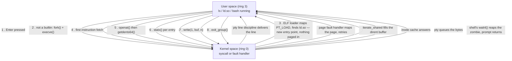

# What Happens When You Type `ls`

Twenty mechanisms, named and linked, between a keystroke and a directory listing on your screen.

:::note
Folder 02 is a set of maps, not a set of destinations. Every mechanism named here in **bold**
gets its own page once the folders that own it (05 onward) are written — the link appears then.
Until it does, treat the bold name as a promise: this thing is real, it matters, and it is coming.
:::

One command, roughly twenty mechanisms, most of which will never get mentioned again on this page
after this paragraph — each earns a page of its own later. The point right now is not to understand
any of them; it is to know they exist, in order, and how they hand off to one another, so that when
a later page dives into one of them it has somewhere to attach.

## The keystroke

You press `l`, `s`, Enter. The terminal emulator drawing your window is an ordinary user-space
program — it is not part of the kernel, it just happens to be the thing painting text on screen. What
*is* kernel is the pty pair underneath it: a line discipline buffers every character you type and
only releases the whole line to the shell's `read()` once Enter arrives, which is why line editing
(backspace, Ctrl-W) works before the shell ever sees a byte.

## The shell decides

`ls` is not a shell builtin, so bash walks `$PATH` looking for an executable file named `ls` — a
handful of `stat`-family calls against each directory in the list until one hits. Having found it,
bash does what every shell does to run an external command: **`fork()` and copy-on-write**, then
**`exec()` and binary formats** to replace the child's image with the `ls` binary.

## Loading the binary

`execve()` doesn't read `ls` into memory — it maps it. The kernel parses the ELF header, finds the
`PT_LOAD` segments (text, data, and friends) and maps each one, and reads the `PT_INTERP` segment to
learn this binary wants `ld.so` as its dynamic linker. `ld.so` itself gets mapped the same way, and it
is `ld.so` — running as ordinary user code — that resolves the symbols `ls` needs against `libc`.
Nothing has been read from disk yet. Mapping a segment is not reading it.

## The first instruction faults

The CPU jumps to the new program's entry point and tries to fetch the first instruction — and faults,
because the text segment was mapped, not populated. This is not an error: it is the normal way
mapped-but-absent memory becomes present, and it's the page cache that answers the fault, pulling in
the executable's first page from disk (or handing back a page already resident from some earlier
run). The mechanics of that fault are their own page: [The Life of a Page Fault](./the-life-of-a-page-fault.md).

## Reading the directory

`ls` does not `open()` the directory and `read()` bytes from it — Linux does not let you read a
directory as a byte stream. It calls `openat()` to get a file descriptor, then `getdents64()`
repeatedly until the kernel reports zero entries left. Dispatch happens through the VFS: the
directory's `struct file` has an `f_op` table, and `getdents64()` walks it via
<Src file="fs/readdir.c" symbol="iterate_dir" />, which calls the filesystem's own `iterate_shared`
operation to actually produce entries. Run the same `ls` again right after and it's faster — the
dentry cache already has the answers.

## `stat` for every entry

Bare `ls` only needs names, so `getdents64()` alone is nearly enough. `ls -l` needs a size, an owner,
permissions, and a modification time for every single entry, which means a `stat`-family call per
file — dramatically more syscalls for the same directory. The inode cache is what keeps this cheap on
a second run: if the inode is already resident, the "stat" costs a lookup, not an I/O.

## Writing the output

Once `ls` has formatted a line, it calls `write()` on file descriptor 1 — standard output — which,
sitting at your interactive shell, is the other end of that same pty from the first stage. The kernel
copies the bytes into the pty's buffer; the terminal emulator, a user-space program, reads them back
out the master side and draws the characters you see. The mechanics of what `write()` promises, and
when, are the next page in this folder: [The Life of a `write()`](./the-life-of-a-write.md).

## Exit and reap

`ls` finishes and calls `exit_group()`, which tears the process down and leaves behind a zombie — a
slot in the process table holding just enough information (an exit status) for somebody to collect.
That somebody is bash, which has been blocked in `wait4()` this whole time; it reaps the zombie,
recovers the exit status, and prints your prompt again.

## What actually happens

Here is a real `strace -c ls` from this repo's directory, unedited:

```text
% time     seconds  usecs/call     calls    errors syscall
------ ----------- ----------- --------- --------- ------------------
 19.55    0.000358          19        18           read
 12.51    0.000229           8        27           mmap
 11.47    0.000210          11        19         8 openat
  9.23    0.000169         169         1           execve
  8.30    0.000152          76         2           getdents64
  7.15    0.000131          14         9           rt_sigaction
  3.99    0.000073           9         8           mprotect
  3.50    0.000064          32         2           munmap
  3.33    0.000061          15         4         2 newfstatat
  3.11    0.000057           9         6           statx
  2.89    0.000053           4        11           close
  2.57    0.000047           4        10           fstat
  2.13    0.000039           5         7         7 ioctl
  1.47    0.000027           5         5           brk
  1.26    0.000023           7         3           sigaltstack
  1.26    0.000023          11         2         1 statfs
  1.09    0.000020          10         2         2 access
  0.87    0.000016          16         1           write
  0.87    0.000016           5         3           fcntl
  0.38    0.000007           3         2           lseek
  0.38    0.000007           3         2           pread64
  ...
------ ----------- ----------- --------- --------- ------------------
100.00    0.001831          11       155        20 total
```

And the shape of the plain trace — the first line, then the part that matters at the end, with the
long stretch of dynamic-linker and locale-file noise between them elided:

```text
execve("/usr/bin/ls", ["ls", "docs/linux/02-guided-traces"], 0x7fff304394f8 /* 50 vars */) = 0

[... ~140 lines: mapping libselinux, libgcc_s, libm, libc, libpcre2; reading
     /proc/filesystems and /proc/mounts; loading coreutils' locale strings;
     probing the terminal with TCGETS2/TIOCGWINSZ — all of it either ld.so
     or glibc, none of it specific to `ls` ...]

openat(AT_FDCWD, "docs/linux/02-guided-traces", O_RDONLY|O_NONBLOCK|O_CLOEXEC|O_DIRECTORY) = 3
fstat(3, {st_mode=S_IFDIR|0755, st_size=4096, ...}) = 0
newfstatat(AT_FDCWD, "docs/linux/02-guided-traces", {st_mode=S_IFDIR|0755, st_size=4096, ...}, 0) = 0
getdents64(3, 0x63b89f33a480 /* 9 entries */, 32768) = 392
getdents64(3, 0x63b89f33a480 /* 0 entries */, 32768) = 0
close(3)                                = 0
write(1, "_category_.json\nfrom-power-on-to"..., 184) = 184
exit_group(0)                           = ?
+++ exited with 0 +++
```

155 syscalls for one directory listing. Of those, five are the ones this page is actually about:
`execve`, `openat`, `getdents64`, `write`, and `exit_group`. Everything else — the `mmap`s, the
`openat`s against shared libraries, the `ioctl`s probing your terminal — is the dynamic linker and
`libc` doing setup that has nothing to do with reading a directory.



*One `ls`, eight stages, and every crossing of the privilege boundary.*

<KernelFacts
  structure={[["struct linux_dirent64", "include/linux/dirent.h"]]}
  path="execve() → ELF loader → page faults → openat() → getdents64() → write() → exit_group()"
  observe="strace -c ls"
  trap="`ls` does not call `read()` on the directory. Directories are not readable as files on Linux; `getdents64()` exists precisely because the kernel refuses to hand you raw directory bytes." />

## References

- [`man 2 getdents64`](https://man7.org/linux/man-pages/man2/getdents64.2.html) — why a separate
  syscall exists for directories and what the returned buffer actually contains.
- [`man 1 strace`](https://man7.org/linux/man-pages/man1/strace.1.html) — the tool this page's
  evidence comes from, including the `-c` summary flag used above.
- [The Linux kernel's VFS documentation](https://docs.kernel.org/filesystems/vfs.html) — the
  dispatch layer every stage from "Reading the directory" onward goes through; skim it now, own it
  when folder 11 covers the VFS in depth.
