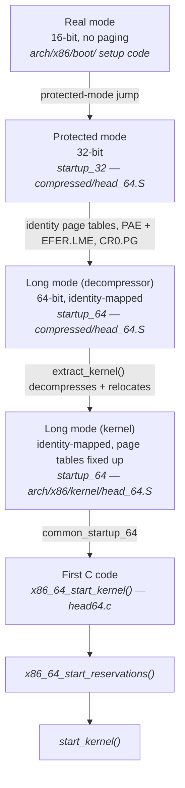

# Early Boot: Getting to C

x86-64 from 16-bit entry through protected mode and early page tables into long mode, and the far simpler arm64 equivalent.

Between "the decompressor jumps into the kernel" and "C code runs" there is a stretch of assembly that
exists for one reason: the CPU does not start in the mode the kernel needs. C assumes a stack, a flat
address space, and known register state — none of which exist yet when control first arrives. Naming
what this stretch does removes the last piece of boot that feels like magic, and it is aggressively
architecture-specific: this page says x86-64 in nearly every paragraph, because there is no
architecture-neutral way to describe it.

## Why any assembly at all

An x86 CPU resets into real mode — 16-bit addressing, no paging, a 1 MB address space — because that is
what every x86 chip has booted into since the original 8086, and backward compatibility with that reset
state is still part of the architecture. [The x86 boot protocol](https://docs.kernel.org/arch/x86/boot.html)
and the decompressor documented on [the previous page](./the-kernel-image.md) already move the CPU out of
16-bit real mode before the kernel's own code runs, but what's left even after that handoff is still not
what C needs: no page tables mapping the kernel's own virtual addresses, no stack in a place the kernel
considers its own, and registers holding whatever the previous stage left in them. Every one of those has
to be established before the first `{` of `start_kernel()` can execute, and establishing them requires
code that cannot itself be written in C, because C is exactly what isn't available yet.

## The x86-64 sequence

Tracing an actual boot end to end, symbol by symbol:

1. **Real-mode setup code** (`arch/x86/boot/`) — 16-bit, inherited from the boot protocol; does minimal
   hardware setup and jumps to the decompressor's 32-bit entry point once the CPU is in protected mode.
2. **The decompressor's own transition to long mode** — `startup_32` in
   <Src file="arch/x86/boot/compressed/head_64.S" symbol="startup_32" />: builds identity-mapped page
   tables covering the memory the decompressor needs, sets `CR4.PAE`, sets `EFER.LME` (the long-mode
   enable bit), and loads `CR0` with paging turned on — the exact sequence x86-64 requires to go from
   32-bit protected mode to 64-bit long mode. It then jumps to
   <Src file="arch/x86/boot/compressed/head_64.S" symbol="startup_64" />, the decompressor's own 64-bit
   entry, which calls `extract_kernel()` to decompress and relocate the real kernel image.
3. **The kernel's own `startup_64`** — <Src file="arch/x86/kernel/head_64.S" symbol="startup_64" />. This
   is a *different* symbol of the same name from the one above: `extract_kernel()` jumps here once the
   real kernel is decompressed and in place, and by this point the CPU is already running in 64-bit long
   mode with identity-mapped page tables in force. What this `startup_64` does is fix up the kernel's own
   page tables for wherever it actually got loaded (see Relocation and KASLR, below), switch `CR3` to
   them, and jump to `common_startup_64`.
4. **`x86_64_start_kernel()`** — <Src file="arch/x86/kernel/head64.c" symbol="x86_64_start_kernel" />. The
   first C function that runs. It clears BSS, initialises KASAN if built in, sets up the early IDT, loads
   microcode, and copies the boot parameters the loader left behind — all the bookkeeping a fully
   general-purpose C function like `start_kernel()` shouldn't have to do for itself.
5. **`x86_64_start_reservations()`** — <Src file="arch/x86/kernel/head64.c" symbol="x86_64_start_reservations" />,
   a short intermediate step that re-copies boot data if needed and runs a couple of early platform
   quirks, then calls `start_kernel()` directly — the point where [`start_kernel` and the Initcall
   Order](./start-kernel-and-initcalls.md) picks up.

The two `startup_64` symbols are easy to conflate, and the confusion is worth naming explicitly: the
decompressor's `startup_64` is what performs the actual real-mode-ancestry-to-long-mode work, while the
kernel's own `startup_64` already runs in long mode and never touches real mode, protected mode, or PAE
setup at all — that work is entirely behind it by the time this symbol runs.

*The x86-64 mode transitions between the decompressor and the first line of C.*

## The early page tables

The page tables the decompressor builds in step 2 are **identity-mapped** — virtual address `X` maps to
physical address `X` — for a specific reason: the CPU is executing at its physical load address at the
moment paging turns on, and an identity mapping means that instruction fetch keeps working across that
transition with no jump required. A mapping straight to the kernel's intended *virtual* addresses would
fault the instant paging enabled, because the program counter is still holding a physical address that
mapping doesn't cover.

Once the kernel's own `startup_64` runs and the real kernel image is in its final place, it switches to
its own page tables — mapping the kernel at its proper high canonical addresses — and the identity
mapping's job is done. It is deliberately temporary scaffolding, not the mapping the running kernel uses.

## Relocation and KASLR

A kernel binary is built assuming it will run at one particular virtual address. If the kernel always
loaded there, an attacker who knew the source could compute the address of any function or gadget in
advance. **KASLR** (kernel address space layout randomisation) defeats that by having the decompressor
choose a randomised physical load address at each boot, and the relocation logic in `extract_kernel()`
and the fixups performed in the kernel's own `startup_64` are what make a kernel built for one address
run correctly when placed somewhere else. This is not a rebuild — it's the same compiled image, patched
up in memory as it's placed.

The practical consequence lands squarely on debugging: a GDB session built against `vmlinux`'s
symbol table assumes the addresses that binary was linked at. If the running kernel was relocated by
KASLR, every one of those addresses is off by the same randomised slide, and breakpoints set by symbol
name simply never trigger. Booting with `nokaslr` disables the randomisation — the kernel loads at its
link-time address every time — which is why [the debugging setup covered
earlier](../01-lab-and-toolchain/booting-your-kernel-in-qemu.md) needs it. In the lab, `nokaslr` is not a
security trade-off; it's a prerequisite for GDB to find anything at all.

## What is not available yet

Everything about debugging this stretch of boot is harder than debugging normal kernel code, for the
same underlying reason: none of the kernel's usual tools exist yet.

- **No memory allocator.** `kmalloc`, the page allocator, and friends are set up later in
  `start_kernel()`. Anything needed before that point is either static, on the stack, or reserved through
  much more primitive mechanisms.
- **No `printk` to a real console.** The console subsystem is initialised inside `start_kernel()`
  (`console_init()`); until then, ordinary `printk()` output is buffered, not displayed. This is precisely
  why `earlyprintk=` exists — it wires up a minimal, unbuffered console (commonly the serial port) that
  works before the real console driver is ready, specifically so this otherwise-invisible stretch of boot
  can print anything at all.
- **No interrupts.** `local_irq_disable()` is one of the first things `start_kernel()` itself does and
  interrupts stay masked through most of early boot; before even that, nothing has set up an IDT capable
  of handling them safely.

A bug here doesn't get a stack trace, doesn't get a `dmesg` line, and doesn't get a debugger that can find
its symbols unless `nokaslr` was passed. It gets a hang or a triple fault. That combination is exactly why
this stage rewards being understood in advance rather than debugged after the fact.

## arm64 in contrast

:::note
arm64 has none of this. Firmware (typically UEFI or U-Boot) already leaves the CPU in the execution state
the kernel needs — no real-mode ancestry exists on arm64 at all, because the architecture was never
required to reset into a 1979-vintage compatibility mode. Entry is
<Src file="arch/arm64/kernel/head.S" symbol="primary_entry" />, and the head sequence is correspondingly
much shorter: enable the MMU with an early identity/kernel mapping, then branch straight to `start_kernel`
— no protected-mode intermediate stage, no separate long-mode enable step, because arm64 doesn't have
those modes to transition through in the first place.
:::

<KernelFacts
  structure={[["startup_64 (kernel)", "arch/x86/kernel/head_64.S"], ["x86_64_start_kernel()", "arch/x86/kernel/head64.c"]]}
  path="decompressor → startup_64 (decompressor) → early page tables → long mode → extract_kernel() → startup_64 (kernel) → x86_64_start_kernel() → x86_64_start_reservations() → start_kernel()"
  observe="dmesg | head -20"
  trap="KASLR is why your GDB breakpoints miss. The kernel you built and the kernel that is running have the same code at different addresses, and `nokaslr` is not a security decision in the lab — it is a prerequisite." />

## References

- [The x86 boot protocol](https://docs.kernel.org/arch/x86/boot.html) — where the boot protocol hands
  over, which is where this page's real-mode setup code picks up.
- [Kernel boot parameters](https://docs.kernel.org/admin-guide/kernel-parameters.html) — `earlyprintk` and
  `nokaslr`, the two parameters that make this stage observable and debuggable at all.
- [KASLR — kernel address space layout randomization (LWN, 2013)](https://lwn.net/Articles/569635/) —
  KASLR's introduction and rationale for x86; the mechanism it describes is the same one this page's
  Relocation and KASLR section covers, well predating v6.18 but unchanged in kind.
