# Secure Boot and Signed Kernels

The chain of trust from firmware keys to a signed kernel and signed modules, and what it does and does not protect against.

Secure Boot answers one narrow question: is the thing about to be executed signed by a key this machine
trusts? That's all. Understanding exactly how narrow that question is prevents both of the mistakes
people make about it — "it makes my machine secure," which overstates what a signature check can do, and
"it is DRM," which mistakes a verification gate for a restriction on what you're allowed to run. It
verifies provenance, once, at each handoff; it says nothing about what the verified thing actually does
once it's running.

## The chain of trust

Each stage in the chain verifies the next one before handing control to it, using a key store that
belongs to the stage doing the verifying — never a key the *next* stage controls:

```mermaid
flowchart LR
    PK["Platform Key<br/>PK<br/><i>owns the KEK database</i>"] -->|"authorises updates to"| KEK["Key Exchange Key<br/>KEK<br/><i>owns db/dbx updates</i>"]
    KEK -->|"authorises entries in"| DB["Signature database<br/>db / dbx<br/><i>allowed and revoked signers</i>"]
    DB -->|"firmware verifies shim's signature against db"| SHIM["shim<br/>Microsoft-signed first-stage loader"]
    SHIM -->|"verifies against its own trust store (db, or MOK)"| GRUB["Boot loader<br/>e.g. grubx64.efi"]
    GRUB -->|"verifies against the kernel's build-time key"| KERNEL["Signed kernel image"]
    KERNEL -->|"verifies against CONFIG_MODULE_SIG key"| MODULES["Loadable kernel modules"]
```

*The Secure Boot chain of trust: each arrow is a signature check, made with the verifying stage's own
key store, not a key the checked stage supplies.*

Firmware only has to know about `PK`, `KEK`, `db`, and `dbx` — it verifies whatever `.efi` file it's
about to run against `db` (the allowed-signers list) and `dbx` (the revoked-signers list), and refuses to
run anything that fails. Everything past that first check is *this document's* concern, not firmware's:
firmware doesn't know what a kernel is, only that the file it loaded had a valid signature.

## `shim`, and why it exists

Every mainstream Linux distribution's installation media boots through `shim` — a small, deliberately
minimal loader signed by Microsoft's third-party UEFI CA, which is present in the `db` of essentially
every PC sold with Secure Boot enabled. Distributions do this instead of getting their own key into every
machine's `db` directly, which would need cooperation from every OEM, because `shim`'s entire job is to
be the *one* thing that needs that cooperation. Once `shim` has firmware's trust, it carries its own
trust store — the distribution's key, baked in at build time — and verifies the actual boot loader
(`grubx64.efi`, typically) against that instead.

`shim` also supports **MOK** (Machine Owner Key) enrolment: a mechanism for a user to add their own
signing key to a machine-specific trust store, separate from `db`, via a one-time interactive step
(`mokutil --import`, followed by a prompt at the next boot, handled by `shim`'s bundled `MokManager`).
This is how a locally-built or third-party kernel module gets a working signature on a Secure Boot
machine without touching firmware's own key database at all.

## Signed modules

The same idea repeats one layer down, inside the kernel: `CONFIG_MODULE_SIG` enables module signature
checking against a key generated (or supplied) at kernel build time, and `CONFIG_MODULE_SIG_FORCE`
changes what happens when a module *fails* that check — from tainting the kernel and loading it anyway,
to refusing to load it at all.

This is why an out-of-tree module — a proprietary GPU driver built by DKMS, for instance — fails to load
on a Secure Boot machine with `CONFIG_MODULE_SIG_FORCE` set: the module was never signed with the running
kernel's build-time key, because it wasn't built at the same time or by the same party. The fix is the
same MOK mechanism `shim` uses one layer up — sign the module with a key you enrol yourself, so the
kernel's check has something to succeed against.

## Lockdown

Signature checking on the kernel and its modules closes one door; **lockdown** (`CONFIG_SECURITY_LOCKDOWN_LSM`)
closes the others — the many ways a *running, already-verified* kernel can be told to do something that
amounts to executing unsigned code or exposing kernel memory anyway. It has two modes, set via the
`lockdown=` command-line parameter or raised at runtime and never lowered:

- **`integrity`** — forbids anything that could modify the running kernel: loading unsigned modules
  regardless of `CONFIG_MODULE_SIG_FORCE`, `kexec` of an unsigned image, writing to `/dev/mem` and
  `/dev/kmem`, and similar.
- **`confidentiality`** — everything `integrity` forbids, plus anything that could *read* kernel memory
  or secrets: much of `/proc/kcore`, some `ioctl`s, several BPF program types that could otherwise dump
  kernel state, and MSR access.

This is also why `nokaslr` and several kernel debugging paths stop working on a locked-down machine:
disabling KASLR or attaching a debugger both amount to exposing or bypassing protections lockdown exists
to preserve, so both are on the forbidden list under `confidentiality`.

## What it does not protect against

Every one of these checks verifies a signature at one specific handoff, and nothing past that handoff:

- **A signed kernel with a known vulnerability.** Secure Boot verifies who signed the image, not whether
  the code is safe. A CVE in a properly-signed kernel passes every check in this chain.
- **A compromised initramfs**, on configurations that don't extend the signature chain to cover it —
  the initramfs is often built and updated locally, outside the vendor's signing pipeline.
- **Physical access to firmware settings.** Anyone who can reach the firmware setup screen can disable
  Secure Boot outright, clear `PK`, or enrol their own key as trusted — Secure Boot protects the software
  boot path, not the hardware.

## Doing this in the lab

:::danger
Enrolling the wrong key, or clearing `PK` on real hardware, can make a physical machine unbootable —
and on some vendors' firmware, that state is not recoverable from within Linux at all; it needs a
firmware-level reset or a trip back to the vendor's recovery tooling. Do this in a VM with OVMF
(QEMU's UEFI firmware build), never on a laptop you need working tomorrow.
:::

<KernelFacts
  structure={[["CONFIG_MODULE_SIG_FORCE", "kernel/module/signing.c — refuse any module that fails signature verification"], ["/sys/kernel/security/lockdown", "securityfs file exposing the active lockdown mode"]]}
  path="firmware db/dbx → shim → boot loader → kernel signature check → module signature check"
  observe="mokutil --sb-state && cat /sys/kernel/security/lockdown"
  trap="Secure Boot verifies signatures, not behaviour. A signed kernel with a known vulnerability passes every check in this chain, which is why dbx — the revocation list — is the part that actually does work over time: it's how a signed-but-broken image stops being trusted after the fact." />

## References

- [Kernel module signing](https://docs.kernel.org/admin-guide/module-signing.html) — the mechanism this
  page's "Signed modules" section describes, and the exact `CONFIG_MODULE_SIG*` symbols.
- [Rod Smith's account of shim and Secure Boot](https://www.rodsbooks.com/efi-bootloaders/secureboot.html) —
  the clearest practical walkthrough of `shim`, MOK enrolment, and why distributions boot the way they do.
- [`man 7 kernel_lockdown`](https://man7.org/linux/man-pages/man7/kernel_lockdown.7.html) — exactly what
  `integrity` and `confidentiality` forbid, which is the list to consult the moment kernel debugging stops
  working on a locked-down machine.
