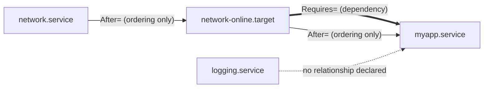

# systemd: The Model

Units, the separation of dependency from ordering, targets instead of runlevels, and the transaction computed at every boot.

systemd is not a shell-script replacement. It's a dependency resolver with a process supervisor attached,
and almost everything about it that confuses people traces back to one distinction this page exists to
make stick: **`Requires=` and `After=` are different axes, and neither one implies the other.** Get that
straight and the rest of systemd — parallel boot, targets, the job transaction — stops looking like magic
and starts looking like the consequence of a graph being solved.

## Units

A unit is anything systemd manages, and the type suffix tells you what kind of thing it is:

| Unit type | What it represents |
|---|---|
| `.service` | A managed process — start command, stop command, restart policy |
| `.socket` | A listening socket systemd owns, which can start a `.service` the first time something connects to it |
| `.target` | A synchronisation point — a named milestone other units order themselves around, with no process of its own |
| `.mount` | A filesystem mount, generated automatically from `/etc/fstab` or written by hand |
| `.timer` | A scheduled trigger — systemd's `cron` — that starts another unit (usually a same-named `.service`) |
| `.path` | Starts another unit when a watched path changes: a file appears, a directory's contents change |
| `.slice` | A cgroup grouping for resource control — units are placed into a slice rather than being cgroups themselves |

## Requirement and ordering are orthogonal

This is the page's core idea, and the two directives are answering two completely different questions:

- **`Requires=`** answers *"if I start, what else has to start too?"* It's a dependency: if the
  required unit fails to start, systemd tries to stop the requiring unit as a consequence.
- **`After=`** answers *"if we're both starting anyway, which one goes first?"* It's pure ordering and
  says nothing about whether the other unit starts at all.

`Requires=` with no `After=` is a race, not a guarantee of sequence — and it's the single most common bug
in a hand-written unit file. Both units get queued to start; nothing tells systemd which to start first,
so it starts them in whatever order the rest of the transaction happens to allow, which is frequently
*simultaneously*.

| | `After=` present | `After=` absent |
|---|---|---|
| **`Requires=` present** | Both start, dependency ordered — the intended combination for "B needs A and must wait for it" | Both start, but the order between them is unconstrained — a race that "usually" works and occasionally doesn't |
| **`Requires=` absent** | If the other unit is *also* starting for some other reason, this one waits for it; if it isn't starting at all, this ordering has no effect | No relationship at all — the two units start (or don't) completely independently |

*The four combinations of `Requires=` and `After=`, and what each one actually produces.*



*A small unit graph. Solid thin arrows are pure ordering (`After=`); the double arrow is a `Requires=`
dependency, which happens to also carry its own `After=` here; the dotted arrow marks two units with no
declared relationship at all — they may start in any order, or not together.*

## Targets are not runlevels

A target is a name a set of units order themselves `Before=`/`After=`, and nothing more — it has no
executable, no PID, no state of its own beyond "reached" or "not reached." `multi-user.target` isn't a
numbered level a machine climbs through in sequence the way SysV runlevel 3 was; it's a label a large
number of units happen to declare `Wants=`/`Before=` relationships against. systemd ships runlevel-named
aliases (`runlevel3.target` symlinked to `multi-user.target`, and so on) purely for scripts and habits
carried over from SysV init, and those aliases are exactly what leads people to imagine an ordered ladder
of levels that isn't actually there — targets can pull in each other, several can be reached in parallel,
and "the current target" is just whichever one the last transaction was computed against.

## The transaction

Booting to a target — or running `systemctl start foo.service` at any point after — doesn't run a unit
directly. systemd computes a **transaction**: starting from the requested unit or target, it walks
`Requires=`/`Wants=` to pull in everything that has to (or should) come along, resolves any conflicts
those units declare against each other, and produces an ordered **job set** constrained only by `Before=`/
`After=` relationships among the units actually in that set. Jobs with no ordering constraint between
them run in parallel — which is why a systemd boot is parallel by default and a SysV boot, which just ran
a numbered list of scripts in sequence, wasn't. `After=` (and its inverse, `Before=`) is the *only* thing
that serialises any part of a transaction; everything else runs as soon as its own ordering constraints
are satisfied.

## Where units come from and who wins

Unit files are assembled from several directories with a defined precedence, so the same unit name can be
defined or modified in more than one place at once:

| Location | Purpose |
|---|---|
| `/usr/lib/systemd/system/` | Shipped by packages — the vendor default, never hand-edited |
| `/etc/systemd/system/` | Local overrides — a file here with the same name *replaces* the vendor unit entirely |
| `/etc/systemd/system/foo.service.d/*.conf` | Drop-ins — merge additional or overriding directives into the vendor unit without replacing it wholesale |

`systemctl cat <unit>` is the answer to "what is this unit actually configured to do right now" — it
prints the vendor file *and* every drop-in that modifies it, concatenated in the order they apply, so
there's no need to hunt across three directories by hand to reconstruct the effective configuration.

## What actually happens

**"`systemctl start foo` runs foo."** What it actually does is queue a start job for `foo.service`,
compute the transaction that job implies — pulling in everything `foo.service` requires, ordering it
against every other job already queued or implied — and only then does anything execute. The unit's own
`ExecStart=` is the very last step of a much larger computation, not the whole of what the command does.

```text
$ systemctl list-jobs
JOB UNIT                  TYPE  STATE
 12 multi-user.target     start waiting
 13 sshd.service           start running
 14 network-online.target  start waiting
 15 NetworkManager-wait-online.service start running

4 jobs listed.
```

That listing during boot is the transaction made visible: several jobs queued at once, some `running`,
some `waiting` on an ordering constraint another job hasn't satisfied yet.

```text
$ systemd-analyze critical-chain
graphical.target @8.912s
└─multi-user.target @8.910s
  └─sshd.service @8.201s +45ms
    └─network.target @8.198s
      └─NetworkManager.service @6.884s +1.312s
        └─dbus.service @2.104s
```

The critical chain is the answer to a different question than the job list — not "what ran" but "what
was actually on the path that determined how long boot took."

## Misconceptions

- **"`After=` makes it a dependency."** It only orders. A unit ordered `After=` something that never
  starts for any reason simply starts as soon as its other constraints allow — the ordering directive
  produces no requirement of its own.
- **"Targets are runlevels."** A runlevel was an ordered, numbered ladder; a target is an unordered
  synchronisation label multiple units can reference, several of which may be reached in parallel. The
  runlevel-named aliases exist for compatibility, not because targets work the same way.
- **"systemd is PID 1 doing everything."** The manager process is PID 1, but it delegates actual work to
  a forked, `exec`ed process per unit, placed in its own cgroup for tracking — folder 15 covers how that
  cgroup is what lets `systemctl status` account for every descendant process a unit spawns, even after a
  double-fork tries to escape its parent.

<KernelFacts
  structure={[["/usr/lib/systemd/system/*.service", "shipped units"], ["/etc/systemd/system/*", "local overrides and drop-ins"]]}
  path="PID 1 systemd → default.target requested → transaction computed from Requires=/Wants= → jobs run in After=/Before= order"
  observe="systemd-analyze critical-chain"
  trap="Requires= without After= starts both units at once. The dependency is satisfied, the ordering is not, and the failure is intermittent — which is exactly why it survives testing." />

## References

- [`systemd.unit(5)`](https://www.freedesktop.org/software/systemd/man/latest/systemd.unit.html) — the
  full directive reference, and the precise definitions of `Requires=`, `Wants=`, and `After=` this page
  builds on.
- [`bootup(7)`](https://www.freedesktop.org/software/systemd/man/latest/bootup.html) — the target
  sequence a normal boot walks through, which is the map this page's "targets" section only samples.
- [Rethinking PID 1](https://0pointer.de/blog/projects/systemd.html) — the original rationale from
  systemd's author; old, but still the clearest statement of why socket activation changes what the
  dependency problem even is.
