# The Boot Chain

The whole handoff sequence in one diagram, with the exact artefact passed at each step and where each one lives on disk.

Debugging a boot that doesn't work means knowing exactly what got handed from one stage to the next,
and where the artefact each stage is looking for actually lives on disk. Every stage in this chain does
one job and then gets out of the way — it doesn't know what came before it beyond the one thing it was
given, and it doesn't know what comes after beyond the one thing it produces. That narrowness is what
makes the chain debuggable at all: a failure has a location, because every step either found its input
or it didn't. This page is the map. The rest of this folder is the territory each stop on the map
expands into.

## The chain, end to end

```mermaid
flowchart LR
    A["Firmware<br/>NVRAM boot order picks a loader<br/><i>Firmware: BIOS and UEFI</i>"] -->|"loads and jumps to"| B["Boot loader<br/>\EFI\&lt;vendor&gt;\grubx64.efi or the MBR<br/><i>Boot Loaders</i>"]
    B -->|"loads, assembles cmdline, jumps to"| C["Kernel image<br/>/boot/vmlinuz-*<br/><i>Inside bzImage</i>"]
    C -->|"decompresses, arch setup"| D["Early boot<br/>startup_64 → x86_64_start_kernel<br/><i>Early Boot: Getting to C</i>"]
    D -->|"start_kernel() → initcalls unpack"| E["Initramfs<br/>/boot/initrd.img-*<br/><i>initramfs and Early User Space</i>"]
    E -->|"switch_root into"| F["Real root<br/>the root= device<br/><i>switch_root and PID 1</i>"]
    F -->|"execs"| G["PID 1<br/>/sbin/init<br/><i>switch_root and PID 1</i>"]
    G -->|"builds a unit graph, reaches"| H["systemd<br/>dependency graph<br/><i>systemd: The Model</i>"]
    H --> I["Login prompt"]
```

*The full boot chain, with the artefact handed over at each step.*

Two topics sit beside this chain rather than inside it, because they aren't handoff steps: the
[kernel command line](./the-kernel-command-line.md) is text threaded through several of these arrows
rather than a stage of its own, and [Secure Boot](./secure-boot-and-signed-kernels.md) is a verification
gate that can sit between any two of the first three nodes, rejecting a handoff instead of performing one.

## What is handed over at each step

| Step | Artefact | Where it lives on disk | How to inspect it |
|---|---|---|---|
| Firmware picks a loader | a boot variable / boot order entry | firmware NVRAM — not on any filesystem | `efibootmgr -v` |
| Boot loader loads a kernel | `\EFI\<vendor>\grubx64.efi` (UEFI) or the MBR's first-stage code (legacy) | the EFI System Partition, or the disk's first sector | `ls /boot/efi/EFI/*/` |
| Kernel image | `/boot/vmlinuz-*` | `/boot` | `ls -l /boot/vmlinuz-*` |
| Initramfs | `/boot/initrd.img-*` | `/boot` | `lsinitramfs /boot/initrd.img-$(uname -r) \| head` (Debian/Ubuntu) |
| Real root | whatever `root=` names — a device, a UUID, a LABEL | named on the kernel command line, not stored as a file | `cat /proc/cmdline` |
| Init | `/sbin/init` | the real root filesystem, reachable only after `switch_root` | `ls -l /sbin/init` |

## Where each step is covered

| Step in the chain | Page |
|---|---|
| What firmware does before anything Linux exists | [Firmware: BIOS and UEFI](./firmware-bios-and-uefi.md) |
| The full chain, in one place | this page |
| Finding a kernel and initramfs, and handing off | [Boot Loaders](./bootloaders-grub-and-friends.md) |
| What text actually gets passed to the kernel | [The Kernel Command Line](./the-kernel-command-line.md) |
| Verifying every step before it's allowed to run | [Secure Boot and Signed Kernels](./secure-boot-and-signed-kernels.md) |
| Unpacking `bzImage` into a running kernel | [Inside `bzImage`](./the-kernel-image.md) |
| CPU mode transitions before the first C function | [Early Boot: Getting to C](./early-boot-and-arch-setup.md) |
| `start_kernel()` and the initcall levels | [`start_kernel` and the Initcall Order](./start-kernel-and-initcalls.md) |
| Unpacking and using the initramfs | [initramfs and Early User Space](./initramfs-and-early-userspace.md) |
| Moving to the real root and becoming PID 1 | [`switch_root` and PID 1](./switch-root-and-pid-1.md) |
| How systemd turns units into a boot | [systemd: The Model](./systemd-the-model.md) |
| Reading timestamps, diagnosing a broken boot | [systemd in Practice, and Debugging a Broken Boot](./systemd-in-practice-and-boot-debugging.md) |

## Where it usually breaks

| Symptom | Likely step | Covered in |
|---|---|---|
| Firmware finds nothing bootable | firmware has no usable boot-order entry (empty NVRAM, missing ESP) | [Firmware: BIOS and UEFI](./firmware-bios-and-uefi.md) |
| Loader menu appears, but no kernel is found | the loader's config points at a `vmlinuz`/`initrd` that isn't where it expects | [Boot Loaders](./bootloaders-grub-and-friends.md) |
| Kernel panics with "unable to mount root fs" | the `root=` device named on the command line doesn't exist or isn't ready yet | [`switch_root` and PID 1](./switch-root-and-pid-1.md) |
| Dropped to an `(initramfs)` shell prompt | early user space couldn't find or mount the real root itself | [initramfs and Early User Space](./initramfs-and-early-userspace.md) |
| Boots to `emergency.target` | systemd reached PID 1 fine, but a critical unit or mount failed after that | [systemd in Practice, and Debugging a Broken Boot](./systemd-in-practice-and-boot-debugging.md) |

<KernelFacts
  structure={[["/boot", "where the kernel image, initramfs, and loader configuration live on most distributions"]]}
  path="firmware → loader → kernel → initramfs → real root → PID 1"
  observe="ls -l /boot && cat /proc/cmdline"
  trap="Each stage only knows about the next one. A machine that reaches the loader menu has proved firmware and partitioning are fine, which eliminates half the chain before you start guessing." />

## References

- [Boot Loader Specification](https://www.freedesktop.org/wiki/Specifications/BootLoaderSpec/) —
  the standard `/boot` layout modern distributions are converging on, and the source for this page's
  artefact-location table.
- [The kernel's admin guide to `init`](https://docs.kernel.org/admin-guide/init.html) —
  the kernel's own account of the "unable to mount root" class of failure, written for exactly this
  page's failure table.
- [`man 7 boot`](https://man7.org/linux/man-pages/man7/boot.7.html) — the traditional boot sequence,
  stated compactly, and a useful cross-check against this page's diagram.
