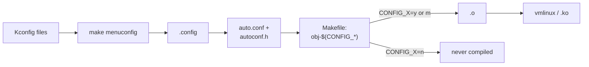

# Kconfig and Kbuild

How a configuration symbol becomes a compiled object, and how to read past the CONFIG_ ifdefs that are everywhere.

`.config` is the most consequential file in the kernel tree: it decides which of roughly 20,000 options
exist in your kernel, and it is *generated*, not written by hand. Understanding the pipeline from a
`Kconfig` symbol to a compiled object is what turns `#ifdef CONFIG_FOO` from noise into information — a
question with a mechanical, checkable answer instead of something to shrug at.

## The Kconfig language

A `Kconfig` file is built out of `config` entries. Each one declares a symbol, a type, and the rules that
govern its value:

```text
config MODULE_UNLOAD_TAINT_TRACKING
	bool "Tainted module unload tracking"
	depends on MODULE_UNLOAD
	select MODULE_DEBUGFS
	help
	  This option allows you to maintain a record of each unloaded
	  module that tainted the kernel. In addition to displaying a
	  list of linked (or loaded) modules e.g. on detection of a bad
	  page (see bad_page()), the aforementioned details are also
	  shown. If unsure, say N.
```

The pieces that matter on every `config` entry:

- **Type** — `bool` (on/off), `tristate` (off / built-in / module — see below), `int`, or `string`. The
  type decides what values are even legal.
- **`depends on`** — a precondition. The symbol cannot be turned on unless the expression is already
  satisfied; the config tools will not even offer it as a choice otherwise.
- **`default`** — the value used when nothing overrides it, itself often conditional (`default y if X`).
- **`help`** — the text `menuconfig` shows for the option. On a large, unfamiliar `Kconfig` file this is
  usually the fastest way to find out what a symbol is *for*, before going anywhere near the C that reads it.

## Why `m` exists

A `tristate` symbol has three possible values, not two: `n` (absent), `y` (built directly into `vmlinux`),
or `m` (built as a separate loadable module). This third state is the one `bool` symbols cannot express,
and it matters because "absent" is not a runtime setting — it means the code was never compiled at all.
There is no flag to flip later, no config file entry to edit on a running system, to turn on a feature that
was built as `n`. A missing capability at `n` and a disabled-but-present capability at `m` look identical
from user space until you go looking for the `.ko` file, and only one of them can ever come back without a
new build.

## `select` is the footgun

`depends on` and `select` both relate two symbols, but they check dependencies in opposite directions.
`depends on FOO` refuses to let you turn a symbol on until `FOO` is already satisfied — the safe direction,
because the config tool enforces it for you. `select FOO` does the opposite: turning the selecting symbol on
*forces* `FOO` to `y`, without checking whether `FOO`'s own `depends on` clauses are satisfied. A symbol
selected this way can end up enabled in a configuration where its own preconditions were never verified,
which is exactly how invalid `.config` combinations get produced and how readers meet `select` for the
first time — in a bug report, not in the language reference. The convention in the tree is: reach for
`depends on` first, and treat `select` as something to use only when you are certain the selected symbol's
own dependencies are already covered.

## From symbol to object file

`.config` is not read directly by the C compiler. The build pipeline turns it into two derived
artifacts before any code sees it: `include/config/auto.conf`, a `make`-readable list Kbuild consumes, and
`include/generated/autoconf.h`, the C header that actually defines the `CONFIG_FOO` macros `#ifdef` tests
against. Kbuild then reads each directory's `Makefile`, where a symbol's value literally decides whether an
object file is built at all:

```text
obj-$(CONFIG_MODULE_SIG)               += signing.o
obj-$(CONFIG_MODVERSIONS)              += version.o
obj-$(CONFIG_MODULE_UNLOAD_TAINT_TRACKING) += tracking.o
```

When `CONFIG_MODVERSIONS` is `y`, that line expands to `obj-y += version.o` and `version.o` is compiled and
linked into `vmlinux`. When it is `n`, the line expands to `obj- += version.o`, which builds nothing —
`version.c` is never handed to the compiler for this build at all.

## Reading past `#ifdef CONFIG_`

The practical skill this whole pipeline exists to support: before reading an `#ifdef CONFIG_FOO` block,
check that symbol's value in *your* `.config` first, then read only the branch that is actually live. One
command answers it without opening the file:

```text
$ ./scripts/config --state CONFIG_MODULES
y
```

`--state` prints `y`, `n`, `m`, or `undef` for any symbol against a `.config` in the current directory (or
pass `--file path/to/.config`). Reading both branches of every `#ifdef` in a subsystem is how a five-minute
question turns into an hour; reading only the live one is how it stays five minutes.

## The `make *config` family

| Target | What it's for |
|---|---|
| `menuconfig` | Interactive, ncurses-based full configuration editor. The default way to explore what exists. |
| `nconfig` | A newer ncurses front-end with search; functionally similar to `menuconfig`. |
| `xconfig` | Qt-based graphical configuration editor. |
| `olddefconfig` | Takes an existing `.config`, fills in any symbol the tree has added since with its default, and does not prompt. The standard "update after a `git pull`" step. |
| `savedefconfig` | Writes the *minimal* `.config` that reproduces the current one — every value that's already a default is dropped. |
| `localmodconfig` | Disables every module not currently loaded on the running machine, based on `lsmod` — the fast way to shrink a distro `.config` to what one machine actually needs. |

:::tip
A full `.config` runs to well over ten thousand lines. `savedefconfig` is how you turn that into a
reviewable diff of a few dozen lines — the values that actually differ from upstream defaults — instead of
asking a reviewer to read the whole file.
:::

## How one Kconfig symbol becomes, or fails to become, an object file



*How one Kconfig symbol becomes, or fails to become, an object file.*

<KernelFacts
  structure={[[".config", "generated; the single source of truth for a build"], ["include/generated/autoconf.h", "the C view of the same thing"]]}
  path="Kconfig → .config → auto.conf/autoconf.h → obj-$(CONFIG_X) in a Makefile → object linked or omitted"
  observe="./scripts/config --state CONFIG_MODULES  (or zgrep CONFIG_MODULES /proc/config.gz on a running system)"
  trap="A CONFIG_ symbol set to n is not a disabled feature — the code was never compiled. There is no runtime switch to look for, and no error message when you look for one." />

## References

- [Kconfig language](https://docs.kernel.org/kbuild/kconfig-language.html) — the language reference,
  including the precise semantics of `select` versus `depends on` this page's warning is based on.
- [Kbuild makefiles](https://docs.kernel.org/kbuild/makefiles.html) — how `obj-$(CONFIG_*)` is expanded and
  consumed, from the primary source.
- <Src file="scripts/config" /> — the script behind the `--state` command above; reads and edits a
  `.config` non-interactively, without going through any of the `make *config` front-ends.
