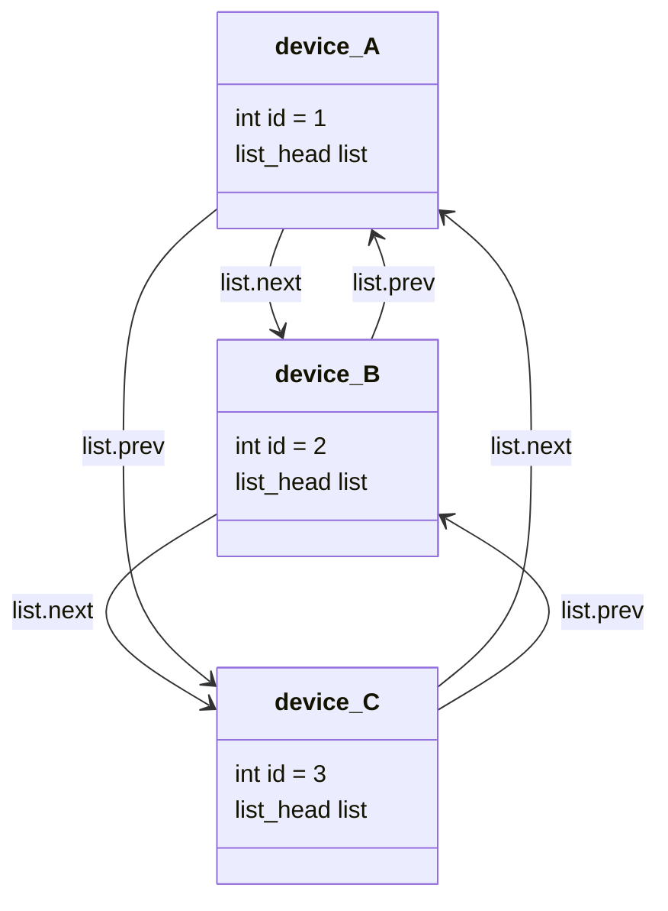

# Kernel Data Structures

Intrusive lists, hlists, red-black trees, xarrays, and IDRs — why intrusive containers, and what they cost.

Reach for a linked list in user-space code and you almost always allocate a separate node — a small struct
holding a `next` pointer and a copy of, or pointer to, your data — and hand it to the container. Kernel
containers don't work that way. The kernel's lists, trees, and hash tables are *intrusive*: the link field
that makes an object a member of a list lives *inside* the object's own struct, as an ordinary member like
any other. That single decision, made for allocation reasons, ripples through nearly everything else on this
page, and it's the reason kernel code is saturated with `container_of` — which is exactly the topic the next
page picks up once this one has made the shape of the problem visible.

## Intrusive, and why

An intrusive container costs nothing extra to insert into: the link field is already part of the object,
allocated (or not — it can be a stack or static object) along with everything else the object needs, so
adding it to a list is just pointer surgery on fields that already exist. There is no second allocation on
insert, and therefore no allocation-failure path to handle on insert — a genuinely useful property in
contexts where allocation can fail or isn't allowed at all (interrupt context, for one). It's also cache-
friendly: object and link field usually share a cache line, instead of the link node and the object living
in two separately-allocated, possibly-distant pieces of memory.

The cost is the mirror image of the benefit: an object's ability to be linked is now baked into its *type* —
you can't put an arbitrary struct on a `list_head`-based list unless someone already added a `list_head`
field to it — and an object can be a member of exactly as many lists as it has link fields, no more. A
generic, non-intrusive container doesn't have either restriction; it costs an allocation and a cache miss
instead.

## `struct list_head`

The workhorse: a circular, doubly-linked list where the "list" type and the "node" type are the same thing —
`struct list_head`, two pointers, `next` and `prev`. A list head that owns no data is itself just a
`list_head` whose `next`/`prev` point to itself when empty, declared with `LIST_HEAD(name)` or initialized
with `INIT_LIST_HEAD()`.

```c
struct request {
	int id;
	struct list_head list;   /* the embedded link field */
};

LIST_HEAD(pending_requests);

void enqueue(struct request *r)
{
	list_add_tail(&r->list, &pending_requests);
}

void drain(void)
{
	struct request *r, *tmp;

	/* _safe because list_del() inside the loop body would otherwise
	 * invalidate the cursor list_for_each_entry() is still using. */
	list_for_each_entry_safe(r, tmp, &pending_requests, list) {
		list_del(&r->list);
		process(r);
	}
}
```

`list_add`/`list_add_tail` insert at the head or tail; `list_del` removes; `list_empty` tests for the
empty case; `list_for_each_entry` walks the list yielding the *containing* `struct request *`, not the
`list_head` — recovering that containing pointer from the field address is exactly what `container_of` does
under the macro's hood, on every iteration. The `_safe` suffix exists for the extremely common case of
deleting the current entry while iterating: without it, the plain `list_for_each_entry` cursor is advanced
by reading the just-deleted node's own (now-invalid) pointers.

## `hlist`

`hlist_head`/`hlist_node` are `list_head`'s sibling, built for a different constraint: a hash table has one
bucket head per slot, potentially millions of them, and a plain `list_head`'s two pointers per empty head
double a hash table's footprint for no benefit — an empty bucket never needs a `prev` pointer to itself. An
`hlist_head` is a single pointer. The list is still doubly linked for O(1) removal, but the trick moves to
the node side: instead of a `prev` pointer, `hlist_node` carries `pprev`, a pointer *to the previous node's
`next` field* (or to the bucket head's single pointer, if this is the first node) — which is exactly what
removal needs to splice a node out without walking the list to find what points at it, at the cost of that
one field being a pointer-to-pointer instead of a pointer, which is the detail that makes `hlist` code read
slightly less obviously than `list_head` code the first time you see it.

## Red-black trees

`struct rb_node` is the embedded link field for the kernel's balanced binary search tree, with the same
intrusive shape as `list_head`: embed an `rb_node` in your struct, and the tree's root is a `struct rb_root`.
What's different from a textbook rbtree library is the division of labour — the kernel's rbtree code owns
*balancing* (`rb_insert_color()` to fix up colours and rotations after an insert, `rb_erase()` after a
removal) but not *comparison*. The caller writes the search and insertion-point-finding logic itself, walking
`rb_left`/`rb_right` and comparing keys however that particular tree's keys compare, then calls
`rb_link_node()` followed by `rb_insert_color()` to splice the new node in and rebalance. This is a
deliberate trade: a generic comparator (a function pointer called at every node, on every operation) costs
an indirect call per comparison; a caller-written walk costs nothing beyond the comparison itself.

The CFS scheduler's runqueue and (historically) the process address space's list of VMAs are the canonical
examples of rbtrees embedded this way in real kernel structs.

:::note
The VMA tree moved from a plain rbtree to a maple tree in more recent kernels — a different, more cache-
efficient balanced structure covered where address-space management is discussed in folder&nbsp;08. The
rbtree pattern described here is still exactly how the kernel's actual rbtrees — CFS's runqueue among
them — work.
:::

## `xarray`

`xarray` (`struct xarray`) is an *abstract*, non-intrusive associative array — unlike everything above, you
don't embed an `xa_node` in your own struct; you store arbitrary pointers into an `xarray`, indexed by a
plain `unsigned long`, and the implementation manages its own internal tree nodes. It's the current, more
general replacement for the older `radix_tree` API and is what the page cache and various ID-to-pointer maps
are built on. The core operations are exactly as small as they sound: `xa_store(xa, index, entry, gfp)`
inserts or replaces the entry at `index`, `xa_load(xa, index)` reads it back, `xa_erase(xa, index)` removes
it — with the array's internal RCU-aware locking handling concurrent lookups against concurrent modification
without every caller having to reason about it directly.

## `idr`/`ida`

Most of what looks like "allocate a small unique handle" in the kernel — a file descriptor number, a device
minor number, a request tag — is `idr` or `ida` under the hood. `idr` maps a small integer to a pointer (it's
built on the same radix-tree-derived machinery `xarray` generalizes); `ida` is the special case where you
only need the integer itself, with no pointer attached — an ID *allocator*, not an ID-to-pointer map. Both
solve the same recurring problem: "give me the smallest unused integer in some range, and let me give it
back later," done correctly under concurrent allocation and free.

## Bitmaps

For a fixed-size set of small integers — CPU masks, IRQ masks, feature-flag sets — the kernel reaches for a
bitmap: `DECLARE_BITMAP(name, bits)` allocates the right number of `unsigned long` words for `bits` flags,
and `set_bit()`/`clear_bit()`/`test_bit()` manipulate individual bits. The atomic variants —
`test_and_set_bit()` and siblings — are the ones to reach for by default whenever the bitmap might be touched
from more than one context concurrently (an interrupt handler and process context, or two CPUs); the plain,
non-atomic versions are for bitmaps that are provably single-threaded, which is a smaller set of cases than
it first appears.

## Choosing

| Need | Ordered? | Lookup by key? | Iteration | Structure |
|---|---|---|---|---|
| A queue, stack, or membership list | Insertion order | No | Sequential, both directions | `list_head` |
| A hash table bucket | No | By hash, then linear scan of the bucket | Sequential within a bucket | `hlist` |
| A sorted set with fast insert/search/range queries | Fully ordered by key | Yes, `O(log n)` | In-order walk | `rb_node` |
| A sparse array indexed by a large or unsigned-long key, non-intrusive | By index | Yes, `O(log n)`-ish | Range/iterate | `xarray` |
| "Give me a small unique integer" (with or without an attached pointer) | N/A | By the ID itself | Rare | `idr`/`ida` |
| A fixed, small set of flags/masks | N/A | By bit position | Whole-word scans | Bitmap |

## Reading the diagram

The picture every one of the intrusive structures above shares is the same one: the link fields, not the
objects, are what actually point at each other.



*The list links point at the embedded fields, not at the objects — which is the whole problem `container_of`
solves.*

`list_for_each_entry` hands you a pointer to `device_A`, not to `device_A.list` — but the pointers the list
actually stores, `next` and `prev`, only ever point at `list_head` fields. Getting from "a pointer to the
field I was handed" back to "a pointer to the object that embeds it" is the arithmetic the next page derives.

<KernelFacts
  structure={[["struct list_head", "include/linux/types.h"], ["struct rb_node", "include/linux/rbtree_types.h"]]}
  path="embed the link field in your struct → add the object to the container (list_add, rb_insert_color, …) → iterate (list_for_each_entry, an in-order rbtree walk) → recover the object with container_of()"
  observe="include/linux/list.h — `list_for_each_entry()` (a structural page like this one has no single runtime command to observe; the macro that does the recovering is the closest equivalent)"
  trap="`list_del()` overwrites the removed node's `next`/`prev` with poison pointers (`LIST_POISON1`/`LIST_POISON2`) rather than leaving them dangling or zeroing them. A use-after-free through a deleted list node therefore faults on a recognisable, fixed poison address — a deliberate debugging aid, not a bug in the list code." />

## References

- <Src file="include/linux/list.h" /> — the whole intrusive-list API in one file, and the fastest way to
  actually learn it: short, heavily commented, and every function is small enough to read in full.
- [XArray](https://docs.kernel.org/core-api/xarray.html) — the XArray's model and locking rules, which
  aren't obvious from the function signatures alone.
- [IDR/IDA](https://docs.kernel.org/core-api/idr.html) — ID allocation, and when to reach for `ida` instead
  of `idr`.
