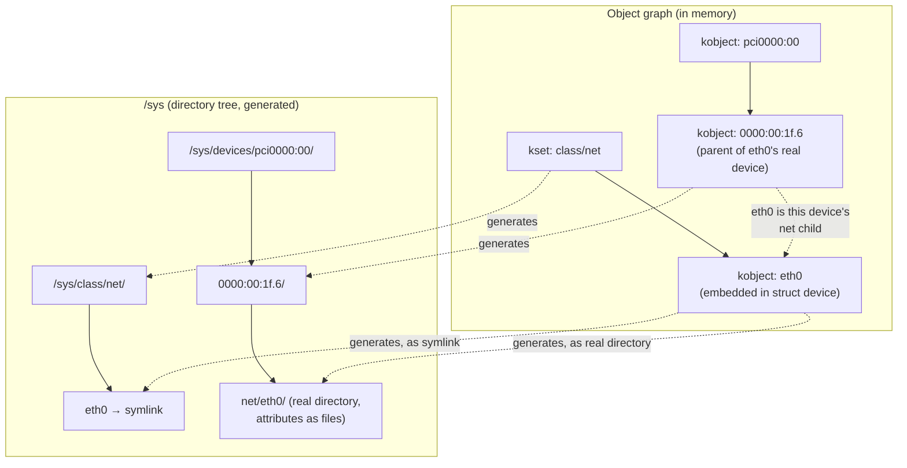

# kobjects, ksets, and sysfs

`/sys` is not a directory tree someone laid out by hand. It is *generated*, at runtime, from an in-kernel
object graph — and once you know that, the whole filesystem becomes readable at a glance: every directory
under `/sys` is an object, every ordinary file inside it is an attribute with a `show` function and
possibly a `store` function behind it, and every symlink is a relationship between two objects. Nothing in
`/sys` is stored on disk or even held as text in memory waiting to be read; it is computed on access from
structures that exist for entirely different reasons — device management, module state, block layer
configuration — that happen to also participate in this one shared object model.

## The three pieces

| Type | What it is | Its one job |
|---|---|---|
| `struct kobject` | a name, a reference count, a parent pointer, and a pointer to its type | the generic, embeddable unit that participates in the object graph |
| `struct kset` | a collection of kobjects, which is itself a kobject | groups kobjects and gives that group its own place in the graph |
| `struct kobj_type` (`ktype`) | the *behaviour* attached to a kobject — its release function and its attribute operations | says what happens when a kobject is freed and how its attributes are read and written |

A `kobject` alone only knows its name, its parent, and its reference count — it does not know how to
format any of its data as text, or what to do when it's freed. That knowledge lives in the `ktype` it
points at, which every kobject of a given kind shares. A `kset` is the odd one out on purpose: it embeds a
`struct kobject` (`kset->kobj`) so that a *group* of objects is itself a node in the same graph, sitting at
the directory that groups its members — `/sys/class/net`, for instance, is the directory generated by the
network class's `kset`.

## It is always embedded

A `kobject` is never allocated on its own — embedding it inside a real, larger structure is not an
optimisation, it is the entire design. [`container_of`](./container-of-and-embedded-structs.md) is how the
kernel gets back from the generic `kobject` it is holding to the specific object that embeds it, and
that derivation is exactly what pays off here. `struct device` is the case worth internalising:

```c
struct device {
	struct kobject kobj;
	struct device *parent;
	/* ... */
};
```

sysfs code, the driver core, and anything walking the object graph deal in `struct kobject *` — the
generic type every participant shares. Getting back to the concrete `struct device *` that a given
`kobject` is embedded in is one subtraction, via `container_of`:

```c
#define kobj_to_dev(__kobj)	container_of_const(__kobj, struct device, kobj)
```

And this is why a `kobject`'s release function — the `release` field of its `ktype` — is the mechanism
that frees the *containing* object, not the `kobject` itself: `release(struct kobject *kobj)` receives a
generic kobject pointer, immediately runs it through the equivalent of `kobj_to_dev()` to recover the real
`struct device *` (or whichever concrete type embeds it), and frees *that*. The `kobject`'s own reference
count is the containing object's reference count, because they are the same allocation — this is the
payoff the previous page's derivation was building toward.

## From object graph to directory tree

Four rules turn the in-memory graph into the tree `ls /sys` shows you:

- A kobject's **parent pointer** becomes the directory it lives inside.
- A **kset** becomes a grouping directory whose members are the kobjects that belong to it.
- **Attributes** — fields of the concrete object, exposed through the `ktype`'s `sysfs_ops` — become
  ordinary files inside the kobject's directory.
- **Cross-references** between objects that aren't in a strict parent/child relationship become symlinks.

Walk one concrete path: `/sys/devices/pci0000:00/0000:00:1f.6/net/eth0` is a `struct device` for a
network interface, whose `kobject`'s parent chain runs back through the PCI device it belongs to, up to
the platform root — each segment of that path is one kobject's name, and the nesting of directories is the
nesting of parent pointers. `/sys/class/net/eth0`, alongside it, is not a second copy of that device; it is
a *symlink* back to the same `/sys/devices/...` directory, because "this device belongs to the `net`
class" is a relationship, not a parent/child link, and sysfs represents relationships as symlinks rather
than duplicating the object.

## Attributes

An attribute is `struct attribute` (`include/linux/sysfs.h`) — deliberately small, just a name and a mode:

```c
struct attribute {
	const char		*name;
	umode_t			mode;
};
```

All the actual behaviour — what happens when the file is read or written — lives in the `sysfs_ops` the
owning `ktype` points at, via `show()` and `store()` functions the attribute's concrete type wraps around
`struct attribute`. `sysfs_create_group()` registers a whole named set of attributes as one directory of
files in a single call, which is how most subsystems populate a device's directory rather than creating
each file individually.

sysfs enforces one policy that plain files don't: **one value per file.** A sysfs attribute is meant to
expose exactly one number, string, or boolean — not a structured record you'd need to parse — which is why
`cat`-ing an attribute is almost always immediately useful without a special tool, and why a subsystem that
wants to expose several related values gives each one its own file in the same directory rather than
packing them into one.

## The lifetime rule that bites

A kobject's release function is where the *containing* object is actually freed — not a separate cleanup
step that runs alongside freeing the container, but the mechanism that frees it. That has one direct,
sharp consequence: freeing the containing object yourself, directly, while a kobject reference to it is
still outstanding, bypasses the reference count entirely and frees memory something else still holds a
pointer to. The only correct way to release an object that embeds a kobject is `kobject_put()` — never a
direct `kfree()` of the container.

sysfs makes this concrete in a way that's easy to forget: **opening an attribute file holds a reference on
its kobject for as long as the file stays open.** A process that opens `/sys/class/net/eth0/mtu` and holds
it open is holding a live reference on that network device's `kobject`, which means the device cannot be
fully torn down — its release function cannot run — until that file descriptor is closed, no matter what
else in the kernel thinks it is done with the device.

## What actually happens

`cat /sys/class/net/eth0/mtu` (or any other live attribute) does not read a file in the ordinary sense.
The sequence is:

1. `open()` on the attribute path resolves through sysfs's kernfs backend to the `kobject` and `attribute`
   it names, and takes a reference on that kobject for the duration the file stays open.
2. `read()` calls the attribute's `show()` function, passing it the kobject and a buffer. `show()` reads
   the *live* value out of the real in-memory `struct device` — or whatever structure actually holds
   `mtu` — right then, and formats it into the buffer as text.
3. The formatted bytes are what `read()` returns. Nothing was stored as those bytes before the call; they
   were computed by `show()` during it.

This one fact explains three things that otherwise look like sysfs bugs:

- **Some sysfs files can block.** If `show()` needs to take a lock, wait on hardware, or otherwise do work
  that can sleep, reading the file blocks for exactly as long as that work takes — because reading the
  file *is* calling that function.
- **`stat` reports a fixed size (commonly 4096 bytes, a page) regardless of the attribute's real content
  length.** The file's "size" isn't the length of any stored content, because there is no stored content
  until `show()` runs — sysfs just reports a page as a generic upper bound. A tool that trusts `stat`'s
  size before actually reading the file will get that number wrong for essentially every attribute.
- **The value can differ every time you look**, with no caching and no notification needed to make that
  true — each `read()` is a fresh call to `show()` against whatever the live structure holds at that
  instant.

<Lab host="any-linux" title="Read /sys as an object graph" time="10 min">

1. Pick a real network device: `ls /sys/class/net/` — this directory is the `net` class's `kset`; each
   entry is a symlink to the device's real location under `/sys/devices/`.
2. `ls -l /sys/class/net/<iface>` (pick whichever interface is listed, `lo` always exists) and look for the
   `device` and `subsystem` symlinks — `device` points at the underlying PCI/USB/virtual device this
   network interface belongs to, `subsystem` points back at the `net` class directory itself.
3. Follow the device link to its real location: `readlink -f /sys/class/net/<iface>/device` (this may be
   absent for a purely virtual interface like `lo` — that's expected, try a real NIC if one is available,
   or skip to step 4 with `lo`).
4. `cat` two or three attributes directly, e.g. `cat /sys/class/net/<iface>/mtu`,
   `cat /sys/class/net/<iface>/operstate`, `cat /sys/class/net/<iface>/address`. Each one is a `show()`
   call, not a file read.
5. `stat /sys/class/net/<iface>/mtu` and compare the reported size against how many bytes the value
   actually printed in step 4 — the mismatch is the point.

If it fails: WSL2's `/sys` is real but reflects a synthetic Hyper-V machine rather than physical hardware,
so device symlinks and some attributes may be sparse or absent — see the WSL2 capability table in
[a full-system VM and WSL2](../01-lab-and-toolchain/a-full-system-vm-and-wsl2.md) for what to expect there,
and prefer a real Linux box or the QEMU lab if the sparse output is confusing.

</Lab>



*The object graph on the left generates the directory tree on the right; nothing about `/sys` is stored —
`ls`, `cat`, and `stat` against it are all calls into live kernel code.*

<KernelFacts
  structure={[["struct kobject", "include/linux/kobject.h"], ["struct kobj_type", "include/linux/kobject.h"], ["struct attribute", "include/linux/sysfs.h"]]}
  path="kobject_init_and_add() → sysfs directory created under the parent → attribute show()/store() called on each access"
  observe="ls -l /sys/class/net/ && cat /sys/class/net/lo/mtu"
  trap="A sysfs file's stat size is a fixed page, not its content length, because the content does not exist until you read it. Any tool that trusts the size before reading gets it wrong." />

## References

- [sysfs — The filesystem for exporting kernel objects](https://docs.kernel.org/filesystems/sysfs.html)
  — the attribute contract itself, including the one-value-per-file rule and the buffer-size constraints.
- [The kobject infrastructure](https://docs.kernel.org/core-api/kobject.html) — the kernel's own guide,
  and the primary source for the lifetime rules this page states.
- <Src file="include/linux/kobject.h" /> — the structures themselves, small enough that reading them
  clarifies the parent/kset relationship faster than prose does.
