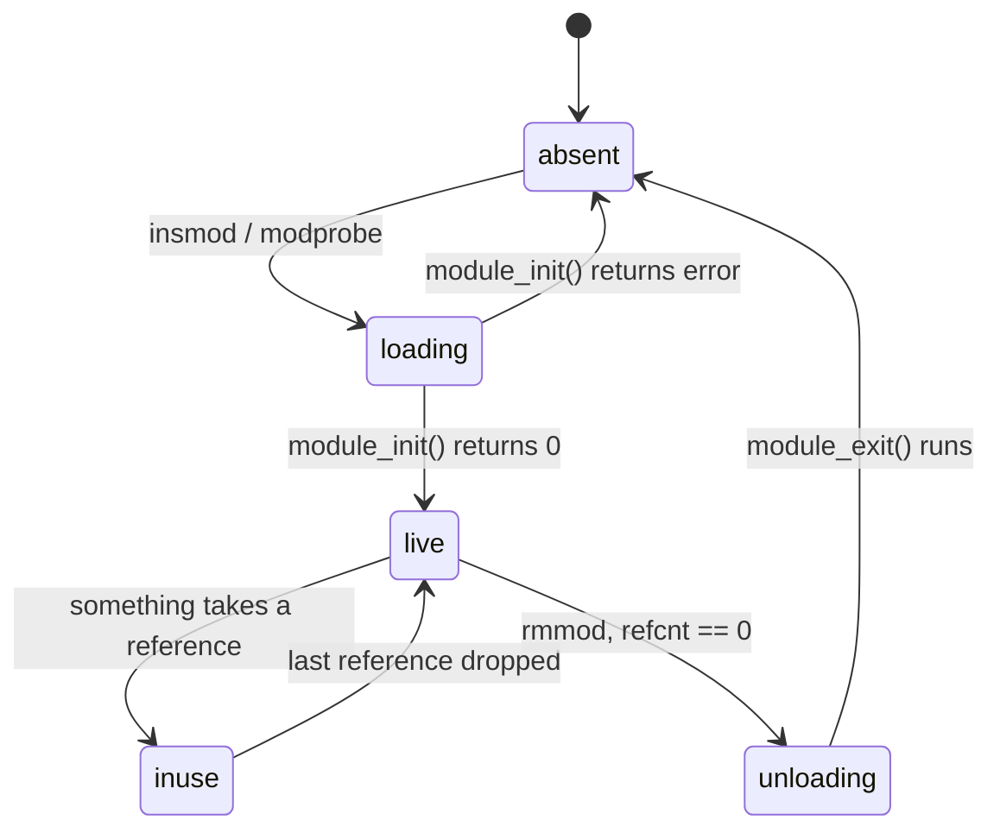

# Kernel Modules

Loading, unloading, parameters, dependency resolution, taint, and building a module out of tree.

A module is an object file the kernel links into itself at runtime. Writing one is the shortest path from
reading about the kernel to running code inside it, and the whole lifecycle — build, load, observe, unload
— fits on one page.

## The minimum module

```c
#include <linux/init.h>
#include <linux/module.h>
#include <linux/kernel.h>

static int __init hello_init(void)
{
	pr_info("hello: loaded\n");
	return 0;
}

static void __exit hello_exit(void)
{
	pr_info("hello: unloaded\n");
}

module_init(hello_init);
module_exit(hello_exit);

MODULE_LICENSE("GPL");
MODULE_AUTHOR("you");
MODULE_DESCRIPTION("Minimal example module");
```

`module_init`/`module_exit` register the functions the kernel calls on load and unload;
`MODULE_LICENSE`/`MODULE_AUTHOR`/`MODULE_DESCRIPTION` are metadata macros that write into a dedicated
section of the compiled object, readable later with `modinfo`. Building it out of tree needs a four-line
`Makefile` that hands the work to the installed kernel's own build system instead of reimplementing it:

```text
obj-m += hello.o

all:
	make -C /lib/modules/$(shell uname -r)/build M=$(PWD) modules
clean:
	make -C /lib/modules/$(shell uname -r)/build M=$(PWD) clean
```

`-C` switches `make` into the running kernel's build tree; `M=$(PWD)` tells that tree's `modules` target to
come back and build only the object named by `obj-m` in this directory, not the kernel itself.

## `MODULE_LICENSE` and taint

`MODULE_LICENSE` is not a formality. The string it declares is checked at load time: a license the kernel
does not recognise as GPL-compatible sets a taint flag on the running kernel and restricts what symbols the
module can resolve (see [exported symbols](./exported-symbols-and-the-module-abi.md)). A tainted kernel is
still running, but the taint is now part of any bug report — maintainers reading a crash dump see it and
weight the report accordingly, because non-GPL code they cannot inspect may be involved. The current taint
state is one file away:

```text
$ cat /proc/sys/kernel/tainted
4096
```

The value is a bitmask; individual bits mean things like "a proprietary module is loaded", "a module was
force-loaded", or "the machine has an unsigned module loaded" — `dmesg` around the load usually names the
bit in plain text (for example, `"module license 'X' taints kernel"`), which is faster to read than
decoding the mask by hand.

## Parameters

`module_param(name, type, perm)` declares a variable the module accepts at load time
(`insmod hello.ko debug=1`) and, if `perm` is non-zero, exposes as a file under
`/sys/module/hello/parameters/`. A non-zero permission mode is a promise about more than default value: a
parameter file opened for writing lets a value be changed on a module that is already loaded and running,
without a reload — useful for a debug flag, and a real hazard for anything the module's init path assumed
was fixed for the module's lifetime.

## `insmod` versus `modprobe`

`insmod` takes a path to a `.ko` file and does exactly what it's told: no dependency resolution, no
configuration files consulted, nothing loaded but the one file named. `modprobe` is the tool built on top of
it that resolves a module's dependencies from `modules.dep` (generated by `depmod`), loads them in the
right order, and honours `/etc/modprobe.d/` for blacklists and options — which is why `modprobe` is what you
almost always want, and `insmod` is what you reach for only when loading one exact, already-built `.ko` by
hand.

## Where the kernel keeps it

- `/proc/modules` and `lsmod` (a thin formatter over the same data) — one line per loaded module: name,
  size, and a reference count with the list of modules or kernel facilities holding a reference.
- `/sys/module/<name>/` — a directory per loaded module, holding `parameters/`, `refcnt`, `sections/`, and
  (for a module built with debug info retained) `.text`, `.data`, and similar addresses used by tools that
  symbolicate kernel addresses.

The reference count (`refcnt`) is the number that decides whether a module can be removed at all: it is
incremented by every kernel facility currently depending on the module — another loaded module calling its
exported symbols, an open device file backed by it, a mounted filesystem it implements — and `rmmod` refuses
to proceed while it is non-zero.

## Unloading, and why it often fails

Two things stop `rmmod` from succeeding: a non-zero reference count (something is still using the module,
and removing it out from under that user would be removing code whose instructions might be executed a
moment later), or a module built without unload support at all (`CONFIG_MODULE_UNLOAD` off, or the module's
own code declines to register an exit function). Neither is a bug in `rmmod` — both are the kernel refusing
to do something it cannot do safely.

:::warning
`rmmod -f` forces removal past a non-zero reference count. It does not make the code holding that reference
stop calling into the module — it just deletes the memory the next call would have jumped into. This is not
a way around a stuck reference count; it is a way to turn a "can't unload" situation into a use-after-free.
:::

## A module's lifecycle



*A module's lifecycle: relocation and symbol resolution happen in `loading`, and `unloading` is only
reachable once every reference has been dropped.*

<Lab host="qemu" title="Build and load your first module" time="20 min">

1. In the lab VM (or on the host, building against the lab kernel's build tree), create `hello.c` and
   `Makefile` with the contents above.
2. `make` — this cross-invokes the kernel build tree via `-C ... M=$(PWD) modules` and produces `hello.ko`.
3. `insmod hello.ko`, then `dmesg | tail -2` — the last line should be `hello: loaded`.
4. `lsmod | grep hello` — confirms it's loaded, with `Used by` at `0`.
5. `rmmod hello`, then `dmesg | tail -1` — the last line should be `hello: unloaded`.

If step 3 fails with `Invalid module format`, the module was built against a different kernel's headers
than the one currently running — that mismatch, and how the kernel detects it, is the next page's topic.

</Lab>

<KernelFacts
  structure={[["struct module", "include/linux/module.h"], ["/sys/module/<name>/parameters/", "live parameter values"]]}
  path="modprobe → finit_module(2) → load_module() → relocation and symbol resolution → module_init()"
  observe="lsmod | head && cat /proc/sys/kernel/tainted"
  trap="insmod failing with Invalid module format is almost never a corrupt file. It means the module was built against a different kernel than the one running, and the version magic caught it." />

## References

- [Tainted kernels](https://docs.kernel.org/admin-guide/tainted-kernels.html) — every taint bit and what it
  tells a maintainer reading a bug report; the concrete reason `MODULE_LICENSE` is not a formality.
- [Building external modules](https://docs.kernel.org/kbuild/modules.html) — the official out-of-tree build
  procedure the `Makefile` above is taken from.
- `man 8 modprobe` — dependency resolution via `modules.dep` and the `/etc/modprobe.d/` configuration
  directory that `insmod` does not consult.
