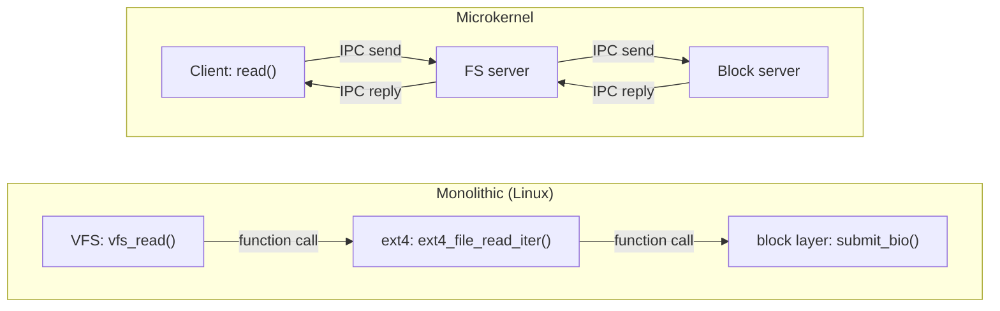

# Monolithic, With Modules

Where Linux sits in the architecture taxonomy, why, and the honest cost: a driver bug is a kernel bug.

Linux made one structural decision that explains most of what follows: every subsystem runs in one
address space at one privilege level, calling each other with ordinary function calls. Modules do not
change that — they change *when* code is linked in, not where it runs.

## One address space

A filesystem calling into the block layer is a function call. Nothing marshals the arguments, nothing
crosses a protection boundary, and nothing checks that the caller is allowed to ask. `ext4` calls
`submit_bio()` the same way any C code calls any other C code, because from the CPU's point of view it
*is* the same code, running at the same privilege level, in the same address space. There is no message
passing between kernel subsystems and no IPC — the boundaries you see in diagrams (VFS, block layer,
device drivers) are boundaries in the source tree and in the header files, not boundaries the hardware
enforces at run time.

This is the source of both Linux's performance and its fragility. A call between subsystems costs what a
function call costs — nanoseconds, no context switch, no copy — which is a large part of why a monolithic
kernel can be fast where a message-passing microkernel pays a crossing on every request. But it also means
nothing stops a bug in one subsystem from corrupting state that belongs to another; there is no boundary
to contain the damage, because there was never a boundary there to begin with.

## What modules actually are

A kernel module is relocatable object code, linked into the already-running kernel at load time instead
of at build time. Once linked, a module's code has exactly the same authority as code that was compiled
into `vmlinux` from the start — it runs at ring 0 (see
[the kernel/userspace boundary](../00-overview/the-kernel-userspace-boundary.md)), it can call any
non-static kernel symbol that has been exported to it, and nothing distinguishes its instructions from
built-in kernel instructions once they are executing.

What modules buy is build-time and deploy-time flexibility, not isolation: a driver for hardware you
don't have never gets compiled in, a distribution can ship one kernel image that supports thousands of
different machines by loading only the modules a given machine needs, and a driver fix can be loaded onto
a running system without a reboot. None of that is a safety property — it is a packaging property.

## The honest trade-off

A driver bug is a kernel bug. A null-pointer dereference in a USB driver is not a crash contained to
"the USB subsystem" — it is an oops in kernel context, on the kernel's own stack, and depending on what
that driver happened to be holding a lock on when it faulted, the rest of the machine may still be
running but can no longer be trusted. This is the level of respect kernel code deserves: three lines of a
driver, written by someone who has never touched the scheduler or the memory manager, can bring down
subsystems that have nothing to do with the bug.

This is not a design flaw nobody noticed. It is the direct, unavoidable consequence of one address space,
and every later page in this section — reference counting, locking, memory safety in kernel C — is in
some sense about managing the cost of this decision, because the decision itself is not going to change.

## Why Linux chose it, and why it held

The case for one address space is development speed: no IPC protocol to design between subsystems, no
marshalling code to write and keep in sync, and a bug at a subsystem boundary can be fixed by whoever is
already touching that interface, in the same patch, without coordinating across a process boundary. Early
Linux development leaned hard on this — the entire kernel was few enough people, moving fast enough, that
paying an IPC tax on every VFS call would have been a real cost for no benefit anyone was asking for.

Decades later, the counter-pressure shows up as attempts to buy back some of what a microkernel gets for
free, without paying for a microkernel: `CONFIG_STRICT_MODULE_RWX` makes a module's code pages
non-writable and its data pages non-executable after load, closing off one common exploitation technique
without touching the address-space model. Lockdown and signed modules restrict *what* can be loaded at
all, which is a policy question, not an isolation one. And the Rust-for-Linux effort is the most direct
answer yet — not a new address-space boundary, but a language-level guarantee that a large class of the
bugs this page just described (the null derefs, the use-after-frees) cannot compile in Rust code in the
first place. All three are attempts to reduce *how often* the trade-off above bites, not attempts to
remove the trade-off.

## The same request, two architectures



*The same request, served monolithically and served by user-space servers. The monolithic path is three
function calls in one address space; the microkernel path is four boundary crossings, each one an IPC
send or reply that the kernel itself must mediate.*

## Where the theory lives

The monolithic/microkernel/hybrid taxonomy this page assumes — and why Linux's choice is a real design
point on that spectrum rather than an accident of history — is argued in full in
[OS structure: monolithic, microkernel, hybrid](../../computer-science/operating-systems/os-structure-monolithic-microkernel-hybrid.md).
This page will not re-argue it; it only shows what living inside the monolithic choice looks like from
Linux's actual source and tooling.

## What actually happens

`lsmod` and `/proc/modules` are usually read too optimistically. Try it:

```text
$ lsmod | head -5
Module                  Size  Used by
nf_conntrack          172032  1 nf_nat
nf_nat                 57344  1 nf_conntrack_netlink
xt_conntrack           16384  1
usbcore               372736  4 usbhid,xhci_pci,xhci_hcd,ehci_hcd
```

The `Used by` column is a reference count and a list of the modules holding a reference — nothing more.
`usbcore` shows `4` because four other loaded modules depend on symbols it exports; a module whose count
is non-zero cannot be removed with `rmmod` because references are still outstanding, not because the
kernel is protecting anything. There is no column here that says "safe," and none of these numbers say
anything about what a module is allowed to touch once it is running — that authority question was
answered the moment the module finished loading, and it was answered "everything."

## Misconceptions

**"Modules are sandboxed."** No. A module is ordinary kernel code, executing with the same privileges as
every other kernel subsystem. There is no container, namespace, or capability boundary around a loaded
module — those mechanisms constrain user-space processes, not kernel code.

**"A module crash only kills the module."** No. A fault inside a module's code is a kernel fault, in
kernel context, and it is handled exactly like a fault anywhere else in the kernel — an oops, and
possibly a panic if it happens somewhere the kernel cannot safely continue from. `rmmod` after a module
has faulted usually will not help, because the fault may have left kernel data structures (locks held,
lists half-updated) in a state the kernel cannot cleanly unwind from.

**"Monolithic means one huge file, or one huge blob."** No. Monolithic describes the address-space and
privilege model, not the source layout: the kernel's source is spread across thousands of files, most of
a given build's code is optional and selected at configure time (see
[Kconfig and Kbuild](./kconfig-and-kbuild.md)), and a running kernel may load only a small fraction of the
drivers physically present in the source tree. "Monolithic" is a claim about where the boundary is, not
about how the source is organised.

<KernelFacts
  structure={[["struct module", "include/linux/module.h"]]}
  path="insmod → sys_finit_module() → load_module() → module relocated, symbols resolved and linked → module_init()"
  observe="lsmod | head && cat /proc/modules | head -3"
  trap="A loaded module has exactly the same privileges as the rest of the kernel. `lsmod`'s `Used by` column counts references, and nothing in the module system limits what a module may touch." />

## References

- [Module signing](https://docs.kernel.org/admin-guide/module-signing.html) — what module signing does
  and does not constrain. Signing proves provenance; it says nothing about what a signed module is
  allowed to do once it loads, which is the concrete limit of module trust this page is arguing for.
- <Src file="kernel/module/main.c" symbol="load_module" /> — the function that does the linking this page
  describes: relocating a module's code and data into the running kernel and resolving its symbol
  references against the exported symbol table.
- [Rust for Linux status (LWN)](https://lwn.net/Articles/945300/) — a status report on the Rust effort
  referenced above as an attempt to buy back safety without an address-space boundary; the article is from
  2023, well before this page's v6.18 pin, so treat it as background on the effort's motivation rather than
  a snapshot of exactly where it stands today.
