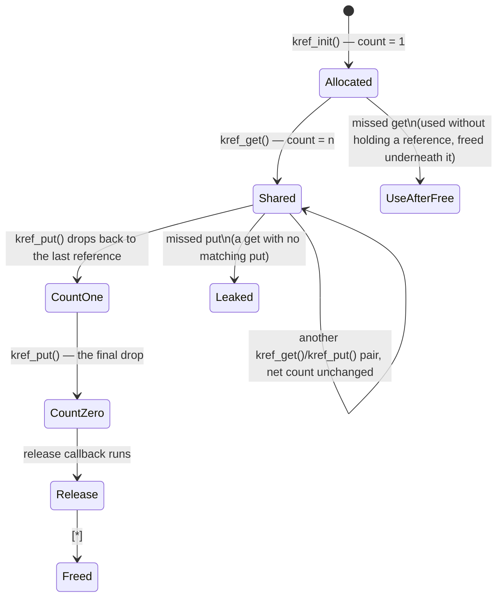

# Reference Counting and Object Lifetime

A kernel has no garbage collector and no scope-based destruction — nothing frees an object automatically
when the last variable pointing at it goes out of scope, because kernel objects routinely outlive any
single function call and are reachable from several subsystems at once: a device is on a bus's list, in a
driver's private state, and open as a file descriptor, all simultaneously. Lifetime is therefore explicit,
and in practice it is almost always a counter. That single fact is worth sitting with, because it means
the entire class of use-after-free bugs — one of the most exploited bug classes in the kernel's history —
reduces to something much more mundane: an unbalanced pair of increment and decrement calls somewhere in
the code.

## `atomic_t` was not enough

The obvious first design is a plain integer, incremented on every new reference and decremented on every
drop, freed when it hits zero — and `atomic_t` gives you that, atomically, for free. The problem is what
happens at the edges. `atomic_t` is a general-purpose counter with no opinion about what the count means:
it wraps silently on overflow, and it will just as happily increment a counter that has already reached
zero, because nothing about `atomic_t` knows that "count already reached zero" is supposed to mean "this
object is gone." Both failures matter more for a *reference* count than for an ordinary counter. A
reference count that wraps on overflow eventually reaches zero again while real references are still
outstanding — a leak silently converts into a use-after-free. And incrementing a count that is already at
zero means a caller has taken a reference to an object mid-teardown, one instant before it is freed out
from under them.

`refcount_t` (`include/linux/refcount.h`) exists to close exactly those two gaps, and the distinction is
worth stating precisely: `atomic_t` is a counter; `refcount_t` is a *reference* counter, with semantics
that trade a small amount of raw throughput for defence against both failure modes. Concretely:

- **It saturates instead of wrapping.** Once the count reaches a fixed high value (`REFCOUNT_SATURATED`),
  further increments and decrements stop changing it. A leaked object then stays leaked forever rather than
  the count eventually wrapping back through zero.
- **It refuses to increment from zero.** `refcount_inc()` (and the other add-style operations) on a
  counter already at zero is treated as a bug — the kernel warns loudly (`refcount_t: addition on 0;
  use-after-free.`) rather than silently handing out a reference to an object that is already being torn
  down.

## `kref`

`struct kref` (`include/linux/kref.h`) is a thin, standard wrapper: one `refcount_t` field, plus the
convention of pairing it with a release callback.

```c
struct kref {
	refcount_t refcount;
};

void kref_init(struct kref *kref);                                     /* set count to 1 */
void kref_get(struct kref *kref);                                      /* count++ */
int  kref_put(struct kref *kref, void (*release)(struct kref *kref));  /* count--; if 0, call release() */
```

`kref_init` sets the count to 1 — the reference the object's creator holds on its own behalf. Every other
piece of code that needs the object outlive its own use of it calls `kref_get` first. `kref_put` is the
symmetric drop; when the count it decrements reaches zero, `kref_put` — not the caller — invokes
`release`, exactly once, and whichever caller's `kref_put` happened to be the one that hit zero is the one
whose thread runs `release`. No caller decides on its own that "this must be the last reference" and frees
the object directly; the counter decides, and only the counter's arithmetic determines who does the
freeing.

## Naming conventions are the documentation

Because the whole scheme depends on every `get` being matched by exactly one `put`, kernel APIs lean
heavily on naming to make ownership visible at the call site without having to read the implementation:

- **`*_get` / `*_put`** — the standard pair. A function ending in `_get` hands you a referenced object;
  you owe it a matching `_put` when you're done.
- **`*_grab`** — used in a few places (for instance `sock_hold`/`sk_free` in networking, or an explicit
  `foo_grab()`) as a synonym for taking a reference without going through the generic `kref` API directly.
- **A function that *returns* a referenced object versus one that hands you a borrowed pointer.** This is
  the distinction that actually matters and is easy to get wrong: `dev_get_by_name()` returns a
  referenced `struct net_device *` that the caller must `dev_put()`; iterating a list with
  `list_for_each_entry()` hands you *borrowed* pointers valid only under whatever lock protects the list,
  with no reference taken and nothing to put. The function's own name and documentation comment are the
  only place this distinction is recorded — the C type system does not encode "owned" versus "borrowed"
  at all, so the convention is doing work a stricter type system would do for you.

The rule of thumb that follows: if a function's name or doc comment says it returns a referenced object,
you owe a `put`. If it hands you something already known to be alive for other reasons — you're holding
the lock that protects it, or it was passed to you as an argument by a caller who is guaranteeing its
lifetime for the duration of your call — you don't.

## Where references come from

| Pattern | Example |
|---|---|
| A lookup function takes a reference before returning it | `dev_get_by_name()` looks up a network device by name and returns it already referenced, so it cannot be freed out from under the caller before the caller is done with it |
| An object stored in a list holds a reference to something it points at | a `struct file` on a filesystem's open-files list holds a reference to the `struct inode` it was opened from, for as long as it stays open |
| A container object holds a reference to a component it embeds a pointer to | `struct file` itself holds a reference on the `struct inode` it wraps, released when the file is closed |
| A subsystem registers a callback and holds a reference for the callback's lifetime | a timer or workqueue callback that operates on an object typically takes a reference when scheduled and drops it when the callback runs, so the object cannot vanish while the callback is pending |

## The two failure modes

Get one half of a `get`/`put` pair wrong and the two failures look nothing alike:

- **A missing `put` leaks.** The object's count never reaches zero, so it is never freed. Nothing crashes;
  the system just slowly accumulates objects that should have gone away. The signature is a slab cache
  that grows without bound in `slabtop`, over minutes or hours, with no corresponding drop — the kind of
  bug that a short test run never catches and a long-running production system eventually does.
- **A missing `get` frees early.** Some code assumed a reference was already held — because it was handed
  a pointer without taking its own — and by the time it dereferences that pointer, the object is gone. The
  signature is a use-after-free, and it is often triggered from code far away from, and much later than,
  the actual missing `get`, which makes it dramatically harder to trace back to its cause.

The second failure mode is far worse and far harder to find than the first, which is exactly why these
naming and ownership conventions are enforced socially — through review, `checkpatch`, and static analysis
— rather than by the type system. A leak is annoying and eventually visible. A missing `get` is a security
bug waiting for the right timing.

## RCU-protected lookup, in one paragraph

The pattern above — take a reference, then use the object — has a gap under RCU: a lookup that finds an
object under `rcu_read_lock()` is reading a pointer that RCU only guarantees is *not yet freed*, not that
its reference count is still above zero; another CPU could be mid-way through dropping the last reference
at the same instant. The fix is `refcount_inc_not_zero()` (and `kref_get_unless_zero()` at the `kref`
level): increment the count only if it is not already zero, atomically, so a lookup under `rcu_read_lock`
either gets a valid new reference or learns the object is already going away — never a reference to an
object mid-free. This pattern, and the RCU guarantees it depends on, is covered properly in folder 09.



*An object's life as a reference count: allocated at one, shared while several owners hold a reference,
down to zero, released, freed. The two off-path edges are the failure modes the rest of this page
describes — a missed `put` never reaches `Release` at all, and a missed `get` can be using the object at
the exact moment something else drives it to zero.*

<KernelFacts
  structure={[["refcount_t", "include/linux/refcount.h"], ["struct kref", "include/linux/kref.h"]]}
  path="kref_init() → kref_get() per new reference → kref_put() per drop → release callback at zero"
  observe="slabtop -o | head  (a steadily growing cache, with no corresponding shrink, is the signature of a leaked reference)"
  trap="refcount_t saturates rather than wrapping, and a saturated counter never reaches zero. The object leaks — deliberately — because leaking is the safe failure and a wrapped counter is an exploitable one." />

## References

- [refcount_t vs. atomic_t](https://docs.kernel.org/core-api/refcount-vs-atomic.html) — the kernel's own
  statement of why the two types differ, including the ordering guarantees each provides.
- <Src file="include/linux/kref.h" /> — the whole `kref` API, short enough to read in one sitting.
- [The end of refcount overflows (LWN)](https://lwn.net/Articles/728626/) — `refcount_t`'s introduction
  and the vulnerability class that motivated it.
