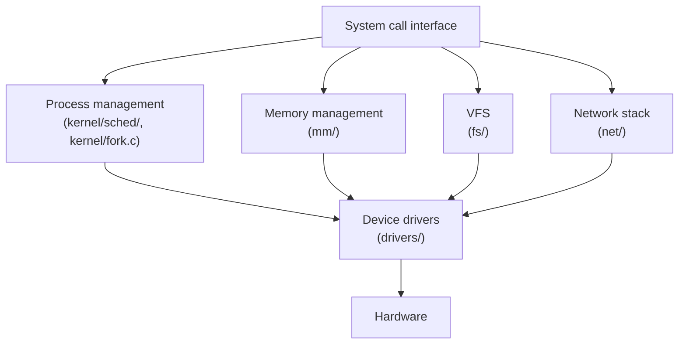

# The Source Tree, Mapped

Every top-level directory in a line, the four that matter expanded, and a lookup table from question to location.

The tree is not organised by importance and it is not organised by subject — it is organised by *what
kind of thing* the code is: core kernel logic in one place, memory management in another, every
filesystem under one directory regardless of how different they are from each other, every driver under
one directory regardless of what it drives. Once that's clear, "where does the answer to this question
live" stops being a search problem and becomes mechanical: identify what kind of thing you're asking
about, and you already know the top-level directory.

## The whole tree, one line each

Every top-level directory in v6.18, in the order `ls` gives you:

| Directory | What lives there |
|---|---|
| `Documentation/` | Kernel documentation source — the reStructuredText that builds into the published kernel docs (docs.kernel.org); prose, not code. |
| `LICENSES/` | SPDX license texts referenced by the `SPDX-License-Identifier` tag at the top of most kernel source files. |
| `arch/` | Architecture-specific code — one subdirectory per CPU architecture (`x86/`, `arm64/`, …), each a nearly-complete miniature port: boot code, low-level memory management, the syscall entry path. |
| `block/` | The block layer: request queues, I/O schedulers, and the code every block device driver and every filesystem's I/O path goes through. |
| `certs/` | Certificates and keys used to verify signed kernel modules and, on some configurations, the kernel image itself. |
| `crypto/` | The kernel's own cryptographic algorithm implementations and the crypto API that dm-crypt, IPsec, and others build on. |
| `drivers/` | Device drivers — the single largest directory in the tree by a wide margin, organised by device class (`net/`, `gpu/`, `usb/`, …), not by vendor. |
| `fs/` | Filesystems: one subdirectory per filesystem type, plus the VFS layer that gives them a common interface. |
| `include/` | Public and internal headers — the declarations everything else in the tree, and every out-of-tree module, compiles against. |
| `init/` | The earliest generic kernel startup code, including `start_kernel()` itself. |
| `io_uring/` | The `io_uring` asynchronous I/O interface — large and active enough to have graduated out of `fs/` into its own top-level directory. |
| `ipc/` | System V and POSIX inter-process communication: message queues, semaphores, shared memory. |
| `kernel/` | Core kernel subsystems that aren't specific to memory, filesystems, or a device class: the scheduler, locking primitives, module loading, timekeeping, cgroups, tracing. |
| `lib/` | Generic library code shared across the tree — string functions, data structures (`rbtree`, `list`), checksums — that isn't specific to any one subsystem. |
| `mm/` | Memory management: the page allocator, the virtual memory subsystem, page reclaim, `slub`. |
| `net/` | The network stack, protocol by protocol, below the socket layer that user space sees. |
| `rust/` | Infrastructure for writing kernel code in Rust — bindings, the `alloc`/`kernel` crates, and build support for the Rust-for-Linux effort. |
| `samples/` | Small, self-contained example code — sample modules, sample `BPF` programs — meant to be read and copied from, not built into a production kernel. |
| `scripts/` | Build-system and developer tooling: `Kconfig` machinery, `checkpatch.pl`, `get_maintainer.pl`, and the scripts that turn a `.config` into a build. |
| `security/` | The Linux Security Module (LSM) framework and the security modules that use it — SELinux, AppArmor, Smack, and the LSM hook infrastructure itself. |
| `sound/` | The ALSA sound subsystem: sound card drivers and the kernel-side audio infrastructure they sit on. |
| `tools/` | User-space tools that are developed and versioned alongside the kernel because they depend closely on kernel internals — `perf`, `tools/testing/selftests/`, and others. |
| `usr/` | Build-time support for generating an initial ramdisk image as part of the kernel build itself. |
| `virt/` | Architecture-independent virtualization support — most notably the core of KVM, shared across the per-architecture KVM backends in `arch/`. |

`Kconfig`, `Makefile`, and `MAINTAINERS` sit alongside these at the root as files rather than
directories, and are covered in [Kconfig and Kbuild](./kconfig-and-kbuild.md).

## The four that matter most

Four directories account for most of the time a working kernel reader spends navigating the tree.

### `kernel/`

Core, cross-cutting subsystems that don't belong to memory, filesystems, or a device class:

- `kernel/sched/` — the scheduler: the core scheduling loop, the CFS and real-time scheduling classes,
  and load balancing.
- `kernel/locking/` — every locking primitive's implementation: mutexes, spinlocks, `rwsem`s, lockdep.
- `kernel/time/` — timekeeping, hrtimers, and the clock source/event device infrastructure.

### `mm/`

Everything about how memory is represented, allocated, and reclaimed:

- `mm/page_alloc.c` — the page allocator itself: the buddy allocator that hands out physically contiguous
  pages.
- `mm/slub.c` — the SLUB slab allocator, the default general-purpose kernel object allocator (`kmalloc()`
  is built on it).
- `mm/memory.c` — the generic page-fault and page-table-manipulation code shared across architectures.

### `fs/`

The VFS layer plus every filesystem implementation:

- `fs/namei.c` — pathname lookup: turning a string like `/etc/passwd` into a `dentry`/`inode` pair.
- `fs/read_write.c` — the generic `read()`/`write()` machinery every filesystem's file operations sit
  behind.
- `fs/ext4/` — a concrete, heavily-used filesystem implementation, useful as a full worked example of
  what implementing the VFS interface actually looks like in practice.

### `drivers/`

By line count, more than half the entire kernel tree, organised by device class rather than vendor:

- `drivers/base/` — the Linux device model itself: `struct device`, `struct bus_type`, driver
  registration and probing, and the machinery behind sysfs's `/sys/devices/` tree (see
  [kobjects, sysfs, and the object model](./kobjects-sysfs-and-the-object-model.md)).

## Where a question's answer lives

| Question | Where to look |
|---|---|
| How does the scheduler pick a task? | `kernel/sched/` |
| What happens on a page fault? | `mm/memory.c`, and the architecture-specific entry point — on x86-64, `arch/x86/mm/fault.c` |
| Where is a syscall's implementation defined? | The subsystem that owns it — found fastest with `git grep SYSCALL_DEFINE.*(sys_name` across the tree |
| What does this `CONFIG_` symbol actually gate? | The nearest `Kconfig` file — `git grep` the symbol name across every `Kconfig` in the tree |
| How does a page get allocated? | `mm/page_alloc.c` (physical pages) or `mm/slub.c` (kernel objects) depending on which layer you're asking about |
| Where does a network packet enter the kernel? | `drivers/net/` for the device driver, then `net/` for the protocol stack above it |
| How does a device get matched to its driver? | `drivers/base/` — the device model's bus/driver matching logic |
| Where is a filesystem's on-disk format implemented? | `fs/<name>/`, e.g. `fs/ext4/` |
| Where do lock primitives live? | `kernel/locking/` |
| How is a module loaded? | `kernel/module/` — see [Monolithic, with modules](./monolithic-with-modules.md) |
| Where is the user-space ABI defined, as opposed to internal kernel headers? | `include/uapi/` |
| What's architecture-specific about this feature? | `arch/<your-arch>/`, with the portable fallback (if one exists) in `include/asm-generic/` |
| Who owns this file, and what list does a patch to it go to? | `MAINTAINERS`, or `scripts/get_maintainer.pl -f <path>` |
| How does a `.config` symbol become a compiled object? | `Kconfig` → `.config` → `obj-$(CONFIG_X)` in the relevant `Makefile` — see [Kconfig and Kbuild](./kconfig-and-kbuild.md) |
| Where does process creation happen? | `kernel/fork.c` |

## `arch/` and the portability line

Most of the kernel is architecture-independent C, but a hard floor of it cannot be: page table formats,
exception entry, context switching, and atomic instructions are properties of the CPU, not choices the
kernel gets to make generically. That floor lives under `arch/<architecture>/` — `arch/x86/`,
`arch/arm64/`, and so on — each one a nearly self-contained port with its own `boot/`, `mm/`, `kernel/`,
and `include/` subdirectories mirroring the top-level tree's shape at a smaller scale.

The convention that keeps generic code generic is `include/asm-generic/`: when most architectures can
share one implementation of some low-level primitive, that implementation lives once in
`include/asm-generic/`, and an architecture that has nothing special to say simply includes the generic
header instead of writing its own. An architecture only gets its own `arch/<arch>/include/asm/` version
of something when it genuinely needs one — a different page table depth, a different atomic instruction
sequence, and so on. Reading `arch/x86/` for a topic and finding the interesting logic is a good sign
that x86 needed something other architectures didn't; finding a one-line `#include <asm-generic/...>` is
the equally useful sign that it didn't.

## `include/` layout

Three subtrees inside `include/` matter for different reasons:

- `include/linux/` — internal kernel headers. Anything declared here is kernel-internal API: subject to
  change across kernel versions, and never something user-space code includes directly.
- `include/uapi/` — the user-space ABI, deliberately split out from `include/linux/` so the boundary
  between "the kernel's own internal types" and "what glibc and user programs are allowed to depend on"
  is a directory, not a convention someone has to remember. Headers here are copied out and installed as
  the `linux/` headers user-space `#include`s, and changing a struct layout here is an ABI break in a way
  that changing an `include/linux/` struct usually is not.
- `include/asm-generic/` — the architecture-portable fallback described above, included by an
  architecture's own `asm/` headers when it has nothing arch-specific to add.

The `uapi`/non-`uapi` split is a real, enforced distinction, not a naming convention: a header that leaks
an internal-only type into `include/uapi/` is a bug, because it commits the kernel to a user-space-visible
promise about something that was never meant to be one.

## Reading the tree at scale

<Figure src="/img/linux/kernel-architecture-and-idioms/linux-kernel-diagram.svg" alt="A directed graph of Linux kernel subsystems and their dependencies, from system calls down to hardware interfaces" caption="The real subsystem graph. Click to zoom — it is not meant to be read at this size; it is meant to show the scale of what the six boxes below are hiding." source="Graphviz gallery" href="https://graphviz.org/Gallery/directed/Linux_kernel_diagram.svg" />

The full subsystem graph above is honest about scale in a way a curated diagram never is: everything
depends on something, most of it is not worth holding in your head at once, and the tree's directory
structure is the tool that makes that manageable — you consult the graph for scope, not for navigation.
For day-to-day orientation, six boxes are enough:

*The six boxes to actually hold in your head.*

<KernelFacts
  structure={[["MAINTAINERS", "the file that maps any path to the people and lists that own it"]]}
  path="a question → the kind of thing it is → the top-level directory → git grep within it"
  observe="./scripts/get_maintainer.pl -f mm/memory.c"
  trap="`drivers/` is more than half the tree by line count and almost none of it is worth reading in order. Depth in `drivers/` is reached through one device you care about, never by browsing." />

## References

- <Src file="MAINTAINERS" /> — the authoritative map from any path in the tree to the people and mailing
  lists that own it, and a surprisingly good index of what subsystems exist at all.
- [Development process documentation](https://docs.kernel.org/process/index.html) — how the tree is
  organised socially (subsystem maintainers, mailing lists, trees), which explains a lot of how it ended
  up organised physically.
- [Elixir cross-referencer, v6.18](https://elixir.bootlin.com/linux/v6.18/source) — the fastest way to
  answer a one-off "where is this actually defined" question without a local clone, and the same version
  this section is pinned to.
