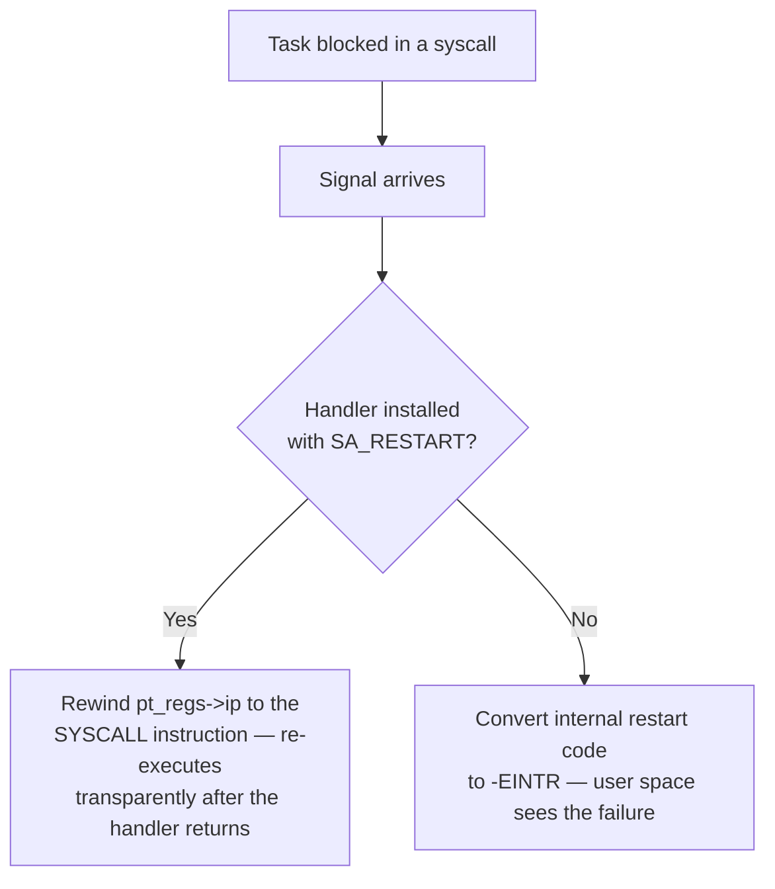

# Arguments, Returns, and errno

A syscall has no calling convention of its own. It borrows one — the same general-purpose registers a
normal function call would use — and the borrowing is imperfect. On x86-64 the syscall ABI deliberately
differs from the C ABI in exactly one register, and that single difference explains a surprising amount
of confusing-looking assembly the first time someone reads a raw `syscall` invocation next to a C
function call.

## The register ABI

The syscall number goes in `rax`; up to six arguments follow in a fixed order; the return value comes
back in `rax`. This table is **x86-64 only** — other architectures assign different registers, which is
why `man 2 syscall`'s per-architecture table exists at all.

| Purpose | Syscall ABI register | C ABI (System V AMD64) register |
|---|---|---|
| Syscall number | `rax` | — (not applicable to a function call) |
| Argument 1 | `rdi` | `rdi` |
| Argument 2 | `rsi` | `rsi` |
| Argument 3 | `rdx` | `rdx` |
| Argument 4 | `r10` | `rcx` |
| Argument 5 | `r8` | `r8` |
| Argument 6 | `r9` | `r9` |
| Return value | `rax` | `rax` |

The one divergence is argument four: the C ABI puts it in `rcx`, the syscall ABI puts it in `r10`. The
reason is mechanical, not stylistic — see [the entry path](./the-entry-path.md): the `SYSCALL`
instruction itself saves the caller's `RIP` into `rcx`, so `rcx` is not available to carry an argument
across the boundary. libc's syscall wrappers quietly move the fourth argument from `rcx` into `r10`
before executing `SYSCALL`, which is why C code calling `write(2)` normally never notices the
substitution — only code written directly against `syscall(2)` or raw assembly has to know about it.
The full C-side convention, including how the stack and the remaining registers are used, is covered in
[Calling Conventions and the Stack](../../computer-science/assembly/calling-conventions-and-the-stack.md);
this page only concerns the six registers the syscall boundary itself uses.

## Six arguments, and what happens beyond

Six is not a soft guideline — it is the size of the register set `do_syscall_64` unpacks from `pt_regs`.
There is no seventh register to spend. Interfaces that legitimately need more state than six registers
can hold take a pointer to a struct instead: the historical example is `mmap` on 32-bit x86, which
packs its many arguments into a single struct because the raw arguments never fit six registers; newer
examples are `clone3` and `openat2`, which take a `struct clone_args *`/`struct open_how *` plus a
separate size argument rather than trying to add more scalar parameters.

That size argument is not incidental — it is how the interface grows without needing a new syscall
number, and it is worth internalising before [Structures that grow](./copying-data-across-the-boundary.md#structures-that-grow)
covers the mechanism that makes it safe.

## Negative errno, and the sign trick

The kernel does not set `errno`. There is no `errno` variable in the kernel at all — a syscall handler
that fails returns a small negative number directly as its return value, for example `-EFAULT` rather
than a sentinel plus a side channel. A successful return is any value from `0` up to `-MAX_ERRNO - 1`
inclusive (as an unsigned comparison); everything from `-MAX_ERRNO` to `-1` is reserved for errors.
<Src file="include/linux/err.h" symbol="MAX_ERRNO" /> fixes that boundary at 4095, and it is exactly the
same trick [`ERR_PTR` uses on kernel pointers](../04-kernel-architecture-and-idioms/error-handling-idioms.md) —
the same "top of the address space is reserved, so a small negative-looking value can never collide with
a legitimate one" reasoning, applied to a register instead of a pointer. That page derives the trick in
full; it is not re-derived here.

## What actually happens

Where does user-space `errno` come from, then, if the kernel never touches it? Walk a failing
`open("/nonexistent", O_RDONLY)`:

1. The kernel's `open` handler fails to find the path and returns `-ENOENT`, which as a number is `-2`.
   That `-2` is what lands in `pt_regs->ax` and crosses back to user space via `SYSRET`.
2. glibc's `open()` wrapper (or, for a raw `syscall(2)` caller, the caller's own code) tests the
   return value. If it is in the negative-errno range, the wrapper negates it — `-(-2)` is `2` — stores
   `2` (`ENOENT`) into the calling thread's thread-local `errno`, and returns `-1` to the caller.

```c
// what the C program sees
int fd = open("/nonexistent", O_RDONLY);
// fd == -1
// errno == ENOENT (2)
```

```text
$ strace -e trace=openat cat /nonexistent
openat(AT_FDCWD, "/nonexistent", O_RDONLY) = -1 ENOENT (No such file or directory)
```

The `strace` line's `-1 ENOENT` is `strace` itself performing the same translation the libc wrapper
does, for readability — the raw value `do_syscall_64` actually returned was `-2`. The `-1` never existed
on the kernel side of the boundary; it is a user-space convention that both libc and `strace` apply
consistently, which is exactly why it is easy to forget it is a translation at all.

The consequence follows directly: a program that calls the raw `syscall(2)` wrapper (bypassing libc's
per-syscall wrappers) gets the kernel's negative-errno value back verbatim and must do the negate-and-set
itself if it wants `errno` semantics. And more subtly, code that reads `errno` without first checking
that the call actually failed is reading a stale value — `errno` is only meaningful immediately after a
call whose return value indicated failure; a successful call is not required to (and generally does not)
reset it.

## Restartable syscalls

`-ERESTARTSYS` and its relatives (`-ERESTARTNOINTR`, `-ERESTARTNOHAND`, `-ERESTART_RESTARTBLOCK`) are
never seen by user space — they are purely internal signalling values a blocking syscall can return
when a signal interrupts it, consumed entirely inside the kernel's signal-delivery path. When a signal
arrives while a task is blocked in a syscall, the kernel does one of two things with that internal value
on the way back out, depending on the signal handler that is about to run:

- If the handler was installed with `SA_RESTART`, the kernel rewinds `pt_regs->ip` back to the
  `SYSCALL` instruction itself, so that once the handler returns, the instruction re-executes as if the
  syscall had never been entered.
- Otherwise, the internal restart code is converted to the one errno user space actually sees:
  `-EINTR`.

This is why some blocking calls appear to transparently survive a signal, and others visibly return
`-EINTR` to be retried by hand — and the difference is a property of the **handler**, via `SA_RESTART`,
not a property of the syscall being called. The same blocked `read()` can do either, depending entirely
on how the signal that interrupted it was installed.



*What happens to a blocking syscall interrupted by a signal — a property of how the handler was
installed, not of the syscall itself, decided in the same exit path described below.*

## The exit path is where this is decided

The negative-errno conversion, the restart-versus-`-EINTR` decision, and the actual delivery of a
pending signal all happen in the same place: the syscall exit work, run from
`syscall_exit_to_user_mode()`, described in [the entry path](./the-entry-path.md#then-c-takes-over). The
kernel does not interrupt a running syscall to deliver a signal mid-flight — it waits for this
well-defined exit point, checks what is pending, and acts on it there.

## Misconceptions

1. **"Syscalls return -1 and set errno."** That is libc's behaviour, applied uniformly across its
   wrappers. The kernel returns a negative errno value directly; there is no `-1` and no `errno` on the
   kernel side of the boundary.
2. **"`EINTR` means the call failed."** It means the call was interrupted by a signal before it could
   complete — not that anything is wrong. For most blocking calls, the correct response to `-EINTR` is
   simply to call it again.
3. **"You can pass as many arguments as you like via the stack, the way some C calling conventions
   spill extra arguments."** The syscall ABI has no stack arguments at all. Six registers is the entire
   budget; there is no seventh slot anywhere, on the stack or otherwise — see
   [Six arguments, and what happens beyond](#six-arguments-and-what-happens-beyond) above.

<KernelFacts
  structure={[["struct pt_regs", "arch/x86/include/asm/ptrace.h"], ["MAX_ERRNO", "include/linux/err.h"]]}
  path="handler returns -EFAULT → pt_regs->ax → SYSRET → libc wrapper negates into errno → -1 to the caller"
  observe="strace -e trace=openat cat /nonexistent"
  trap="errno is a libc variable in thread-local storage. The kernel has never heard of it, and nothing sets it unless a wrapper does." />

## References

- [`syscall(2)`](https://man7.org/linux/man-pages/man2/syscall.2.html) — the per-architecture
  argument-register table, including the `r10` note for x86-64.
- [`signal(7)`](https://man7.org/linux/man-pages/man7/signal.7.html), the "Interruption of system calls
  and library functions by signal handlers" section — the definitive list of which calls restart and
  which return `-EINTR`, and how `SA_RESTART` changes it.
- <Src file="include/linux/err.h" symbol="MAX_ERRNO" /> — the boundary between a valid return and an
  error, in the source.
- [System V Application Binary Interface, AMD64 Architecture Processor Supplement](https://gitlab.com/x86-psABIs/x86-64-ABI) —
  the C calling convention the syscall convention deviates from, and the authority for the deviation.
