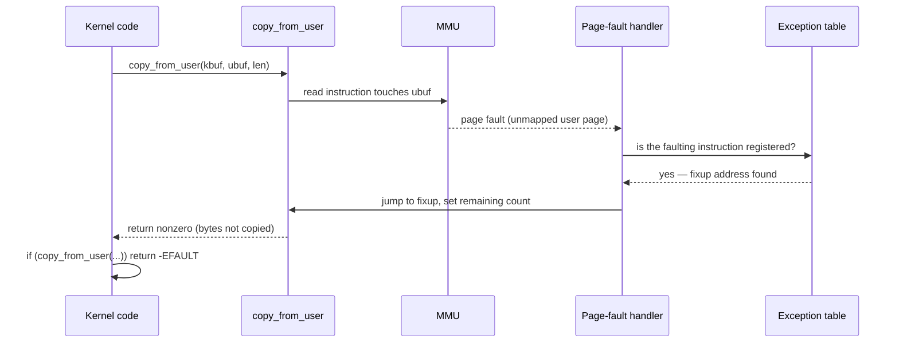

# Copying Data Across the Boundary

There is a rule that sounds like bureaucracy and is not: the kernel may never dereference a user
pointer directly, even though on ordinary hardware it is perfectly capable of doing so — a plain `*ptr`
on a user address would, mechanically, just work, right up until the moment it doesn't. Three separate
things can go wrong with a pointer a syscall was handed: it may not point at valid memory at all, it may
point at kernel memory the caller has no business reading or writing, or its contents may change out
from under the kernel between two reads of it. The copy routines this page covers exist to turn each of
those three into a handled, well-defined case, rather than a crash or a hole.

## `copy_from_user` and `copy_to_user`

<Src file="include/linux/uaccess.h" symbol="copy_from_user" /> and
<Src file="include/linux/uaccess.h" symbol="copy_to_user" /> are the interface almost every syscall that
touches a buffer goes through. Both take a kernel pointer, a `__user` pointer, and a length; both return
the number of bytes that could **not** be copied — not a boolean, not an error code, a count. Zero means
complete success. This trips up everyone once, because it means the natural-looking
`if (copy_from_user(...))` reads correctly (any nonzero remainder is truthy, i.e. a failure) but
`copy_from_user(...) == -1` or treating the return as a byte-count success value does not:

```c
if (copy_from_user(&kbuf, ubuf, len))
	return -EFAULT;
```

`copy_from_user` additionally zero-pads the destination on a short copy, so a partially-failed copy does
not leave uninitialised kernel stack or heap bytes sitting behind a buffer the caller believes is fully
populated.

## `access_ok`, and what it does not check

<Src file="arch/x86/include/asm/uaccess.h" symbol="access_ok" /> checks exactly one thing: that the
address range given falls entirely within the user half of the address space, as opposed to reaching
into kernel addresses. That is all it checks. It does **not** check that the range is actually mapped to
anything — whether a page exists at that address, whether it is present in physical memory right now, or
whether the calling process has permission to touch it — because that is the page-fault handler's job,
decided at the moment of actual access. This is precisely why `access_ok` alone is never sufficient by
itself for a raw copy: passing `access_ok` only means the pointer is *in range*, not that dereferencing
it is safe, which is why the copy routines still need the mechanism below even after the range check has
passed.

## The exception table

This is the single most elegant thing in this folder, and it earns the space. A plain, unprotected
`mov` instruction that faults on a bad address would, in ordinary kernel code, be treated as a kernel bug
— an oops. But the instructions inside `copy_from_user`/`copy_to_user` that actually touch user memory
are deliberately *not* ordinary: each one is registered in a table, <Src file="arch/x86/include/asm/extable.h" symbol="exception_table_entry" />,
alongside a fixup address to jump to if that specific instruction faults:

```c
struct exception_table_entry {
	int insn, fixup, data;
};
```

(The three fields are relative offsets, not raw pointers — kept compact and position-independent so the
table can be built into read-only, relocation-free memory.) When a page fault happens anywhere in the
kernel, the fault handler calls <Src file="arch/x86/mm/extable.c" symbol="fixup_exception" />, which
looks up the faulting instruction's address in this table. If it finds an entry, the fault is not a
kernel bug at all — it is a user-copy routine that was handed a bad pointer, doing exactly what it is
supposed to do when that happens. `fixup_exception` redirects execution to the registered fixup address
instead of the instruction that faulted; that fixup code sets the appropriate registers so the copy
routine returns the remaining byte count as if the copy stopped right there, and the caller's
`if (copy_from_user(...))` check turns that into `-EFAULT`. If the faulting address is *not* found in
the table, `fixup_exception` returns failure and the fault handler falls through to treating it as the
kernel bug it actually is.

The effect: a single mechanism turns "the kernel touched a bad user pointer" from an oops into an
ordinary, checkable return value, without the copy routine needing a conditional branch around every
single memory access.

## SMAP and SMEP

The exception table is a software safety net; SMAP and SMEP are hardware backing the same rule from
underneath it. SMEP (Supervisor Mode Execution Prevention) stops the kernel from ever *executing*
instructions that live on a user page — no amount of kernel-mode confusion about `RIP` can jump into
attacker-controlled code. SMAP (Supervisor Mode Access Prevention) goes further and stops the kernel from
even *accessing* user pages at all, except inside a narrow window explicitly opened with the `stac`
instruction and closed again with `clac` — exactly the window the copy routines execute inside.

The consequence worth stating plainly: on a machine with SMAP enabled, an accidental, unprotected user
dereference in kernel code — a bug that on older or SMAP-less hardware might have silently worked and
gone unnoticed for years — faults immediately, every time, rather than quietly succeeding. SMAP turns a
latent, hard-to-find class of bug into one that reproduces on the first bad access.

## `__user` and sparse

The `__user` annotation seen throughout this page (`const void __user *from`, and so on) is what lets a
static checker catch, at build time, the same class of bug SMAP catches at run time: sparse treats
`__user` as marking a distinct address space, and flags any attempt to dereference a `__user` pointer
directly or assign it to a plain kernel pointer without going through a conversion function. The
annotation itself, and the rest of the kernel's address-space and type-checking vocabulary sparse
understands, belongs to [the kernel C dialect](../04-kernel-architecture-and-idioms/the-kernel-c-dialect.md) —
this page only uses it, it does not re-derive it.

## Double-fetch bugs

The copy interface also creates its own bug class. The shape: a syscall reads a length (or some other
control value) out of user memory, validates it against some limit, and then — instead of using the
already-validated copy — reads the *same user memory* a second time and acts on whatever it finds there.
Between the first read and the second, another thread in the same process can change the value, and the
kernel ends up validating one value while acting on a different one it never checked. This is a genuine,
recurring, real-world CVE class — a time-of-check-to-time-of-use (TOCTOU) bug specific to the user/kernel
boundary — not a theoretical concern. The rule that avoids it: copy the data into kernel memory exactly
once, and validate the kernel-side copy from then on. Never re-read the user pointer after validation.

## Structures that grow

<Src file="include/linux/uaccess.h" symbol="copy_struct_from_user" /> generalises the same idea to
whole structs, and is the mechanism behind the size-argument convention mentioned when
[arguments beyond the register limit](./arguments-return-values-and-errno.md#six-arguments-and-what-happens-beyond)
were introduced. It takes a kernel destination and its size, a user source, and the *caller-supplied*
size of the user struct, and handles the two cases that let a struct grow new fields across kernel
versions without a new syscall number:

- An old binary built against a smaller struct passes a smaller `usize`. The kernel copies that many
  bytes and zero-fills the rest of the (newer, larger) kernel struct — any field the old binary never
  knew about reads as zero, which by convention means "not set."
- A binary passes a *larger* `usize` than the kernel struct it knows about — for instance, a newer
  binary talking to an older kernel. `copy_struct_from_user` checks that every trailing byte beyond what
  the kernel understands is zero; if any of them is nonzero, it fails with `-E2BIG` rather than silently
  discarding data the caller thought it was setting.

`openat2`'s `struct open_how` and `clone3`'s `struct clone_args` are both built this way.



*A user pointer that was not valid, turned into an error return instead of an oops.*

<KernelFacts
  structure={[["struct exception_table_entry", "arch/x86/include/asm/extable.h"]]}
  path="copy_from_user() → access_ok() → faulting access → exc_page_fault() → fixup_exception() → -EFAULT"
  observe="sudo grep -c . /proc/kallsyms >/dev/null; dmesg | grep -i smap"
  trap="copy_from_user returns the number of bytes it could not copy. Zero means success. Treating the return as a byte count or as a boolean success flag is a bug that tests will not catch, because the common case is zero either way." />

## References

- <Src file="arch/x86/mm/extable.c" symbol="fixup_exception" /> — the fault handler's decision point,
  in a compact, readable function.
- <Src file="include/linux/uaccess.h" symbol="copy_struct_from_user" /> — the kernel-doc comment above
  it states the backwards-compatibility contract this page describes, in the kernel's own words.
- LWN, [*"Finding double-fetch bugs with static analysis"*](https://lwn.net/Articles/755906/) — the bug
  class with real examples and the tooling built to find it.
- Intel SDM Vol. 3A, the SMAP/SMEP description in ch. 4 (*Paging*) — what the hardware enforces, and
  what `stac`/`clac` open.
