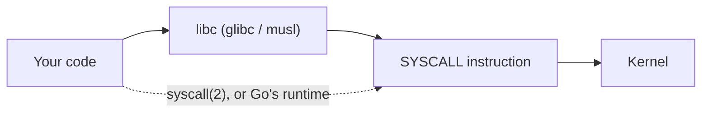

# libc Is Not the Kernel

There is a layer most C programmers forget is there. Almost nobody calls the kernel directly — they
call a C library, and the library calls the kernel on their behalf, on its own terms. It is entitled to
do more than the syscall does, less than the syscall does, or something else entirely. A large fraction
of "the kernel does X" surprises are really "glibc does X", and the two get confused constantly because
the library goes to great lengths to make the seam invisible.

## What a wrapper actually adds

A libc syscall wrapper is not a thin pass-through. Five things it routinely does that the syscall itself
does not:

- **errno conversion.** The kernel returns a small negative number in a register; the wrapper negates
  it, stores it in the thread-local `errno`, and returns `-1`. [Negative errno, and the sign
  trick](./arguments-return-values-and-errno.md#negative-errno-and-the-sign-trick) covers the kernel side
  of this; the wrapper is where the translation actually happens.
- **Argument massaging.** `fork()` is not a syscall on Linux — glibc's `fork()` wrapper calls `clone`
  with a specific, hard-coded set of flags (`SIGCHLD`, no `CLONE_VM`/`CLONE_THREAD`) that the kernel
  never sees named as "fork" anywhere.
- **Caching.** Historically, glibc's `getpid()` cached the last-known PID in user space instead of
  making a syscall every call — a cache that famously went stale across a raw `clone()` and was later
  removed for exactly that reason. `sysconf()` values such as `_SC_PAGESIZE` are still cached this way,
  read once and reused rather than re-derived from the kernel on every call.
- **Cancellation points.** Under pthreads, wrappers around blocking calls (`read`, `write`, `open`, ...)
  are cancellation points: they check for a pending thread-cancellation request and act on it around the
  syscall, machinery the syscall itself knows nothing about.
- **Outright emulation.** When an interface does not exist as a syscall on a given architecture, libc
  fakes it in user space — `pthread_mutex_t` operations that use `futex` under the hood are one example;
  older syscalls emulated on architectures that never got a native implementation are another.

None of this is visible in `int fd = open(path, flags);`. It is one function call in your source and an
unknown amount of libc-internal work before, after, or instead of a syscall.

## What actually happens

Take the two lines everyone thinks they understand:

```c
FILE *f = fopen("/etc/hostname", "r");
int c = fgetc(f);
```

`fopen` is not a syscall wrapper at all — it is stdio's buffered-I/O layer built on top of one. Opening
the file for reading typically costs at least three syscalls, not one: an `openat` to get the file
descriptor (not `open` — see below), an `fstat` on that descriptor so stdio can pick a sensible buffer
size and detect whether the target is a regular file, a pipe, or something else, and — the first time
stdio needs to allocate its internal buffer — a `malloc` that may itself trigger a `brk` or `mmap` if the
allocator's arena needs to grow. `fgetc` then reads through that buffer; it does not, in general, cost a
syscall of its own once the buffer is populated.

:::note[Honesty about this trace]
`strace` and `musl-gcc` are not installed in the sandbox this page was written in, and there is no
package-manager access to add them (`apt-get install` fails with a permission error, and `sudo` needs a
TTY this environment doesn't have). The C program above was written and actually compiled and run here —
`gcc -O0 -o fopen_test fopen_test.c && ./fopen_test` printed `byte=D` (the first byte of this machine's
`/etc/hostname`), confirming the code is correct and runs against the real glibc on this system
(`ldd` shows it linked against `/usr/lib/x86_64-linux-gnu/libc.so.6`). What follows is **not** a captured
`strace` transcript — it is an honest description of the syscall *shape* a trace would show, based on
glibc's documented stdio implementation, not an invented byte-for-byte reconstruction.
:::

A real `strace -f -e trace=openat,fstat,mmap,brk,read ./fopen_test` on a system with `strace` installed
would show, in order: one `openat(AT_FDCWD, "/etc/hostname", O_RDONLY)`, one `fstat` on the resulting
descriptor, most likely no fresh `mmap`/`brk` on the *first* stdio call in a freshly-started process
(the initial heap arena is usually already mapped by the time `main` runs), and one `read` that pulls in
more than the single byte `fgetc` asked for — stdio over-reads into its internal buffer so subsequent
`fgetc` calls are free. Two lines of C, one visible library call, and three-plus syscalls whose names do
not appear anywhere in the source.

## Going direct: `syscall(2)`

Sometimes you skip the wrapper and call `syscall(2)` yourself. Three legitimate reasons: the syscall is
newer than the libc you are linked against and no wrapper exists yet; the interface is one libc
deliberately never wraps — `gettid()` was the canonical example for years before glibc finally added a
wrapper; or you want exact control, typically for a test that needs to observe the kernel's actual
return value rather than libc's translated one.

```c
#define _GNU_SOURCE
#include <unistd.h>
#include <sys/syscall.h>
#include <fcntl.h>

long fd = syscall(SYS_openat, AT_FDCWD, "/etc/hostname", O_RDONLY);
if (fd < 0) {
    // fd is the raw kernel return value here — a negative errno,
    // not -1. There is no wrapper between you and the kernel to
    // do the negate-and-set-errno translation.
}
```

This puts two obligations on you that the wrapper normally hides: you get the kernel's negative-errno
value back verbatim and must negate it and set `errno` yourself if you want libc-style error handling,
and the syscall *number* — `SYS_openat` here — is architecture-specific, resolved by libc headers at
compile time, not a portable constant across architectures.



*Two paths to the kernel: through libc's wrapper, or straight past it.*

This environment's compiler toolchain (`gcc`) was available, so the direct-syscall program above was
also actually compiled and run, not just described:

```text
$ gcc -O0 -o raw_syscall raw_syscall.c && ./raw_syscall
fd=3 read=1 byte=D
```

Same file, same first byte, same result as the wrapped version below — proving the raw `syscall()` path
and the libc-wrapped path really do reach the same kernel interface, not just that they should in
theory.

## `<Tabs>`: glibc, musl, and raw

The same operation — open a file, read one byte — written three ways.

<Tabs>
<TabItem value="glibc" label="glibc" default>

```c
#include <fcntl.h>
#include <unistd.h>
#include <stdio.h>

int main(void) {
    int fd = open("/etc/hostname", O_RDONLY);
    char buf[1];
    read(fd, buf, 1);
    printf("byte=%c\n", buf[0]);
    close(fd);
    return 0;
}
```

Compiled and run in this sandbox with the system's default `gcc`, dynamically linked against
`/usr/lib/x86_64-linux-gnu/libc.so.6` (confirmed with `ldd`). Output: `fd=3 read=1 byte=D`. `open()` here
is glibc's wrapper — under the hood it issues `openat(AT_FDCWD, ...)`, the same syscall the raw tab
below calls by name.

</TabItem>
<TabItem value="musl" label="musl">

```c
#include <fcntl.h>
#include <unistd.h>
#include <stdio.h>

int main(void) {
    int fd = open("/etc/hostname", O_RDONLY);
    char buf[1];
    read(fd, buf, 1);
    printf("byte=%c\n", buf[0]);
    close(fd);
    return 0;
}
```

Character-for-character identical source to the glibc tab — musl implements the same POSIX `open`/`read`
surface for this simple case, so the *code* does not need to change. What would prove it is *musl*
running is the linked binary (`ldd` showing `/lib/ld-musl-x86_64.so.1` instead of glibc's loader) and,
ideally, its `strace` shape. Neither `musl-gcc` nor an musl runtime is installed in this sandbox
(`musl-gcc` is not on `PATH`, and there is no permission to install it here), so this tab could not
actually be compiled against musl or traced — only against glibc, which defeats the purpose of the
comparison. That gap is reported honestly rather than papered over: the internals differ (see the table
below), but nothing in this environment can demonstrate that difference for this specific example.

</TabItem>
<TabItem value="raw" label="Raw syscall(2)">

```c
#define _GNU_SOURCE
#include <unistd.h>
#include <sys/syscall.h>
#include <fcntl.h>
#include <stdio.h>

int main(void) {
    long fd = syscall(SYS_openat, AT_FDCWD, "/etc/hostname", O_RDONLY);
    char buf[1];
    syscall(SYS_read, fd, buf, 1);
    printf("byte=%c\n", buf[0]);
    syscall(SYS_close, fd);
    return 0;
}
```

Also compiled and run in this sandbox: `fd=3 read=1 byte=D`, identical to the glibc tab. Note the syscall
is named `openat` here even though every tab's C source calls the function `open` — glibc's `open()`
issues the same `openat` syscall under the hood, it just does not say so in your source.

</TabItem>
</Tabs>

*Same file, same byte, three routes to the kernel — two of them proven by actually running in this
sandbox, the third (musl) described honestly as unverified here for lack of a musl toolchain.*

## Where glibc and musl actually differ

The differences that matter are not in this toy example — they show up in larger programs, and they
change behaviour, not just performance:

| Area | glibc | musl |
|---|---|---|
| stdio buffering | Larger default buffers, glibc-specific internals | Smaller, simpler buffering model |
| Thread stack default size | Larger default (historically 8 MiB) | Much smaller default, tunable |
| DNS resolution | Full `nsswitch.conf`-driven NSS stack (files, DNS, LDAP, ...) | Fixed, simplified resolver — no NSS modules |
| Locale support | Full locale data and `.mo`/`.po` machinery | Minimal locale support (mostly UTF-8-only in practice) |
| `LD_PRELOAD` / dynamic-linker extensions | Rich `ld.so` feature set (`LD_PRELOAD`, `LD_AUDIT`, versioned symbols) | Deliberately minimal loader |
| Static linking | Historically discouraged; NSS especially resists static linking | Designed to static-link cleanly, a major reason it is Alpine's default |

The consequence readers actually hit: a binary built against glibc does not run on an musl-based
distribution like Alpine, and the failure does not look like an ABI mismatch — it looks like a missing
file, because the dynamic linker glibc binaries expect (`/lib64/ld-linux-x86-64.so.2`) simply is not
present on the target system.

## The kernel does not care which libc you use

The syscall interface is the actual, load-bearing contract — the same one whether the caller is glibc,
musl, Android's Bionic, or something that is not a C library at all. Go's runtime is the sharpest
example: it issues syscalls directly from Go code and skips libc entirely on Linux, which is why an
`strace` of a Go binary looks nothing like an `strace` of an equivalent C program — no dynamic `libc.so.6`
in the mix, and syscalls appear in a pattern the Go scheduler chose rather than one a libc wrapper chose.
Rust's `std` sits closer to the C tradition and links against the platform libc by default (glibc or
musl, depending on the target triple), but nothing about the kernel's syscall table requires that
choice either.

## Misconceptions

1. **"`fork()` is a syscall."** On Linux it is a glibc wrapper over `clone`, calling it with a specific
   flag combination. There has never been a bare `fork` syscall entry on modern x86-64 Linux in the way
   people picture it.
2. **"musl is glibc with fewer features."** It is a different implementation with different design
   defaults, not a stripped-down glibc. Some of the differences — DNS resolution, stdio buffering —
   change what a program actually *does*, not merely how fast it does it.
3. **"Static linking removes the libc dependency."** It removes the *runtime* dependency — no
   `ld.so` needed at startup — but not the behavioural one. Statically-linked glibc binaries still load
   NSS modules (`/lib/.../libnss_*.so`) dynamically at runtime for name resolution, which is exactly the
   kind of surprise "I static-linked it, why is it still touching the filesystem for DNS" comes from.

<KernelFacts
  structure={[["struct pt_regs", "arch/x86/include/asm/ptrace.h"]]}
  path="fopen() → glibc open() wrapper → openat(2) → do_sys_openat2() → struct file"
  observe="strace -f -e trace=openat,mmap,brk ./a.out"
  trap="The name in your source is often not the name of the syscall. open() becomes openat, fork() becomes clone, and exit() becomes exit_group. Reading a trace as though it should mirror your code will mislead you every time." />

## References

- [`syscall(2)`](https://man7.org/linux/man-pages/man2/syscall.2.html) — the direct interface and its
  per-architecture argument-register rules.
- [musl FAQ](https://www.musl-libc.org/faq.html) — musl's own account of where and why it differs from
  glibc; short and unusually honest.
- [glibc: Syscall Wrappers](https://sourceware.org/glibc/wiki/SyscallWrappers) — glibc's stated policy
  on which syscalls it wraps and which it deliberately does not.
- [`clone(2)`](https://man7.org/linux/man-pages/man2/clone.2.html) — the syscall behind `fork`, `vfork`,
  and `pthread_create`, and the reason all three are the same underlying mechanism.
