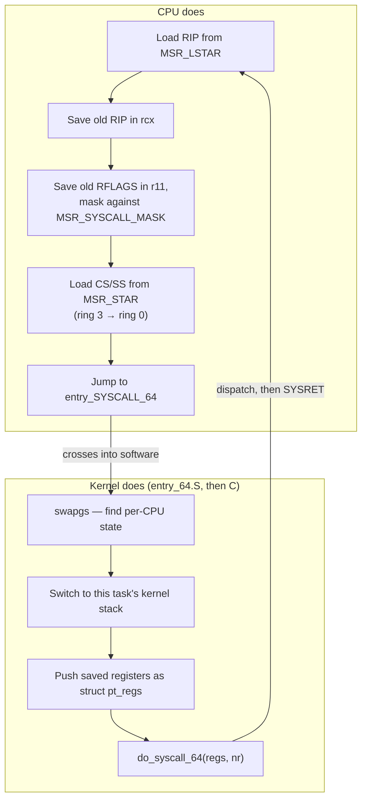

# The Entry Path

Some of what happens between the `SYSCALL` instruction and `do_syscall_64` is done by the CPU, because
software cannot be trusted to do it — there is no valid kernel state yet for software to run in. The
rest is done by software, because the CPU does surprisingly little on its own. Knowing which is which
is the difference between reading `entry_64.S` and guessing at it.

## What the CPU does, exactly

On x86-64, executing `SYSCALL` makes the CPU do exactly five things, and nothing else:

1. Load `RIP` from <Src file="arch/x86/include/asm/msr-index.h" symbol="MSR_LSTAR" /> — the address the
   kernel registered at boot as the syscall entry point.
2. Save the instruction to return to in `rcx` (the old `RIP`).
3. Save the flags register in `r11` (the old `RFLAGS`), then mask `RFLAGS` against
   <Src file="arch/x86/include/asm/msr-index.h" symbol="MSR_SYSCALL_MASK" /> — clearing the bits the
   kernel does not want carried into ring 0. See the register diagram below.
4. Load `CS` and `SS` from `MSR_STAR`, which is how the privilege level actually changes.
5. Jump to the loaded `RIP`.

That is the entire hardware contract. Two things it conspicuously does **not** do: it does not switch
stacks, and it does not save any register other than the old `RIP` (in `rcx`) and the old `RFLAGS` (in
`r11`). Every general-purpose register the caller was using is still exactly where the caller left it
when software takes over. Everything else — finding a stack, saving those registers, deciding what to
run — is software's problem from this point on.

## `swapgs` and finding the kernel's own state

The very first instruction in <Src file="arch/x86/entry/entry_64.S" symbol="entry_SYSCALL_64" /> is
`swapgs`. Before the kernel can do anything else — before it can even find its own per-CPU data — it
needs a register it can trust, and `GS` is that register: `swapgs` exchanges the value in `GS.base`
with a value saved in `MSR_KERNEL_GS_BASE`, so that `GS`-relative addressing now reaches the kernel's
per-CPU structures instead of whatever userspace was using `GS` for. Nothing before this instruction
can be written as ordinary C, because ordinary C on this kernel assumes per-CPU data is reachable, and
until `swapgs` runs it is not.

This is also a genuine hazard, not a formality. If an interrupt or an NMI could land in the narrow
window where `GS` has already been swapped once but the kernel state built on top of it does not exist
yet — or is only half-built — the handler would run with the wrong idea of whose state it is looking
at. The entry code handles this explicitly, with `PARANOID`-flavoured paths for NMI and machine-check
entry that re-check whether a `swapgs` is already in effect before deciding whether to issue another
one, rather than assuming the normal one-swap-per-transition invariant holds.

## The stack switch

`SYSCALL` did not touch `rsp`. The very next instructions after `swapgs` do: the entry stub stashes the
old `rsp` in a per-CPU scratch slot, then loads the new stack pointer from the per-CPU
`cpu_current_top_of_stack` — the top of *this task's* kernel stack, not a stack shared across tasks or
CPUs.

Running kernel code on a stack pointer userspace controls would be an immediate privilege escalation:
userspace could point `rsp` at a location it can read and write, and every subsequent `push` in the
entry path would be writing kernel-chosen values to an address userspace chose, which userspace could
then read directly — or worse, point `rsp` somewhere unmapped or dangerous and let the very first
`push` fault or corrupt something the kernel trusted. The switch has to happen in this exact position:
after `swapgs` gives the kernel a trustworthy per-CPU pointer to find the stack, and before anything
in the entry path uses the stack for a single byte.

## Building `pt_regs`

With a trusted stack under it, the entry stub pushes the saved registers — `ss`, the old `rsp`,
`rflags` (from `r11`), `cs`, the old `rip` (from `rcx`), and the syscall number (from `rax`), followed
by the rest of the general-purpose registers — onto that stack, in the fixed layout of
<Src file="arch/x86/include/asm/ptrace.h" symbol="pt_regs" />. This is why every syscall handler, every
tracer, and every oops dump can find the caller's registers by shape rather than by convention: a
`struct pt_regs *` is not a hint about where the registers probably are, it is the actual layout the
entry stub built, byte for byte.

## Then C takes over

Once `pt_regs` exists, <Src file="arch/x86/entry/syscall_64.c" symbol="do_syscall_64" /> is called with
a pointer to it. It, in turn, calls
<Src file="include/linux/entry-common.h" symbol="syscall_enter_from_user_mode" /> before dispatch and
<Src file="include/linux/entry-common.h" symbol="syscall_exit_to_user_mode" /> after it — the pair that
handles the bookkeeping the raw entry stub does not: syscall tracing (`ptrace`, audit), seccomp
filtering, and, on the way out, checking for a pending signal or a rescheduling request. The exit path
is where a pending signal or a `need_resched` flag is actually acted on — the kernel does not interrupt
itself mid-syscall to deliver a signal or preempt a task; it waits for a safe, well-defined point, and
`syscall_exit_to_user_mode` is that point. This is the fact that folder 06's signals page and folder
07's preemption page both build on.

## KPTI, in one paragraph

With kernel page-table isolation active, the entry path also switches `CR3` — the register that points
at the current page-table root — because the user-mode and kernel-mode page tables are kept separate to
prevent user code from using speculative execution to read kernel memory it cannot legitimately access.
Switching `CR3` mid-instruction-stream needs code and a stack that are mapped in *both* page tables,
which is exactly what the trampoline stack exists for: a minimal, always-mapped landing pad the CPU can
run on for the few instructions before the "real" kernel stack (from the section above) becomes usable.

:::note[Version- and hardware-scoped]
Whether KPTI is active, and what else is active alongside it, depends on the CPU model and on boot
parameters (`pti=on`/`off`/`auto`, and others). `/sys/devices/system/cpu/vulnerabilities/` is the
authoritative answer on any given machine — read it rather than assuming a mitigation is or is not
active based on kernel version alone.
:::

## This path is simplified

Deliberately. Error paths (a bad `rcx`/`rip` that would fault on `SYSRET`, for instance), `CONFIG_*`
variants, IST-based stacks for faults that can occur at inconvenient times, and the 32-bit compat entry
points are all elided here. <Src file="arch/x86/entry/entry_64.S" symbol="entry_SYSCALL_64" /> is the
real thing, comments and all — the comments in it are documentation in their own right.

## arm64 does this differently

:::note[Architecture: arm64]
arm64 has no direct equivalent of `SYSCALL`/`MSR_LSTAR`. A syscall is requested with `SVC`, which traps
to a vector table entry selected by exception *category* (synchronous exception from a lower exception
level, using AArch64) rather than by a single fixed vector number the way x86-64's `SYSCALL` always
targets `MSR_LSTAR`. The return address and saved processor state live in `ELR_EL1` and `SPSR_EL1`
rather than `rcx`/`r11`, and the kernel stack pointer for EL1 comes from `SP_EL1`, which the exception
entry already made current — there is no software `swapgs`-style exchange to reach it. The syscall
number is passed in `x8`, not `rax`.
:::



*The division of labour on syscall entry: five things the hardware does, everything else in
`entry_64.S`.*

```wavedrom title="RFLAGS bits MSR_SYSCALL_MASK clears on entry" alt="RFLAGS bit-field strip from bit 18 (AC) down to bit 0 (CF), showing which bits are cleared on SYSCALL entry"
{ reg: [
  { bits: 1, name: 'AC' },
  { bits: 3, name: '' },
  { bits: 1, name: 'NT' },
  { bits: 2, name: 'IOPL' },
  { bits: 1, name: 'OF' },
  { bits: 1, name: 'DF' },
  { bits: 1, name: 'IF' },
  { bits: 1, name: 'TF' },
  { bits: 1, name: 'SF' },
  { bits: 1, name: 'ZF' },
  { bits: 1, name: '' },
  { bits: 1, name: 'AF' },
  { bits: 1, name: '' },
  { bits: 1, name: 'PF' },
  { bits: 1, name: '' },
  { bits: 1, name: 'CF' },
] }
```

`syscall_init()` programs `MSR_SYSCALL_MASK` to clear every flag shown above (plus `RF` and `ID`, off
this strip) on entry — the comment above the write says it plainly: "clear as much as possible to
minimize user space-kernel interference." Of the bits shown, `IF` and `DF` are the two that matter most
in practice: `IF` because the kernel needs interrupts to start out disabled on entry rather than
inheriting whatever state userspace happened to be in, and `DF` because a huge amount of kernel code
uses `rep`-prefixed string instructions and the C calling convention already assumes `DF` is clear —
inheriting a set `DF` from userspace would silently run those instructions backwards.

<KernelFacts
  structure={[["struct pt_regs", "arch/x86/include/asm/ptrace.h"], ["MSR_LSTAR", "arch/x86/include/asm/msr-index.h"]]}
  path="SYSCALL → entry_SYSCALL_64() → swapgs → stack switch → pt_regs → do_syscall_64()"
  observe="sudo rdmsr 0xc0000082 && sudo grep entry_SYSCALL_64 /proc/kallsyms"
  trap="SYSCALL does not switch stacks. Between the instruction and the stack switch a few instructions later, the kernel is running on a stack the user chose — which is why that window is written in assembly and audited carefully." />

## References

- <Src file="arch/x86/entry/entry_64.S" symbol="entry_SYSCALL_64" /> — the path itself, and the
  comments in it are documentation.
- Intel SDM Vol. 2B, the `SYSCALL`/`SYSRET` instruction reference — the exact list of what the hardware
  saves, loads, and masks.
- [*7. Kernel Entries*](https://docs.kernel.org/arch/x86/entry_64.html) — the in-tree x86-64 entry
  documentation, current at v6.18.
- LWN, *"Meltdown and Spectre: kernel page-table isolation"* — why `CR3` moves on entry and what the
  trampoline stack is for.
