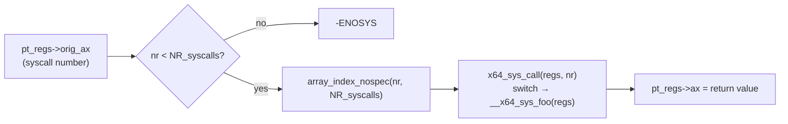

# The Table and the Dispatch

Behind a grand-sounding interface is a mundane mechanism: the syscall number is an index, that index
selects one function out of a fixed set the kernel built at compile time, and the bounds check on that
index is one of the most security-critical two lines in the tree — get it wrong and a syscall number is
a primitive for calling arbitrary kernel code.

## The table

Every syscall's number, calling convention, name, and entry point come from one generated source: a
`.tbl` file, one line per syscall. For x86-64 that file is
<Src file="arch/x86/entry/syscalls/syscall_64.tbl" />. Five real lines from it:

```text
0	common	read			sys_read
1	common	write			sys_write
2	common	open			sys_open
3	common	close			sys_close
257	common	openat			sys_openat
```

That file is `#include`d, wrapped in macros, to generate two different things at build time: an array
of function pointers, <Src file="arch/x86/entry/syscall_64.c" symbol="sys_call_table" /> — and, since a
recent restructuring of the dispatch path, a `switch` statement the actual dispatch runs through
instead. See [Dispatch, in six lines](#dispatch-in-six-lines) below for why both exist.

## Numbers are frozen forever

A syscall number, once shipped in a released kernel, means that syscall on that architecture until the
end of time. It cannot be reassigned, even if the syscall it named is later removed — a removed
syscall leaves a hole in the table (routed to a "not implemented" stub), and a new syscall is appended
after the highest existing number rather than filling the hole. This is why `strace` needs to know
which ABI it is decoding before it can turn a number into a name, and why a seccomp filter that
inspects the syscall number must check the **architecture** first: the same number means a different
syscall — or nothing at all — on a different architecture, and a filter written against the wrong
architecture's numbering is not a portability bug, it is a security bug.

## `SYSCALL_DEFINEn`, expanded

Take a real three-argument syscall, `write`, defined as:

```c
// fs/read_write.c
SYSCALL_DEFINE3(write, unsigned int, fd, const char __user *, buf, size_t, count)
{
	return ksys_write(fd, buf, count);
}
```

`SYSCALL_DEFINE3` expands into (not one function, but) a small family of them. First, the inner
function that does the real work, built from the type/name pairs given to the macro:

```c
// generated from the SYSCALL_DEFINE3 above
static inline long __do_sys_write(unsigned int fd, const char __user *buf, size_t count)
{
	return ksys_write(fd, buf, count);
}
```

Then, on x86-64, the wrapper that unpacks a `pt_regs` into that inner function's argument list —
<Src file="arch/x86/include/asm/syscall_wrapper.h" symbol="SC_X86_64_REGS_TO_ARGS" /> supplies the
register mapping (argument 1 from `regs->di`, argument 2 from `regs->si`, argument 3 from `regs->dx`,
and so on through `r10`, `r8`, `r9` for arguments four through six):

```c
// generated by __SYSCALL_DEFINEx / __X64_SYS_STUBx
long __x64_sys_write(const struct pt_regs *regs)
{
	return __se_sys_write(regs->di, regs->si, regs->dx);
}
```

Three things this buys, beyond saving the author of `fs/read_write.c` from writing any of it by hand:

- **The `pt_regs`-based calling convention.** Every syscall's real entry point, the one the dispatch
  mechanism below actually calls, takes a single `const struct pt_regs *` rather than its natural
  argument list. This was a Spectre-era change: with every syscall sharing one calling convention,
  speculative-execution mitigations and stack-frame validation can be written once, generically,
  instead of once per syscall signature.
- **Sign-extension and type-checking.** The `__se_sys_*` layer (elided above for space) casts each
  argument to its final type consistently, which is where a 32-bit negative value passed where the
  syscall expects an unsigned type gets handled the same way on every syscall rather than differently
  depending on how each author happened to write the check.
- **Tracepoint hookup.** The same macro expansion wires each syscall into the `sys_enter`/`sys_exit`
  tracepoints (visible to `perf` and `ftrace`) without every syscall author writing tracing code by
  hand.

## Dispatch, in six lines

The bounds check and the call, close to verbatim from <Src file="arch/x86/entry/syscall_64.c" symbol="do_syscall_64" />'s
helper:

```c
unsigned int unr = nr;

if (likely(unr < NR_syscalls)) {
	unr = array_index_nospec(unr, NR_syscalls);
	regs->ax = x64_sys_call(regs, unr);
	return true;
}
return false; /* out of range: -ENOSYS */
```

`x64_sys_call()` itself is the `switch (nr) { case 1: return __x64_sys_write(regs); ... }` generated
from the same `.tbl` file — dispatch on current x86-64 kernels is a bounds-checked `switch`, which the
compiler is free to lower to a jump table, rather than a literal `sys_call_table[nr]` array read
followed by an indirect call. `sys_call_table[]` itself still exists and is still built from the same
table, but — per the comment directly above its definition — it is "no longer used for system calls,"
kept only because `kernel/trace/trace_syscalls.c` still wants each syscall's address for tracing.

`array_index_nospec()` is the speculation hardening: it clamps `unr` so that, even under speculative
execution past a mispredicted bounds check, the index used to select a syscall cannot be coaxed outside
the valid range. Without a bounds check on `nr` at all, a syscall number would be an arbitrary index
into kernel memory interpreted as a function pointer and called — arbitrary kernel code execution from
a single userspace-controlled register.

## Where the per-architecture tables live

| Architecture | Table lives in |
|---|---|
| x86-64 | <Src file="arch/x86/entry/syscalls/syscall_64.tbl" /> |
| x86-32 / x86-64 compat | <Src file="arch/x86/entry/syscalls/syscall_32.tbl" /> |
| arm64 (native 64-bit ABI) | <Src file="include/uapi/asm-generic/unistd.h" /> — arm64 has no `syscall_64.tbl` of its own; it uses this shared generic list directly |
| arm64 (32-bit compat ABI) | <Src file="arch/arm64/tools/syscall_32.tbl" /> — only the compat table is architecture-specific |

<Lab host="any-linux" title="Find a syscall's number three ways" time="10 min">

1. **From a header.** `grep write /usr/include/asm/unistd_64.h` — expect a line like
   `#define __NR_write 1`, matching the `.tbl` line above.
2. **From the running kernel's tracepoints.** `perf list 'syscalls:sys_enter_*' | grep write` — expect
   `syscalls:sys_enter_write` in the listing, confirming the kernel you are running has that tracepoint
   compiled in and readable. (If `auditd` tooling is installed, `ausyscall --dump | head` shows the same
   number-to-name mapping from a different source.)
3. **See it in flight.** `strace -e trace=openat ls` — expect one or more lines like
   `openat(AT_FDCWD, "/lib/x86_64-linux-gnu/libc.so.6", O_RDONLY|O_CLOEXEC) = 3`, and match `openat`
   against its number (257) from the `.tbl` excerpt above.

If it fails: the header from step 1 may live under a multiarch path instead —
`/usr/include/x86_64-linux-gnu/asm/unistd_64.h` — if `/usr/include/asm` does not exist or points
elsewhere. Step 2's `perf list` needs `tracefs` mounted and readable (`mount | grep tracefs`); without
it, `perf list` will simply not show the `syscalls:*` group at all.

</Lab>



*A syscall number becoming a function pointer, and the bounds check that stands between the two.*

<KernelFacts
  structure={[["sys_call_table", "arch/x86/entry/syscall_64.c"], ["SYSCALL_DEFINE3", "include/linux/syscalls.h"]]}
  path="do_syscall_64() → bounds check on nr → array_index_nospec() → x64_sys_call() → __x64_sys_foo() → __do_sys_foo()"
  observe="grep -E '^(0|1|2|60|257)\t' arch/x86/entry/syscalls/syscall_64.tbl"
  trap="A syscall number is not portable and not stable across architectures. openat is 257 on x86-64 and a different number on arm64, which is why a seccomp filter that checks the number without first checking the architecture is a security bug, not a portability bug." />

## References

- <Src file="arch/x86/entry/syscalls/syscall_64.tbl" /> — the table's source of truth, readable as a
  plain file.
- <Src file="include/linux/syscalls.h" symbol="SYSCALL_DEFINE3" /> — the macro, with the comments
  explaining the `pt_regs` wrapper.
- LWN, [*"System calls and the pt_regs-based calling convention"*](https://lwn.net/Articles/766109/) —
  why the wrapper shape changed in 2018, which explains the double-underscore functions readers will
  otherwise find baffling.
- [`syscalls(2)`](https://man7.org/linux/man-pages/man2/syscalls.2.html) — the catalogue of what
  exists, with the kernel version each was added in.
