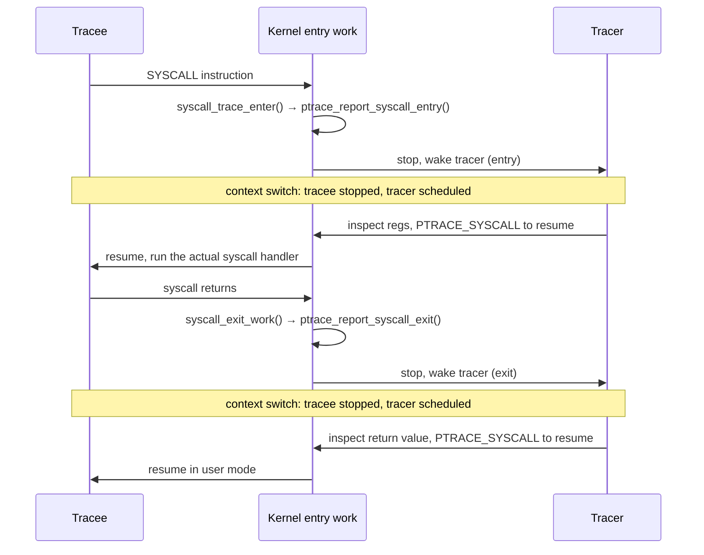

# Tracing and Intercepting Syscalls

Watching a syscall and changing what it does are completely different mechanisms with completely
different costs, and the tool people reach for first — `strace` — is frequently the wrong one for the
job they actually have. `strace` is precise and expensive; the tracepoint path is cheap and cannot
change anything; and the only mechanism built to *intervene* correctly is neither of those.

## What actually happens when you run `strace ls`

`strace` attaches with `PTRACE_TRACEME` (from a forked child, just before its `execve`) or
`PTRACE_ATTACH` (to an already-running process), then asks the kernel to stop the tracee at every
syscall boundary. From there, one syscall means **two** stops: the tracee stops on entry, before the
syscall body runs, and stops again on exit, after it has returned. Each stop is a full context switch —
tracee to tracer, tracer decides what to do (usually just "let it continue"), then tracer to tracee
again — not a lightweight callback. `strace`'s job at each stop is mundane by comparison: read the
frozen `pt_regs` out of the tracee, decode the syscall number and arguments into the readable form you
see on your terminal, and let the tracee resume.

Give the cost honestly, because `strace`'s reputation as "the tool to reach for" undersells it: a
syscall-heavy workload under `strace` commonly runs one to two orders of magnitude slower than
untraced, because the double context switch is paid on *every single syscall*, and a program that
makes a lot of small `read`/`write` calls pays it a lot of times. The consequence is not a footnote —
it changes what you can conclude. `strace` does not observe a program's timing, it replaces it with the
tracer's timing. It is a correctness tool — "what did this program actually call, with what
arguments, in what order" — and a poor performance tool, because the act of measuring is itself the
dominant cost.

## `perf trace`, and why it is cheaper

`perf trace` gets most of the same information from a different mechanism entirely: the
`raw_syscalls:sys_enter` and `raw_syscalls:sys_exit` tracepoints, the same tracepoint pair
`kernel/entry/syscall-common.c`'s `syscall_trace_enter()` fires via `trace_sys_enter()` when
`SYSCALL_WORK_SYSCALL_TRACEPOINT` is set (see [the entry path](./the-entry-path.md) for where that sits
in the syscall-exit work). A tracepoint firing writes a record into a per-CPU ring buffer and returns —
no stop, no scheduling decision, no context switch to a separate tracer process. The tracee never
leaves the CPU it was already running on.

The trade-off is real, not just a footnote to the speed advantage:

- **Less detail per call.** A tracepoint records the raw register values at the moment it fires. It does
  not, on its own, walk a `struct sockaddr *` or decode a `flags` bitmask into names the way `strace`'s
  argument-printing tables do — `perf trace` layers some of that decoding back on top, but it is working
  from a snapshot, not a live, stoppable tracee.
- **No ability to modify anything.** A tracepoint is a read: it cannot change the syscall number, the
  arguments, or the return value, because nothing is stopped for it to change. Interception is simply
  not this mechanism's job.

The number to keep in your head: ptrace-based tracing costs *two context switches per syscall*;
tracepoint-based tracing costs *one ring-buffer write*, on the CPU that was already running.

## The same question, four ways

"Which files did this process open?" — one question, answered by four different mechanisms with four
different costs.

<Tabs>
<TabItem value="strace" label="strace" default>

```text
$ strace -e trace=openat ./app
openat(AT_FDCWD, "/etc/resolv.conf", O_RDONLY|O_CLOEXEC) = 3
openat(AT_FDCWD, "/var/lib/app/config.json", O_RDONLY) = 4
```

Full argument decoding (path, flags spelled out by name, the returned fd), for free. Costs the two
ptrace stops above on *every* syscall the process makes, not just the `openat` calls being filtered —
the filter only decides what gets printed, not what gets stopped for.

</TabItem>
<TabItem value="perf-trace" label="perf trace">

```text
$ perf trace -e openat ./app
   0.128 ( 0.019 ms): app/1234 openat(dfd: CWD, filename: "/etc/resolv.conf", flags: RDONLY|CLOEXEC) = 3
   4.902 ( 0.011 ms): app/1234 openat(dfd: CWD, filename: "/var/lib/app/config.json", flags: RDONLY)  = 4
```

Similar readability, from the tracepoint path — `perf` can `-e` filter to just the `openat` tracepoint,
so only the syscalls you asked about even produce a record, and none of them cost a context switch.

</TabItem>
<TabItem value="bpftrace" label="bpftrace">

```text
$ bpftrace -e 'tracepoint:syscalls:sys_enter_openat { printf("%s %s\n", comm, str(args.filename)); }'
app     /etc/resolv.conf
app     /var/lib/app/config.json
```

A one-liner attached to the same tracepoint group `perf trace` uses underneath, run through a small BPF
program instead of a fixed decoder. Cheap for the same reason `perf trace` is cheap — it is the same
tracepoint mechanism — with the added ability to filter, aggregate, or histogram in the kernel before
anything reaches user space. Folders 17–18 cover BPF tracing tools in depth; this is only the shape of
the answer.

</TabItem>
<TabItem value="opensnoop" label="opensnoop">

```text
$ opensnoop -n app
PID    COMM             FD ERR PATH
1234   app               3   0 /etc/resolv.conf
1234   app               4   0 /var/lib/app/config.json
```

A purpose-built BPF-backed tool (part of the BCC/bpftrace tool collections) that is exactly the
`bpftrace` one-liner above, packaged, with column formatting and error decoding done for you. Same
tracepoint, same cost, no bpftrace script to write.

</TabItem>
</Tabs>

Four tools, two mechanisms: `strace` pays for a stoppable tracee it does not need for a read-only
question, and the other three all ride the same cheap tracepoint underneath a different amount of
convenience.

## Interception, properly

None of the four tools above can *change* a syscall's outcome — they can only watch. The mechanism
built to intervene correctly is seccomp user-space notification
(`SECCOMP_RET_USER_NOTIF`): a seccomp filter, instead of allowing, denying, or killing on a matched
syscall, suspends the calling task and hands a file descriptor for that suspended call to a separate
supervisor process. The supervisor reads a `struct seccomp_notif` (<Src file="include/uapi/linux/seccomp.h" symbol="seccomp_notif" />)
off that descriptor — the syscall number, the architecture, and the full argument snapshot — inspects
it, and decides: let it proceed unmodified, fail it with a chosen errno, or (carefully — see the kernel
header's own caution about the flag) let it continue.

What makes this correct where `ptrace`-based interception is not: the supervisor sees the arguments in
a race-free way. A `ptrace`-based interceptor stops the tracee, reads its memory to resolve any pointer
arguments (a path string, a struct), decides, and resumes — but between the read and the resume, a
second thread in the same traced process can rewrite that memory, and the interceptor's decision was
made against data that no longer matches what the syscall will actually see when it runs. This is a
real, documented class of TOCTOU bug in `ptrace`-based sandboxes. Seccomp user notification does not
by itself close every such window (the kernel header for `SECCOMP_USER_NOTIF_FLAG_CONTINUE` warns about
exactly this if the flag is used to resume the original syscall unmodified), but the redesigned model —
one process supervising, using an explicit fd-based protocol built for this purpose, rather than the
general-purpose debugging interface `ptrace` also is — is what container runtimes such as `runc` and
gVisor's `runsc` are built on for the syscalls they need to intercept rather than merely filter.

## Why `LD_PRELOAD` is not syscall interception

`LD_PRELOAD` replaces *library* functions — it works by injecting a shared object earlier in the
dynamic linker's symbol resolution order, so a call to `open()` resolves to your replacement instead of
glibc's. It never touches the syscall boundary itself. A statically linked binary, a Go program (whose
runtime issues syscalls directly and does not go through libc at all — see
[libc is not the kernel](./libc-is-not-the-kernel.md)), or code that calls `syscall(2)` directly all
sail straight past an `LD_PRELOAD` shim, because there is no dynamic symbol resolution step for it to
intercept in the first place.

## What each mechanism can see and do

| Mechanism | Observes | Can modify | Cost | Survives a static binary |
|---|---|---|---|---|
| `ptrace` (`strace`) | Full arguments, return value, every entry and exit | Yes — registers and memory of a stopped tracee | High: two context switches per syscall | Yes |
| Tracepoints (`perf trace`) | Arguments and return value, from a ring-buffer snapshot | No | Low: one ring-buffer write, no stop | Yes |
| kprobes | Anywhere a probe is attached, including inside syscall handlers | Not safely, for the syscall's own outcome | Low to moderate, depending on probe placement | Yes |
| seccomp-notify | Full argument snapshot, race-free, via a supervisor | Yes — the syscall's outcome, via the supervisor's response | Moderate: one suspend/resume round trip per intercepted call | Yes |
| `LD_PRELOAD` | Only calls that go through the dynamic linker to libc | Yes, but only at the library layer | Effectively free (a redirected function call) | **No** — dynamically-linked, libc-routed calls only |

## Why the ptrace stop is where it is

The ptrace check in `syscall_trace_enter()` is not bolted on beside the syscall dispatch — it runs
*inside* the same syscall entry work that also runs seccomp and decides what happens with a pending
signal, and in that order deliberately: `kernel/entry/syscall-common.c` runs ptrace's report first and
seccomp second, specifically "to catch any tracer changes" a debugger made to the registers before the
filter evaluates them. [The entry path](./the-entry-path.md#then-c-takes-over) already established that
`syscall_enter_from_user_mode`/`syscall_exit_to_user_mode` is where tracing, seccomp filtering, and
signal delivery all live — one code path, three features, and the ordering between the first two is not
an accident.



*One syscall under `strace`: two stops, two context switches, and the reason tracing is expensive.*

<KernelFacts
  structure={[["struct seccomp_notif", "include/uapi/linux/seccomp.h"]]}
  path="syscall entry → syscall_trace_enter() → ptrace_report_syscall_entry() → ptrace_report_syscall() → tracer wakes → tracee resumes → handler → syscall_exit_work() → ptrace_report_syscall_exit() → exit stop"
  observe="strace -c -f ls >/dev/null; perf trace -s ls >/dev/null — compare the wall time each one reports"
  trap="strace does not observe a program, it suspends it twice per syscall. Anything you conclude about timing from a traced run is a fact about the tracer." />

## References

- [`ptrace(2)`](https://man7.org/linux/man-pages/man2/ptrace.2.html), the syscall-stop section —
  the definitive statement of when `PTRACE_SYSCALL` stops happen and what the tracer sees at each.
- [`seccomp_unotify(2)`](https://man7.org/linux/man-pages/man2/seccomp_unotify.2.html) — the modern
  interception interface, with a complete worked example in the man page itself.
- [`perf-trace(1)`](https://man7.org/linux/man-pages/man1/perf-trace.1.html) — the low-overhead
  alternative and its option surface.
- LWN, [*"Deferring seccomp decisions to user space"*](https://lwn.net/Articles/756233/) — why
  `ptrace`-based interception was inadequate and what replaced it.
