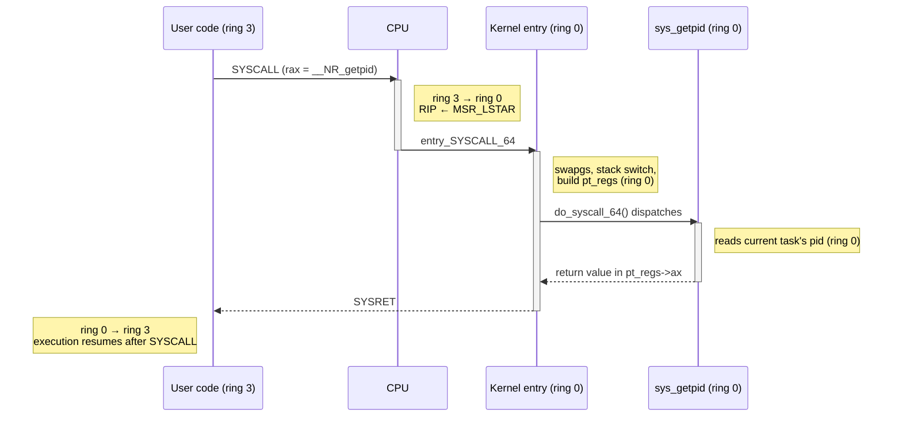

# What a System Call Actually Is

A system call is not a function call into the kernel. It is a deliberate, hardware-mediated
privilege transition into code you do not control, entered at an address you cannot choose, running
on a stack you did not allocate. Everything expensive about it follows from that, and so does
everything safe about it.

## Three things a call cannot do that a syscall must

- **Change privilege level.** An ordinary `call` leaves the CPU exactly as privileged as it was; a
  syscall has to move execution from ring 3 to ring 0, and only a small, hardware-defined set of
  instructions is allowed to do that.
- **Switch to a trusted stack.** A `call` pushes a return address onto whatever stack `rsp` already
  points at. A syscall cannot run kernel code on a stack userspace chose and might have mapped
  read-write, mapped executable, or not mapped at all — so the transition itself has to install a
  stack the kernel trusts before it does anything else.
- **Land somewhere the caller cannot pick.** A `call`'s target is an operand — the caller names the
  address. A syscall's target is fixed by the kernel at boot time and cannot be redirected by
  userspace, because a jump to an attacker-chosen kernel address is the entire attack.

An ordinary `call` instruction is structurally incapable of any of the three, which is exactly why the
transition needs its own instruction and its own hardware support rather than being one more calling
convention.

## What it costs, and where the cost is

The privilege transition itself is no longer the dominant cost on modern hardware — `SYSCALL`/`SYSRET`
is on the order of a hundred cycles, not the thousands a page-fault-based transition once cost. What
actually shows up in a profile is everything the crossing does around that hundred cycles:

- **Register save and restore.** The entry path has to preserve the caller's register state before it
  can touch a single general-purpose register for its own use, and restore it, intact, on the way out.
- **A cold instruction cache.** The code path through entry, dispatch, and a filesystem or network
  handler is rarely the code the CPU was just running, so the crossing is very likely to stall on
  instruction fetch.
- **A polluted branch predictor.** The kernel's branches are not the branches userspace was training
  the predictor on; the crossing throws that training away.
- **A page-table switch under KPTI.** Since Meltdown, many configurations also swap `CR3` on entry and
  exit — see [The Entry Path](./the-entry-path.md) — which is itself one of the more expensive single
  instructions a modern CPU executes.

Say the quiet part plainly: the mitigation-era cost is the reason so much of modern kernel interface
design is about *not* making the call at all, rather than making the call faster. See
[The Design Consequences](#the-design-consequences) below.

## What actually happens

Take `getpid()`. In C it looks like an ordinary function call:

```c
pid_t pid = getpid();
```

Follow it all the way down and it is nothing like one:

1. **libc's wrapper.** `getpid()` in glibc is a thin stub that loads the syscall number into `rax`,
   the (zero) arguments into the argument registers, and executes `SYSCALL`.
2. **The `SYSCALL` instruction.** The CPU changes privilege level, loads `RIP` from a model-specific
   register, and does *not* switch stacks or save any register beyond `RIP` and `RFLAGS` — see
   [The Entry Path](./the-entry-path.md) for exactly what it does and does not do.
3. **The entry stub**, <Src file="arch/x86/entry/entry_64.S" symbol="entry_SYSCALL_64" />, finds the
   kernel's per-CPU state, switches to this task's kernel stack, and builds a `struct pt_regs` from
   the saved registers.
4. **`sys_getpid`**, reached through <Src file="arch/x86/entry/syscall_64.c" symbol="do_syscall_64" />
   and the dispatch it performs — see [The Table and the Dispatch](./the-syscall-table-and-dispatch.md)
   — reads one field out of the current task and returns.
5. **Return to user**, retracing steps 3 and 2 in reverse: registers restored, privilege level dropped,
   execution resumes at the instruction after `SYSCALL`.

The punchline is that the *cheapest possible syscall* — one that does no real work, touches no device,
takes no lock — still does all of that. Nothing about steps 2 through 5 gets cheaper because the
kernel-side work happens to be trivial; the register save, the cache and branch-predictor disruption,
and (where active) the KPTI page-table switch are paid in full regardless. That is exactly why some
libcs cache `getpid()`'s result across `fork()` boundaries instead of calling it fresh every time, and
why `gettimeofday()` and `clock_gettime()` were moved into the vDSO entirely — a call that does no
kernel-side work has nothing to show for the cost of crossing.

## The design consequences

Because the boundary is expensive, a good deal of Linux's interface design over the past two decades
is aimed at reducing how often a program crosses it, not at making any one crossing faster:

| Mechanism | The crossing it removes |
|---|---|
| [The vDSO](./the-vdso.md) | Avoids the crossing entirely for calls whose answer can be computed in userspace (`gettimeofday`, `clock_gettime`, `getcpu`). |
| `io_uring` | Batches many operations behind one (or zero, in polling mode) crossings, via shared submission and completion rings. |
| `mmap` | Pays one crossing to establish a mapping, then services every subsequent access with no crossing at all. |
| `readv`/`writev` | One crossing moves data through many buffers instead of one crossing per buffer. |
| `epoll` | One crossing returns readiness for many file descriptors instead of one crossing per descriptor polled. |

Only the vDSO is linked above; `io_uring`, `mmap`'s fault path, and `epoll`'s internals live in folders
not yet written.

## Not every trap is a syscall

Page faults and device interrupts also cross from user mode into kernel mode, and they are not
syscalls: nothing in userspace executed `SYSCALL`, no syscall number was loaded, and no libc wrapper
was involved. A syscall is deliberate and synchronous to the instruction stream that requested it; a
page fault is the CPU noticing a problem with an address it was just asked to use and trapping on its
own initiative; a device interrupt is asynchronous to whatever the CPU was doing at all. All three
share machinery with the syscall path — `struct pt_regs`, a kernel stack, a privilege transition — but
they are triggered by different things for different reasons. This distinction is exactly the one [how
an interrupt reaches the
kernel](../10-interrupts-time-and-deferred-work/how-an-interrupt-reaches-the-kernel.md) depends on.

## Misconceptions

- **"A syscall is slow because the kernel is slow."** Most of the measured cost is the transition and
  its cache and branch-predictor effects, not the work the kernel does once it gets there — a trivial
  syscall like `getpid()` and a syscall that does real I/O pay nearly the same fixed overhead before
  either one starts working.
- **"Syscalls are how programs talk to the kernel."** Some of the most frequent kernel interactions a
  running program has involve no syscall at all: page faults on first touch of a mapped page, and vDSO
  reads that never leave userspace.
- **"The kernel runs on my behalf in a separate thread."** It does not. The kernel code servicing your
  syscall runs *in your task's context*, on *your task's kernel stack*, and the time it spends is
  charged to *your task's* `sys` time — there is no handoff to another thread or process.



*One `getpid()`, from the instruction that traps to the instruction after it, with the privilege level
at each step.*

<KernelFacts
  structure={[["struct pt_regs", "arch/x86/include/asm/ptrace.h"]]}
  path="user SYSCALL → entry_SYSCALL_64() → do_syscall_64() → sys_getpid() → return to user"
  observe="perf stat -e raw_syscalls:sys_enter -- ls"
  trap="The syscall boundary is fast on modern hardware; what is slow is everything the crossing does to your caches and branch predictors. Measuring one syscall in a tight loop tells you almost nothing about its cost in a real program." />

## References

- `man 2 syscall` — the per-architecture register table, and the honest statement that libc wrappers
  are not the interface.
- [The Linux kernel user-space API guide](https://docs.kernel.org/admin-guide/index.html) — the
  kernel's own account of what it exposes across the boundary.
- Kerrisk, *The Linux Programming Interface*, ch. 3 — the definitive treatment from the caller's side;
  a purchase.
- LWN, [*"KPTI: the kernel page-table isolation"*](https://lwn.net/Articles/741878/) coverage — why the
  transition got more expensive in 2018, which is the context for every syscall-avoidance interface
  since; predates v6.18 and describes the mechanism, not current defaults.
