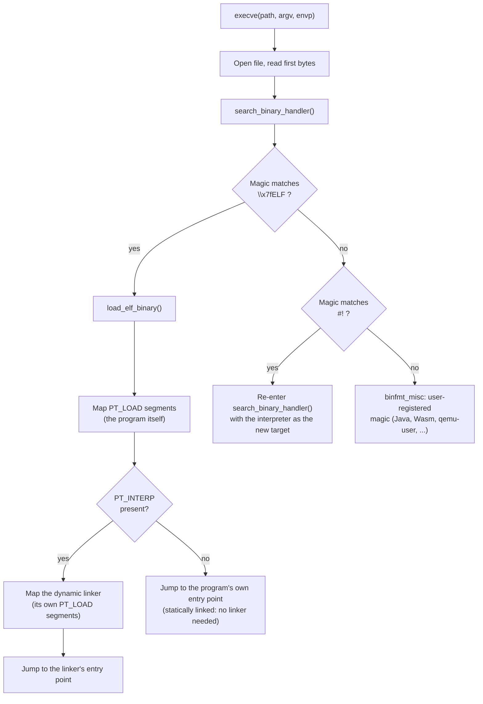

# `exec()` and Binary Formats

`exec()` is the complement to [`fork()`](./fork-and-copy-on-write.md), in the precise sense of doing the
opposite thing to the same object. Where `fork()` duplicates everything about a process and changes
nothing, `exec()` keeps exactly one thing — the `task_struct`, meaning the PID stays the PID — and
destroys everything that struct pointed at: a new address space replaces the old one, every existing
memory mapping is gone, signal dispositions reset, and execution jumps to an entry point that was, until
a moment ago, just a file on disk. The task survives `exec()`. The program running inside it does not.

## What survives an exec

Given how much `exec()` tears down, the short list of what it leaves alone is worth stating precisely,
because it is exactly the list people get wrong under pressure — usually while debugging why a file
descriptor they expected to be closed is still open, or why a child process they `exec()`'d unexpectedly
inherited credentials they didn't grant it:

| Survives `exec()` | Notes |
|---|---|
| PID and TGID | The defining fact of `exec()`: same task, new program |
| Parent/child relationship | `getppid()` is unchanged; the process tree shape is untouched |
| Open file descriptors, unless `FD_CLOEXEC` | Any fd opened without `O_CLOEXEC`/`FD_CLOEXEC` set stays open across the exec — a frequent source of accidental fd leaks into a newly-exec'd program |
| Current working directory | `chdir()` state is process-wide state that lives outside the address space `exec()` replaces |
| Credentials | Unchanged, **unless** the binary being exec'd has the setuid or setgid bit set — see below |
| The signal *mask* | What is blocked stays blocked; what each signal *does* does not (see next section) |

## What is destroyed

Everything not on that list is gone, unconditionally:

- **The entire address space** — every VMA, every mapping, the heap, the stack, all of it. `exec()` does
  not reuse the old `mm_struct`; it builds a new one and switches to it.
- **All memory mappings**, which is really the same fact stated at a finer grain: shared library
  mappings, `mmap()`'d files, anonymous memory the old program allocated — none of it exists in the new
  program's address space.
- **Signal handlers, reset to their default disposition** — a handler installed with `sigaction()` does
  not survive, because the handler is a function pointer into code that no longer exists once the old
  address space is gone. The signal *mask* (which signals are currently blocked) is a property of the
  task, not the address space, and does survive, which is the asymmetry worth remembering: disposition
  resets, blocking does not.
- **Every thread except the one that called `exec()`.** In a multi-threaded process, `exec()` is a
  synchronization event: the kernel has to stop and discard every other thread in the thread group before
  it can safely tear down the shared address space they were all running against, because letting another
  thread keep executing against memory `exec()` is in the middle of replacing is not a state the kernel
  can make sense of.
- **Pending timers** tied to the old program's signal handlers or address space go with it, for the same
  reason handlers do.

## `binfmt` handlers

The kernel does not, itself, know what an ELF file is. `execve()` hands the first bytes of the target
file to a chain of registered handlers — `struct linux_binfmt` objects, each offering a `load_binary`
callback — and asks each one in turn "is this yours?" The three handlers worth naming:

- **`binfmt_elf`** — recognizes the four-byte magic `\x7fELF` and handles the overwhelming majority of
  executables on a modern Linux system.
- **`binfmt_script`** — recognizes the two-byte magic `#!` and handles shebang scripts. This is the fact
  that makes the rest of shebang handling comprehensible: **`#!` is a binary format**, in exactly the
  same sense ELF is one. There is no special-cased "the kernel understands scripts" logic; there is a
  registered handler that recognizes a two-byte magic number and knows what to do next, structurally no
  different from the ELF handler recognizing its own four-byte magic.
- **`binfmt_misc`** — a handler that recognizes whatever *user space* has registered with it: byte
  patterns for Java class files, WebAssembly modules, or foreign-architecture binaries (paired with
  `qemu-user` to transparently run, say, an ARM binary on an x86-64 host). `binfmt_misc` is the extension
  point that lets new "binary formats" exist without a kernel patch.

`search_binary_handler()` (`fs/exec.c`, v6.18) is the function that walks this chain, trying each
registered `linux_binfmt`'s `load_binary` callback until one accepts the file or all of them decline.

## What actually happens: running `./hello`, a dynamically linked C program

Trace the concrete sequence for the ordinary case — a small, dynamically linked C program:

1. `execve("./hello", …)` opens the file and reads its first bytes.
2. Those bytes match `\x7fELF`, so `search_binary_handler()` hands off to `binfmt_elf`'s
   `load_elf_binary()`.
3. `load_elf_binary()` reads the ELF program headers and maps every `PT_LOAD` segment at its requested
   address — this is the actual program: its code, its read-only data, its writable data, each becoming
   one or more VMAs in the new address space.
4. It also looks for a `PT_INTERP` segment, which — for anything dynamically linked — names a path to the
   dynamic linker (`/lib64/ld-linux-x86-64.so.2` on x86-64 glibc systems). Confirmed directly against a
   locally compiled binary:

   ```text
   $ readelf -x .interp hello
   Hex dump of section '.interp':
     0x00000374 2f6c6962 36342f6c 642d6c69 6e75782d /lib64/ld-linux-
     0x00000384 7838362d 36342e73 6f2e3200          x86-64.so.2.
   ```

   `load_elf_binary()` maps *that* file into the address space too — a second ELF binary, loaded by
   exactly the same `PT_LOAD`-segment mechanism it just used for the program itself.
5. Then it jumps — not to the program's own entry point, but to the **dynamic linker's** entry point.
   This is the punchline stated exactly: **`exec()` puts two programs in your address space and runs the
   wrong one first.** The dynamic linker runs first, in ordinary user space, with no special kernel
   assistance beyond having been mapped: it reads the program's `.dynamic` section, maps every shared
   library the program depends on (each its own set of `PT_LOAD` segments, mapped the same way, again),
   resolves symbol relocations so calls like `printf` land in the right library, and only once all of
   that is done does it jump to the program's *actual* entry point — user code, calling `_start`, which
   in turn calls `main()`.

**Honest disclosure on tooling:** the natural way to make this concrete is `strace -e
trace=execve,openat,mmap ./hello`, counting the `openat`/`mmap` pairs before `main()` runs. `strace` is
not installed in this environment (checked directly: `which strace` found nothing, and no package
manager access to install it here), so the syscall trace below is not a captured run — it is the
documented shape of what `strace` would show, built from `ldd` and `readelf` output that *was* captured
directly against a locally compiled `hello` binary, plus the kernel source path above. Do not read the
trace as pasted tool output; read it as the shape the previous four numbered steps predict.

`ldd hello`, run for real against the compiled binary, lists exactly what step 4/5 above says gets mapped:

```text
$ ldd hello
	linux-vdso.so.1 (0x0000703300bfc000)
	libc.so.6 => /usr/lib/x86_64-linux-gnu/libc.so.6 (0x0000703300800000)
	/lib64/ld-linux-x86-64.so.2 (0x0000703300bfe000)
```

The dynamic linker (mapped by the kernel directly, per step 4) then goes on to map `libc.so.6` itself
(one `openat` plus several `mmap`s for its `PT_LOAD` segments) and attach the vDSO — one `execve`, and
by the time `main()` runs, at least two files have been opened and several `mmap()` calls made on the
kernel's and the linker's behalf, before a single line of the program's own code executes.

## The `#!` line, precisely

The interpreter line on a script is not tokenized the way most people assume. On Linux,
`binfmt_script`'s handling of `#!/path/to/interpreter optional-arg` treats everything after the
interpreter path, up to the end of the line, as **at most one** additional argument — it is not split on
whitespace into multiple arguments the way a shell command line is. `#!/usr/bin/env python3 -u -O` does
not pass `-u` and `-O` as two separate arguments to `env`; on Linux, that whole trailing string is a
single argument. The interpreter path itself is also length-limited (historically 127 bytes on Linux,
`BINPRM_BUF_SIZE`-bound). The script's own path is appended as a further argument by the kernel, so the
interpreter actually gets invoked as `interpreter [optional-arg] script-path [script's own argv...]`. This
single-argument rule, quietly different from how a shell parses the same-looking line, is a small fact
with an outsized footprint in shell debugging — the classic symptom is a shebang line that works when
typed by hand at a shell prompt (which *does* split on whitespace) and fails when the kernel executes it
directly.

## setuid and exec

`exec()` of a binary with the setuid or setgid bit set is the one point in a process's entire life where
its credentials change **without a syscall asking for it** — no `setuid()` call appears anywhere in the
exec'd program's own code; the kernel changes the effective (and saved) user or group ID during the exec
itself, as a direct consequence of what bits are set on the file being loaded. [Credentials and
identity](./credentials-and-identity.md) covers `struct cred` and the four kinds of user ID this
transition actually manipulates; this page only needs you to know exactly where in the sequence above
that change happens — during the binfmt handler's work, before the jump to any entry point, so the
dynamic linker and the program both start running with the new, elevated credentials already in place.

## Why exec never returns

A successful `exec()` has, by the time it would return, already destroyed the address space that
contained the return address, the stack frame the caller was using, and the code the caller was running.
There is nothing left to return *to*. This is why every `exec()` family function's man page describes it
as returning only on failure: failure means the old address space was never torn down, so the old call
site is still there to receive an error code; success means it is gone, and the "return value" of a
successful `exec()` is, in the most literal sense, whatever the new program's exit status eventually is.

## Misconceptions

1. **"`exec()` creates a new process."** It replaces the program running inside the *existing* process —
   the PID is unchanged, and every other identity fact in the "what survives" table above stays intact.
   The common `fork()` + `exec()` pattern creates the new process with `fork()`; `exec()`'s own job is
   pure replacement.
2. **"The kernel runs the dynamic linker."** The kernel *maps* the dynamic linker into memory and jumps
   to its entry point — one instruction, no different in kind from jumping to the program's own entry
   point would have been. Everything the dynamic linker then does (reading `.dynamic`, mapping libraries,
   resolving relocations) is ordinary user-space code, running at user privilege, that happens to run
   before the program the user asked for.
3. **"`#!/usr/bin/env python` is a shell feature."** It is a kernel binary-format handler
   (`binfmt_script`), which is exactly why it works identically no matter what shell (or no shell — direct
   `execve()` from another program) launches the script; a shell's own parsing rules for `#` as a comment
   character are irrelevant here because the shell never gets a chance to interpret the line — the kernel
   does, before any shell-equivalent logic runs.



*One `execve`, from a path on disk to the dynamic linker's first instruction — the `binfmt_script` branch
re-enters the same search with the script's interpreter as the new target, drawn here as a side branch
rather than a separate flow.*

<KernelFacts
  structure={[["struct linux_binprm", "include/linux/binfmts.h"], ["struct linux_binfmt", "include/linux/binfmts.h"]]}
  path="execve() → do_execveat_common() → bprm_execve() → search_binary_handler() → load_elf_binary() → START_THREAD() → start_thread()"
  observe="ldd ./hello; readelf -x .interp ./hello"
  trap="exec does not start your program. It starts the dynamic linker, which starts your program — which is why LD_PRELOAD works, why a missing shared library reports 'No such file or directory' for a file that plainly exists, and why static binaries behave differently for reasons that have nothing to do with performance." />

## References

- [`execve(2)`](https://man7.org/linux/man-pages/man2/execve.2.html) — the definitive list of what is
  preserved and what is reset across an exec; longer and more surprising than expected on first read.
- <Src file="fs/binfmt_elf.c" symbol="load_elf_binary" /> — the ELF loader, readable end to end, with the
  `PT_INTERP` handling and the jump to `START_THREAD()`/`start_thread()` both visible in the same function.
- [Kernel documentation: `binfmt_misc`](https://docs.kernel.org/admin-guide/binfmt-misc.html) — how user
  space registers a new executable format at runtime, and the interface containers and emulators
  (`qemu-user`, in particular) build on.
- [`ld.so(8)`](https://man7.org/linux/man-pages/man8/ld.so.8.html) — the dynamic linker's own
  documentation, including its library search order and the environment variables (`LD_PRELOAD`,
  `LD_LIBRARY_PATH`) that change it.
