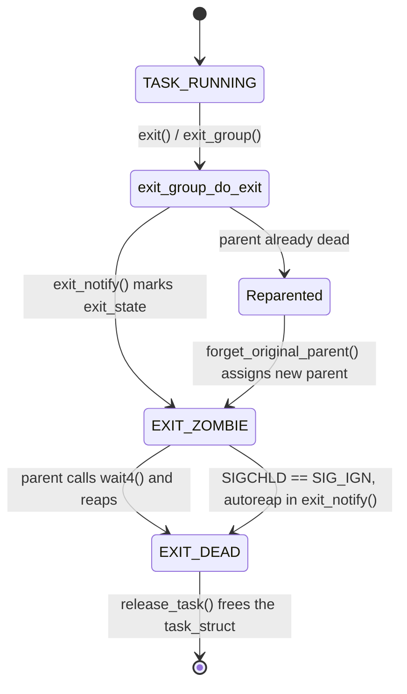

# Exit, Zombies, and Orphans

A process's exit status has to survive the process, because POSIX gives the parent the right to ask
for it — `wait()` and its relatives — and there is no guarantee the parent has asked yet, or ever will,
by the instant the child actually finishes running. The kernel's answer to "keep the status around for a
question that hasn't been asked" is to keep a corpse: no memory, no address space, no open files, no
usable resources of any kind — just enough of a `task_struct` left standing to answer one question,
correctly, whenever the parent gets around to asking it.

## What `exit()` releases immediately

A task calling `exit_group()` (the glibc-level `exit()` you write ends up here for a multi-threaded
process; `kernel/exit.c`'s `do_exit()` is the underlying path either way) releases almost everything it
holds well before it becomes a zombie, and the *order* matters — it is exactly why a process can already
be showing `Z` in `ps` while every byte of its memory has already been given back to the system. Read
directly out of `do_exit()` at v6.18, the release sequence is: signal-related bookkeeping first
(`exit_signals()`, which sets the `PF_EXITING` flag other code checks to know not to touch this task
anymore), then the address space (`exit_mm()`), then System V IPC attachments (`exit_sem()`,
`exit_shm()`), then the open-file-descriptor table (`exit_files()`), then namespaces
(`exit_task_namespaces()`), and only after all of that does `exit_notify()` run — the function that
actually marks the task a zombie. By the time a task is visible as `Z`, its address space is gone, its
file descriptors are closed, its POSIX timers are canceled — there is nothing left to reclaim from it
except the shell that remains.

## What it cannot release

Three things persist past `exit_notify()`: the `task_struct` itself (reduced, but not freed), the PID
(kept alive via `struct pid`'s own refcount specifically so a concurrent `waitpid()` can still name it),
and the exit status (the code or signal the process died from). Say the actual cost plainly, because the
word "zombie" invites exaggeration: a zombie occupies a few kilobytes of kernel memory and one slot in
the PID space. It does not hold memory in any quantity that matters, has no threads, and consumes no CPU
time.

The real problem thousands of zombies cause is not memory — it is PID exhaustion. The PID space is
finite (`/proc/sys/kernel/pid_max`, commonly 4194304 on a 64-bit system but frequently configured much
lower), and every zombie is holding one PID that cannot be reused until it is reaped. A parent that leaks
zombies fast enough — a process-pool server that forks constantly and never calls `wait()` — can run the
counter dry, at which point `fork()` itself starts failing for *every* process on the system, not just
the buggy one. A handful of zombies is cosmetic; a systemic failure to reap is an availability incident.

## What actually happens

Here is a parent that forks a child, and the child exits immediately while the parent never calls
`wait()`:

```c
#include <stdio.h>
#include <unistd.h>
#include <sys/types.h>

int main(void) {
    pid_t pid = fork();
    if (pid == 0) {
        _exit(0);                 /* child: exit immediately */
    } else {
        printf("parent %d, child %d, sleeping without wait()\n", getpid(), pid);
        fflush(stdout);
        sleep(20);                /* parent: never reaps */
    }
    return 0;
}
```

Compiled and run in this environment (`gcc -O0 -o zombie zombie.c && ./zombie &`), `ps` shows the child
sitting in `Z` state for the full twenty seconds the parent sleeps:

```text
$ ps aux | grep zombie
dev        14603  0.0  0.0   2776  1892 ?        SN   01:47   0:00 ./zombie
dev        14605  0.0  0.0      0     0 ?        ZN   01:47   0:00 [zombie] <defunct>
```

Real, captured output — not invented. The child (PID 14605) shows `STAT` `ZN`: `Z` for zombie,
`N` for a positive nice value inherited from the parent's shell. Its `RSS` and `VSZ` columns both read
`0` — no memory is charged to it — and its command name is rewritten in brackets with the `<defunct>`
marker, the kernel's own way of telling `ps` "this is a name, not a running program." When the parent
(PID 14603) was killed, the reparented zombie was immediately reaped by its new parent, confirming there
was nothing further holding it beyond the parent's neglect:

```text
$ kill -9 14603
$ ps -eo pid,ppid,stat,comm | grep -E "14603|14605"
(no output — both gone)
```

There are exactly two correct fixes, and one common wrong one. The first correct fix is to install a
`SIGCHLD` handler that calls `wait()` or `waitpid()` (typically in a loop with `WNOHANG`, to drain
however many children exited at once) — reaping happens as a side effect of the handler running. The
second, Linux- and POSIX-standardized but far less known, is to explicitly set `SIGCHLD`'s disposition to
`SIG_IGN`:

```c
signal(SIGCHLD, SIG_IGN);
```

This is not "ignore the notification and hope for the best" — it is a documented instruction to the
kernel meaning "auto-reap my children the instant they exit; I am not going to ask for their exit
status." `exit_notify()` checks exactly this at the moment a child would become a zombie and, when the
parent's disposition says so, sets `exit_state` straight to `EXIT_DEAD` and calls `release_task()`
inline — the zombie state is skipped entirely rather than created and then cleaned up.

The fix that does not work, and needs to be said plainly because the instinct is so natural: **you cannot
kill a zombie.** `kill -9` delivers a signal to a running process so it can be acted on; a zombie has
already exited; there is no execution left to interrupt, no pending-signal check that will ever run, no
handler to invoke. `kill -9 <zombie-pid>` either fails (`ESRCH`, if the PID has already been fully
reclaimed) or silently sets a pending bit on a `task_struct` that will never again reach a return-to-user
checkpoint to act on it. The bug is never in the zombie. It is always in the parent, and the fix is
always in the parent.

## Reparenting

When a parent dies before its children do, those children do not become unowned — every process must
have a parent for `wait()` bookkeeping to make sense. `forget_original_parent()`
(`kernel/exit.c`) walks the dying task's children and reparents each one via `find_child_reaper()`, which
picks a new parent by a specific rule: the nearest ancestor that has marked itself with
`prctl(PR_SET_CHILD_SUBREAPER, 1)`, or, if none exists in the child's PID namespace, PID 1 of that
namespace.

Subreapers exist because PID 1 being the sole fallback was too coarse for how modern systems are
structured. A session manager, an init system's service supervisor, or a container runtime often wants
to inherit its *own* orphans rather than have them silently vanish into the system's real PID 1, where
diagnosing "who orphaned this" becomes much harder. `PR_SET_CHILD_SUBREAPER` lets any process opt in to
that role for its own descendant tree without being PID 1 itself.

## Why PID 1 must reap

Every orphan a system produces ends up, eventually, parented to some `task_struct` that must call
`wait()` on it — and if no subreaper claims that duty, that `task_struct` is PID 1. This is a genuine
obligation, not a formality: a PID 1 that never calls `wait()` accumulates every orphan the system ever
produces, each holding its small `task_struct` and its PID slot, for as long as the system runs. This is
exactly the bug people hit when they run an ordinary application binary directly as a container's PID 1
— the application was never written to reap children it does not know it has, and every process the
container spawns and abandons becomes a permanent zombie under it. The duty a container's actual init
process (prose reference only — the design and responsibilities of that process belong to the container
and orchestration material later in this documentation) exists to take on is precisely this one.

## Orphaned process groups and `SIGHUP`

One more piece completes the picture of what happens when a controlling process disappears. When the
process that led a foreground process group exits — a shell, when its controlling terminal is closed —
and that exit leaves the group "orphaned" (no member has a parent left in the same session), the kernel
sends `SIGHUP` to every stopped member of that group, and this is exactly why closing a terminal
window kills whatever job was running in it, and exactly why `nohup` (which sets `SIGHUP`'s disposition
to `SIG_IGN` before running the command) and `setsid` (which detaches the command into its own new
session entirely, so the terminal closing never touches it) are the two standard ways to keep a
long-running job alive past its terminal's lifetime.

## Misconceptions

1. **"Zombies leak memory."** A zombie holds a PID slot and a small `task_struct` remnant — its memory
   was already released before it became a zombie at all. The real resource pressure is PID exhaustion,
   not memory.
2. **"You can `kill -9` a zombie."** There is nothing left to signal — a zombie is not executing and
   never will again. The correct target for a signal is the *parent*, to make it call `wait()`.
3. **"Orphans become zombies."** The opposite: orphans are reparented (to a subreaper or PID 1) and, by
   convention, promptly reaped by whatever process takes them on. An orphan that lingers as a zombie
   means its *new* parent is also failing to reap — the same bug, one level up.



*The two ways a task's remains are cleaned up: the parent asks, or the parent dies and someone else
inherits the duty.*

<KernelFacts
  structure={[["struct task_struct", "include/linux/sched.h"], ["struct pid", "include/linux/pid.h"]]}
  path="exit_group() → do_exit() → exit_mm() → exit_files() → exit_notify() → EXIT_ZOMBIE → parent wait4() → release_task()"
  observe="ps -eo pid,ppid,stat,comm | awk '$3 ~ /Z/'"
  trap="A zombie is not a stuck process, it is a receipt. The bug is always in the parent, and the fix is always in the parent." />

## References

- [`wait(2)`](https://man7.org/linux/man-pages/man2/wait.2.html) — the reaping interface, including the
  `SIGCHLD`-to-`SIG_IGN` auto-reap behavior, which is Linux-specific and rarely known.
- [`prctl(2)`](https://man7.org/linux/man-pages/man2/prctl.2.html), the `PR_SET_CHILD_SUBREAPER` section
  — the mechanism that made container init processes practical.
- <Src file="kernel/exit.c" symbol="do_exit" /> — the release order, read in the order it actually
  happens; verified at v6.18 to run `exit_signals()` → `exit_mm()` → `exit_sem()`/`exit_shm()` →
  `exit_files()` → `exit_task_namespaces()` → `exit_notify()`.
- <Src file="kernel/exit.c" symbol="exit_notify" /> and <Src file="kernel/exit.c" symbol="release_task" />
  — the zombie-creation and reaping functions themselves; `exit_notify()` is also where the `SIGCHLD ==
  SIG_IGN` autoreap fast path (skipping `EXIT_ZOMBIE` and going straight to `EXIT_DEAD`) actually lives.
- [`credentials(7)`](https://man7.org/linux/man-pages/man7/credentials.7.html) and
  [`setsid(2)`](https://man7.org/linux/man-pages/man2/setsid.2.html) — for the process-group and
  `SIGHUP` section above.
