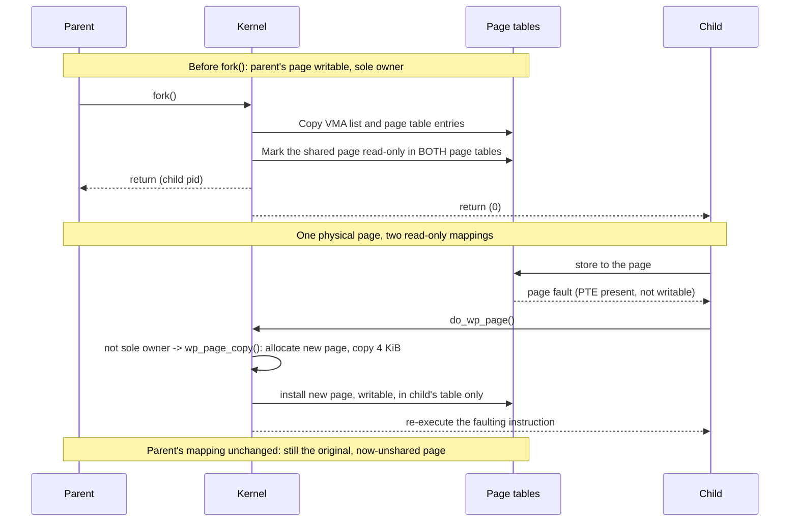

# `fork()` and Copy-on-Write

`fork()`'s contract sounds absurd the moment you say it out loud: duplicate this entire process,
including its ten gigabytes of memory, its open files, and every byte on its stack and heap — and return
in microseconds, to both copies, as if nothing had happened. No real duplication of ten gigabytes
happens in microseconds on any hardware that exists. `fork()` keeps its promise by duplicating almost
nothing and lying convincingly about the rest, and the lie is maintained entirely by the MMU: both
processes are handed page tables that point at the *same* physical pages, marked read-only, and the
kernel only makes good on "your own private copy" for a page at the exact moment either process tries to
write to it.

[The previous page](./threads-are-tasks.md) established that `fork()` is `kernel_clone()` with none of
the sharing flags set — every pointer that a `pthread_create()` would share instead gets a fresh,
independent object. This page is about what "fresh, independent object" actually costs, and it turns out
the honest answer is "surprisingly little, followed by a bill that arrives later, one page at a time."

## What is genuinely copied

Not every fresh object is created equal — some are copied byte-for-byte, some are new containers around
shared underlying resources, and knowing which is which is the difference between reasoning about
`fork()` correctly and not:

| Object | Copied or shared | Refcounted |
|---|---|---|
| `task_struct` | New struct, copied from parent's, then given its own `pid` and scheduling state | No — one per task |
| Kernel stack | Freshly allocated, not copied (the child starts executing at `kernel_clone()`'s return, not mid-parent-stack) | No |
| `mm_struct` | New struct; its VMA list is walked and copied entry-by-entry (`dup_mmap()`) | Yes — `mm_users`/`mm_count` |
| Page tables | New tables, populated to mirror the parent's mappings | No — one set per `mm_struct` |
| File-descriptor **table** | New table, one slot per parent slot | Yes — the table itself (`files_struct`) |
| Each open `struct file` the table points at | **Not copied** — both tables' slots point at the identical `struct file` | Yes — `file->f_count` |
| Credentials (`struct cred`) | Not copied — pointer shared, `struct cred` is immutable once installed | Yes — `cred->usage` |
| Signal handler table (`sighand`) | New struct, copied (this is what makes `fork()`, unlike `pthread_create()`, give the child its own `sighand`) | No — `fork()` never shares it |

The pattern repeating down that table is the same one the previous page named: some fields become "point
at the same object, plus a reference" and others become "allocate a new object and copy into it," and
which happens is fixed by what the object *is*, not by a flag `fork()` gets to choose — `fork()` always
takes the "no sharing" branch of every flag `clone()` exposes. The one row worth dwelling on is the
file-descriptor table: fd 3 in the child is a *different slot* in a *different table* than fd 3 in the
parent, but both slots point at the same `struct file`, which is why the child inherits the parent's
current file offset and closing fd 3 in one process does not close it in the other — the table forked,
the open file did not.

## What is not copied: the pages

The VMA list and the page tables in that first table are both real, honest copies — but a copied page
table entry does not mean a copied page. After `fork()`, the parent's and child's page tables contain
**the same physical frame numbers** for every private writable mapping (anonymous memory, and
`MAP_PRIVATE` file mappings), and the kernel changes exactly one thing about those entries during the
copy: it clears the writable bit in *both* copies of the PTE, in both address spaces, even though the
parent's mapping was writable a moment before `fork()` ran.

This is the entire mechanism, stated precisely: **copy-on-write is a page-table operation, not a memory
operation.** No page of actual data moves during `fork()`. What moves is a bit, flipped twice (once per
address space), converting "the only owner, writable" into "one of two owners, temporarily read-only in
both." The physical page itself does not know it has two owners; the page tables do, and the reference
count on the underlying page (or, since folios, the folio) is what lets the kernel tell "shared, don't
free on unmap" apart from "sole owner, free freely."

## What actually happens: the first write after a fork

Consider the instant a store instruction executes in either process — say the child, since that is the
more common case — against a page that `fork()` marked read-only:

1. The MMU walks the page table, finds a valid, present, but **not writable** PTE, and raises a page
   fault. This looks identical, at the hardware level, to a genuine protection violation.
2. The fault handler reaches `do_wp_page()`, the specific handler for "write fault, PTE says
   present-but-read-only." At v6.18 `do_wp_page()` first checks whether the fault is on a shared mapping
   (handled by `wp_page_shared()`/`wp_pfn_shared()` — not this page's concern) and, for a private
   anonymous mapping, whether the current process is already the page's *sole* owner
   (`PageAnonExclusive()`, or `wp_can_reuse_anon_folio()`) — if so, it just flips the PTE back to
   writable in place via `wp_page_reuse()` and returns, no copy needed at all. That fast path exists
   because a page can end up read-only for reasons other than a live COW sibling (a `fork()`'d parent
   that has since exited, for instance, releasing its reference), and `do_wp_page()` is careful not to
   copy when copying isn't actually necessary.
3. When a copy genuinely is necessary — a second process (the other side of the `fork()`) really does
   still hold a reference — `do_wp_page()` calls `wp_page_copy()`, which allocates a new page, copies the
   old folio's 4 KiB of content into it, and installs the new page at that PTE, now writable and exclusive
   to the faulting process. The other side's PTE is untouched — it still points at the original page, and
   the reference count that page carried drops by one.
4. The instruction that faulted is re-executed from the top. This time the PTE is present and writable,
   the store succeeds, and the process never sees anything except a single instruction that took
   unusually long.

:::note Brief drift, corrected against the pinned tree
Earlier notes on this section described `do_wp_page()` as a single self-contained function that "sees the
page is COW... and copies it." At v6.18, `do_wp_page()` is a short dispatcher: it distinguishes the
shared-mapping case, the already-exclusive-owner fast path (`wp_page_reuse()`, no copy), and the genuine
copy-needed case, which it hands to `wp_page_copy()` to actually perform. The three-way split — and the
`PageAnonExclusive()`/folio-based ownership check specifically — is the post-folio reorganisation the
brief for this page flagged as worth re-verifying; the call names above (`do_wp_page`, `wp_page_reuse`,
`wp_page_copy`) were read directly out of `mm/memory.c` at the pinned tag, not reconstructed from memory.
:::

The two-cost consequence is the entire point of this section: `fork()` is cheap, and **the first write to
each page afterward costs a page fault plus a 4 KiB copy.** A process that forks once and then writes
across most of its address space has not avoided the cost of duplicating its memory — it has deferred
that cost and spread it out one fault at a time. This is exactly why fork-heavy servers (the classic
pre-fork worker-pool model) show unexplained minor-fault storms in profiling: every worker, right after
being born, pays for its own copy of every page it touches, one page fault at a time, and a profiler that
only samples CPU time can miss where that time is going because each individual fault is fast — it is the
*count* of them that adds up.

## Why fork of a 10 GB process can still fail

Copy-on-write means `fork()` doesn't copy data, but it does not mean `fork()` does zero work
proportional to the parent's size. Two things scale with address-space size, and a third can refuse the
operation outright:

- **The VMA list is walked and copied, one `vm_area_struct` per mapping**, in `dup_mmap()`. A process
  with a few large mappings pays almost nothing here; a process with tens of thousands of small mappings
  (common in some allocators and in heavily `mmap()`-based database engines) pays a real, linear cost.
- **The page tables themselves are copied**, not shared, and for a large, densely populated address space
  that is real CPU time and real additional memory — a multi-level page table has entries proportional to
  how much of the address space is actually mapped, and `dup_mmap()` walks and populates every level.
- **Overcommit accounting can refuse the fork outright.** Even though no new physical pages are allocated
  yet, the kernel's memory accounting (governed by `vm.overcommit_memory`) may have to reserve *worst-case*
  address space for the child — the case where every private page ends up written and copied — and if the
  system's accounting says that reservation cannot be honored, `fork()` returns `ENOMEM` before a single
  page fault has happened. A process can be, in the everyday sense, "using" 10 GB comfortably and still
  fail to `fork()` if overcommit accounting judges the worst case unaffordable. Folder 08's
  [demand paging and copy-on-write](../08-memory-management/demand-paging-and-cow.md) page covers that
  accounting in the depth it deserves; this page only needs you to know the refusal exists and where it
  comes from.

## `vfork` and `posix_spawn`

`vfork()` is `fork()` with `CLONE_VFORK | CLONE_VM` set, which — as [the previous
page](./threads-are-tasks.md#clone-is-the-real-primitive) already established from the syscall
definitions directly — means the child shares the parent's actual address space (not a copy-on-write
mirror of it; the *same* `mm`) and the parent is suspended until the child either execs or exits. That is
a sharp tool: it is correct only because the child is expected to do nothing except immediately call
`exec()` or `_exit()`, since anything else the child does (including returning from the function that
called `vfork()`) corrupts the parent's still-shared stack and heap out from under it. `vfork()` exists
because on hardware with no MMU at all, `fork()` cannot work — there is no page table to mark read-only,
so copy-on-write has nothing to attach to, and the *only* way to spawn a new program is to share the
address space outright and immediately overwrite it with `exec()`.

`posix_spawn()` is the interface you should actually reach for when the goal is "run this other program,"
rather than `fork()` followed by `exec()`. On Linux, glibc's `posix_spawn()` is implemented, in the common
case, as exactly the `clone(CLONE_VFORK | CLONE_VM, ...)` plus `exec()` pattern described above, done
correctly and without exposing the sharp edges of `vfork()` to the caller — no live parent stack for the
child to corrupt, because glibc's implementation is careful about what it does in that narrow shared-`mm`
window before the exec.

## fork and threads do not mix well

`fork()` in a multi-threaded process only clones the calling thread — every other thread in the process
simply does not exist in the child; there is no `task_struct` for it, and it never runs there. The trap
is what "does not exist" does *not* mean: any lock those other threads were holding at the moment of
`fork()` — a `malloc()` arena lock mid-allocation, a `printf()` buffer lock mid-flush, a mutex inside a
library the program didn't even know was threaded — is still marked held in the child's copy of that lock,
forever, because the thread that would eventually unlock it does not exist in the child to do so. The
child is not merely missing some threads; it can be holding locks with no possible owner, which is a
programmatic deadlock waiting for the first unlucky code path to touch that lock.

This is why `fork()` in a threaded program is safe only when the child calls one of the `exec()` family
immediately — replacing the entire address space, locks included, before anything can touch the
inherited mess. `pthread_atfork()` exists to register handlers that run before and after a `fork()`
specifically to release and reacquire locks around the fork point, but it is not a real fix: it requires
every lock in every library linked into the process to register a correct set of atfork handlers, and in
practice most third-party libraries do not. The safe rule in a threaded program remains "fork, then exec,
immediately, and do nothing else in between."

<Lab host="any-linux" title="Watch copy-on-write happen" time="15 min">

A small C program makes the whole mechanism visible without any kernel tooling: allocate 256 MiB, touch
every page once (so the pages are real, not just reserved address space), `fork()`, and have the child
write one byte per page in a loop while the parent waits.

```c
#include <stdio.h>
#include <stdlib.h>
#include <unistd.h>
#include <sys/wait.h>
#include <sys/mman.h>
#include <sys/resource.h>

#define SIZE (256UL * 1024 * 1024)
#define PAGE 4096UL

int main(void) {
    unsigned char *mem = mmap(NULL, SIZE, PROT_READ | PROT_WRITE,
                               MAP_PRIVATE | MAP_ANONYMOUS, -1, 0);
    for (unsigned long i = 0; i < SIZE; i += PAGE)
        mem[i] = 1;                       /* fault every page in, once */

    pid_t pid = fork();
    if (pid == 0) {
        for (unsigned long i = 0; i < SIZE; i += PAGE)
            mem[i] = 2;                   /* first write per page: COW fault */
        _exit(0);
    }
    int status;
    waitpid(pid, &status, 0);
    return 0;
}
```

1. Compile it (`gcc -O0 -o forker forker.c`) and run it under `/usr/bin/time -v`, which reports minor
   faults for the whole run:

   ```text
   $ /usr/bin/time -v ./forker
   Minor (reclaiming a frame) page faults: 131187
   ```

   256 MiB at 4 KiB/page is 65,536 pages. The parent's initial touch loop faults each of those in once
   (≈65,536 faults); the child's write loop then faults the *same* 65,536 pages again, one COW fault per
   page, for a combined total of ≈131,072 — the measured 131,187 is that number plus a few hundred faults
   from process and libc startup, not a discrepancy.

2. Instrument the program itself (via `getrusage(RUSAGE_SELF, …)` and `/proc/self/status`) to separate
   parent from child, rather than guessing from the combined total above:

   ```text
   parent (pre-fork, after touching all pages)              minor faults: 65613
   child  (immediately post-fork, before any write)          minor faults: 24
   child  (after writing one byte per page)                  minor faults: 65561
   ```

   The child's fault count rises by 65,537 across its write loop — one fault per page touched, exactly as
   the mechanism predicts, and starting from a near-zero baseline (24 faults from its own post-fork setup,
   not the parent's memory).

3. **`ps -o rss` alone will not show what you expect.** Plain RSS counts pages *resident in physical
   memory and mapped by this process*, and it does not distinguish "resident because this process owns it
   privately" from "resident because this process shares it with another." Right after the fork, both
   parent and child already report essentially the same, large RSS (~263 MB here) — the pages are shared,
   not absent — and RSS barely changes as the child's writes convert those shared pages into private ones,
   because the *count* of resident pages this process maps is the same either way. What actually reveals
   copy-on-write is `Pss` (proportional set size, from `/proc/<pid>/smaps_rollup`), which *does* divide a
   shared page's cost between its owners:

   ```text
   parent, pre-fork:                       Pss: 262497 kB   (sole owner, full cost)
   child, immediately post-fork:           Pss: 131217 kB   (shared: half the cost, on paper)
   child, after writing every page:        Pss: 262294 kB   (private again: full cost, on paper)
   ```

   That dip-then-recovery in `Pss` — halved the instant the pages become shared, back to full size the
   instant they stop being shared — *is* copy-on-write made visible in a single number. RSS cannot show
   it; PSS can.

**If it fails:** the exact fault counts above depend on transparent huge pages (THP) being out of the
picture. This machine's default THP mode is `madvise` (visible in
`/sys/kernel/mm/transparent_hugepage/enabled`), meaning a plain `mmap()` like the one above does *not*
get huge pages unless the program explicitly opts in with `madvise(mem, SIZE, MADV_HUGEPAGE)`. Adding
that one call to the program above and re-running it drops the parent's initial-touch fault count from
~65,613 to **205** — roughly 320× fewer faults, because each fault now populates a 2 MiB huge page instead
of a 4 KiB page, which is the "512× smaller" effect the THP setting produces (the measured ratio here is
somewhat below the theoretical 512× because a few 4 KiB pages remain at the unaligned ends of the
mapping). Interestingly, the *child's* write-loop fault count barely changes with `MADV_HUGEPAGE`
(65,560 versus 65,561 without it) — on this kernel, a write fault against a COW-shared transparent huge
page still resolves at 4 KiB granularity rather than copying the whole 2 MiB folio at once, so THP speeds
up the initial population but does not change the cost of the COW write storm itself. Folder 08's
[hugepages and THP](../08-memory-management/hugepages-and-thp.md) page covers the mechanism this
observation is a symptom of. This machine has no root access in this environment, so the system-wide THP
default (`always`/`madvise`/`never`) could not be toggled; both runs above used the same `madvise` system
default, with THP requested per-mapping via `MADV_HUGEPAGE` only in the second run.

</Lab>



*One page, from shared-and-read-only at fork to privately writable after the first store.*

<KernelFacts
  structure={[["struct mm_struct", "include/linux/mm_types.h"], ["struct kernel_clone_args", "include/linux/sched/task.h"]]}
  path="fork() → kernel_clone() → copy_process() → copy_mm() → dup_mm() → dup_mmap() → [first write] → page fault → do_wp_page() → wp_page_copy()"
  observe="/usr/bin/time -v ./forker 2>&1 | grep -i 'minor'"
  trap="Copy-on-write does not make fork() free, it makes it deferred. The cost reappears as a minor fault and a 4 KiB copy on the first write to each page, and for a process that forks and then writes widely, deferred is not the same as cheaper." />

## References

- [`fork(2)`](https://man7.org/linux/man-pages/man2/fork.2.html) and
  [`clone(2)`](https://man7.org/linux/man-pages/man2/clone.2.html) — the interface and the exact list of
  what is and is not inherited, which is longer than anyone remembers on the first read.
- <Src file="kernel/fork.c" symbol="copy_process" /> — the whole of `fork()` in one readable function,
  with each `copy_*` helper (`copy_mm`, `copy_files`, `copy_sighand`, `copy_creds`, and the rest) named
  and called in sequence.
- <Src file="mm/memory.c" symbol="do_wp_page" /> — the write-fault dispatcher this page leans on most
  heavily; read it alongside `wp_page_reuse` and `wp_page_copy` immediately below it in the same file.
- [`posix_spawn(3)`](https://man7.org/linux/man-pages/man3/posix_spawn.3.html) — the interface that exists
  because `fork()` + `exec()` is, in practice, a bad primitive for the common case of "just run this other
  program."
- LWN, [*"Making the fork() of threaded programs safer"*](https://lwn.net/Articles/779751/) (2019, ahead
  of the pinned v6.18 tree) — the `pthread_atfork()` problem and why the kernel and glibc communities have
  repeatedly tried and failed to make `fork()` in threaded programs fully safe by default.
