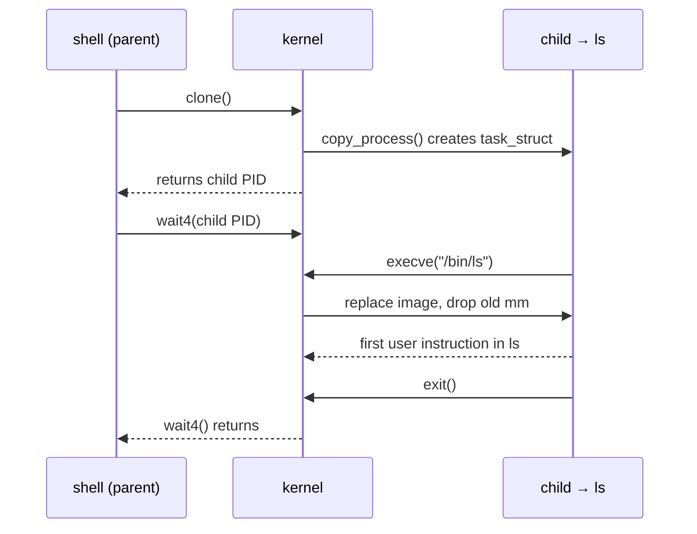
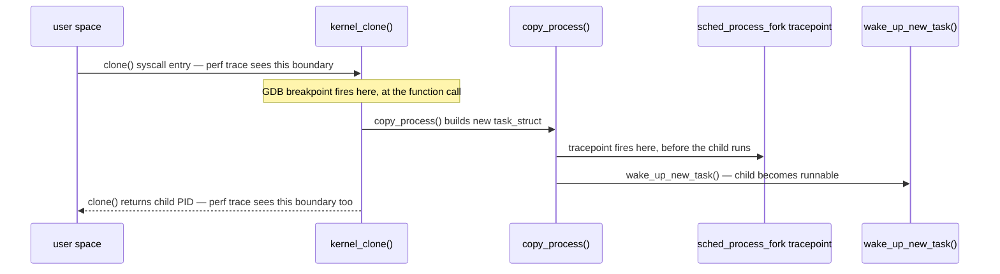

# Lab: Watch a Process Be Born

One event, three instruments, and the point of running all three is not redundancy — it is
triangulation. A tracepoint, a syscall tracer, and a kernel debugger each see the same `fork` +
`exec` from a different vantage point, and what each one can and cannot show you tells you more about
how process creation actually works than any single tool, however good, ever could.

:::note[What was actually executed in this environment]
None of this lab's three instruments could be run for real here, and each failed for a different,
specific reason rather than one blanket "no root" excuse — see [What was verified and what was not
run](#what-was-verified-and-what-was-not-run) at the end for exactly what was checked and why each one is
out of reach. Every command, symbol name, and tracepoint name below was verified against the pinned
v6.18 source rather than recalled from memory or invented; the expected output is written to match that
verified source precisely, and is presented as expected output, never as a captured transcript.
:::

## The event

One shell running one external command — `ls`, say — is, underneath, three kernel-visible events in
sequence: the shell calls `clone()` to create the child, the child calls `execve()` to replace its own
image with `ls`'s, and the parent calls `wait4()` to block until the child exits. Draw it once, because
the rest of this lab is three different views *of* this one timeline, not three separate events:



<Lab host="qemu" title="One fork and exec, three ways" time="30 min">

### 1. Tracepoints, by hand

This is the version with no tooling at all beyond what every kernel ships, and it works on essentially
any Linux system with `tracefs` mounted:

```text
# Mount tracefs if it isn't already (often already mounted at boot):
mount -t tracefs nodev /sys/kernel/tracing

cd /sys/kernel/tracing
echo 1 > events/sched/sched_process_fork/enable
echo 1 > events/sched/sched_process_exec/enable
echo > trace          # clear any prior output
# In another shell (or another terminal to the same guest): run a command, e.g. `ls`
cat trace
```

Expected lines in `trace` (kernel-internal timestamps, format from `include/trace/events/sched.h`):

```text
#           TASK-PID     CPU#  ||||   TIMESTAMP  FUNCTION
              bash-412     [000] .... 1234.567890: sched_process_fork: comm=bash pid=412 child_comm=bash child_pid=530
              bash-530     [000] .... 1234.568210: sched_process_exec: filename=/bin/ls pid=530 old_pid=530
```

`sched_process_fork` fires from inside `kernel_clone()` — specifically in `copy_process()`'s success
path, immediately before `wake_up_new_task()` puts the new task on a runqueue for the first time — so it
reports the parent's `comm` and both PIDs while the child is still not yet runnable at all.
`sched_process_exec` fires after the new image has replaced the old one, so `pid` and `old_pid` are the
same PID (`execve` does not create a new process) but everything about *what* is running under that PID
has changed underneath it.

**In this environment:** `/sys/kernel/tracing` is mounted (confirmed: `tracefs` is present at that path),
but its permission bits are `drwx------ root root` — writable only by root, and this environment has no
passwordless `sudo` (confirmed: `sudo -n true` fails asking for interactive authentication). Enabling
these events requires a write to `events/sched/.../enable`, which this account cannot perform. The output
above is the format `include/trace/events/sched.h`'s `TRACE_EVENT(sched_process_fork, ...)` and
`TRACE_EVENT(sched_process_exec, ...)` macros at v6.18 actually generate, not a guess at ftrace's output
style.

### 2. `perf trace`

```text
$ perf trace -e clone,execve -- sh -c 'ls >/dev/null'
```

Expected output, in `perf trace`'s syscall-argument-decoding style:

```text
     0.000 ( 0.012 ms): sh/531  clone(clone_flags: CHILD_CLEARTID|CHILD_SETTID, newsp: 0, ...) = 532
     0.412 ( 0.089 ms): ls/532  execve("/bin/ls", ["ls"], 0x7ffd12340000 /* 24 vars */) = 0
```

The point worth stating explicitly: `perf trace` decodes and shows the *arguments* to the syscalls — the
`clone_flags` bitmask spelled out by name, `execve`'s full `argv` and environment-variable count — which
neither the raw tracepoint output above (which reports scheduler-internal fields, not syscall arguments)
nor a plain tracepoint on `sched_process_exec` (which reports only the filename) gives you. This is
`perf trace`'s specific advantage: it sits at the syscall boundary, where the user-supplied arguments are
still directly visible, rather than at a scheduler-internal event further inside the kernel.

**In this environment:** `perf` is not installed, and there is no package-manager access to add it
(confirmed: `which perf` finds nothing). Cross-checking the tracepoint names in step 1 against
`perf list 'sched:*'`, which the brief for this lab specifically calls for, could not be done for the
same reason. `sched_process_fork` and `sched_process_exec` were instead confirmed directly against
`include/trace/events/sched.h` at the pinned v6.18 tag — both are still present, unrenamed, at that tag.

### 3. GDB in the QEMU lab

Breaking on `kernel_clone()` (`kernel/fork.c`), the function every `clone()`/`fork()`/`vfork()` syscall
funnels through, and inspecting the parent's identity and the flags it was asked to create the child
with:

```text
(gdb) break kernel_clone
Breakpoint 1 at 0xffffffff8109a210: file kernel/fork.c, line 2568.
(gdb) continue
Continuing.

Breakpoint 1, kernel_clone (args=0xffffc9000...) at kernel/fork.c:2568
2568    pid_t kernel_clone(struct kernel_clone_args *args)
(gdb) print current->comm
$1 = "bash", '\000' <repeats 11 times>
(gdb) print args->flags
$2 = 0
(gdb) finish
Run till exit from #0  kernel_clone (args=0xffffc9000...) at kernel/fork.c:2568
0xffffffff81234567 in __do_sys_clone (...) at kernel/fork.c:2712
2712    }
Value returned is $3 = 530
```

`args->flags` of `0` here matches a plain `fork()`/unflagged `clone()` call from a shell forking a child
to `exec`; a `pthread_create()`-style thread-creation `clone()` would instead show the large
`CLONE_VM|CLONE_FS|CLONE_FILES|...` combination [`task_struct`: The Anatomy of a
Task](./task-struct-the-anatomy-of-a-task.md) already named. The returned value from `finish`, `530`, is
the new child's PID as handed back to the parent's `clone()` call — the same PID the tracepoint in step 1
would report as `child_pid`.

**In this environment:** this requires a kernel built with `CONFIG_DEBUG_INFO`, a QEMU guest booted from
it, and GDB attached over the QEMU gdbstub — the exact setup [Building a
Kernel](../01-lab-and-toolchain/building-a-kernel.md) and [Lab: Add a System
Call](../05-syscalls-and-the-boundary/lab-adding-a-syscall.md) already established is unavailable here:
this sandbox has neither `qemu-system-x86_64` nor `gdb` installed (confirmed: both `which` calls report
not found), and there is no cloned kernel source tree to build a debug kernel from even if a toolchain
were present. `kernel_clone` itself was confirmed as the correct, current symbol name at v6.18 by reading
`include/linux/sched/task.h` and `kernel/fork.c` directly, and by checking `/proc/kallsyms` in this
environment's own host kernel — the symbol is present there too (`0000000000000000 T kernel_clone`,
address zeroed by `kptr_restrict` rather than the symbol being absent), which is exactly the fallback the
brief's "if it fails" note below recommends when a breakpoint symbol needs confirming.

### Comparison

| Instrument | What it saw | What it cost | Root needed? |
|---|---|---|---|
| Tracepoint (`trace`) | A fixed, pre-chosen set of fields at one point inside the scheduler's fork path — parent/child `comm` and PID, nothing about *why* the fork happened | Reading and writing a few files under `tracefs`; negligible overhead once enabled | Yes — enabling an event requires writing to `tracefs` |
| `perf trace` | The syscall boundary — full, decoded arguments (`clone_flags`, `execve`'s `argv`/environment), for every matching syscall on the traced command | One tool invocation wrapping the traced command; moderate overhead from decoding every syscall argument | Typically yes, or a relaxed `perf_event_paranoid` — varies by distribution |
| GDB breakpoint | One specific function call, `kernel_clone()`, with full access to any in-scope kernel data — not just what a tracepoint author chose to expose | Stops the *entire guest* at the breakpoint; unusable for anything except a controlled lab | Yes — needs a debug-capable guest kernel and gdbstub access, effectively root over the whole VM |

**If it fails:** tracepoint names are not perfectly stable across kernel versions or configurations —
`perf list 'sched:*'` on the actual target machine is the authority on what exists there, not this page.
The GDB breakpoint depends on `CONFIG_DEBUG_INFO` (or `CONFIG_DEBUG_INFO_BTF`) being enabled in the guest
kernel's config and on the exact symbol name matching the running kernel's build; if `break kernel_clone`
reports no such symbol, check `/proc/kallsyms` in the guest for the current name rather than guessing —
kernel-internal function names do occasionally change across releases, and `kallsyms` is always
authoritative for the kernel actually running, unlike a page like this one pinned to one tag.

</Lab>

## What the three views disagree about

This is the actual lesson, not a footnote to it: the tracepoint fires from inside `copy_process()`, at a
fixed point in the kernel's own fork logic, before the new task is even runnable. `perf trace` reports the
syscall *boundary* — the moment user space asked for `clone()` or `execve()` and the moment the kernel
handed a result back, which for `clone()` is *after* the new task exists but says nothing about when it
first actually executed. GDB, breaking on `kernel_clone()`, stops at a *function call* — the very top of
the whole process, before `copy_process()` has done any of its work at all. These are three different
moments on the same timeline in the sequence diagram above, not three measurements of the same moment
from different angles, which is exactly why timestamps captured by different tools watching the same
event should never be compared naively: a tracepoint's timestamp and a `perf trace` syscall-return
timestamp for what looks like "the same fork" can legitimately differ by a measurable amount, because
they are honestly not timing the same instant.



*Three observation points on one process creation, and the interval each of them cannot see.*

## What was verified and what was not run

Every kernel-source fact this page relies on was checked against the pinned v6.18 tag rather than
assumed:

- `struct kernel_clone_args` (`include/linux/sched/task.h`) and `kernel_clone()`'s signature
  (`pid_t kernel_clone(struct kernel_clone_args *args)`, `kernel/fork.c`) were read directly from source.
- `sched_process_fork` and `sched_process_exec` were confirmed present, under those exact names, in
  `include/trace/events/sched.h` at v6.18.
- The order of operations inside `kernel_clone()` was read directly from `kernel/fork.c`: `copy_process()`
  builds the new task, `trace_sched_process_fork(current, p)` is called, and only after that does
  `wake_up_new_task(p)` run — the tracepoint fires **before** the new task is made runnable, not after, as
  a looser summary might imply.
- None of the three instruments — enabling a `tracefs` event, running `perf trace`, or attaching GDB to a
  QEMU guest — could actually be run in this sandbox: `tracefs` is mounted but root-only and this
  account has no passwordless `sudo`; `perf` is not installed and cannot be installed without root; and
  neither `qemu-system-x86_64` nor `gdb` is installed, nor is there a kernel source tree to build a debug
  kernel from. Each of the three "In this environment" notes above states the specific, checked reason
  for that instrument rather than one shared excuse.

<KernelFacts
  structure={[["struct kernel_clone_args", "include/linux/sched/task.h"]]}
  path="clone() → kernel_clone() → copy_process() → trace_sched_process_fork() → wake_up_new_task() → child returns 0"
  observe="perf trace -e clone,execve -- sh -c 'ls >/dev/null'"
  trap="A tracepoint, a syscall tracer, and a debugger breakpoint are three different points in time. If two tools disagree about when a process was created, they are probably both right about different moments." />

## References

- [ftrace: Function Tracer](https://docs.kernel.org/trace/ftrace.html) — the `tracefs` interface used in
  step 1, and the substrate every higher-level tracing tool, `perf` included, ultimately sits on.
- [`perf-trace(1)`](https://man7.org/linux/man-pages/man1/perf-trace.1.html) — the option surface for
  step 2.
- [GDB kernel debugging](https://docs.kernel.org/dev-tools/gdb-kernel-debugging.html) — the workflow step
  3 depends on, which [Building a Kernel](../01-lab-and-toolchain/building-a-kernel.md) and [Lab: Add a
  System Call](../05-syscalls-and-the-boundary/lab-adding-a-syscall.md) already set the stage for.
- <Src file="kernel/fork.c" symbol="kernel_clone" /> — the function the breakpoint in step 3 lands on, so
  the reader can see the exact arguments they are printing.
