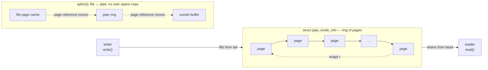

# Pipes, FIFOs, and UNIX Sockets

Every operating systems course spends a lecture on System V message queues and semaphores, and almost no
running system uses either. What actually carries local IPC on a modern Linux machine — the shell
pipeline you type without thinking, the socket pair a container runtime opens to talk to its shim, the
UNIX-domain socket every database and message broker listens on instead of TCP on loopback — is, at the
kernel level, one idea wearing three names. A pipe is a ring of pages. A FIFO is the same ring with a
name in the filesystem. A UNIX-domain socket is the same ring's sibling, stream- or datagram-shaped, with
credentials and file descriptors riding along. This page is that one idea, and the three costumes it
wears.

## A pipe is a ring of pages

The mental model "a pipe is a byte stream sitting in a buffer" is close enough for user-space code and
wrong in exactly the way that matters for understanding `splice`. A pipe's kernel object,
`struct pipe_inode_info` (`include/linux/pipe_fs_i.h`), holds no single buffer at all — it holds
`bufs`, a circular array of `struct pipe_buffer` entries, each one a reference to a full page, plus a
`head` and `tail` marking the range currently holding data. Writing to a pipe does not append bytes into
a shared byte array; it claims free slots in this ring and copies data into whichever pages back them.
Reading advances `tail` past pages that have been fully drained. The ring's capacity is `ring_size`
buffers — `PIPE_DEF_BUFFERS` is 16 at v6.18, and at a page each that is the familiar default pipe
capacity of 64 KiB. `fcntl(fd, F_SETPIPE_SZ, n)` can grow or shrink that ring per-pipe, up to a ceiling
the system administrator sets in `/proc/sys/fs/pipe-max-size`.

That a pipe's contents live in ordinary, individually addressable pages — not in a buffer that only the
pipe implementation knows how to slice — is not an implementation detail to skip past. It is the entire
reason `splice` and `tee` (below) can exist as zero-copy operations at all: moving data out of a pipe can
mean moving *page references*, because the pages were never anything but a ring of page references to
begin with.

## Blocking, `PIPE_BUF`, and atomicity

`write()` to a pipe blocks when the ring is full and there is a reader still attached; `read()` blocks
when the ring is empty and a writer is still attached. Neither call spins — both go through the ordinary
wait-queue mechanism [Process States and Wait Queues](./process-states-and-wait-queues.md) already
covered, sleeping on the pipe's own `rd_wait`/`wr_wait` queues until the other end moves.

Atomicity is the sharper fact and the one that actually changes how you write code: POSIX guarantees that
a `write()` of `PIPE_BUF` bytes or fewer to a pipe is atomic with respect to other writers — either the
whole write lands as one contiguous run in the pipe, or (if there is not currently room) it blocks and
waits for room, but it never interleaves with another process's simultaneous write partway through.
`PIPE_BUF` is 4096 bytes on Linux, a number chosen specifically to be large enough to cover a typical
line of log output while staying small enough to guarantee headroom in even a shrunk pipe. A write past
`PIPE_BUF` carries no such guarantee — the kernel is free to interleave it with another writer's data at
page granularity, since satisfying it may require multiple trips through the wait queue while other
writers get scheduled in between. This single number is the entire reason several processes can log to
one pipe (or one FIFO) concatenated by line and never see garbled output, provided every writer keeps
each write under 4096 bytes — and the entire reason the same pattern silently corrupts once a writer
starts emitting longer lines.

## `SIGPIPE`, and the error nobody expects

Writing to a pipe whose read end has been closed does not return an error by default. It delivers
`SIGPIPE` to the writing process, and `SIGPIPE`'s default disposition is to terminate the process — not
print a message, not set `errno` and return, terminate it, silently, with no traceback pointing at the
`write()` call that triggered it. This is, by a wide margin, the single most common surprise anyone
writing pipe- or socket-based code hits, usually in production, usually intermittently, because it only
happens the moment the reader on the other end goes away — a shell pipeline's downstream command exiting
early (`yes | head -1`, the classic case, which is `SIGPIPE`-killing `yes` on purpose, silently, every
time it runs), a client disconnecting mid-response, a subprocess dying under load.

There are exactly two correct responses:

1. **`signal(SIGPIPE, SIG_IGN)`, then check for `EPIPE`.** Ignoring `SIGPIPE` turns the failed write back
   into an ordinary syscall failure: `write()` returns `-1` and sets `errno` to `EPIPE`, which is
   information a program can act on instead of dying on. This is the right default for almost any program
   that writes to pipes it did not create and cannot control the lifetime of.
2. **`send(fd, buf, len, MSG_NOSIGNAL)`**, on a socket specifically — the per-call equivalent of ignoring
   `SIGPIPE`, without changing process-wide signal disposition (which matters if some other part of the
   same process legitimately wants `SIGPIPE`'s default behavior for a different file descriptor).

A program that never sets either up is one disappearing reader away from dying with no error message at
all — worth checking for explicitly in any long-running process that writes to a pipe or a socket it does
not fully control.

## FIFOs

A FIFO (`mkfifo(1)`, or `mknod` with `S_IFIFO`) is exactly the object above with one addition: a name in
the filesystem. `open()`ing that name does not open a regular file — the VFS recognizes the special
mode bit and hands back a pipe endpoint, backed by the identical `pipe_inode_info` machinery already
described. The behavior that actually surprises people writing shell scripts is the open call itself:
**opening a FIFO for reading blocks until a writer opens the other end, and opening for writing blocks
until a reader does**, unless `O_NONBLOCK` is given. A script that does `cat myfifo &` in the background
and then, thirty seconds later, writes to `myfifo` in the foreground was never doing anything but waiting
at that `open()` call the entire thirty seconds — nothing was read, nothing failed, the reader was simply
parked exactly where the pipe-open contract says it should be.

## `splice`, `tee`, and zero copy

`splice(2)` moves data between a pipe and something else — a file, a socket, another pipe — without
copying it through a user-space buffer. `sendfile()`, the older and narrower interface most people learn
first, is really a `splice`-shaped special case restricted to file-to-socket. `tee(2)` duplicates data
from one pipe into another without consuming it from the source. Both work for exactly the structural
reason the first section of this page insists on: a pipe already holds its data as a ring of page
references rather than an opaque buffer, so `splice` between a pipe and a file can, under the right
conditions, simply reassign which structure owns a reference to the same physical page — no `read()` into
user space, no `write()` back out of it.

Say the honest limit plainly, because "zero copy" invites overclaiming: `splice` avoids the copy *to and
from user space*. It does not universally avoid every copy in the kernel — moving between two pipes, or
between a pipe and certain file types, may still require a page-level copy internally, and the underlying
filesystem or device still has to move the bytes across whatever the actual I/O boundary is. The win is
real and large for big transfers — a multi-gigabyte file relayed through a proxy process — and
negligible, sometimes even a net loss from the extra syscall overhead, for anything a handful of
kilobytes or smaller. `splice` is a tool for volume, not a universal replacement for `read`/`write`.

## UNIX-domain sockets

A UNIX-domain socket is created with the same `socket(2)`/`bind()`/`listen()`/`accept()`/`connect()` API
as a TCP socket, in address family `AF_UNIX` instead of `AF_INET`, and it supports the same three socket
types the API generally offers: `SOCK_STREAM` (a reliable, ordered byte stream — the local analog of TCP),
`SOCK_DGRAM` (unreliable, message-boundary-preserving — the local analog of UDP, except that on `AF_UNIX`
delivery is in practice reliable and ordered between two endpoints, since there is no network to drop or
reorder packets), and `SOCK_SEQPACKET` (reliable and ordered *and* message-boundary-preserving, a
combination TCP cannot offer and that D-Bus and a number of other IPC protocols use for exactly that
reason).

Two capabilities set UNIX-domain sockets apart from a TCP socket bound to loopback:

- **Credential passing.** `getsockopt(fd, SOL_SOCKET, SO_PEERCRED, ...)` returns the connecting process's
  real PID, UID, and GID, verified by the kernel at connect time — not asserted by the peer and not
  spoofable by anything short of already having the privilege the credential implies. A service listening
  on a UNIX socket can authenticate its caller from the kernel's own bookkeeping instead of an
  application-layer handshake.
- **Filesystem permissions as access control.** A UNIX socket bound to a path is a filesystem object with
  ordinary owner/group/mode bits; who may even attempt to `connect()` is decided by the same permission
  check every other file access goes through, before any application-level authentication runs at all.

This is why almost every local service that is not explicitly a network service — D-Bus, container
runtime daemons (`dockerd`, `containerd`), most embedded database sockets (PostgreSQL's default local
socket, Redis's optional UNIX socket) — listens on a UNIX-domain socket rather than TCP against
`127.0.0.1`: no protocol-stack overhead for traffic that never leaves the machine, filesystem permissions
as a first access-control layer for free, and credential passing an application-layer protocol over TCP
would have to reinvent badly.

## Passing a file descriptor

`SCM_RIGHTS` is ancillary ("control") data attached to a message sent over a UNIX-domain socket, and it
does something no other IPC mechanism on this page can: it transfers an open file descriptor to another,
unrelated process. What actually crosses the socket is not a number and not a copy of the underlying
file — the kernel installs a new file descriptor in the receiving process's descriptor table that points
at the exact same underlying `struct file` the sender's descriptor pointed at, sharing its file offset,
its open flags, everything a `dup()`'d descriptor within one process would share. Two processes with no
`fork()` relationship end up holding descriptors to the identical open file object.

This is the section that makes the whole page worth reading for someone who already thinks they know
pipes: `SCM_RIGHTS` is the mechanism underneath a surprising amount of infrastructure most engineers use
daily without knowing it depends on this. `systemd` socket activation hands a bound, already-listening
socket to a service process at startup this way. Container runtimes pass a namespace file descriptor or a
pre-opened terminal across the process boundary this way. Privilege-separated daemons — a small,
privileged helper that opens a resource requiring root and then hands the open descriptor to an
unprivileged worker that never itself held that privilege — depend on `SCM_RIGHTS` specifically because
it lets the *capability* (an open file) cross a process boundary that a *credential* (root) is
deliberately never allowed to cross.

## What about System V IPC

System V message queues, semaphores, and shared memory (`msgget`, `semget`, `shmget`) exist, have their
own kernel-managed namespace of integer keys (inspectable with `ipcs`, removable with `ipcrm`), and their
own lifetime model — a System V IPC object outlives every process that created it, persisting until
explicitly removed or the system reboots, unlike a pipe, which disappears the moment its last file
descriptor closes. That persistent, process-independent lifetime is exactly why System V IPC has its own
namespace type — `CLONE_NEWIPC` — separate from every other kind of namespace: isolating a container's
view of these objects means giving it its own key space, not just restricting what it can see in one that
is shared. New code should not reach for System V IPC regardless — POSIX message queues
(`mq_open`, backed by a small in-kernel filesystem rather than the System V key namespace) and the pipes
and sockets this page covers handle essentially every case System V IPC was designed for, with clearer
lifetime semantics and, for message queues and sockets, a file-descriptor-based interface that integrates
with `poll`/`epoll` — something the System V primitives were never designed to support.



*A pipe is a ring of pages, which is why `splice` can move data through it without copying it.*

A small piece of live evidence for the "ring of page references" idea, rather than "an opaque buffer":
holding the read end of an anonymous pipe shows up in `/proc/PID/fd` as a symlink naming the pipe's inode,
not a regular file:

```text
$ sleep 3 | cat &
$ ls -l /proc/$(pgrep -n cat)/fd
total 0
lr-x------ 1 dev dev 64 Sep  8 02:03 0 -> pipe:[128587]
l-wx------ 1 dev dev 64 Sep  8 02:03 1 -> ...
l-wx------ 1 dev dev 64 Sep  8 02:03 2 -> ...
```

`pipe:[128587]` is the pipe's inode number — there is no path, because an anonymous pipe was never given
one; the kernel synthesizes this pseudo-path purely so tools like `lsof` and `ls -l` have something
readable to print.

<KernelFacts
  structure={[["struct pipe_inode_info", "include/linux/pipe_fs_i.h"], ["struct unix_sock", "include/net/af_unix.h"]]}
  path="write() → anon_pipe_write() → copy into a ring buffer page → wake readers → pipe read path"
  observe="ls -l /proc/self/fd && ss -xp | head"
  trap="Writing to a pipe whose reader has closed does not return an error by default — it kills your process with SIGPIPE. Every long-running program that writes to a pipe must decide about this explicitly." />

## References

- [`man 7 pipe`](https://man7.org/linux/man-pages/man7/pipe.7.html) — the buffer size, the `PIPE_BUF`
  atomicity guarantee, and the blocking rules, all in one page.
- [`man 7 unix`](https://man7.org/linux/man-pages/man7/unix.7.html) — the address forms, `SCM_RIGHTS`,
  and `SO_PEERCRED`, with worked examples.
- [`man 2 splice`](https://man7.org/linux/man-pages/man2/splice.2.html) — the zero-copy interface and its
  honest constraints (one end of the transfer must be a pipe).
- <Src file="fs/pipe.c" symbol="anon_pipe_write" /> — the ring buffer and the wakeup, in one function.
  Verified at v6.18: the write-side handler for an anonymous pipe was split off and renamed from the
  older, single `pipe_write` name — `fifo_pipe_write()` (same file) is a thin FIFO-specific wrapper that
  calls this function for the actual write.
