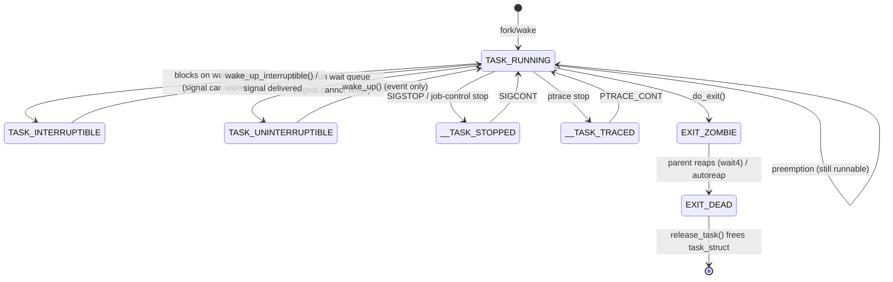

# Process States and Wait Queues

"Running" is the rarest state a task is in. Look at any real machine, at any moment, and almost every
task on it is waiting for something — a keystroke, a disk block, a lock, a timer, another process. The
kernel's central scaling trick is that a waiting task costs *nothing*: it is not polled, not checked in a
loop, not touched by the scheduler at all until the thing it is waiting for happens. The wait queue is
the mechanism that makes this possible — it is how a task arranges to be forgotten completely and then
remembered again at exactly the right moment.

## The states

[`task_struct`: The Anatomy of a Task](./task-struct-the-anatomy-of-a-task.md#the-twelve-fields-that-matter) already named
`__state` and `exit_state` as two separate fields. Here is what actually goes in each, read directly out
of `include/linux/sched.h` at v6.18:

| Constant | Value | Meaning | `ps` letter |
|---|---|---|---|
| `TASK_RUNNING` | `0x0000` | Runnable — on a CPU right now, *or* sitting on a runqueue waiting for one | `R` |
| `TASK_INTERRUPTIBLE` | `0x0001` | Sleeping; a signal can end the wait early | `S` |
| `TASK_UNINTERRUPTIBLE` | `0x0002` | Sleeping; only the thing being waited for can end it | `D` |
| `TASK_KILLABLE` | `TASK_WAKEKILL \| TASK_UNINTERRUPTIBLE` | Uninterruptible, except a fatal signal still wakes it | `D` (some `ps` variants show `K`) |
| `__TASK_STOPPED` | `0x0004` | Stopped by `SIGSTOP`/`SIGTSTP`/job control | `T` |
| `__TASK_TRACED` | `0x0008` | Stopped for a debugger (`ptrace`) | `t` |
| `EXIT_ZOMBIE` | `0x0020` | Exited; `task_struct` kept for the parent to reap | `Z` |
| `EXIT_DEAD` | `0x0010` | Being torn down, already past the point of being reaped | usually invisible — very short-lived |

Say the first row twice, because it is the single most common misreading of `ps` output:
**`TASK_RUNNING` means runnable, not running.** A task showing `R` in `ps` might be receiving cycles from
a CPU this very instant, or it might be one of forty other `R` tasks sitting on a runqueue waiting its
turn — `__state` does not distinguish the two, and can't: which runnable task is *actually* on a CPU is
the scheduler's business, covered starting in the scheduling folder that follows this one.

Two more details worth having precisely, both visible in the table's raw values: `EXIT_DEAD` is
numerically *smaller* than `EXIT_ZOMBIE` (`0x10` versus `0x20`) despite coming *after* it in a task's
life — a zombie becomes `EXIT_DEAD` only in the narrow window between the last reference being dropped
and `release_task()` actually freeing the struct, which [Exit, Zombies, and
Orphans](./exit-zombies-and-orphans.md) covers in full. And `TASK_KILLABLE` is not a fifth independent
bit pattern; it is `TASK_UNINTERRUPTIBLE` with `TASK_WAKEKILL` ORed in, which is exactly why the two look
identical to `ps` — the extra bit only changes which wakeup function is willing to touch the task, not
what a state-reporting tool sees.

## Wait queues

A wait queue is nothing more than a list — `struct wait_queue_head`, defined in `include/linux/wait.h` —
of tasks that have asked to be told when some specific thing happens: data arrives on a pipe, a lock is
released, a timer fires, an I/O request completes. Each entry on that list (`struct wait_queue_entry`)
carries a wake function, so "wake everyone on this queue" does not mean "set every task to `TASK_RUNNING`
unconditionally" — it means "call each entry's wake function and let it decide," which is what makes
exclusive waiters (only one gets woken, for the classic thundering-herd-avoidance case) possible on the
same primitive as "wake everyone."

Sleeping correctly on a wait queue is a five-step pattern, and every one of the `wait_event_*()` macros in
`include/linux/wait.h` exists to encode it so that driver and filesystem authors do not have to get it
right by hand:

```c
/* The pattern wait_event_interruptible() expands into: */
add_wait_queue(&wq_head, &entry);      /* 1. join the queue */
set_current_state(TASK_INTERRUPTIBLE); /* 2. announce intent to sleep */
while (!condition) {                   /* 3. RE-CHECK — this is not optional */
    schedule();                        /* 4. actually give up the CPU */
    set_current_state(TASK_INTERRUPTIBLE);
}
__set_current_state(TASK_RUNNING);
remove_wait_queue(&wq_head, &entry);   /* 5. leave the queue */
```

Step 3, the re-check, is the step every first implementation gets wrong, and it is not defensive
programming — it closes a real race. Between deciding "I need to wait for `condition`" and actually
being on the wait queue with your state set, the condition can become true and the waker can run,
finding no one on the queue yet to wake. Skip the re-check and that wakeup is simply lost: the waiter
joins the queue *after* the wakeup already happened and now sleeps forever, or until something unrelated
happens to wake it. This is the **lost-wakeup race**, and the reason `wait_event_interruptible()` checks
`condition` once *before* ever touching the queue and then checks it again *every time* `schedule()`
returns, rather than trusting that a return from `schedule()` means the condition is now true. Reading
the real macro's expansion (`include/linux/wait.h`, `___wait_event()`) shows the actual implementation
folds steps 1 and 2 into one call, `prepare_to_wait_event()`, which adds the entry to the queue *and*
sets the state atomically with respect to a concurrent waker — but the five-step mental model above is
exactly the contract that call is upholding.

## What actually happens

A process calls `read()` on a pipe with no data in it yet. Inside the kernel, the pipe's read path finds
its buffer empty and, rather than spin or return early, does the five-step dance against the pipe's own
`wait_queue_head`: `prepare_to_wait_event()` puts the reading task on the pipe's queue and sets its state
to `TASK_INTERRUPTIBLE`, the buffer is checked once more, and `schedule()` is called. At that instant the
task stops existing as far as the CPU is concerned — it is not on any runqueue, the scheduler will never
look at it again until something puts it back, and the CPU it was using goes to run whatever else is
runnable, or goes idle.

Some time later — a millisecond or an hour, the mechanism does not care which — a writer calls `write()`
on the other end of the pipe. Depositing data and finding the read side's wait queue non-empty, the
kernel calls `wake_up_interruptible()` on it. That walks the queue, calls each entry's wake function,
which for an ordinary sleeper sets `__state` back to `TASK_RUNNING` and places the task on a runqueue.
Nothing about the reader's own code path has moved yet — it is still sitting inside its call to
`schedule()`, which is a function call like any other, so when the scheduler eventually picks this task
again, `schedule()` simply *returns*, and the reader's code resumes exactly at the re-check in the loop
above, sees the buffer now has data, and proceeds.

The detail worth sitting with: the reader's own CPU time in this entire story is a handful of
microseconds — the syscall entry, the queue join, the `schedule()` call, the wakeup, the re-check, the
copy back to user space — regardless of whether the wait itself lasted a millisecond or an hour. Waiting
is free. Only the moments of actually running cost anything, and the wait queue is precisely the
mechanism that keeps "waiting" and "running" from being confused with each other by the scheduler,
by `top`, or by anyone reasoning about where the CPU's time went.

## Interruptible versus uninterruptible

The difference between `TASK_INTERRUPTIBLE` and `TASK_UNINTERRUPTIBLE` is exactly one thing: whether a
pending signal is allowed to end the wait early. An interruptible sleep's wake function also reacts to a
signal becoming pending, waking the task so it can unwind back to user space and handle it (typically
returning `-EINTR` or `-ERESTARTSYS` from the syscall). An uninterruptible sleep's wake function does not
— only the specific event being waited for can end it.

`TASK_UNINTERRUPTIBLE` is not an oversight or a lazy default; it exists because some waits genuinely
cannot be safely unwound partway through. A driver mid-transaction with a device, or a filesystem holding
a lock across a multi-step operation, may have no safe way to abandon the operation if a signal arrives —
there is no "undo" for a write already in flight to hardware. Choosing interruptible in that situation
would mean either corrupting state on signal delivery or ignoring the signal anyway, which is worse than
being honest about it. `TASK_KILLABLE` is the compromise this pressure produced: uninterruptible with
respect to ordinary signals, but still responsive to a fatal one (`SIGKILL`, or any signal that would
terminate the process anyway), because "unkillable except by rebooting the machine" is a worse failure
mode than the small additional complexity of checking for fatal-only wakeup. `TASK_KILLABLE` exists
specifically because too much kernel code, historically, chose plain `TASK_UNINTERRUPTIBLE` out of
caution when `TASK_KILLABLE` would have been safe and considerably friendlier.

## Why a `D`-state process cannot be killed

The common description — "it's ignoring the signal" — is wrong in a way that matters. The signal *is*
delivered to the task's pending set the moment it is sent; `kill -9` against a `D`-state process succeeds
at the syscall level and sets the bit. What does not happen is the signal being *acted on*, and the
reason is structural, not a bug: signal delivery — actually running a handler, or actually terminating
the process — happens at one specific checkpoint, the return from kernel mode to user mode. A task in
`TASK_UNINTERRUPTIBLE` is, by construction, not returning to user space; it is inside a wait whose wake
function does not check for pending signals at all (that is the entire definition of uninterruptible), so
the checkpoint where the signal would be acted on is never reached. `SIGKILL` cannot skip this — there is
no separate "force the task off the CPU right now" path, because the task correctly promised the kernel
subsystem it is waiting on (a driver, a filesystem) that it would not disappear mid-operation.

The correct response to a persistent `D` is not to keep sending signals — it is to find out *what* the
task is waiting on. Two `/proc` files are the standard tools, described here as what you would run rather
than as a captured session, since forcing a real `D`-state task on demand needs a genuinely blocked
device or filesystem operation, not something this environment can manufacture honestly:

```text
cat /proc/PID/stack     # kernel-side call stack at the point it blocked (needs CONFIG_STACKTRACE)
cat /proc/PID/wchan     # the single function name it is blocked inside
```

A persistent `D` almost always means a device or a filesystem is not responding — an unresponsive NFS
server, a failing disk, a USB device that unplugged mid-transfer — and essentially never means a bug in
the *process* itself. The process did everything correctly; something underneath it stopped answering.

## Load average counts these

`TASK_UNINTERRUPTIBLE` tasks are counted in the Linux load average alongside genuinely runnable tasks —
this is Linux-specific behavior, and it is why a machine with a hung NFS mount can show a load average of
40 with every CPU sitting at 0% utilization. Every process blocked in `D` state on the dead mount adds 1
to the load figure exactly as a CPU-bound `R` task would, even though not one of them is consuming a
cycle. This single fact resolves a confusion that recurs constantly in on-call situations, and it is worth
having ready now — the observability material later in this section builds directly on it.

## Misconceptions

1. **"`TASK_RUNNING` means the task is on a CPU."** It means runnable — eligible to run. Whether it is
   actually receiving cycles right now, this instant, is a separate question the scheduler answers, not a
   fact `__state` records.
2. **"A `D`-state process is stuck in the kernel and hung."** It is *waiting*, and in the overwhelming
   majority of cases waiting correctly. The interesting, actionable question is never "why is it hung" —
   it is "what is it waiting on," which `/proc/PID/wchan` and `/proc/PID/stack` answer directly.
3. **"Load average measures CPU usage."** It counts runnable tasks *and* uninterruptible tasks together.
   A machine can be at 0% CPU utilization with a load average of 40, and the two numbers are not even
   measuring compatible things — one counts activity, the other counts a queue length that includes
   tasks doing nothing at all.



*Every state a task can be in, and the event that moves it — with `TASK_RUNNING` covering both "on a CPU"
and "waiting for one."*

<KernelFacts
  structure={[["struct wait_queue_head", "include/linux/wait.h"], ["struct task_struct", "include/linux/sched.h"]]}
  path="read() → no data → prepare_to_wait_event() → schedule() → wake_up_interruptible() → try_to_wake_up() → runqueue"
  observe="ps -eo pid,stat,wchan:30,comm | head -20"
  trap="A task in D state is not ignoring signals; it never reaches the point where signals are acted on. Delivery happens on the return to user space, and an uninterruptible sleep is precisely a promise not to return until the wait completes." />

## References

- <Src file="include/linux/wait.h" symbol="wait_event_interruptible" /> — the macro that encodes the
  correct sleeping pattern; reading its expansion (`___wait_event()`, same file) is the fastest way to
  internalize the lost-wakeup problem, and it is where `prepare_to_wait_event()` is actually declared.
- <Src file="kernel/sched/core.c" symbol="try_to_wake_up" /> — the wakeup path a wait queue's wake
  function ultimately calls; verified at v6.18 to still carry this name.
- [Scheduler documentation](https://docs.kernel.org/scheduler/index.html) — the runqueue side of this
  story, which the scheduling folder that follows this one owns.
- [`ps(1)`](https://man7.org/linux/man-pages/man1/ps.1.html), the process-state codes section — the
  letter-to-state mapping used in the table above.
- Love, *Linux Kernel Development*, 3rd ed., ch. 4 — the classic treatment of wait queues; predates v6.18
  and some API names have shifted since (`prepare_to_wait_event()` and the `___wait_event()` macro
  internals in particular postdate it), so check each name against source before citing it directly.
