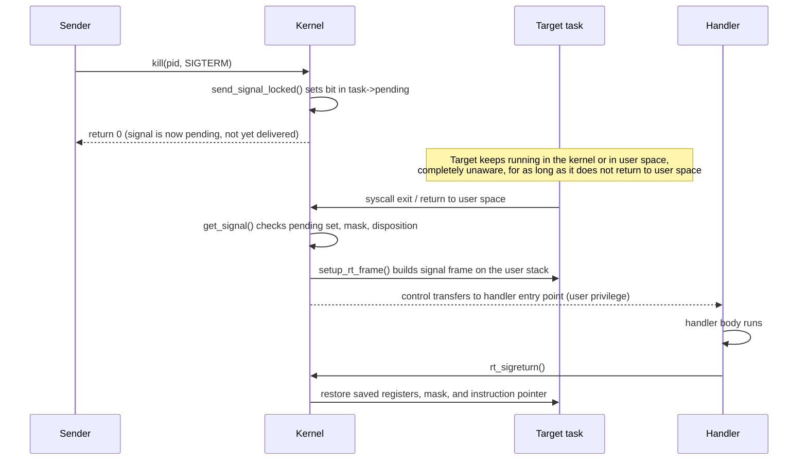

# Signals

Signals are the oldest asynchronous notification mechanism in UNIX — older than threads, older than
almost everything else covered in this section — and their semantics are shaped entirely by that
history. The single fact worth holding onto before anything else: **a signal is not a message and not an
interrupt.** It does not run code the instant it is sent, it does not carry a payload (mostly — real-time
signals are the exception, below), and the sender has essentially no control over when, or in what state,
the receiver notices it. A signal is a bit set in a task's pending mask, acted on later, at a checkpoint
the sender does not control.

## Generation, pending, delivery

Every signal misconception traces back to conflating three genuinely distinct moments:

- **Generation** is the signal being sent — `kill()`, a hardware exception like an illegal instruction, a
  terminal driver reacting to Ctrl-C, `raise()` from inside the process itself. Generation's only effect
  is setting a bit in the target's pending set (`struct sigpending`, more below).
- **Pending** is the state between generation and delivery — the bit is set, and stays set, for as long
  as the signal is blocked or the task has not yet reached a checkpoint where delivery is checked.
  Standard signals do not accumulate here: the bit is a bit, not a counter (see [Standard versus
  real-time signals](#standard-versus-real-time-signals)).
- **Delivery** is the handler actually running — or, for the default action, the process actually
  terminating, coring, stopping, or ignoring. Delivery happens at one specific checkpoint: a task's
  return from kernel mode to user mode, decided in `get_signal()` (`kernel/signal.c`).

The gap between generation and delivery can be arbitrarily large. A signal sent to a task that never
returns to user space — one blocked in `TASK_UNINTERRUPTIBLE`, covered in [Process States and Wait
Queues](./process-states-and-wait-queues.md#why-a-d-state-process-cannot-be-killed) — is generated and
pending immediately, and delivered never, for as long as the block lasts.

## What actually happens

Press Ctrl-C in a terminal running a foreground job. The terminal driver's line discipline recognizes the
interrupt character and sends `SIGINT` to the foreground process *group* — every task in it, not just one
— via the kernel's signal-sending path (`send_signal_locked()` in `kernel/signal.c`, reached through
`kill_pgrp()` for the group case). Each target task's pending set gets the `SIGINT` bit set. That is the
entirety of what happens synchronously with the keypress. Nothing else follows until each of those tasks
next returns to user space and `get_signal()` runs.

The consequences of "nothing else follows" are concrete and worth stating outright:

- A task spinning in a tight, non-preemptible kernel code path does not react to the Ctrl-C until that
  code path finishes and the task starts back toward user space.
- A task in `D` state (`TASK_UNINTERRUPTIBLE`) does not react at all, for exactly the reason [Process
  States and Wait Queues](./process-states-and-wait-queues.md#why-a-d-state-process-cannot-be-killed)
  gives — its wake function does not check for pending signals, so the return-to-user checkpoint is never
  reached.
- A task on another CPU already running user code reacts as soon as that CPU next takes an interrupt (a
  timer tick, at the latest) and the exit-to-user-space path runs `get_signal()`.

This environment has no `strace` installed (`which strace` returned nothing), so rather than fabricate a
trace, here is what `strace -f` against a self-signaling program would show, described precisely rather
than presented as a captured run: a call to `kill(getpid(), SIGTERM)` (or `tgkill()`, which is what
glibc's `raise()` actually issues) returning `0` immediately — the syscall completes as soon as the bit
is set, before any handler runs — followed, on this task's *next* syscall return or the next time it
takes a trap back to the kernel, by a `--- SIGTERM {si_signo=SIGTERM, si_code=SI_TGKILL, ...} ---` line
marking the point delivery actually happened, followed by the handler's own instructions if traced with
`-i`, and finally an `rt_sigreturn()` call the handler's return compiles down to. The gap between the
`kill()` syscall returning and the `--- SIGTERM ... ---` line is the generation-to-delivery gap made
visible — it can be zero instructions (a task about to return to user space anyway) or arbitrarily long.

## Building a handler frame

When `get_signal()` decides a signal should run a handler rather than take the default action, the kernel
does something that only makes sense once you know where it happens: it writes a signal frame onto the
**user** stack — the same stack the interrupted code was using — or onto the alternate signal stack
if the process registered one with `sigaltstack()` (the standard defense against handling a stack-overflow
signal on an already-exhausted stack). Architecture-specific code builds this — on x86-64,
`setup_rt_frame()` in `arch/x86/kernel/signal.c` dispatches to `x64_setup_rt_frame()` (or the
`ia32`/`x32` variants for compat tasks) — laying out the saved register state, the signal mask to
restore, and a return address pointed at a small trampoline. Control then returns to user space, but not
at the point it left: at the handler's entry point, running at ordinary user privilege, with the
interrupted context sitting on the stack beneath it.

When the handler returns normally, it does not simply resume the interrupted code directly — it calls
`rt_sigreturn()`, a syscall whose entire job is to read that saved frame back off the stack and restore
the exact register state, signal mask, and instruction pointer the interrupt clobbered. The security
consequence is direct: the frame `rt_sigreturn()` trusts is sitting on a stack the *user* — or an
attacker who has already achieved some memory corruption — controls. This is precisely why
`rt_sigreturn()` validates its input carefully rather than blindly restoring whatever is there, and why a
forged signal frame on a controlled stack is a known exploitation technique (sigreturn-oriented
programming, "SROP") rather than a theoretical concern.

## Standard versus real-time signals

Standard signals (`SIGINT`, `SIGTERM`, `SIGUSR1`, and the rest of the classic set below `SIGRTMIN`) carry
one bit of information — "this signal happened" — and that bit does not queue. If `SIGUSR1` is already
pending and generated again before being delivered, the second occurrence changes nothing; the pending
set has no way to represent "twice." A process using standard signals to count events (twelve widgets
processed, deliver `SIGUSR1` twelve times) will silently undercount the moment two occurrences land
before the handler runs once.

Real-time signals (`SIGRTMIN` through `SIGRTMAX`) fix both problems: they genuinely queue — multiple
pending instances of the same real-time signal are each delivered, not coalesced — and each carries an
integer or pointer value via `sigqueue()`/`rt_sigqueueinfo()`, plus they are delivered in a defined order
(lowest signal number first) rather than the unspecified order standard signals use when several are
pending at once. The practical rule: if the count matters, standard signals are the wrong tool.

## Blocking, and what cannot be blocked

Every task carries a signal mask — which signals it currently refuses to have delivered, kept pending
instead — manipulated with `sigprocmask()` (whole-process view, single-threaded) or `pthread_sigmask()`
(per-thread, the mask being genuinely per-*task* rather than shared across a thread group). Blocking a
signal does not discard it; it accumulates in the pending set (for a standard signal, still just one bit)
and is delivered the instant the mask is lifted, if it is still pending then.

Two signals cannot be blocked, caught, or ignored under any circumstances: `SIGKILL` and `SIGSTOP`. This
is enforced in the kernel itself, not by convention — `sigaction()` on either simply fails. The
consequence of the mask being per-task rather than per-process worth calling out explicitly: for a
process-directed signal (one sent to a PID rather than a specific thread), delivery goes to whichever
thread in the group has not blocked it, and if multiple threads qualify, the kernel picks one — which
thread that is is not something a program should rely on.

## Async-signal-safety

A handler can interrupt code at literally any instruction boundary — including in the middle of
`malloc()` while it holds an internal lock, or in the middle of updating a data structure another part of
the program assumes is only ever touched non-reentrantly. Calling anything from a handler that might
itself need that same lock is a deadlock the interrupted code cannot see coming and cannot defend
against. [`signal-safety(7)`](https://man7.org/linux/man-pages/man7/signal-safety.7.html) lists exactly
which library and system calls are safe to call from a handler, and the list is shorter than almost
anyone expects — most of `stdio`, `malloc`, and anything that takes a lock internally is off it.

The three patterns that actually work in practice: set a `volatile sig_atomic_t` flag and check it in the
main program's normal control flow (the handler does nothing risky at all); write a byte to a pipe
created for exactly this purpose (the "self-pipe trick") so the main event loop can `select()`/`poll()`
on it alongside everything else; or skip handlers entirely in favor of `signalfd()`, below.

## The modern alternatives

Three Linux-specific interfaces exist specifically because the classic handler model above has sharp
edges, and each fixes a different one, in one sentence apiece: `signalfd()` turns a set of signals into
a file descriptor that can be read like any other, eliminating the async-signal-safety problem entirely
because the "handler" is now just ordinary code running in a normal read loop; `pidfd_open()` turns a PID
into a stable file-descriptor reference to a specific process, closing the PID-reuse race where a signal
or a `kill()` call meant for one process lands on a different one that was assigned the same PID after
the original exited; and `pidfd_send_signal()` sends a signal through that stable reference instead of
through a PID number, so it is the correct pairing with `pidfd_open()` — together they make "signal
exactly the process I opened, or fail" an atomic guarantee a raw PID can never give.

## Misconceptions

1. **"A signal interrupts the process immediately."** It is delivered when the target next returns to
   user space — which may be a few instructions away, or may be never, if the target never returns (a
   task parked in `TASK_UNINTERRUPTIBLE`, for instance).
2. **"Signals queue."** Standard signals do not — a second occurrence while one is already pending is
   simply lost. Only real-time signals (`SIGRTMIN`–`SIGRTMAX`) queue. Counting events with standard
   signals is a bug, not an edge case.
3. **"`kill -9` always works instantly."** `SIGKILL` cannot be blocked or caught, but "cannot be blocked"
   is not "cannot be delayed" — it still cannot act on a task that has not returned to user space, which
   is exactly why `kill -9` does not free a process stuck in uninterruptible sleep.

## Signal masks, decoded from a real run

`/proc/<pid>/status` exposes a task's four signal-related masks as hex bitmasks, one bit per signal
number (bit *N*−1 for signal *N*). A small C program that blocks `SIGUSR1`, ignores `SIGUSR2`, installs a
handler for `SIGTERM`, and then raises `SIGUSR1` against itself (so it becomes pending behind the block)
produces this real, captured output in this environment:

```text
$ ./sigmask
SigQ:   2/79961
SigPnd: 0000000000000200
SigBlk: 0000000000000200
SigIgn: 0000000000000800
SigCgt: 0000000000004000
```

Decoded bit by bit, against `SIGUSR1` = 10, `SIGUSR2` = 12, `SIGTERM` = 15 on Linux/x86-64:

| Mask | Value | Bit set | Signal | Matches the program |
|---|---|---|---|---|
| `SigPnd` | `0x200` | bit 9 | signal 10 = `SIGUSR1` | raised while blocked, so it is pending |
| `SigBlk` | `0x200` | bit 9 | signal 10 = `SIGUSR1` | blocked via `sigprocmask(SIG_BLOCK, ...)` |
| `SigIgn` | `0x800` | bit 11 | signal 12 = `SIGUSR2` | set to `SIG_IGN` |
| `SigCgt` | `0x4000` | bit 14 | signal 15 = `SIGTERM` | handler installed via `sigaction()` |

Every bit matches the program's own setup exactly, which is the whole point of reading these masks:
`SigPnd` versus `SigBlk` sharing the same bit here is not a coincidence — a blocked-and-generated signal
is pending precisely because it is blocked, and clearing the block (a later `sigprocmask(SIG_UNBLOCK,
...)`) is what would move it out of `SigPnd`. For comparison, an ordinary interactive shell with no
custom handlers, traps, or blocked signals installed shows all four masks as zero:

```text
$ cat /proc/self/status | grep -E 'Sig(Pnd|Blk|Ign|Cgt)'
SigPnd: 0000000000000000
SigBlk: 0000000000000000
SigIgn: 0000000000000000
SigCgt: 0000000000000000
```



*A signal from `kill()` to the handler: three separate moments, only one of which is under the sender's
control.*

<KernelFacts
  structure={[["struct sigpending", "include/linux/signal_types.h"], ["struct k_sigaction", "include/linux/signal_types.h"]]}
  path="kill() → send_signal_locked() → set bit in task->pending → syscall exit work → get_signal() → setup_rt_frame() → handler → rt_sigreturn()"
  observe="cat /proc/self/status | grep -E 'Sig(Pnd|Blk|Ign|Cgt)'"
  trap="Signals are delivered on the return to user space, not when they are sent. A process that never returns to user space never sees them, which is why SIGKILL does not free a task stuck in an uninterruptible wait." />

## References

- [`signal(7)`](https://man7.org/linux/man-pages/man7/signal.7.html) — the master reference: the
  disposition table, the syscall-restart rules, and the standard-versus-real-time distinction.
- [`signal-safety(7)`](https://man7.org/linux/man-pages/man7/signal-safety.7.html) — the list of
  functions a handler may safely call, shorter than anyone expects.
- <Src file="kernel/signal.c" symbol="get_signal" /> — the delivery decision point, where blocked,
  ignored, and fatal are separated; verified at v6.18 to return `bool`, not `int`.
- [`signalfd(2)`](https://man7.org/linux/man-pages/man2/signalfd.2.html) and
  [`pidfd_send_signal(2)`](https://man7.org/linux/man-pages/man2/pidfd_send_signal.2.html) — the modern
  interfaces, and the specific races (async-signal-safety, PID reuse) each one closes.
