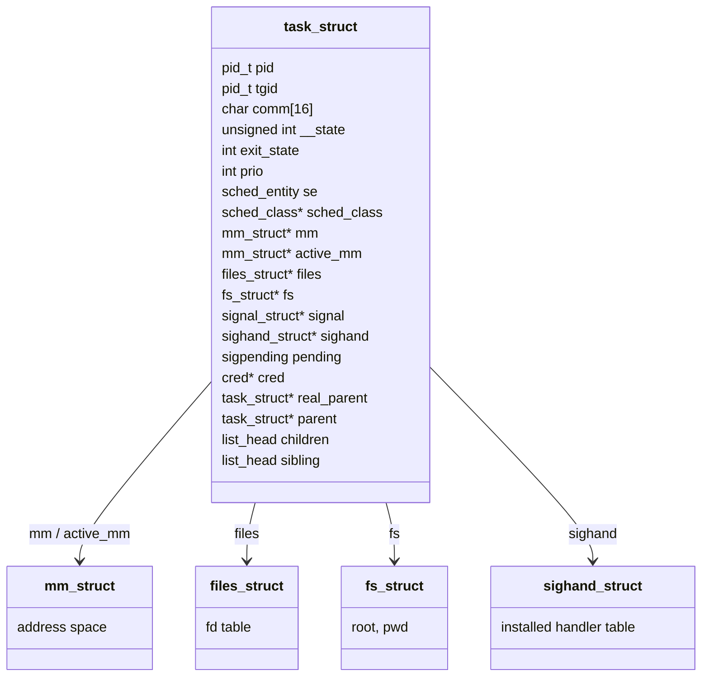

# `task_struct`: The Anatomy of a Task

The kernel's unit of scheduling — not the two hundred fields, the twelve that matter, grouped by concern.

Linux does not have a process object, a separate thread object, and a separate scheduler-entity object
bolted together. It has one structure, `struct task_struct`, allocated once per schedulable thing —
whatever "thing" turns out to be, once [Threads Are Tasks](./threads-are-tasks.md) makes the word
uncomfortably load-bearing — and everything the kernel knows about it is either a field in that struct or
reachable from it by one pointer. `task_struct` has grown to hundreds of fields not from bloat but from
necessity: memory management touches a task, so it has an `mm`; signals touch a task, so it has a
`signal`; scheduling touches a task, so it has a `sched_class`. There is nowhere else for that state to
live.

## One struct, one schedulable entity

`copy_process()` (in `kernel/fork.c`, covered in full on the next page) allocates a fresh `task_struct`
every time `fork`, `vfork`, `clone`, or `clone3` runs, and it stays allocated until the parent reaps the
task's exit status — the interval [Exit, Zombies, and Orphans](./exit-zombies-and-orphans.md) covers.
Whichever task is running on a given CPU right now is reachable through `current`, and how `current`
actually works is worth being precise about, because it trips up anyone whose mental model comes from an
older book: on x86-64, `current` is **not** a stack-walk trick that derives the task from the stack
pointer, and it is not a plain global variable either — a plain global would be wrong the instant a
second CPU is running a different task at the same time. It is a **per-CPU variable**, populated by
`current_task`, so that "the task running on CPU 3 right now" and "the task running on CPU 0 right now"
are two independent reads with nothing to synchronize. (Older x86-32 kernels really did derive `current`
by masking the stack pointer down to find a `thread_info` at the bottom of the kernel stack; x86-64
has not worked that way for a long time, which is exactly the point [Love's book gets dated
on](#references) — more below.)

## The twelve fields that matter

Grouped by concern rather than by declaration order, these are the fields worth holding in your head
before ever opening `include/linux/sched.h` and being confronted with the rest of it:

- **Identity** — `pid` (this task's own kernel PID), `tgid` (the thread-group id — what POSIX calls a
  process id, a distinction [the next page](./threads-are-tasks.md#tgid-versus-pid) exists to unpack),
  `comm` (the 16-byte executable name shown by `ps`).
- **State** — `__state` (runnability: `TASK_RUNNING`, `TASK_INTERRUPTIBLE`, and the rest — verified
  against `include/linux/sched.h` at v6.18: yes, two leading underscores, read and written only through
  `READ_ONCE`/`WRITE_ONCE`-wrapped helpers rather than directly), `exit_state` (a separate, narrower set —
  `EXIT_ZOMBIE`/`EXIT_DEAD` — that only ever applies once a task is on its way out; note the *asymmetric*
  naming, `__state` but `exit_state`, which is exactly the kind of detail worth checking against source
  rather than assuming symmetric).
- **Scheduling** — `prio` (the task's current effective priority), `se` (`struct sched_entity`, the
  scheduler's own bookkeeping — vruntime and the rest, the subject of folder 07), `sched_class` (a
  pointer to the scheduling policy's operation table — CFS, EEVDF-successor, deadline, or realtime — this
  page only names it; [the scheduler docs](https://docs.kernel.org/scheduler/index.html) own the rest).
- **Memory** — `mm` and `active_mm` (both `struct mm_struct *`; see [below](#mm-versus-active_mm) for why
  there are two).
- **Files** — `files` (`struct files_struct *`, the open-file-descriptor table) and `fs` (`struct
  fs_struct *`, the current working directory and root).
- **Signals** — `signal` (`struct signal_struct *`, shared per thread group — defined in
  `include/linux/sched/signal.h`), `sighand` (`struct sighand_struct *`, the installed handler table),
  `pending` (`struct sigpending`, this task's own — not thread-group-wide — queue of signals not yet
  delivered).
- **Credentials** — `cred` (a `const struct cred __rcu *`; there is also a separate `real_cred` field for
  the pre-setuid identity, which [Credentials and Identity](./credentials-and-identity.md) is where that
  split actually matters).
- **Relationships** — `real_parent` (the task that actually created this one), `parent` (usually the same
  task, except when a debugger has reparented this one via `ptrace`), `children` and `sibling` (both
  `struct list_head`, the intrusive links [Kernel Data Structures](../04-kernel-architecture-and-idioms/kernel-data-structures.md)
  covered — this task's list of children, and this task's link in its own parent's children list).



*The dozen `task_struct` fields worth holding in your head, and the four that are pointers to objects a
thread can share.*

## What is a pointer, and why that matters

Look again at four of the fields above: `mm`, `files`, `fs`, and `sighand` are not the memory-management
state, the file table, the filesystem context, or the signal-handler table — they are **pointers** to
those objects, and the objects themselves are separately allocated and reference-counted. That single
fact — that the "heavy" per-task state lives behind a pointer rather than embedded inline — is the entire
mechanism that makes a thread a thread instead of a process: two `task_struct`s can each hold a copy of
the same pointer value, each incrementing that target's refcount, and from that moment on they are
looking at the identical `mm_struct`, the identical `files_struct`, the identical `fs_struct`, the
identical `sighand_struct`. Nothing else has to change. [Threads Are Tasks](./threads-are-tasks.md) is,
almost in its entirety, a page about which of these four pointers `clone()`'s flags tell the kernel to
copy versus share — a page that is nearly trivial once this fact is in hand.

## `mm` versus `active_mm`

A kernel thread — `kthreadd`'s children, workqueue workers, anything that never runs user-space code —
has no address space of its own: its `mm` field is `NULL`. But the CPU still needs *some* set of page
tables loaded whenever that kernel thread runs, and switching page tables (a full TLB-affecting operation
on most architectures) on every single kernel-thread wakeup would be wasted work, since a kernel thread
never touches user-space memory anyway. The kernel's answer is `active_mm`: when a kernel thread is
scheduled in, it borrows the outgoing task's `mm` as its own `active_mm` rather than switching to no
address space at all, and the page tables are simply left alone. A normal user-space task's `mm` and
`active_mm` point at the same `mm_struct`; a kernel thread's `mm` is `NULL` while its `active_mm` borrows
whatever happened to be active a moment ago.

The visible consequence, the moment anyone actually looks: read `/proc/<pid>/maps` for a kernel thread —
`kthreadd` itself, PID 2, is the easiest to find — and it comes back empty. There is no address space to
list, because `mm` is `NULL`; `active_mm` is a scheduling optimization, never a substitute address space
for `/proc` or anything else in user-space-facing code to read.

## Where it lives, and the stack

Each task gets its own small, fixed-size kernel stack — 16&nbsp;KB on a stock x86-64 v6.18 build (32&nbsp;KB
under `CONFIG_KASAN`), exactly the `THREAD_SIZE` budget
[The Kernel Is Not C You Know](../04-kernel-architecture-and-idioms/the-kernel-c-dialect.md#the-stack-is-16-kb-and-used-to-be-8-and-that-is-all)
derives in full. That page's rules — no large stack locals, no unbounded recursion — are not academic
advice here: a deep, unreviewed call chain in a driver or filesystem is a live way to walk this specific
task's specific 16&nbsp;KB off the end and corrupt whatever memory sits past it. There is no guard page
that grows on demand the way a user-space stack has; there is only the fixed allocation and
`CONFIG_FRAME_WARN` catching what review missed.

## Finding tasks

Two structures let the kernel find a task given almost anything except a direct pointer to it. The first
is the task list itself: every `task_struct` is linked onto a global doubly-linked list via its own
embedded `list_head`, and `for_each_process()` walks it — the same intrusive-list pattern from
[Kernel Data Structures](../04-kernel-architecture-and-idioms/kernel-data-structures.md), applied to
tasks. The second is the PID hash: user-space PIDs and kernel-internal `pid_t` values are looked up
through `struct pid` (`include/linux/pid.h`), a separately-allocated, refcounted object that a
`task_struct` points at rather than embeds — the layer that lets a PID keep existing (for `waitpid` to
observe) for a moment after the task itself has become a zombie. Between the two, `for_each_process()`
plus the PID hash is exactly what the GDB helper `lx-ps` below is doing, one indirection removed.

<Lab host="qemu-gdb" title="Walk a real task_struct in GDB" time="20 min">

This lab reuses the debug setup from
[Debugging the Kernel with GDB](../01-lab-and-toolchain/debugging-the-kernel-with-gdb.md) — a lab kernel
booted with `-s -S`, `nokaslr` on the command line, and `gdb vmlinux` attached over `target remote
:1234`. If any of that setup is unfamiliar, that page derives it step by step; this lab starts from where
it leaves off.

1. **List every task.** With the guest running (after `continue` past the initial breakpoint):

   ```text
   (gdb) lx-ps
         TASK          PID    COMM
   0xffffffff82a12480     0    swapper
   0xffff888003a41cc0     1    sh
   0xffff888003a43340     2    kthreadd
   ```

   (Addresses will differ run to run with KASLR left on elsewhere; the shape is what matters.)

2. **Get the currently running task without walking the list by hand.**

   ```text
   (gdb) p $lx_current()
   $1 = (struct task_struct *) 0xffff888003a41cc0
   (gdb) p $lx_current()->comm
   $2 = "sh\000\000\000\000\000\000\000\000\000\000\000\000"
   (gdb) p $lx_current()->pid
   $3 = 1
   (gdb) p $lx_current()->tgid
   $4 = 1
   (gdb) p $lx_current()->mm
   $5 = (struct mm_struct *) 0xffff888003a4c000
   ```

3. **Follow `mm` and read a real field out of it.**

   ```text
   (gdb) p *$lx_current().mm
   $6 = {mmap_base = 140186538328064, ...}
   (gdb) p $lx_current()->mm->mmap_base
   $7 = 140186538328064
   ```

**If it fails:** `lx-ps` and `$lx_current()` are supplied by `vmlinux-gdb.py`, auto-loaded by GDB from the
`vmlinux` build directory — they require `CONFIG_GDB_SCRIPTS` to have been on for the build (it was, per
[Building a Kernel](../01-lab-and-toolchain/building-a-kernel.md#the-options-that-matter-for-a-debuggable-lab-kernel))
and, on some distributions, an `add-auto-load-safe-path` entry in `~/.gdbinit` — both covered in
[Debugging the Kernel with GDB](../01-lab-and-toolchain/debugging-the-kernel-with-gdb.md#the-in-tree-gdb-scripts).
An "undefined command" error for `lx-ps` almost always means one of those two.

:::note[What was actually run in this environment]
This is a documentation-repository worktree, not a kernel build or virtualization environment: `gdb` and
`qemu-system-x86_64` are both absent here, and there is no lab kernel with debug symbols to boot. Every
command above, its GDB helper syntax (`lx-ps`, `$lx_current()`), and every `task_struct` field name it
prints were checked directly against `include/linux/sched.h` and `include/linux/pid.h` at the pinned
v6.18 tag on GitHub, and the transcript layout matches the one already captured for real in
[Debugging the Kernel with GDB](../01-lab-and-toolchain/debugging-the-kernel-with-gdb.md#walking-a-task_struct)
(the `lx-ps` output, `$lx_current()->comm`, and `$lx_current()->pid` lines above are that page's own
verified transcript, extended here with `tgid` and `mm` — fields that page didn't need and this one does).
The `mm_struct` fields (`mmap_base`) and the exact numeric addresses are illustrative, written to be
structurally accurate, not a captured session. Nothing here was fabricated as if it were a real run; where
this page goes beyond what was actually executed, it says so plainly rather than presenting it as a
transcript.
:::

</Lab>

<KernelFacts
  structure={[["struct task_struct", "include/linux/sched.h"], ["struct pid", "include/linux/pid.h"]]}
  path="current → task_struct → mm_struct / files_struct / signal_struct / cred"
  observe="sudo cat /proc/1/status | head -20"
  trap="current is not a global variable and not derived from the stack pointer on x86-64 — it is a per-CPU variable. Code that assumes there is one current is code that will break the first time it runs on a second CPU." />

## References

- <Src file="include/linux/sched.h" symbol="task_struct" /> — the definition, whose comments are the best
  available field documentation.
- [Scheduler documentation](https://docs.kernel.org/scheduler/index.html) — the authority on `se` and
  `sched_class`, which this page only names.
- Love, *Linux Kernel Development*, 3rd ed., ch. 3 — the clearest long-form treatment of the process
  descriptor available, but it predates v6.18 substantially and describes `thread_info` living on the
  kernel stack, which is not how `current` resolves on x86-64 today (see
  [One struct, one schedulable entity](#one-struct-one-schedulable-entity) above).
- [GDB kernel debugging](https://docs.kernel.org/dev-tools/gdb-kernel-debugging.html) — the in-tree GDB
  helpers this page's lab uses.
