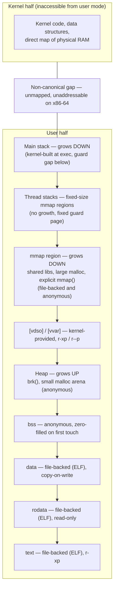

# A Process's Address Space

Every address a program uses is invented. `0x400000` in one process and `0x400000` in another refer to
two different pages of physical memory, or to no memory at all — each process has its own private mapping
from the numbers a pointer holds to the physical pages those numbers actually mean, and the mapping is
maintained entirely by the kernel and the MMU, never negotiated between processes. Roughly half of that
numeric range, on x86-64, is reserved for a kernel the process may never read, write, or even name. This
page is the *map*: what regions exist in that private numeric space, what each one is for, and how to
read the file — `/proc/PID/maps` — that lists them. [The Virtual Address Space](../08-memory-management/the-virtual-address-space.md)
is the *machinery*: how the kernel actually implements that mapping with page tables, and where the
canonical-address hole and the kernel/user split fall in the 64-bit layout. Keep the two apart as you
read — this page names regions and reads them from user space; it does not walk a page table.

## The regions

A typical process's address space is made of the pieces below, roughly in the order they get created.
None of this is hardware-mandated layout — it is a convention the kernel and the ELF loader follow, and
[`exec()` and Binary Formats](./exec-and-binary-formats.md) is where most of it gets built.

| Region | Holds | Permissions | Comes from |
|---|---|---|---|
| Text (`.text`) | The program's compiled instructions | `r-xp` | The ELF file, mapped directly, demand-paged |
| Read-only data (`.rodata`) | String literals, `const` globals, the vtables of a C++ binary | `r--p` | The ELF file |
| Data (`.data`) | Initialized global/static variables | `rw-p` | The ELF file, copy-on-write from first touch |
| BSS (`.bss`) | Zero-initialized global/static variables | `rw-p` | Anonymous, zero-filled on first touch — not actually read from the file at all |
| Heap | `malloc`'s small-allocation arena | `rw-p` | `brk()`, one contiguous region that grows/shrinks at its high end |
| The mmap region | Shared libraries, large `malloc` allocations, explicit `mmap()` calls | varies | `mmap()`, one region per mapping |
| Thread stacks | Per-thread call stacks for every thread but the first | `rw-p` | `mmap()`, ordinary anonymous regions — see [below](#the-stack-and-why-it-grows) |
| The main stack | The initial thread's call stack, argv/envp/auxv | `rw-p` | Set up by the kernel at `exec()`, labeled `[stack]` |
| `[vdso]` | A tiny kernel-provided shared object mapped executable, for syscalls the kernel can serve without a trap (`gettimeofday`, `clock_gettime`) | `r-xp` | The kernel, at `exec()` |
| `[vvar]` / `[vvar_vclock]` | Read-only kernel data the vDSO reads (time source state) | `r--p` | The kernel, at `exec()` |
| The kernel half | Every other process's memory, kernel code and data structures | inaccessible from user mode | Never mapped for user access; see [below](#where-the-kernel-half-is-and-why-you-cannot-see-it) |

## Reading `/proc/PID/maps` line by line

Every line in `maps` describes one contiguous virtual memory area. Here is a real line-for-line capture
of this line's own maps, from an ordinary Linux process (a small dynamically-linked binary) in this
environment — annotated column by column:

```text
5b3aae24c000-5b3aae33e000 r--p 00000000 08:30 1585    /usr/lib/cargo/bin/coreutils/cat
5b3aae33e000-5b3aae7f6000 r-xp 000f2000 08:30 1585    /usr/lib/cargo/bin/coreutils/cat
5b3aae7f6000-5b3aaebb5000 r--p 005aa000 08:30 1585    /usr/lib/cargo/bin/coreutils/cat
5b3aaed1a000-5b3aaed20000 rw-p 00acd000 08:30 1585    /usr/lib/cargo/bin/coreutils/cat
5b3aaed20000-5b3aaed21000 rw-p 00000000 00:00 0
5b3ab08d7000-5b3ab0919000 rw-p 00000000 00:00 0       [heap]
7cc6f9d91000-7cc6f9d95000 r--p 00000000 00:00 0       [vvar]
7cc6f9d97000-7cc6f9d99000 r-xp 00000000 00:00 0       [vdso]
7ffc8368c000-7ffc836ae000 rw-p 00000000 00:00 0       [stack]
```

Column by column, left to right:

- **Address range** — `start-end`, in hex, the half-open range `[start, end)` this VMA covers.
- **Permissions** — four characters: read, write, execute, and a fourth that is `p` (private,
  copy-on-write) or `s` (shared — writes go back to the underlying file or are visible to every other
  mapper). The same binary's text is `r-xp` in every line above: readable, executable, never writable,
  and private, because no process should ever be able to modify another process's view of the same
  code pages.
- **File offset** — where in the mapped file this VMA's first byte comes from. Four separate lines for
  the *same* binary above (`00000000`, `000f2000`, `005aa000`, `00acd000`) are the loader splitting one
  ELF file into separate VMAs per permission: text, rodata, and two data segments cannot share one VMA
  because they need different `r`/`w`/`x` bits, even though they all came from one file.
- **Device** — `major:minor` of the block device the file lives on; `00:00` for anything with no backing
  file.
- **Inode** — the file's inode number; `0` for anonymous regions.
- **Path** — the file backing this mapping, or a bracketed pseudo-name (`[heap]`, `[stack]`, `[vdso]`,
  `[vvar]`) for kernel-supplied regions, or nothing at all for an ordinary anonymous mapping (the blank
  line after the binary's four segments above — that region has no path column because it has no file
  behind it whatsoever; it is a plain `mmap(MAP_ANONYMOUS)` region, likely glibc's loader bookkeeping).

## What actually happens

`malloc(32)` and `malloc(64 * 1024 * 1024)` look identical at the call site and produce completely
different kernel activity. `strace` is not installed in this environment (`which strace` finds nothing),
so what follows is a real `/proc/self/maps` diff around each call rather than a syscall trace — the
`maps` diff already makes the point `strace` would only narrate.

A small C program called `malloc(32)`, wrote into it, then called `malloc(64 * 1024 * 1024)` and wrote
into that, dumping `/proc/self/maps` before each call and after both:

```text
===== BEFORE any malloc =====
57517b7e4000-57517b806000 rw-p 00000000 00:00 0                          [heap]
... (binary + libc + vdso + stack, unchanged throughout) ...

malloc(32) returned 0x57517b7e5910

===== AFTER malloc(32) =====
57517b7e4000-57517b806000 rw-p 00000000 00:00 0                          [heap]
... (identical to before — no new line anywhere) ...

malloc(64 MiB) returned 0x7e8f9f5ff010

===== AFTER malloc(64 MiB) =====
57517b7e4000-57517b806000 rw-p 00000000 00:00 0                          [heap]
7e8f9f5ff000-7e8fa3600000 rw-p 00000000 00:00 0        <- new: exactly 64 MiB, right before libc
... (rest unchanged) ...
```

`malloc(32)` added **nothing** to `maps` — it was carved out of the existing `[heap]` arena glibc had
already obtained from the kernel, so satisfying it took no syscall the address space would show at all.
`malloc(64 MiB)` crossed glibc's `mmap` threshold and added a brand-new anonymous VMA — `7e8f9f5ff000` to
`7e8fa3600000` is exactly `0x4000000` bytes, 64 MiB — sized precisely to the request. Neither allocation
guarantees a single physical page exists yet: a fresh `mmap` region is zero pages of RSS until something
is actually read or written, which the next lab step demonstrates directly. Allocation is a promise
recorded in the address space's bookkeeping; the address space itself is not memory.

## Private versus shared, and file-backed versus anonymous

Almost every line in `maps` falls into one of four cells:

| | File-backed | Anonymous |
|---|---|---|
| **Private** (`p`) | Program text — `r-xp` mapping of the ELF file, copy-on-write if ever written | A heap page, or the `malloc(64 MiB)` region above — `rw-p`, no file, private to this process |
| **Shared** (`s`) | `mmap(fd, ..., MAP_SHARED)` of a real file — writes go straight to the file and are visible to every other mapper | `mmap(-1, ..., MAP_SHARED\|MAP_ANONYMOUS)` between a parent and a `fork()`ed child — a `[stack]`-less, path-less `rw-s` region both processes see the same writes through, the classic no-file IPC segment |

Private-and-anonymous and private-and-file-backed cover the overwhelming majority of a normal process's
`maps`; the shared cells show up specifically for memory-mapped I/O and for parent/child shared memory
that was set up deliberately, not as a side effect of `fork()` itself (an ordinary `fork()`'s copy-on-write
pages are private, not shared — see [`fork()` and Copy-on-Write](./fork-and-copy-on-write.md)).

## The stack, and why it grows

The main thread's stack — the one labeled `[stack]` — is set up by the kernel at `exec()` time with a
**guard gap** below it: an unmapped range that exists purely so a stack overflow faults instead of
silently colliding with whatever `mmap()` happened to place just below it. Historically this was backed
by `VM_GROWSDOWN`, a VMA flag telling the fault handler "extend this mapping downward on a fault just
below it, up to `RLIMIT_STACK`," rather than "this address is simply unmapped." `RLIMIT_STACK` (`ulimit
-s`, typically 8 MiB by default) is the ceiling that growth stops at; hit it and the process gets a
`SIGSEGV` that unwinding cannot recover from, because there is no further room to grow into.

Per-thread stacks — every thread but the first — are **not** special in this sense. `pthread_create()`
picks a fixed size up front (`pthread_attr_getstacksize`, 8 MiB by default on most distributions) and
`mmap()`s an ordinary anonymous region of exactly that size; there is no growable guard region behind it,
only a small fixed guard page glibc places at one end to catch an overflow with `SIGSEGV` rather than
silent corruption of the next thread's stack. The asymmetry is a direct consequence of when each stack is
created: the kernel builds the main stack once, at `exec()`, before it knows how deep the call chain will
ever go, so it needs room to negotiate. `pthread_create()` runs after the program is already executing and
can simply be told a size.

## Where the kernel half is, and why you cannot see it

`maps` never shows anything above a certain address, and that is not a filtering decision `/proc` makes —
there is genuinely nothing there *for this process*. The top half of the 64-bit canonical range is
reserved for kernel code, kernel data structures, and the direct map of physical RAM, and while the
kernel's own page tables describe that half in full, no user-mode page-table entry for it is ever
installed as accessible from this process's `mm`. Attempting to dereference an address up there from user
mode faults exactly the same way a wild pointer into unmapped space would; the kernel-half addresses
aren't secret, they are simply not present in a form user mode can touch. The exact numeric split, the
canonical-address hole in between, and what KASLR moves around at boot are [The Virtual Address
Space](../08-memory-management/the-virtual-address-space.md)'s subject, not this page's.

## `smaps`, briefly

`/proc/PID/maps` tells you a region exists; `/proc/PID/smaps` breaks each region down further, one block
of fields per VMA, the same address-range line as `maps` followed by measurements. The fields this page
names without interpreting — the measurement page in folder 08 builds the actual reasoning about them —
are:

- **`Rss`** — resident set size: physical pages of *this* mapping currently in RAM, whether or not they're
  shared with another process.
- **`Pss`** — proportional set size: `Rss` with shared pages divided by the number of processes sharing
  them, so summing `Pss` across every mapping (or every process) doesn't double-count shared memory.
- **`Private_Dirty`** — pages modified and not shared with any other mapping; the pages that are
  genuinely this process's own and would need to be written back or discarded, never simply dropped as a
  clean duplicate.
- **`Swap`** — pages of this mapping currently swapped out rather than resident.

All four are confirmed present, under exactly these names, in a real `/proc/self/smaps` read in this
environment (see the lab below) and in the kernel's own `/proc` filesystem documentation for v6.18.

<Lab host="any-linux" title="Read your own address space" time="15 min">

1. **Read your own `maps`.**

   ```text
   $ cat /proc/self/maps
   ```

   Every line is `cat`'s own address space at the moment it read the file: its own text/rodata/data
   segments (four lines, one per ELF segment, same file, different offsets — see the annotated example
   above), `[heap]`, libc and its dependencies, `[vvar]`, `[vvar_vclock]`, `[vdso]`, and `[stack]`. No two
   runs will show identical addresses if ASLR is on, but the *shape* — same count and order of regions —
   is stable.

2. **mmap 1 GiB and watch `maps` grow by exactly one line.** A small C program calling
   `mmap(NULL, 1<<30, PROT_READ|PROT_WRITE, MAP_PRIVATE|MAP_ANONYMOUS, -1, 0)` and dumping `maps` before
   and after, captured for real in this environment:

   ```text
   ===== AFTER mmap, before touch =====
   ...
   71905ac00000-71909ac00000 rw-p 00000000 00:00 0
   71909ac00000-71909ac28000 r--p 00000000 08:30 13647   /usr/lib/x86_64-linux-gnu/libc.so.6
   ...
   ```

   `71909ac00000 - 71905ac00000 = 0x40000000` — exactly 1 GiB (`1024^3` bytes) — added as one new
   anonymous, private, `rw-p` VMA, wedged in wherever the kernel's mmap placement chose to put it (here,
   directly below libc). One `mmap()` call, one new line.

3. **Touch one page and watch `Rss` move, not `Size`.** Same region's `/proc/self/smaps` block, before
   and after writing a single byte at the start of the mapping:

   ```text
   ----- BEFORE touching any page -----
   71905ac00000-71909ac00000 rw-p 00000000 00:00 0
   Size:            1048576 kB
   Rss:                   0 kB
   Pss:                   0 kB
   Private_Dirty:         0 kB
   Anonymous:             0 kB
   Swap:                  0 kB

   ----- AFTER touching one page -----
   71905ac00000-71909ac00000 rw-p 00000000 00:00 0
   Size:            1048576 kB
   Rss:                   4 kB
   Pss:                   4 kB
   Private_Dirty:         4 kB
   Anonymous:             4 kB
   Swap:                  0 kB
   ```

   `Size` (the VMA's full 1 GiB span) never changes — it is a property of the mapping's address range, not
   of anything physical. `Rss` moves from `0 kB` to exactly `4 kB`, one page, the moment the first byte is
   written: a 1 GiB mapping cost one physical page, because that's all that was ever touched.

4. **`smaps_rollup` for the process-wide totals**, captured for real:

   ```text
   $ cat /proc/self/smaps_rollup
   5e36e096d000-7ffe2de70000 ---p 00000000 00:00 0                          [rollup]
   Rss:                7380 kB
   Pss:                5654 kB
   Pss_Dirty:          1312 kB
   Pss_Anon:           1312 kB
   Pss_File:           4342 kB
   Shared_Clean:       2180 kB
   Private_Clean:      3888 kB
   Private_Dirty:      1312 kB
   Referenced:         7380 kB
   Anonymous:          1312 kB
   Swap:                  0 kB
   ```

   `smaps_rollup` sums every VMA's fields in one pass without walking and printing each region
   individually — the address range shown (`[rollup]`) is a placeholder spanning the whole address space,
   not a real mapping.

**If it fails:** `smaps_rollup` needs a reasonably modern kernel (added in 4.14); on an older kernel, sum
the per-VMA `smaps` fields by hand. Reading another process's `maps` or `smaps` (`/proc/<other-pid>/maps`)
requires either matching credentials (same UID) or `CAP_SYS_PTRACE` — without one of those, the read
returns `EACCES` even though the file appears to exist.

</Lab>



*One x86-64 process's address space, with the direction each region grows and where each region came
from.*

<KernelFacts
  structure={[["struct mm_struct", "include/linux/mm_types.h"], ["struct vm_area_struct", "include/linux/mm_types.h"]]}
  path="malloc() → brk() or mmap() → new VMA in mm->mm_mt → no physical page until first touch"
  observe="cat /proc/self/maps && cat /proc/self/smaps_rollup"
  trap="The address space is a set of promises, not memory. A 1 GB mapping in maps may be backed by zero physical pages, which is why VSZ tells you nothing about memory use." />

## References

- `man 5 proc`, the `/proc/PID/maps` and `smaps` sections — the field-by-field authority for everything
  on this page.
- `man 2 mmap` — the flag combinations behind every line in `maps`, especially `MAP_PRIVATE` versus
  `MAP_SHARED`.
- [`/proc` filesystem documentation](https://docs.kernel.org/filesystems/proc.html) — the kernel's own
  description of `maps` and `smaps`, including every field name confirmed against v6.18 for this page
  (`Rss`, `Pss`, `Private_Dirty`, `Swap`, and `smaps_rollup`'s summary fields all still current).
- <Src file="fs/proc/task_mmu.c" symbol="show_map_vma" /> — verified against the v6.18 source: `maps`'
  seq_file `.show` callback (`show_map`) is a one-line wrapper that calls `show_map_vma()` to actually
  format each line; `show_map_vma()` remains the correct symbol to point at for "what generates this
  file" at v6.18.
