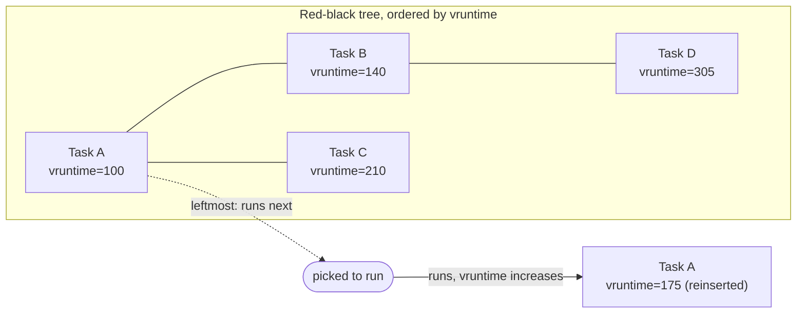

# CFS and Virtual Runtime

The pinned kernel for this section, v6.18, does not run CFS as its fair-class scheduler — it runs
EEVDF, the subject of the [next page](./eevdf.md). So why does a replaced scheduler get a page of its
own? Because CFS ran Linux for fifteen years, from 2.6.23 in 2007 until EEVDF began replacing it in 6.6
(2023), and its vocabulary — vruntime, the red-black tree, nice-to-weight — is still in every tool,
every article, and a good fraction of the mental model most people bring to this subject. More to the
point: EEVDF is not a rewrite from nothing. It is a direct response to specific things CFS could not
express, and that response only makes sense if you know what it was responding to. This page is that
context, and it is written explicitly *as* history — not as documentation of the code your kernel runs.

## The idea

Imagine a CPU that could do the impossible: run every runnable task at once, each at `1/N` of full
speed, where `N` is the number of runnable tasks. Nobody waits, nobody is starved, and every task
progresses at a rate exactly proportional to its share. That machine doesn't exist — real hardware runs
one task at a time per CPU — but CFS is built to *approximate* it as closely as a single time-sliced CPU
can. The approximation strategy is simple to state: track, for every task, how much CPU time it has
received so far, scaled by how much it was entitled to, and always run whichever task is furthest behind
that ideal. Do that continuously and the schedule converges toward the same allocation the impossible
machine would have produced, averaged over a short window rather than instantaneously.

## Virtual runtime

"Scaled by how much it was entitled to" is doing the real work in that sentence, and the mechanism is
virtual runtime (`vruntime`). A task's vruntime is its actual, wall-clock execution time divided by its
scheduling weight (weight comes from `nice`, covered in full in
[Priorities, nice, and Weights](./priorities-nice-and-weights.md) once it exists). A task with double the
weight of another has its vruntime advance at half the rate for the same real CPU time — so it looks
"less far ahead" than it really is, and CFS lets it run again sooner. The task that has run the *least*,
in this weighted sense, is always the one CFS considers most behind, and therefore most deserving of the
CPU right now.

Concretely: two tasks, one at `nice 0` (weight 1024 in the kernel's fixed table) and one at `nice 5`
(weight 335), both perpetually runnable on one CPU. Real runtime accumulates vruntime at a rate
proportional to `1024/weight`, so the `nice 0` task's vruntime grows by `1024/1024 = 1×` per unit of real
time it runs, while the `nice 5` task's vruntime grows by `1024/335 ≈ 3.06×` per unit of real time *it*
runs. For CFS to keep the two tasks' vruntimes advancing together — which is the condition it is always
steering toward — the `nice 0` task must be given roughly 3.06 times as much real CPU time as the
`nice 5` task in any given interval. That ratio, not "5 nice levels means 5 units of anything," is what
a nice difference actually buys under CFS: a fixed multiplicative ratio of CPU share, from a weight table
that turns linear nice values into a geometric progression.

## The red-black tree

CFS needs to answer one question very fast, over and over: of every runnable task on this runqueue,
which one has the smallest vruntime? Doing that by scanning a list would be O(n) on every reschedule.
Instead, CFS keeps runnable tasks in a red-black tree ordered by vruntime — the general-purpose balanced
binary tree described in
[Kernel Data Structures](../04-kernel-architecture-and-idioms/kernel-data-structures.md) — with the
leftmost node cached separately so that "who runs next" is an O(1) lookup and insertion/removal after a
task runs or blocks is O(log n). The task actually running is not left out of the tree while it runs;
conceptually it is removed, charged with the vruntime it accumulates, and reinserted at its new
(larger) vruntime, which is why the same task rarely stays leftmost for long once it starts consuming
CPU time.

*CFS picks the leftmost node — the task with the least weighted CPU time — and reinserts it once it has
run.*

## Slices: `sched_latency` and `min_granularity`

CFS did not give every runnable task the CPU for a fixed slice length. Instead it defined a *target
scheduling period* — historically `sched_latency_ns`, defaulting to 20ms — within which every runnable
task on a CPU should ideally get at least one turn. Each task's actual slice was that period divided
proportionally by weight, so ten equal-weight runnable tasks each got roughly a 2ms slice out of a 20ms
period. Divide a fixed period among too many tasks, though, and slices shrink toward the context-switch
overhead itself, so a second tunable, `sched_min_granularity_ns` (historically 4ms, and scaled up when
the period was extended for high task counts), put a floor under how small a slice could get — beyond
that point CFS let the period stretch instead of shrinking slices further.

**These specific values and tunable names are historical.** `sched_latency_ns` and
`sched_min_granularity_ns` do not exist in `kernel/sched/fair.c` at v6.18 — a direct source check found
no occurrence of either identifier anywhere in the file. EEVDF replaced the period-and-granularity model
with a single tunable, `sysctl_sched_base_slice` (default `700000` nanoseconds, i.e. 0.7ms, confirmed by
source at v6.18), and the rest of the mechanism the next page describes. Anything below this point in
the page is describing code that no longer exists in the fair class; it is preserved because so much
existing material assumes it.

## Placement on wakeup, and the fairness leak

A task that just woke up from sleeping has an old, "stale" vruntime — if it were reinserted at that
value unchanged, and it had slept a long time, it would appear enormously far behind and would then
monopolize the CPU to "catch up," starving everything else. CFS's answer was to adjust a waking task's
vruntime at wakeup — placing it near the current minimum vruntime in the tree rather than at its literal
historical value — so that sleeping neither starves the task (placed too far ahead) nor hands it an
unbounded credit for time it wasn't running (placed too far behind).

Getting this placement right, in general, turned out to be a problem CFS never fully solved. Too
generous a placement rewards short, frequent sleepers — exactly the profile of a latency-sensitive task
like an interactive process or an I/O-bound one — at the expense of measured fairness against
CPU-bound tasks. Too conservative a placement punishes the same interactive tasks by making them wait
behind the CPU hogs they're trying to be scheduled promptly around. Over CFS's lifetime, an accumulating
set of wakeup heuristics tried to thread this needle, and none of them removed the underlying tension:
one number, vruntime, was being asked to answer two different questions — has this task received its
fair share, and does this task deserve to run promptly — and no single placement rule can satisfy both
at once. This is the exact opening EEVDF was built to close.

## What CFS could not express

CFS had exactly one knob a task's owner could turn: `nice`. Nice sets weight, and weight sets *how much*
CPU share a task is entitled to over time. But two genuinely different things get asked of a scheduler:
how much CPU should this task get, and how promptly should it get scheduled once it wants to run. A
video call's audio thread wants very little CPU in aggregate — a few percent — but it wants that CPU
*immediately* whenever it wakes up, or the audio glitches. Under CFS, the only lever available to express
"schedule me promptly" was the same lever that controlled aggregate share: raise the task's nice
priority (lower its nice value), which raises its weight, which increases how large a slice it is owed
and how much CPU it accumulates overall — a much blunter and more consequential change than "let this
task in quickly when it wakes, but don't otherwise favor it." Every wakeup-placement heuristic CFS
accumulated over the years — and there were several, tuned and retuned across releases — was an attempt
to buy latency behavior through the vruntime-placement side door, precisely because there was no
front door. Separating "how much" from "how promptly" into two independently expressible quantities is
the one-sentence description of what EEVDF adds, and the next page is built around exactly that
separation.

## Reading old material

Most scheduler writing on the internet predates 6.6, and a smaller but still large fraction predates
EEVDF becoming the default (6.12) or stabilizing across distributions. A practical rule for reading it:
explanations of the *ideal-multitasking-CPU model*, of vruntime as weighted runtime, and of the
red-black-tree selection structure remain accurate as background — EEVDF keeps all three ideas, it just
changes what gets compared and how deadlines are derived. What does **not** transfer is anything about
specific tunables (`sched_latency_ns`, `sched_min_granularity_ns`, `sched_wakeup_granularity_ns` and
similar sysctls a source search at v6.18 confirms are gone from `fair.c`), anything about wakeup-vruntime
placement heuristics as *the* mechanism controlling latency, and any claim that nice is the only lever
over scheduling responsiveness. If an article's explanation of *why* something happens rests on one of
those specifics, treat it as CFS-era and check the [EEVDF page](./eevdf.md) for the current answer.

<KernelFacts
  structure={[["struct sched_entity", "include/linux/sched.h"], ["struct cfs_rq", "kernel/sched/sched.h"]]}
  path="task_tick_fair() → update_curr() → vruntime += calc_delta_fair(delta_exec, se) → check for reschedule (verified against v6.18: update_curr() computes update_se() then curr->vruntime += calc_delta_fair(...); the CFS-era check_preempt_tick() name does not appear in v6.18 fair.c, its role now falls to EEVDF's deadline check — see the next page)"
  observe="cat /proc/self/sched   # needs CONFIG_SCHED_DEBUG; se.vruntime is still reported at v6.18, alongside EEVDF's se.deadline and se.slice"
  trap="vruntime is not a time in any wall-clock sense — it is time divided by weight. Two tasks with equal vruntime have had equal *fair shares*, not equal CPU." />

## References

- [CFS Scheduler design document](https://docs.kernel.org/scheduler/sched-design-CFS.html) — still
  present in the v6.18 tree (`Documentation/scheduler/sched-design-CFS.rst`, checked 2026-09-08 against
  the `torvalds/linux` `v6.18` tag directly), but its own opening section now says outright that "CFS is
  making room for EEVDF" and points readers at `sched-eevdf.rst` — read it as acknowledged history, not
  as a description of the current default.
- Ingo Molnar's original CFS announcement, [LWN, "Vanilla scheduler"/CFS merge coverage](https://lwn.net/Articles/230501/)
  (2007) — correct about the founding idea (the ideal multitasking CPU, vruntime as its approximation),
  not about current code or tunables.
- <Src file="kernel/sched/fair.c" symbol="update_curr" /> — where virtual runtime is actually
  accumulated; confirmed present under this exact name at v6.18, though its body has grown proxy-execution
  and `fair_server` accounting that didn't exist in classic CFS.
- Jonathan Corbet, LWN, ["CFS bandwidth control"](https://lwn.net/Articles/428230/) (16 February 2011) —
  a retrospective on a mature CFS-era feature (`cpu.cfs_period_us`/`cpu.cfs_quota_us`), included here as a
  specific, dated example of the kind of CFS-specific material this page's "Reading old material" section
  warns about: accurate about the feature it describes, but pre-EEVDF and about a mechanism
  [cgroup CPU Control](./cgroup-cpu-control.md) will need to revisit for the current interface.
