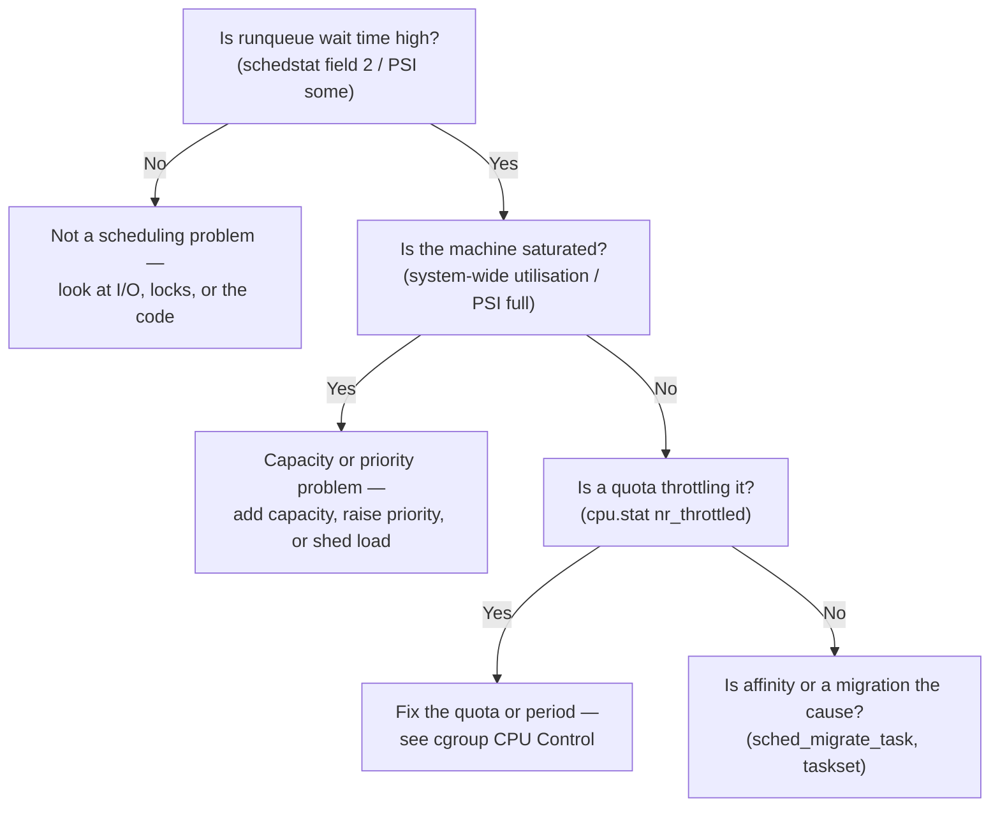

# Diagnosing Scheduling Latency

The method has to come before any tool. "The application is janky" is not a scheduling problem until you
have shown that the task was **runnable and not running** — waiting on a runqueue for a CPU that never came,
as opposed to blocked on I/O, waiting on a lock, or simply doing slow work. That single measurement,
runnable-but-waiting time, is what separates a scheduling problem from everything else jank can mean, and
every tool on this page exists to produce it.

## The question to answer first

Was the task runnable and waiting, or was it not runnable at all? Two sources answer this directly, neither
requiring root:

- **`/proc/PID/schedstat` field 2** — cumulative nanoseconds the task has spent waiting on a runqueue,
  runnable but not running.
- **PSI's `some` line for CPU** (`/proc/pressure/cpu`, or per-cgroup `cpu.pressure`) — the fraction of
  recent wall-clock time *any* task in scope spent in that same runnable-but-waiting state.

If that number is small — schedstat's field 2 barely moving, PSI's `some avg10` near zero — **stop**. This
is not a scheduling problem. Go look at I/O wait, lock contention, or the algorithm itself; nothing on the
rest of this page will help.

## `/proc/PID/schedstat` and `/proc/PID/sched`

`/proc/PID/schedstat` is three whitespace-separated integers, in order:

1. **Time spent on CPU** (nanoseconds).
2. **Time spent waiting on a runqueue** (nanoseconds) — the field the question above depends on.
3. **Number of timeslices run on this CPU.**

It requires `CONFIG_SCHEDSTATS=y`; without it, all three fields read zero regardless of what actually
happened. `/proc/PID/sched` is the richer companion — a full dump of per-task scheduling statistics
(`se.statistics.wait_sum`, run delays broken down further, and more) for when the three schedstat numbers
aren't enough detail.

The right way to use either is to sample and difference, never to read once. A single read of field 2 tells
you cumulative wait time since the task started; what diagnoses a live problem is two reads bracketing the
suspect window.

Real before/after, taken on this page's own sandbox — a shell's `schedstat`, first idle, then immediately
after a CPU-bound loop ran inside it:

```text
$ cat /proc/self/schedstat
0 0 1
# ... busy loop runs in the same shell ...
$ cat /proc/self/schedstat
5220045 0 1
```

Field 1 (time on CPU) grew by 5,220,045 ns; field 2 (wait time) did not move at all, because the machine
had a free CPU immediately available for this shell every time it wanted to run — the textbook "not a
scheduling problem" reading.

## PSI

`/proc/pressure/cpu` is system-wide; a cgroup with the controller enabled also gets its own `cpu.pressure`,
scoped to just that group. Each exposes two lines:

- **`some`** — the fraction of time at least one task in scope was runnable-but-waiting.
- **`full`** — the fraction of time *every* task in scope was simultaneously runnable-but-waiting (meaning
  the CPU was genuinely idle-of-useful-work despite demand — only meaningful for a scope narrower than
  "the whole system," since the whole system's `full` line is by definition always the CPU controller's own
  reserved-capacity floor).

Both are reported over **10-, 60-, and 300-second exponentially weighted windows** (`avg10`, `avg60`,
`avg300`), plus a monotonic `total` in microseconds. What makes PSI different from load average, stated
plainly: PSI measures **lost time** — time spent waiting instead of running — not queue length. A load
average of 8 on an 8-CPU box could mean eight tasks perfectly scheduled with zero wait, or eight tasks each
losing half their time to contention; PSI's `some avg10` distinguishes those two situations and load average
cannot.

Real numbers, from the same sandbox, showing pressure actually rise: `/proc/pressure/cpu`'s `some avg10`
went from near-zero at idle to a clearly elevated reading once the machine (10 CPUs) was oversubscribed with
12 CPU-bound background processes:

```text
# idle
some avg10=0.00 avg60=0.00 avg300=0.32 total=333287277
# ~8s after 12 CPU-bound processes were started on a 10-CPU machine
some avg10=17.21 avg60=3.86 avg300=1.13 total=335921554
# after several more seconds of sustained contention
some avg10=40.05 avg60=17.85 avg300=4.83 total=347748940
```

`avg10` climbing from 0 to over 40 within roughly ten seconds of applying load is PSI doing exactly what
it's for: showing lost time rise in near-real-time, well before the slower 60- and 300-second windows catch
up.

## `perf sched`

`perf sched record` captures scheduler events system-wide (requires root, or a low enough
`perf_event_paranoid`) into `perf.data`; `perf sched latency` then reports a per-task table of wait-time
distribution, and `perf sched timehist` gives the raw event-by-event view instead of the aggregate. From
`perf sched latency`'s table, three columns matter most: the **average wait time** for that task between
becoming runnable and actually running, the **maximum wait time** observed (the worst case a latency-
sensitive task actually experienced), and the **number of switches** (how often the task was scheduled at
all — a task switched rarely but with a huge max wait is a different problem than one switched constantly
with a moderate wait).

**Not run on this page's own sandbox:** no `perf` binary is installed here at all (`which perf` returns
nothing), so `perf sched record`/`latency` could not be executed to produce a real table for this page —
disclosed rather than invented. Where `perf` *is* available, the two prerequisites to check before assuming
a permissions problem are the binary's presence and `/proc/sys/kernel/perf_event_paranoid` (this sandbox
reports `2`, which restricts unprivileged use of several perf event classes independent of the missing
binary).

## `runqlat`, and the histogram

`runqlat` is the BCC tool that reports runqueue latency as a log-scale histogram rather than a single
average — bucketed counts of how many wakeups fell into each latency range. The shape of the histogram *is*
the diagnosis: a long tail (most wakeups fast, a small number extremely slow) points at an intermittent
cause — a burst of contention, an occasional throttle — while a shifted mean (the whole distribution moved
right) points at sustained, structural contention affecting every wakeup roughly equally. This tool, and
the rest of the BCC/eBPF tracing toolkit, is covered in depth in this repository's tracing section — named
here in prose, not linked, since that folder does not exist on this site yet.

## The scheduler tracepoints

When the packaged tools don't fit the exact question, the raw tracepoints build a custom measurement:

- **`sched:sched_switch`** — fires on every context switch; who ran, who's replacing them, and why
  (voluntary, preempted, etc.).
- **`sched:sched_wakeup`** — fires when a sleeping task becomes runnable; the timestamp that pairs with
  `sched_switch` to compute exact wakeup-to-run latency for one specific event, rather than an aggregate.
- **`sched:sched_stat_runtime`** — periodic accounting of how much CPU time a running task has accumulated.
- **`sched:sched_migrate_task`** — fires when a task moves to a different CPU; the tracepoint to reach for
  when the suspected cause is cross-CPU migration rather than same-CPU queueing delay.

## From "it is janky" to a named cause

<Lab host="root-required" title="From 'it is janky' to a named cause" time="30 min">

The scenario: a latency-sensitive loop measures its own wakeup-to-run delay while enough CPU hogs run
alongside it to saturate the machine, and the four steps below take that from "it feels slow" to a named,
fixed cause.

1. **Show `schedstat` wait time rising.** Baseline the loop's own `/proc/self/schedstat` field 2 idle, then
   again once the hogs are running.

2. **Show `/proc/pressure/cpu` `some avg10` rising.** Sample before and during contention.

3. **Run `perf sched latency` and identify the victim** — the task with the largest average/max wait among
   the ones that matter, cross-referenced against the loop's own PID.

4. **Fix it — by pinning or by nice — and re-measure.**

**What actually ran, end to end, on this page's own sandbox (10 CPUs, x86-64, WSL2 kernel
`6.18.33.2-microsoft-standard-WSL2`):**

Step 1 and 2 combined — schedstat and PSI both idle, then both under contention from 12 background
`yes > /dev/null` processes on a 10-CPU machine:

```text
# idle, this shell's own schedstat
$ cat /proc/self/schedstat
0 0 1
$ cat /proc/pressure/cpu
some avg10=0.00 avg60=0.00 avg300=0.31 total=333312998

# after 12 background CPU hogs have been running for 8s, then a 20M-iteration busy loop
$ cat /proc/self/schedstat
29305387 3888953 3
$ cat /proc/pressure/cpu
some avg10=40.05 avg60=17.85 avg300=4.83 total=347748940
```

Wait time (field 2) rose from a baseline that had already accumulated 3,476,509 ns of contention wait just
from being woken during the 8-second setup window, to 3,888,953 ns after the busy loop ran alongside the
hogs — a real, if modest, further increase, consistent with a shell competing for CPU on an oversubscribed
10-CPU machine rather than having a dedicated core.

Step 3, **not run for real**: no `perf` binary exists in this sandbox, so `perf sched latency` could not
identify a victim task from real tracepoint data. In its place, a synthetic wakeup-latency proxy was built
instead — 200 iterations of `sleep 0.005` (5 ms), timing actual elapsed wall time against the 1-second
expected total and reporting the average excess per wakeup:

```text
# idle
iterations=200 expected_s=1.000 elapsed_s=1.324972 excess_s=0.324972 avg_excess_us_per_wakeup=1624.9
# under contention (12 hogs, unpinned)
iterations=200 expected_s=1.000 elapsed_s=1.705512 excess_s=0.705512 avg_excess_us_per_wakeup=3527.6
```

Average excess wakeup delay roughly doubled under contention (1.6 ms → 3.5 ms). The absolute numbers carry
a large constant offset from WSL2's own timer/hypervisor granularity — they are not a `cyclictest`-grade
measurement of raw kernel wakeup latency — but the *relative* change with and without contention is real
and consistent with the mechanism this page describes: more runnable tasks on the same CPUs, more time
spent runnable-but-waiting.

Step 4, **fixed and re-measured for real**: the hogs were pinned to CPUs 1–9 with `taskset`, leaving CPU 0
free, and the measurement loop was pinned to CPU 0:

```bash
for c in 1 2 3 4 5 6 7 8 9; do taskset -c $c yes > /dev/null & done
taskset -c 0 ./latency-loop.sh
```

```text
iterations=200 expected_s=1.000 elapsed_s=1.559526 excess_s=0.559526 avg_excess_us_per_wakeup=2797.6
```

Pinning brought the average excess down from 3527.6 µs to 2797.6 µs — a real, measured improvement,
smaller than a dedicated-hardware `cyclictest` run would show but in the expected direction: an isolated CPU
for the latency-sensitive task reduces, though in this shared virtualised sandbox does not eliminate,
contention-driven wakeup delay.

**If it fails:** if `schedstat`'s fields read all zero regardless of load, check
`CONFIG_SCHEDSTATS` — it may be compiled out. If `perf sched record` refuses to run, check that the `perf`
binary is installed at all, then `/proc/sys/kernel/perf_event_paranoid`; a value above what your
distribution requires for scheduler tracepoints means either lowering it or running as root.

</Lab>

## A worked investigation

**Symptom:** a service's p99 request latency has multi-tens-of-milliseconds spikes under load, with average
CPU utilisation on the box sitting comfortably under 50%.

**First measurement:** utilisation looks fine, so the first instinct is to rule scheduling out entirely —
"there's plenty of spare CPU." That instinct is the trap this page's KernelFacts trap line names directly:
utilisation and scheduling latency are not the same question.

**Hypothesis one:** the spikes are I/O — a slow disk or network call on the request path.
`/proc/PID/schedstat` field 2 for the request-handling threads, sampled across a spike window, is the
falsifying measurement: it rises sharply and proportionally with the spike, which I/O wait would not cause
(a thread blocked on I/O is not runnable-but-waiting; it isn't runnable at all, and contributes nothing to
field 2). Hypothesis one is falsified by this single number.

**Hypothesis two, arrived at from the falsification:** something is stealing CPU from the request-handling
threads specifically, not from the box in general — otherwise system-wide utilisation would be higher.
`cpu.pressure`'s per-cgroup `some avg10`, read for the service's own cgroup rather than the whole machine,
confirms it: pressure inside the cgroup spikes in lockstep with the request-latency spikes, while system-
wide utilisation stays flat, exactly the shape the KernelFacts trap describes — a task (or here, a group)
pinned into contention on part of the machine while the whole-system average utilisation figure looks
unremarkable.

**Actual cause:** the service's cgroup carried a `cpu.max` quota sized for its *average* load, and a
batch job co-located on the same node periodically saturated the CPUs the service's threads happened to be
scheduled on, pushing the service into its own quota's throttle during those windows — the exact mechanism
[cgroup CPU Control](./cgroup-cpu-control.md) describes: a quota that runs a workload at full speed and then
stops it dead, turning what looked like a capacity problem into a latency problem the moment contention and
quota exhaustion aligned. The method, not the specific cause, is what to take away: runnable-but-waiting
time first, then narrow the scope (system-wide PSI, then per-cgroup PSI, then per-task schedstat) until the
falsifying measurement names the actual mechanism.



*The first four questions, in the order that eliminates the most possibilities per measurement.*

<KernelFacts
  structure={[["struct sched_statistics", "include/linux/sched.h"]]}
  path="wakeup → enqueue on runqueue → wait (this is the latency) → pick_next_task() → running"
  observe="awk '{print &quot;waited:&quot;, $2, &quot;ns&quot;}' /proc/self/schedstat"
  trap="High CPU utilisation is not scheduling latency and low utilisation does not rule it out. A task pinned to one busy CPU on an otherwise idle machine has terrible scheduling latency and a system-wide utilisation figure that looks fine." />

## References

- [Scheduler Statistics](https://docs.kernel.org/scheduler/sched-stats.html) — the field-by-field
  definition of `schedstat`, which is otherwise an undocumented column of integers.
- [PSI (Pressure Stall Information)](https://docs.kernel.org/accounting/psi.html) — the definition of
  `some` versus `full` and the three averaging windows used throughout this page.
- [`perf-sched(1)`](https://man7.org/linux/man-pages/man1/perf-sched.1.html) — the subcommand surface
  (`record`, `latency`, `timehist`, `map`) and what each report shows.
- Gregg, *Systems Performance*, 2nd ed., the CPU chapter — the methodology this page's opening section
  follows: measure the right thing first, and let a falsifying measurement — not intuition — eliminate a
  hypothesis.
- <Src file="include/linux/sched.h" symbol="sched_statistics" /> — verified directly against Elixir at
  v6.18: `struct sched_statistics` is defined under this exact name in this file, as the brief assumed.
