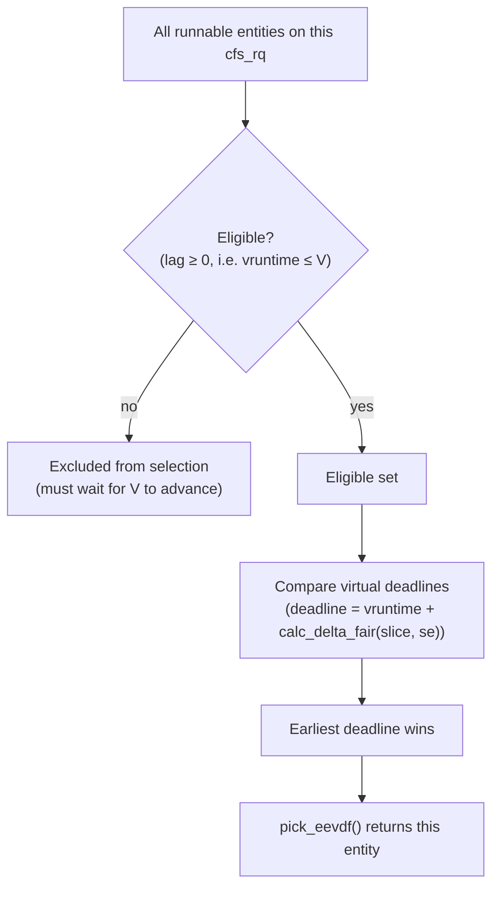

# EEVDF: The Current Fair Scheduler

[CFS and Virtual Runtime](./cfs-and-vruntime.md) ended on a specific complaint: CFS had exactly one
knob, nice, and nice conflates two different requests — how much CPU a task deserves overall, and how
quickly it should be scheduled after it wakes up. A scheduler with one knob cannot serve both requests
independently, so CFS approximated the second with wakeup heuristics bolted onto the mechanism that
answers the first. EEVDF (Earliest Eligible Virtual Deadline First) is Linux's answer to that specific
complaint: a task now declares both quantities separately — its weight (still from nice, unchanged) and
its request size, the amount of CPU it wants in one turn — and the algorithm derives latency behavior
from the second rather than from a heuristic layered on top of the first. Everything below is how it does
that, and everything in it is checked against `kernel/sched/fair.c` at the pinned v6.18 tag.

## Lag, and eligibility

**Lag** is the gap between the service a task *should* have received by now, under the ideal
weighted-fair-sharing model [CFS and Virtual Runtime](./cfs-and-vruntime.md) introduced, and the service
it actually has. Concretely, the kernel tracks a virtual time `V` — the weighted average of vruntime
across all runnable entities on the runqueue — and a task's lag is `weight × (V − vruntime)`. A task is
**eligible** exactly when its lag is non-negative, i.e. when its own vruntime is at or behind `V`: it has
received no more than its fair share so far. A task with positive lag is owed time; a task with negative
lag has already had more than its share and must wait until enough other tasks have run — pulling `V`
forward — to become eligible again. Only eligible tasks are candidates for selection at all; ineligible
tasks are invisible to the pick regardless of how attractive their deadline looks.

Worked example: suppose the runqueue's average virtual time is `V = 1000` (arbitrary time units). Task A
is `nice 0` (weight 1024) with `vruntime = 950`; task B is `nice 5` (weight 335) with
`vruntime = 1200`. Task A's lag is `1024 × (1000 − 950) = 51,200` — positive, so A is eligible. Task B's
lag is `335 × (1000 − 1200) = −67,000` — negative, so B is *not* eligible right now, regardless of what
its deadline would otherwise be: B has already run ahead of the share its weight entitles it to, and has
to fall back before it can be selected again.

## Virtual deadlines

Among the eligible tasks, EEVDF picks the one with the earliest **virtual deadline**. A task's deadline
is its vruntime plus its request (slice), converted into virtual time the same way vruntime accumulation
is: `deadline = vruntime + calc_delta_fair(slice, se)`, where `calc_delta_fair` scales a real-time
duration by the ratio of the reference weight to the task's own weight — the same weighting CFS used to
grow vruntime, applied here to project a slice forward into a deadline (confirmed directly in
`kernel/sched/fair.c` at v6.18: `se->deadline = se->vruntime + calc_delta_fair(se->slice, se)` runs
inside `place_entity()` and after `update_curr()` via `update_deadline()`).

Worked example: two eligible tasks, both `nice 0` (weight 1024, so `calc_delta_fair` is the identity for
both) and both at `vruntime = 2000`, but with different request sizes. Task A asked for a 3ms slice, so
its deadline is `2000 + 3ms = 2003ms` (informally — treating the vruntime unit as milliseconds for the
example). Task B asked for a 1ms slice, so its deadline is `2000 + 1ms = 2001ms`. Task B's deadline is
earlier, so EEVDF runs B first — not because B is "more important," and not through any nice difference
(both are `nice 0`), but purely because B asked for less CPU at a time and therefore *earns* an earlier
deadline. This is the mechanism, not a side effect: a task that wants short, frequent turns gets them,
without touching its aggregate CPU share at all.

## Request size, and where it comes from

A task's request size is `sched_entity.slice`, and by default every task gets the same one:
`sysctl_sched_base_slice`, confirmed at v6.18 (`kernel/sched/fair.c`) as `700000` nanoseconds — 0.7ms —
assigned whenever `se->custom_slice` is unset. A task can override this per-task through
`sched_setattr(2)`'s `sched_runtime` field. This is a genuine repurposing worth being precise about: the
UAPI header (`include/uapi/linux/sched/types.h`) still documents `sched_runtime` under a "SCHED_DEADLINE"
comment, its original purpose for the deadline class — but at v6.18, `kernel/sched/fair.c`'s
`__setparam_fair()` reads the same field for `SCHED_NORMAL`/`SCHED_BATCH` tasks and uses it as EEVDF's
request size: `se->slice = clamp_t(u64, attr->sched_runtime, NSEC_PER_MSEC/10, NSEC_PER_MSEC*100)` —
clamped, confirmed by source, to between 0.1ms and 100ms, with the value interpreted in nanoseconds.
Setting `sched_runtime` on a `SCHED_NORMAL` task through `sched_setattr()` is therefore how a task
expresses "give me short, frequent turns" without changing its nice value or its aggregate CPU share at
all — exactly the missing lever [CFS and Virtual Runtime](./cfs-and-vruntime.md) described.

## What changed for tuning

Every claim in this section was checked directly against `kernel/sched/fair.c` and
`kernel/sched/debug.c` at the `v6.18` tag on 2026-09-08 (via `raw.githubusercontent.com`, not from
memory or from pre-EEVDF secondary sources), and separately cross-checked against context7's indexed copy
of `docs.kernel.org` (`/websites/kernel_doc_html`, queried the same day) for the EEVDF design document's
own account. Where the two agreed, both are cited; context7 did not surface anything the source
disagreed with for the facts below.

- **`sysctl_sched_latency` and `sysctl_sched_min_granularity` are gone.** A source search for both
  identifiers across `kernel/sched/fair.c` at v6.18 returns zero matches. Neither exists as a variable,
  sysctl, or debugfs file in the pinned kernel. Any tuning guide referencing either name is describing
  CFS, not the kernel this section documents.
- **The base slice is `sysctl_sched_base_slice`**, confirmed present in `kernel/sched/fair.c` with a
  default of `700000` (0.7ms), and exposed under `/sys/kernel/debug/sched/` as the debugfs file
  `base_slice_ns` — confirmed by the `debugfs_create_u32("base_slice_ns", 0644, debugfs_sched,
  &sysctl_sched_base_slice)` call in `kernel/sched/debug.c` at v6.18. This is the closest current
  equivalent to CFS's old target-latency knob, though it means something narrower: it is the *default*
  request size assigned to a task that hasn't set its own via `sched_setattr()`, not a target period
  divided among all runnable tasks.
- **`/sys/kernel/debug/sched/` was not inspected on a live system for this page.** This sandbox has no
  root access to debugfs — `ls /sys/kernel/debug/sched/` returned `Permission denied` when checked during
  research — so the directory listing below is sourced entirely from the `debugfs_create_*()` call sites
  in `kernel/sched/debug.c` at v6.18, not from an actual mounted filesystem. Confirmed present as debugfs
  files at that source revision: `features`, `verbose`, `preempt`, `base_slice_ns`, `latency_warn_ms`,
  `latency_warn_once`, `tunable_scaling`, `migration_cost_ns`, and `nr_migrate`. This list is what the
  source creates, not a live directory listing; treat it accordingly and verify with `ls` on a real
  machine before relying on it.
- **Per-task request size is settable, per-task, via `sched_setattr()`'s `sched_runtime` field** — see
  the previous section. This is new expressive power that did not exist under CFS.
- **`vlag` and `deadline` exist on `struct sched_entity`** (`include/linux/sched.h`, confirmed at v6.18),
  though not quite as a plain new field in `vlag`'s case: it shares storage with `vprot` inside a union
  (`union { s64 vlag; u64 vprot; }`). This is a source-level implementation detail rather than a tuning
  knob, but it is worth knowing before searching for `vlag` and finding a union instead of a bare field.
- **No context7-indexed tunable name could not be verified against source.** Everything context7's copy
  of the EEVDF design document (`docs.kernel.org/scheduler/sched-eevdf.html`) described — lag, eligibility,
  virtual deadline selection, deferred dequeue for sleeping tasks, and `sched_setattr()` for request
  sizing — matched what the source at v6.18 does. Nothing in this section is a refusal-to-name case; every
  identifier above was confirmed present under the exact name given.

## What did not change

Weight still comes from `nice` through the same fixed weight table CFS used — a `nice` difference still
means the same multiplicative CPU-share ratio described on the [previous page](./cfs-and-vruntime.md).
The fair class (`fair_sched_class`) still sits below the deadline and real-time classes and above idle in
the strict priority order [Runqueues and Scheduling Classes](./runqueues-and-scheduling-classes.md)
described — EEVDF changed how the fair class picks among its own tasks, not where that class sits
relative to the others. Group scheduling still applies: `struct cfs_rq` at v6.18 still carries
`CONFIG_FAIR_GROUP_SCHED` fields (`sched_entity *parent`, per-group `cfs_rq`), so cgroup CPU shares still
work by giving a task group's own scheduling entity a weight and letting it compete inside its parent's
runqueue exactly as it did under CFS — the mechanics of that are
[cgroup CPU Control](./cgroup-cpu-control.md)'s subject, once written.

## Which articles are now wrong

Three specific, common claims were true of CFS and are not true at v6.18:

- **"Tune scheduling latency via `sched_latency_ns` / `sysctl_sched_latency`."** That sysctl does not
  exist in the pinned kernel's fair scheduler. The nearest lever is `sysctl_sched_base_slice`
  (`base_slice_ns` in debugfs), and it is a default per-task request size, not a shared target period.
- **"A `nice` value is the only way to affect how promptly a task is scheduled after waking."** It no
  longer is. `sched_setattr()`'s `sched_runtime` field lets a task shrink its own request size — and
  therefore its virtual deadline relative to its vruntime — completely independently of its nice value
  and its aggregate CPU share.
- **"A waking task's vruntime is adjusted by a placement heuristic to control fairness versus
  latency."** [CFS and Virtual Runtime](./cfs-and-vruntime.md) described exactly this tension as CFS's
  unsolved problem. EEVDF still places a waking entity (`place_entity()` exists in `fair.c` at v6.18 and
  still computes an initial vruntime/lag for the entity), but the placement no longer has to do the work
  of expressing latency preference by itself — a task that cares about promptness sets its request size
  instead, and eligibility plus earliest-deadline selection do the rest deterministically rather than
  through tuned heuristics.

## A worked comparison

One CPU, three perpetually-active tasks: two CPU-bound hogs at `nice 0`, and one latency-sensitive task
that wants to run for 1ms out of every 10ms (a rough model of, say, audio processing).

**Under CFS:** all three tasks are `nice 0`, so all three get equal weight and are entitled to equal
CPU share — roughly a third each, averaged over the scheduling period. The latency-sensitive task's actual
demand (1ms every 10ms, i.e. 10% CPU) is far below its fair 33% entitlement, so in principle it should
never be starved for *aggregate* CPU. But promptness is a different question: whether it gets its 1ms
slice quickly after each wakeup depends entirely on the wakeup-vruntime-placement heuristic in effect,
and on how far behind the two hogs' vruntime the latency-sensitive task's placement lands it. There is no
way for the task itself to say "give me a short slice promptly" — its only lever is nice, and raising its
priority to improve latency would also (and unnecessarily) inflate its CPU share and start starving the
two hogs of more than the correct amount.

**Under EEVDF:** the latency-sensitive task can keep `nice 0` — its 10%-of-CPU aggregate demand is
already satisfiable at equal weight, so its *share* does not need to change at all — and instead call
`sched_setattr()` with a small `sched_runtime`, say 200 microseconds, while the two hogs keep the default
0.7ms `sysctl_sched_base_slice`. Because deadline is `vruntime + calc_delta_fair(slice, se)`, the
latency-sensitive task's much smaller slice term means that as soon as it becomes eligible again after
sleeping, its deadline lands well ahead of either hog's, and it wins the pick promptly — without having
touched its weight, its nice value, or its long-run CPU share at all. The two independent questions CFS
could only answer with one knob — how much, and how soon — are answered with two.

:::note[Version-scoped]
Everything on this page describes v6.18 specifically. EEVDF began replacing CFS in 6.6 (2023) and became
the default fair-class scheduler in 6.12; a kernel at 6.5 or earlier runs CFS as described on the
[previous page](./cfs-and-vruntime.md) exclusively, with none of the mechanisms above present. The two
schedulers are not the same algorithm with renamed knobs — they answer "which task runs next" with
genuinely different questions (weighted-fairness distance vs. eligibility-then-earliest-deadline), so a
`sched_entity` field, `sysctl`, or debugfs name confirmed here should not be assumed to exist, mean the
same thing, or have the same default on an older kernel.
:::

*EEVDF in two steps: eligibility decides *who may run*, the virtual deadline decides *who runs first*.*

<KernelFacts
  structure={[["struct sched_entity", "include/linux/sched.h"], ["struct sched_attr", "include/uapi/linux/sched/types.h"]]}
  path="pick_next_task_fair() → pick_next_entity() → pick_eevdf() → __pick_eevdf(): eligible tasks (lag ≥ 0) → earliest virtual deadline (verified directly against kernel/sched/fair.c at v6.18: pick_next_entity() at line 5511 calls pick_eevdf(), which wraps __pick_eevdf(); the brief's assumed pick_next_entity() → pick_eevdf() chain is correct as written, unlike several other names checked for this page)"
  observe="ls /sys/kernel/debug/sched/ && cat /proc/self/sched | grep -E 'vlag|slice|deadline|vruntime'   # requires CONFIG_SCHED_DEBUG and debugfs mounted; not inspected live for this page, see 'What changed for tuning' above for why"
  trap="EEVDF did not make Linux 'more fair'. It made *latency* separately expressible from *share*, which means a tuning approach built on nice values alone was already the wrong tool and is now visibly so." />

## References

- [EEVDF Scheduler](https://docs.kernel.org/scheduler/sched-eevdf.html) — the in-tree design document.
  Confirmed present at the v6.18 tag (`Documentation/scheduler/sched-eevdf.rst` in `torvalds/linux`,
  checked directly on 2026-09-08, HTTP 200) — this is not a stale or superseded URL, it is the live,
  current scheduler design doc, and it explicitly says EEVDF began transitioning in 6.6 and cites Peter
  Zijlstra's 2023 proposal as the basis for what actually shipped.
- Jonathan Corbet, LWN, ["An EEVDF CPU scheduler for Linux"](https://lwn.net/Articles/925371/)
  (9 March 2023) — the clearest available explanation of lag and eligibility, confirmed by direct fetch
  to be that exact title, author, and date. It is merge-period coverage of the *proposal*, roughly three
  years before this page's pinned v6.18; some details (the union with `vprot`, the exact debugfs surface,
  proxy execution touching `update_curr()`) postdate the article and are covered above from source
  instead.
- Ion Stoica and Hussein Abdel-Wahab, ["Earliest Eligible Virtual Deadline First: A Flexible and
  Accurate Mechanism for Proportional Share Resource Allocation"](https://citeseerx.ist.psu.edu/document?repid=rep1&type=pdf&doi=805acf7726282721504c8f00575d91ebfd750564)
  (1995) — the original algorithm and the source of "eligible" and "virtual deadline" as vocabulary;
  cited by name in `Documentation/scheduler/sched-eevdf.rst` itself at v6.18.
- [`man 2 sched_setattr`](https://man7.org/linux/man-pages/man2/sched_setattr.2.html) — the userspace
  interface through which a task's request size is actually set; the UAPI header's own field comments
  (`include/uapi/linux/sched/types.h`) still describe `sched_runtime` under `SCHED_DEADLINE` only, so the
  man page and the source in `kernel/sched/fair.c`'s `__setparam_fair()` are what establish that the same
  field now also drives EEVDF's request size for `SCHED_NORMAL`/`SCHED_BATCH`.
- [CFS and Virtual Runtime](./cfs-and-vruntime.md) — the scheduler this page's every comparison is
  measured against.
