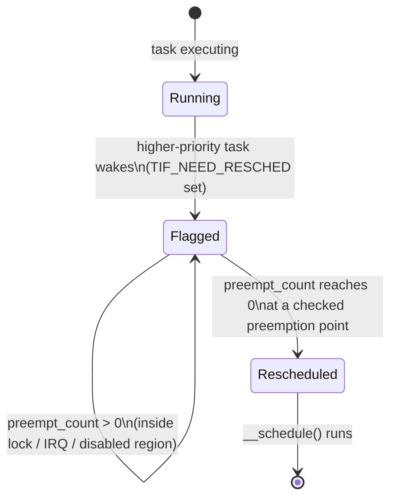

# Preemption Models

When the kernel is executing on behalf of a task — running a system call, handling a fault, walking a
list inside a lock — and something more urgent becomes runnable at that exact moment, may the kernel be
interrupted and made to give up the CPU right now, or must it finish what it is doing first? Every
preemption model is an answer to that one design question, and every answer trades worst-case scheduling
latency against throughput and implementation complexity. None of them is free; they differ in where the
cost lands.

## The models

Verified directly against `kernel/Kconfig.preempt` at the v6.18 tag rather than assumed — this is exactly
the kind of list that goes stale between releases, and it has changed since this page was first
scoped. At v6.18 the choice offers four models, plus one further option layered independently on top:

| Model | Kconfig | Worst-case latency shape | Throughput cost | Suits |
|---|---|---|---|---|
| No Forced Preemption | `PREEMPT_NONE` | Unbounded in principle; good in practice most of the time, occasional long stalls | Lowest — the traditional model | Servers, batch, throughput-first workloads |
| Voluntary | `PREEMPT_VOLUNTARY` | Bounded by the longest stretch between explicit preemption points | Slightly lower throughput than none | Desktops (older default), general responsiveness without full preemption's overhead |
| Preemptible (full) | `PREEMPT` | Bounded by the longest non-preemptible region (locks, IRQ context) | Lower still — every kernel-mode instruction outside a critical section is a potential preemption point | Low-latency desktop / interactive workloads |
| Scheduler-controlled (lazy) | `PREEMPT_LAZY` | Similar shape to full preemption, but avoids some unnecessary preemptions of `SCHED_NORMAL` tasks | Between voluntary and full — recovers some of voluntary's throughput | General-purpose systems wanting full preemption's latency without all of its cost |
| Fully preemptible real-time | `PREEMPT_RT` | Tightest — most kernel code, including former spinlock regions, becomes preemptible | Highest overhead, in exchange for the tightest bound | Hard/soft real-time: audio, industrial control |

`PREEMPT_RT` is not a fifth member of the same `choice` block as the other four — it is a separate config
(`depends on EXPERT && ARCH_SUPPORTS_RT`) that, when enabled, converts most remaining non-preemptible
regions (spinlocks foremost) into preemptible, priority-inheriting ones on top of whichever base model is
selected. This matches its history: `PREEMPT_RT` lived as an out-of-tree patch set for close to two
decades before being merged into mainline (v6.12, per LWN's coverage), and at v6.18 it is present as a
normal, if `EXPERT`-gated, Kconfig option rather than a separate tree.

**Lazy preemption** (`PREEMPT_LAZY`) is real and present in the choice at v6.18, `depends on
ARCH_HAS_PREEMPT_LAZY` — x86-64 defines `HAVE_TIF_NEED_RESCHED_LAZY`, which is what makes it available on
that architecture. This is worth verifying rather than assuming, per the note above: lazy preemption is a
recent (post-6.12-merge-of-RT-era) addition to the choice, sitting between voluntary and full preemption
rather than replacing either.

## `need_resched` and the preemption counter

Two independent pieces of per-something state are what a preemption decision actually reduces to:

- **A per-task "you should give this up" flag.** At v6.18 this is `TIF_NEED_RESCHED`, a bit in
  `struct thread_info::flags` (confirmed in `include/asm-generic/thread_info_tif.h`, generic across
  architectures). x86-64 additionally defines `TIF_NEED_RESCHED_LAZY` (gated by
  `HAVE_TIF_NEED_RESCHED_LAZY`), a second, weaker "reschedule when convenient" flag distinct from the
  regular one — this is the per-task signal `PREEMPT_LAZY` above actually uses to distinguish an urgent
  reschedule from one that can wait for a natural preemption point.
- **A per-CPU "you may not right now" counter.** `preempt_count` (`include/linux/preempt.h`), incremented
  by taking a spinlock, entering interrupt or softirq context, or an explicit `preempt_disable()`, and
  decremented on the matching release. Preemption is legal only when this counter is exactly zero.

A reschedule can happen precisely when both conditions line up: the flag says a higher-priority task is
waiting, and the counter says nothing is currently forbidding a context switch. Either one alone blocks
it — a set flag with a nonzero counter just means the reschedule is deferred to the next point where the
counter returns to zero (checked explicitly, not polled continuously).



*The two pieces of state a preemption decision depends on: a per-task flag saying a switch is wanted, and
a per-CPU counter saying whether one is currently allowed — a switch happens only once both agree, at a
point where the kernel actually checks.*

## Preemption points

"The counter reached zero" does not mean preemption happens instantly — it means preemption becomes
*legal* the next time the kernel actually checks, and those checks happen at specific points, not
continuously:

- **Return from an interrupt to kernel-mode code.** Only under full preemption (`PREEMPT`) and
  `PREEMPT_RT`; voluntary and none models do not preempt kernel code here.
- **Return to user space.** Always checked, in every model — this is why a CPU-bound loop entirely in
  user space is always preemptible at its next syscall or timer interrupt regardless of which model is
  configured.
- **`cond_resched()` calls.** The manual-annotation model: under voluntary preemption, long-running kernel
  loops are expected to call `cond_resched()` periodically to volunteer a preemption point explicitly,
  because the model does not check on its own inside ordinary kernel code. This makes voluntary preemption
  only as good as the placement of these calls — a loop that forgets one runs uninterrupted for its full
  duration under that model, even though the same loop would preempt correctly under full preemption.
- **Unlocking the last spinlock.** `preempt_count` returning to zero on a lock release is itself a checked
  point under full preemption and RT.

## What preemption is not

Preemption is not interrupt handling, and it is not multitasking in general — it is specifically about
whether *scheduling* may take place at a given moment. An interrupt can arrive at (almost) any point in
kernel or user execution regardless of which preemption model is configured; the CPU's interrupt logic
does not consult `preempt_count` before delivering an interrupt. What the preemption model controls is
narrower: once the kernel is *back* from handling that interrupt, or once some other event sets
`TIF_NEED_RESCHED`, may `__schedule()` actually run and switch to a different task right now, or must
current execution continue until a later checked point. This distinction — interrupts always arrive,
scheduling decisions are gated — is what folder 10's hardirq-context material (named here in prose, not
yet linked) builds directly on top of.

## Where the kernel is never preemptible

Regardless of the configured model, four situations keep `preempt_count` above zero and block a
reschedule outright: executing inside an interrupt handler, holding a spinlock, inside an RCU read-side
critical section under configurations where that section maps to `preempt_disable()`, and any explicitly
disabled region (`preempt_disable()`/`local_irq_disable()` bracketing). The rule that follows is
mechanical: worst-case scheduling latency is bounded by the *longest* such region anywhere in the kernel,
because a task waiting to run cannot be scheduled until whichever region currently holds the CPU releases
it. This is exactly why the historical `PREEMPT_RT` project spent most of its effort converting spinlocks
into preemptible, sleepable primitives rather than touching the scheduler itself — the scheduler already
made correct decisions given the state it was handed; the long non-preemptible regions were the actual
latency source.

## `PREEMPT_RT`, in one section

Three mechanisms, at a glance, are what `PREEMPT_RT` adds on top of whichever base model underlies it:

- **Sleeping spinlocks.** Most `spinlock_t` uses become preemptible, priority-inheriting mutexes under the
  hood — a lock that would have raised `preempt_count` under a non-RT kernel instead allows the holder to
  be preempted, closing off the largest source of unbounded latency identified above.
- **Threaded interrupt handlers.** Most interrupt handlers run as preemptible kernel threads rather than
  in true hardirq context, so they compete for the CPU under the ordinary scheduler instead of running to
  completion unconditionally. [Threaded IRQs](../10-interrupts-time-and-deferred-work/threaded-irqs.md)
  owns this mechanism in depth.
- **Priority inheritance.** When a high-priority task blocks on a lock held by a lower-priority one, the
  holder is temporarily boosted to the waiter's priority, bounding priority inversion instead of leaving a
  high-priority task stalled behind medium-priority work that preempted the actual lock holder.

What each buys, together: a system where nearly all kernel code, not just user-space code, can be
preempted promptly, at the cost of overhead on every lock acquisition and thread wakeup. `PREEMPT_RT` in
production practice — tuning, `cyclictest` methodology, and the embedded/industrial deployment story — is
owned by the embedded material this repository has not yet written (named here in prose rather than
linked, since no page exists there yet); this section is the scheduling-model half of the story only.

## Choosing one

There is no universally correct model — the choice is a direct statement of what the workload needs:
servers and throughput-bound workloads default to none or voluntary, where an occasional longer stall is
an acceptable trade for higher aggregate throughput and lower per-switch overhead; desktops and
general-purpose distributions lean toward full or lazy preemption, where interactive responsiveness
matters more than the last few percent of throughput; and audio, industrial control, and other
hard-latency work reach for `PREEMPT_RT`, where an unbounded worst case is not tolerable regardless of
cost. The practical rule is to stop reasoning about it and measure: `cyclictest`, the PREEMPT_RT project's
own latency-measurement tool, reports the actual observed scheduling latency distribution on real
hardware under real load, which settles the question reasoning from Kconfig help text cannot.

```wavedrom title="Wakeup latency under two preemption models" alt="A high-priority task becomes runnable during a long kernel operation; under voluntary preemption the wakeup waits for the operation to finish or hit a cond_resched() call, while under full preemption it runs as soon as preempt_count returns to zero"
{
  signal: [
    { name: "wakeup event",        wave: "010......." },
    { name: "kernel op (long)",    wave: "1..........0" },
    {},
    ["voluntary preemption",
      { name: "HP task runs",      wave: "0..........1", node: ".........a" }
    ],
    ["full preemption",
      { name: "HP task runs",      wave: "0.1.........", node: "..a" }
    ]
  ],
  edge: ["a"]
}
```

*The same wakeup under two preemption models: the delay is the length of the region that could not be
preempted.*

<KernelFacts
  structure={[["struct thread_info", "arch/x86/include/asm/thread_info.h"], ["preempt_count", "include/linux/preempt.h"]]}
  path="wakeup → TIF_NEED_RESCHED set → preempt_count reaches 0 at a checked point → preempt_schedule() → __schedule()"
  observe="grep -E 'CONFIG_PREEMPT' /boot/config-$(uname -r)"
  trap="Preemption is not about whether interrupts are handled — those arrive regardless of the model. It is about whether the *scheduler* may run at that moment, and the difference is why a machine with fast interrupt handling can still have terrible scheduling latency." />

## References

- [`docs.kernel.org` scheduler documentation](https://docs.kernel.org/scheduler/index.html) — the in-tree
  authority on which preemption models exist and how they interact with the scheduler, cross-checked
  against `kernel/Kconfig.preempt` at v6.18 for this page.
- <Src file="kernel/Kconfig.preempt" symbol="PREEMPT_LAZY" /> — the definitive, current list of
  preemption models at v6.18; read in full for this page rather than assumed, and confirmed to include
  `PREEMPT_NONE`, `PREEMPT_VOLUNTARY`, `PREEMPT`, and `PREEMPT_LAZY` as one `choice`, with `PREEMPT_RT` as
  a separate, independent option layered on top.
- <Src file="include/linux/preempt.h" symbol="preempt_count" /> — the counter and the macros
  (`preempt_disable()`/`preempt_enable()`) that manipulate it.
- LWN, ["The realtime preemption end game — for real this time"](https://lwn.net/Articles/989212/) —
  coverage of `PREEMPT_RT`'s mainline merge for 6.12, roughly six releases before this page's pinned
  v6.18; the option is present and `EXPERT`-gated at v6.18 as described above, consistent with that merge
  having landed.
- LWN, ["The long road to lazy preemption"](https://lwn.net/Articles/994322/) — the most recent change to
  this page's model list; `PREEMPT_LAZY` targeted 6.13/6.14-era merges and is present as a selectable
  model at v6.18, but `PREEMPT_NONE` remains the compile-time default per `kernel/Kconfig.preempt`'s
  `default PREEMPT_NONE` — lazy preemption is available, not default.
- [PREEMPT_RT project documentation](https://wiki.linuxfoundation.org/realtime/start) — the project's own
  documentation and the `cyclictest` measurement methodology referenced in "Choosing one" above.
