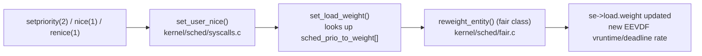

# Priorities, nice, and Weights

What does `nice -n 5` actually buy a process? Not a percentage, and not a guarantee — and, despite the
name, not the same thing in every scheduling class. It buys a change in exactly one number, and that
number's effect on the CPU a task receives is multiplicative and only meaningful relative to whatever
else happens to be runnable at the same time. Everything below unpacks that one sentence.

## nice is a weight, not a priority

[EEVDF](./eevdf.md) already showed the mechanism: a task's nice value maps to a **weight**
(`sched_entity.load.weight`), and weight is what actually drives scheduling — it scales how fast a
task's vruntime advances and how its virtual deadline is projected. `nice` itself never appears past that
translation step. The table the kernel uses to do the translation is `sched_prio_to_weight[]`
(`kernel/sched/core.c`, confirmed present under that exact name and location at v6.18), a fixed array of
40 entries indexed by internal priority (`nice + 20`):

| nice | weight | share vs. a nice-0 competitor |
|---:|---:|---:|
| -20 | 88761 | 98.8% |
| -5 | 3121 | 75.3% |
| 0 | 1024 | 50.0% |
| 5 | 335 | 24.6% |
| 19 | 15 | 1.4% |

The "share" column is not in the kernel — it is `weight / (weight + 1024)`, the two-task case, added here
because an abstract weight is not what anyone actually wants to know. The array itself is built from one
rule, stated directly in its comment at v6.18: each step of nice is intended as roughly a 10% change in
CPU share against a fixed competitor, which is achieved with a geometric ratio of `1.25` between adjacent
weights (`1024 / 820 ≈ 1.249`, and it compounds — five steps of nice is `1.25^5 ≈ 3.05`, matching
`1024 / 335`). That compounding is the entire content of "nice is logarithmic": it is not that nice looks
odd on a chart, it is that a constant per-step *ratio* is what produces a constant per-step *percentage
change*, which is the actual design goal.

## What actually happens

Prediction first, from the table above: a nice-0 task against a nice-5 competitor, both CPU-bound and
pinned to one CPU, should split the CPU roughly 75.4% / 24.6% — the two weights, 1024 and 335, out of
their sum.

Measured, in this sandbox, with two `yes` processes pinned to CPU 0 with `taskset -c 0`, one left at
nice 0 and the other reniced to 5, sampled via `utime + stime` from `/proc/<pid>/stat` over a 10-second
window after a 5-second warm-up:

```text
$ taskset -c 0 nice -n 0 yes > /dev/null &
$ taskset -c 0 nice -n 5 yes > /dev/null &
# ticks accumulated over a 10s window, from /proc/<pid>/stat fields 14+15
nice0 delta ticks: 754
nice5 delta ticks: 246
nice0 share: 75.4%
nice5 share: 24.6%
```

That is as close to the theoretical 75.4% / 24.6% split as a 10-second sample on a shared machine is
going to get — the weight ratio is not a rough guide here, it is close to exactly what happened. Re-run
with nice 0 against nice 19 instead:

```text
$ taskset -c 0 nice -n 0 yes > /dev/null &
$ taskset -c 0 nice -n 19 yes > /dev/null &
nice0 delta ticks: 987
nice19 delta ticks: 14
nice0 share: 98.60%
nice19 share: 1.40%
```

Predicted from the table: `15 / (1024 + 15) = 1.44%`. Measured: `1.40%`. The nice-19 task did not get
zero — it got a few percent, and no amount of renicing lower will ever bring it to exactly zero, because
weight is a ratio and a ratio of two positive numbers is never zero. This is the practical point: `nice`
has no setting that means "only run when nothing else wants the CPU." The closest it gets is nice 19,
which still guarantees a small but nonzero share against any competitor. A policy of *actually* running
only when the CPU would otherwise sit idle is a different mechanism entirely — `SCHED_IDLE`, a scheduling
policy rather than a priority level, which removes the task from EEVDF's normal eligibility competition
instead of merely giving it a tiny weight.

:::note
The two measured splits above were run in this task's sandbox (`taskset -c 0`, two `yes` processes,
`/proc/<pid>/stat` sampling), not fabricated. Expect small drift from the exact theoretical ratio in any
real run — a few percent either way — from scheduler bookkeeping overhead, timer tick granularity, and
whatever else briefly shared CPU 0 during the sampling window; the two runs above happened to land within
a few tenths of a percent of theory, which is closer than a single sample is guaranteed to be.
:::

## Priority means different things per class

Nice and weight are specific to `SCHED_OTHER` (and its relatives `SCHED_BATCH`, `SCHED_IDLE`). The other
scheduling classes covered in [Runqueues and Scheduling Classes](./runqueues-and-scheduling-classes.md)
use "priority" to mean something structurally different:

| Class | Policies | What "priority" means | Range |
|---|---|---|---|
| `fair_sched_class` | `SCHED_OTHER`, `SCHED_BATCH` | A weight, from nice — a ratio, never absolute | nice -20 (highest share) to 19 (lowest) |
| `fair_sched_class` | `SCHED_IDLE` | No weight competition at all — runs only when nothing else is eligible | n/a |
| `rt_sched_class` | `SCHED_FIFO`, `SCHED_RR` | A static real-time priority — strictly ordered, no ratio, no compounding | 1 (lowest RT) to 99 (highest RT) |
| `dl_sched_class` | `SCHED_DEADLINE` | No priority number at all — admission is by runtime, deadline, and period | n/a |

Two numbering conventions collide here in a way that trips up almost everyone reading `ps` or `chrt`
output for the first time. `ps -eo pid,ni,pri` reports `NI` (nice, -20 to 19, lower is higher share) and
`PRI` (the kernel's internal, unified priority number, where *lower is also higher priority* but the
scale is different: real-time tasks occupy roughly 0–39 and ordinary tasks 40 and up in that column, with
the exact offset an implementation detail not worth memorizing). `chrt -p <pid>`, by contrast, reports a
real-time task's priority directly in the `1`–`99` range from the table above, where *higher* is higher
priority — the opposite direction from nice. There is no bug here, just two independent numbering
conventions applied to a `PRI` and a `rt_priority` field that happen to both be called "priority."
Reading one column's number as if it were the other's convention is the actual source of confusion.

## Autogroups

A default that surprises anyone coming from a server background: on most distributions,
`kernel.sched_autogroup_enabled` is on, and every task's fair-class scheduling entity is nested inside a
per-session **autogroup** rather than competing directly against every other task on the runqueue system
-wide. The group itself, not the individual task inside it, competes for CPU share against other groups.
This is why reducing the nice of one process in a build that spawned forty parallel compiler jobs from one
shell can appear to do *nothing* against a browser in a different terminal — the build's forty jobs are
all sharing one autogroup's allocation, contending against each other inside it, while the browser's
autogroup gets its own separate share regardless of how many tasks it contains. Nicing one task inside a
crowded autogroup only redistributes CPU within that autogroup, not against the world outside it. Disabling
autogroups (`sysctl kernel.sched_autogroup_enabled=0`) returns every task to competing directly, which is
closer to what a server workload usually wants and is why the feature is a desktop-responsiveness default
rather than a universal one — see the LWN coverage in References for the original motivation.

## `renice` and what it cannot do

An unprivileged process may lower its own nice value's priority (raise the *number*, i.e. `renice +5`)
freely, but may not raise it (lower the number, e.g. `renice -5`) without `CAP_SYS_NICE` or an
`RLIMIT_NICE` allowance permitting it. The asymmetry is deliberate: a process yielding CPU share to
everyone else is never a problem worth gatekeeping, but a process granting *itself* more CPU share than
its owner was given is exactly the kind of self-escalation the kernel has to assume is hostile or
misbehaving by default, and gate behind a capability check.

## When nice is the wrong tool

`nice` answers exactly one question: relative CPU share among directly competing `SCHED_OTHER` tasks on
one machine, with no floor, no ceiling, and no timing guarantee. Reach for something else when that is
not actually the requirement:

- **A hard cap** ("this task must never use more than 20% of a CPU, even if nothing else is running") —
  `cpu.max` in a cgroup, not nice. Nice never caps; it only reduces share *relative to competitors*, and a
  task with any positive weight alone on a CPU still gets 100% of it.
- **A guaranteed floor** ("this group must get at least its fair share even under contention") —
  `cpu.weight` in a cgroup, the same weight mechanism as nice but applied to a whole group rather than
  negotiated one task at a time. See [cgroup CPU Control](./cgroup-cpu-control.md).
- **A latency guarantee** ("this task must run within a bounded time of becoming runnable, not just
  eventually get a fair share of ticks") — a smaller request size (see [EEVDF](./eevdf.md)) or, if the
  bound must hold even under load from higher-priority work, a real-time policy instead of `SCHED_OTHER`
  entirely.

## Misconceptions

- **"nice 19 means the process only runs when the system is idle."** It means a small weight, not zero —
  see the measured 1.4% share above. `SCHED_IDLE` is the actual policy for "only run when nothing else
  wants the CPU," and it is a policy change, not a nice value.
- **"nice affects I/O priority too."** It does not. Disk I/O scheduling is a separate mechanism,
  `ionice`/the I/O scheduler's own priority classes, against a completely different queue; setting a
  process's nice value has no effect on how its I/O requests are ordered.
- **"A lower nice number is lower priority."** The opposite: nice -20 is the *highest*-share, effectively
  highest-priority setting, and nice 19 the lowest. The name describes how considerate — how "nice" — the
  process is being to its competitors, not its rank: a "nicer" process (higher number) asks for less.



*The path from a nice-value change to its effect on the fair-class scheduler: a nice level is looked up
in a fixed weight table and applied to the task's scheduling entity, not stored as a priority anywhere
past that lookup.*

<KernelFacts
  structure={[["sched_prio_to_weight[]", "kernel/sched/core.c"]]}
  path="setpriority() → set_user_nice() → set_load_weight() → reweight_entity() → new weight in the fair queue"
  observe="ps -eo pid,ni,pri,rtprio,policy,comm | head    &&    chrt -p $$"
  trap="nice is a ratio against whatever else is runnable. A nice-19 task alone on a machine gets 100% of a CPU, and the same task against one nice-0 competitor gets a few percent — the number describes a relationship, not an allocation." />

## References

- [`man 2 setpriority`](https://man7.org/linux/man-pages/man2/setpriority.2.html) and
  [`man 1 nice`](https://man7.org/linux/man-pages/man1/nice.1.html) — the interface, the -20..19 range,
  and who may raise a priority versus only lower it.
- <Src file="kernel/sched/core.c" symbol="sched_prio_to_weight" /> — the fixed weight table nice indexes
  into; verified present under this exact name in `kernel/sched/core.c` at v6.18. Note that
  `set_user_nice()` itself, which reads this table, has moved to `kernel/sched/syscalls.c` at v6.18 — it
  is no longer in `core.c`, a relocation worth flagging since older documentation still points there.
- <Src file="kernel/sched/syscalls.c" symbol="set_user_nice" /> — where a nice value is validated, turned
  into `static_prio`, and pushed into the fair class's weight via `set_load_weight()`.
- [`man 7 sched`](https://man7.org/linux/man-pages/man7/sched.7.html) — the per-policy priority semantics,
  and the `PRI`-versus-`NI` numbering that this page's table above untangles.
- LWN, ["Group scheduling and CPU bandwidth control"](https://lwn.net/Articles/418884/) — the autogroups
  feature's original motivation; 2010, and the per-session grouping mechanism described there is
  unchanged at v6.18.
